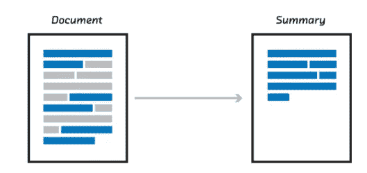
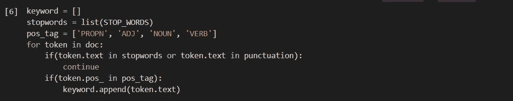
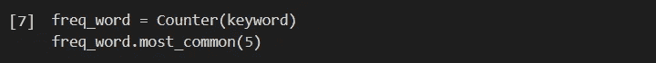
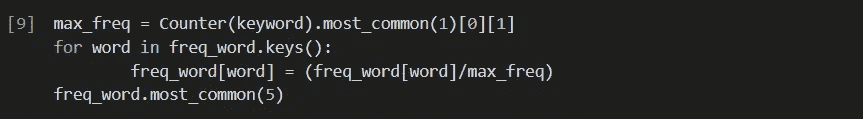
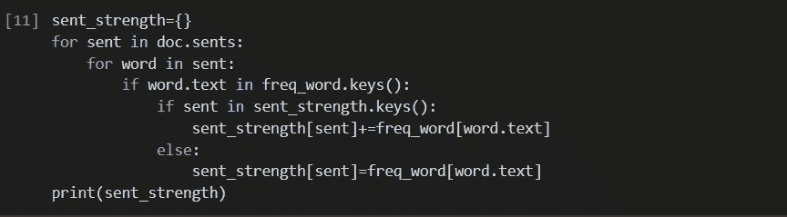
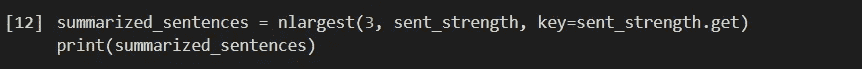
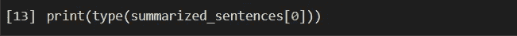
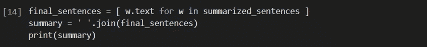

# 使用空间的文本摘要

> 原文：<https://medium.com/analytics-vidhya/text-summarization-using-spacy-ca4867c6b744?source=collection_archive---------1----------------------->

## 文章解释了什么是 spacy，spacy 的优点以及如何利用 spacy 进行文本摘要。


照片由[朝鲜蓟 3](https://commons.wikimedia.org/wiki/File:SpaCy_logo.svg) 拍摄

# spaCy 是什么？

spaCy 是一个免费、开源的高级自然语言处理库，用编程语言 Python 和 Cython 编写。spaCy 主要用于生产软件的开发，也通过 PyTorch 和 TensorFlow 的统计模型支持深度学习工作流。

# 为什么是 spaCy？

spaCy 提供了快速准确的语法分析、命名实体识别和对单词向量的快速访问。我们可以使用默认的词向量，或者用你有的词向量来代替它们。spaCy 还提供了标记化、句子边界检测、词性标注、句法分析、集成的单词向量，以及与原始字符串的高精度对齐。

# 文本摘要



图 2:文本摘要

文本摘要大致可以分为两类——**抽取式摘要**和**抽象式摘要**。

1.  **提取摘要:**这些方法依赖于从一段文本中提取几个部分，如短语和句子，并将它们堆叠在一起以创建摘要。因此，识别用于摘要的正确句子在抽取方法中是至关重要的。
2.  这些方法使用先进的自然语言处理技术来生成一个全新的摘要。本摘要的某些部分甚至可能不会出现在原文中。

在这篇文章中，我们将关注于**提取摘要**技术。

# 步骤:1 安装说明

要安装*空间*，只需输入以下命令:

```
pip install -U spacy
```

首先导入*空间*和其他必要的模块:

```
import spacy
from spacy.lang.en.stop_words import STOP_WORDS
from string import punctuation
from collections import Counter
from heapq import nlargest
```

接下来，将模型(英语)加载到 spaCy 中


图 3:加载模型

我们将要处理的文本是“*机器学习简介”*，字符串存储在变量 *doc 中。*

这个字符串是，

```
Machine learning (ML) is the scientific study of algorithms and statistical models that computer systems use to progressively improve their performance on a specific task. Machine learning algorithms build a mathematical model of sample data, known as “training data”, in order to make predictions or decisions without being explicitly programmed to perform the task. Machine learning algorithms are used in the applications of email filtering, detection of network intruders, and computer vision, where it is infeasible to develop an algorithm of specific instructions for performing the task. Machine learning is closely related to computational statistics, which focuses on making predictions using computers. The study of mathematical optimization delivers methods, theory and application domains to the field of machine learning. Data mining is a field of study within machine learning and focuses on exploratory data analysis through unsupervised learning. In its application across business problems, machine learning is also referred to as predictive analytics.
```

现在，将字符串 *doc* 传递给 *nlp* 函数。


图 4:标记化

为了找出给定字符串中句子的数量，使用下面的函数，


图 5:句子数量

```
7
```

接下来，为词类和停用词创建两个列表，以验证每个标记，然后过滤必要的标记，并将它们保存在*关键字*列表中。

# 步骤 2:过滤令牌



图 6:关键词过滤

使用“*计数器”*函数计算每个令牌的频率，并将其存储在 *freq_word* 中，要查看前 5 个频繁出现的单词，可以使用*最常见的*方法。



图 7:令牌频率

期望的输出将是，

```
[(‘learning’, 8), (‘Machine’, 4), (‘study’, 3), (‘algorithms’, 3), (‘task’, 3)]
```

为了更好地处理，可以对该频率进行归一化，这可以通过将令牌的频率除以最大频率来实现。

# 第三步:标准化



图 8:归一化令牌频率

标准化列表是，

```
[(‘learning’, 1.0), (‘Machine’, 0.5), (‘study’, 0.375), (‘algorithms’, 0.375), (‘task’, 0.375)]
```

这是根据每个句子中出现的标记的频率对每个句子进行加权的主要部分。结果作为键-值对存储在 *sent_strength* 中，其中键是字符串 *doc* 中的句子，值是每个句子的权重。

# 步骤 4:权衡句子



图 9:权衡句子

输出是，

```
{Machine learning (ML) is the scientific study of algorithms and statistical models that computer systems use to progressively improve their performance on a specific task.: 4.125, 
Machine learning algorithms build a mathematical model of sample data, known as “training data”, in order to make predictions or decisions without being explicitly programmed to perform the task.: 4.625, 
Machine learning algorithms are used in the applications of email filtering, detection of network intruders, and computer vision, where it is infeasible to develop an algorithm of specific instructions for performing the task.: 4.25, 
Machine learning is closely related to computational statistics, which focuses on making predictions using computers.: 2.625, 
The study of mathematical optimization delivers methods, theory and application domains to the field of machine learning.: 3.125, 
Data mining is a field of study within machine learning, and focuses on exploratory data analysis through unsupervised learning.: 4.25, In its application across business problems, machine learning is also referred to as predictive analytics.: 2.25}
```

最后， *nlargest* 函数用于总结字符串，它需要 3 个参数，

→要提取的数据数量

→可迭代的(列表/元组/字典)

→分别需要满足的条件

# 步骤 5:总结字符串



图 10:找到 N 个最大值

并且 *nlargest* 函数返回一个包含前 3 个句子的列表，这些句子被存储为*摘要 _ 句子*。

```
[Machine learning algorithms build a mathematical model of sample data, known as “training data”, in order to make predictions or decisions without being explicitly programmed to perform the task., Machine learning algorithms are used in the applications of email filtering, detection of network intruders, and computer vision, where it is infeasible to develop an algorithm of specific instructions for performing the task., Data mining is a field of study within machine learning, and focuses on exploratory data analysis through unsupervised learning.]
```

列表中的每个句子都是 spacy.span 类型的



图 11:令牌的类型

```
spacy.tokens.span.Span
```

这可以通过下面几行代码转换成字符串，



图 12:最终结果

产生最终汇总输出，如下所示

```
Machine learning algorithms build a mathematical model of sample data, known as “training data”, in order to make predictions or decisions without being explicitly programmed to perform the task. Machine learning algorithms are used in the applications of email filtering, detection of network intruders, and computer vision, where it is infeasible to develop an algorithm of specific instructions for performing the task. Data mining is a field of study within machine learning, and focuses on exploratory data analysis through unsupervised learning.
```

# 使用 Gensim 进行总结

众所周知，Gensim 软件包具有内置的汇总功能，但它不如 spaCy 高效。代码是，


图 13:使用 Gensim 进行总结

相应的输出是，

```
'Machine learning algorithms build a mathematical model of sample data, known as “training data”, in order to make predictions or decisions without being explicitly programmed to perform the task.'
```

完整代码可在 [GitHub](https://github.com/kamal2230/text-summarization) 中获得。

# 结论

我希望您现在已经理解了如何使用 spaCy 执行文本摘要。感谢阅读！