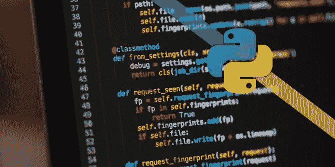
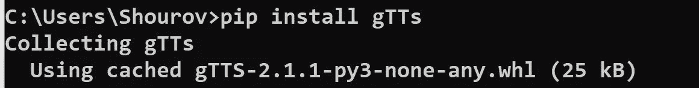
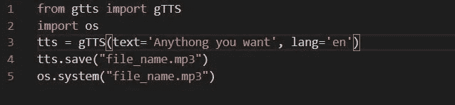

# Python 中的文本到语音转换

> 原文：<https://medium.com/analytics-vidhya/text-to-speech-in-python-a12ba0c61779?source=collection_archive---------17----------------------->



照片来自[morioh.com](https://morioh.com/)

本文将一步一步地解释构建将文本转换成语音的 python 脚本的过程。

# 先决条件:

您需要在计算机上安装 Python 3.6 或更高版本。你需要下载一个 python 库—

> **1。gTTS** —这是一个 Python 库和 CLI 工具，用于与谷歌翻译的文本到语音 API 接口。

# 安装:

考虑到你的电脑上已经安装了 Python 3.6 或以上版本(如果没有你可以看这篇 [**文章**](/@rshourov156/install-python-and-run-python-program-in-cmd-1578a6f5e683) )。在这一部分，我将只解释 gTTS 的安装。

我只解释 windows 的安装过程:

在 windows 上很容易安装 gTTS。在 windows 上，如果您安装了 pip，您可以使用 **pip** 从 **PyPI** 安装它

```
pip install gTTS
```



安装流程 gTTs

# 开始使用:

首先，您必须导入必要的包。为此，您需要导入两个包

```
**from gtts import gTTS
import os**
```

现在你需要存储你想从语音转换成文本的文本，还需要选择语言

```
**tts = gTTS(text='Anything you want', lang='en')**
```

之后，您需要存储语音文件。你可以在你的电脑上以任何名字保存文件。文件总是以 mp3 格式保存

```
**tts.save("file_name.mp3")
os.system("file_name.mp3")**
```

像这样输入代码结构—

```
**from gtts import gTTS
import os
tts = gTTS(text='Anything you want', lang='en')
tts.save("file_name.mp3")
os.system("good.mp3")**
```



文本到语音

就这样，现在你可以运行 python 文件，然后你会在你的电脑上看到一个 mp3 文件。这就是你的文本音频文件。

谢谢你..

你可以在我的 [github](https://github.com/shourov-sorkar/text-to-speech) 中找到这个脚本，也可以[点击这里](https://github.com/shourov-sorkar/text-to-speech)

# 关于作者:

[Md Monir hoss ain show rav](https://www.facebook.com/shourov.cse1810/)*是数据科学 E* nthusiast。我在国际商业农业技术大学计算机科学与工程系攻读计算机科学与工程学士学位。目前，我在第八学期。

你可以在[脸书](https://www.facebook.com/shourov.cse1810/)、 [LinkedIn](https://www.linkedin.com/in/shourov-cse-1810/) 、 [Github](https://github.com/shourov-sorkar) 上找到我。