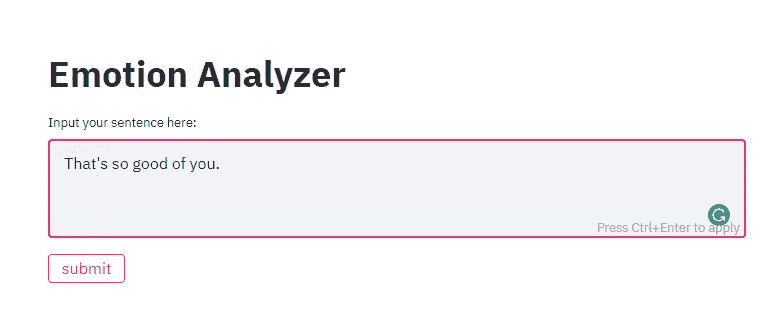
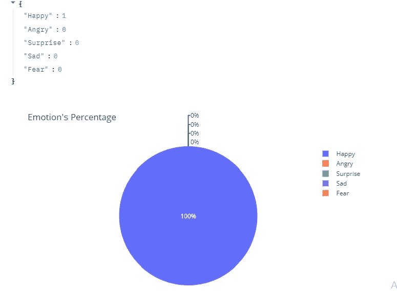

# text2emotion:用 Python 从文本数据中揭示人类情感

> 原文：<https://medium.com/analytics-vidhya/text2emotion-uncovering-human-emotions-from-textual-data-in-python-cde808995707?source=collection_archive---------19----------------------->

来源: [IBM Watson Tone Analyzer 博客](https://www.ibm.com/blogs/watson/2017/04/watson-tone-analyzer-7-new-tones-help-understand-customers-feeling/)

# 介绍

*你有没有想过了解一个人思想背后的情感有多重要或有用？或者说，如果我们知道一个人的情绪，人类如何受益？毫无疑问，一个人可以通过阅读文本来理解自己的情感。但是在这个数字时代，我们每天通过* ***文本、信息、社交媒体等产生海量数据。*** *人类有没有可能通过人工阅读一切来分析人的情绪？显然不是！这就是****text 2 情感*** *进入画面的时候。*

# 目录:

1.  ***什么是 text2emotion？***
2.  ***样本工业用例***
3.  ***它是如何工作的？***
4.  ***怎么用？***

# 1.什么是 text2emotion？

***text 2 emotion****是我和另外三个同事开发的一个****【python 包】*** *，目的是揭开隐藏在文本背后的人类情感。一个很明显的问题可能会出现在你的脑海里* ***这和情感分析有什么不同？***

*嗯，* ***情感分析*** *只是将文本解释和分类为积极、消极或自然，而****text 2 emotion****帮助你将文本的* ***语气分为五种基本的人类情感，即高兴、愤怒、惊讶、恐惧和悲伤。***

*总结一下，****text 2 emotion****就是* ***python 包*** *它会帮助你从内容中提取情感。*

*   处理任何文本信息并识别其中蕴含的情感。
*   *兼容 5 种不同的情绪类别* ***快乐、愤怒、悲伤、惊喜、恐惧。***

# *2。工业用例示例*

现在让我们讨论一个工业用例，在这个用例中，确定情绪可以发挥非常重要的作用。这将使我们更加清晰。

## 电子商务行业:客户参与终点

由 [Unsplash](https://unsplash.com?utm_source=medium&utm_medium=referral) 上的[procylink 访客管理系统](https://unsplash.com/@proxyclick?utm_source=medium&utm_medium=referral)拍摄的照片

*电子商务行业通过各种来源接收来自客户的输入，例如来自* ***聊天机器人的文本数据、来自联络中心的日志、电子邮件*** *等。人们可以假设，客户在投诉时最初可能会很生气，但随着他语气的变化，全程跟踪他的情绪会非常有帮助。如果谈话结束时客户仍然生气，那就是坏消息。如果他高兴，那么从客户服务的角度来看，这是一个成功。*

*跟踪这些音调信号可以帮助客户服务经理改善团队与客户的互动方式。代理需要在内容或沟通方式方面接受更多培训吗？*

*我们当然可以在****text 2 emotion****包中进行定制和更多改进，以将其发展成适合这种用例的成熟服务。*

我希望，现在你可能已经明白了了解一个人情绪的重要性。

# 3.它是如何工作的？

现在，让我们来谈谈这个软件包的 bit 技术细节和工作原理。

***A .文本预处理***

*首先，我们的主要目标是执行数据清理，使内容适合情感分析。*

*   *删除邮件中不需要的文本部分。*
*   *执行自然语言处理技术。*
*   *从文本预处理中带出预处理好的文本。*

***B .情绪调查***

*从我们从预处理文本中获得的每个单词中检测情感，并对其进行计数以供进一步分析处理。*

*   *找出表达情绪或感受的恰当词语。*
*   *查看每个单词的情感类别。*
*   *存储与找到的单词相关的情绪计数。*

***C .情感分析***

*情感调查之后，是我们之前输入的文本信息获得有意义输出的时候了。*

*   *输出将以字典的形式出现。*
*   将会有作为情感类别的键和作为情感分数的值。
*   *特定情感类别的得分越高，我们就可以断定该消息属于该类别。*

# 4.怎么用？

## 查看 Google Collab 演示:

[***Google Collab:text 2 emotion***](https://colab.research.google.com/drive/1sCAcIGk2q9dL8dpFYddnsUin2MlhjaRw?usp=sharing#scrollTo=ivUkOaBPEQYr)

## 应用部署

*下面是用****Streamlit App****为用户做的代码实现演示。*

1.  *输入文本。*

在框中输入文本，然后单击提交按钮。

*2。点击提交按钮。*

*3。Tada！！以可视化的形式获得输出。*

它识别文本中的情绪，并相应地以视觉形式给你输出。

## [点击这里查看演示网络应用](https://text2emotion.herokuapp.com/)

让我们亲身体验一下图书馆。

## 欲了解更多信息，请访问:

[***text 2 情感文档***](https://pypi.org/project/text2emotion/)