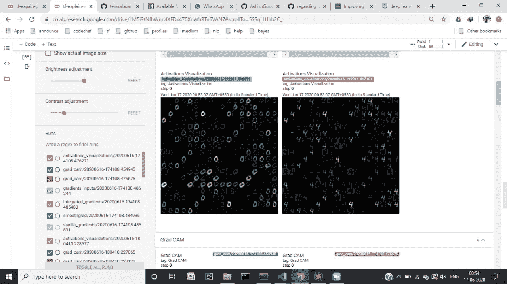
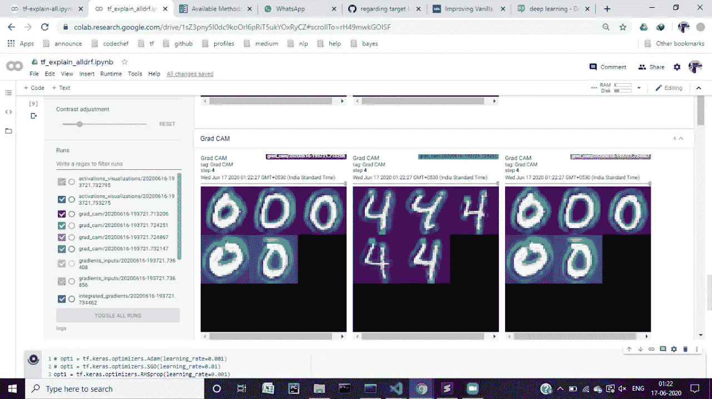
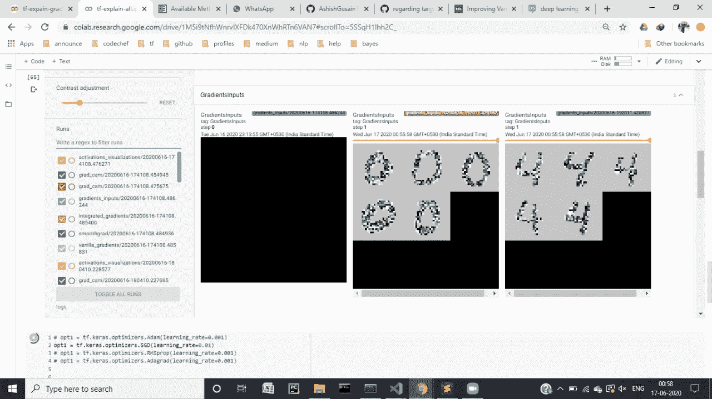
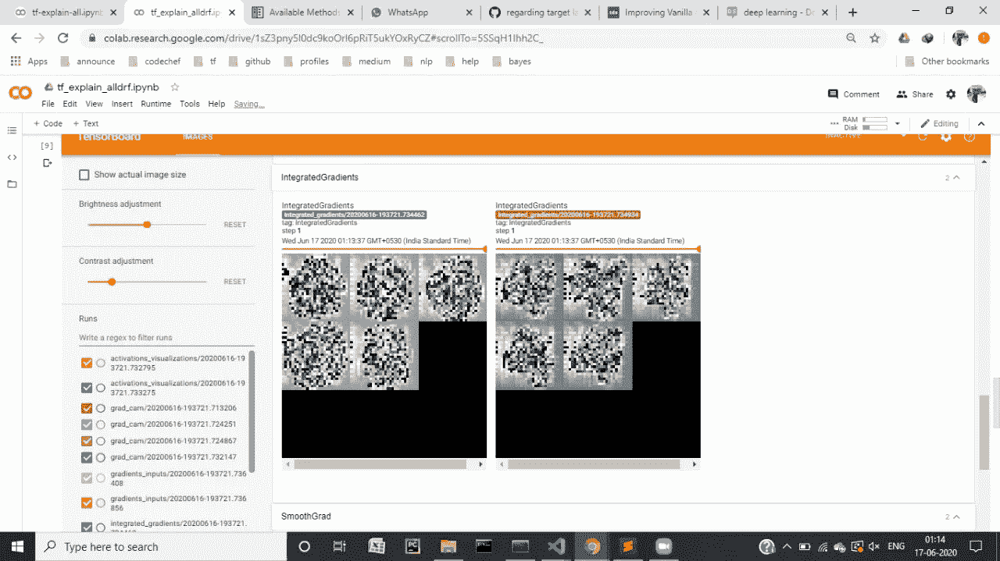
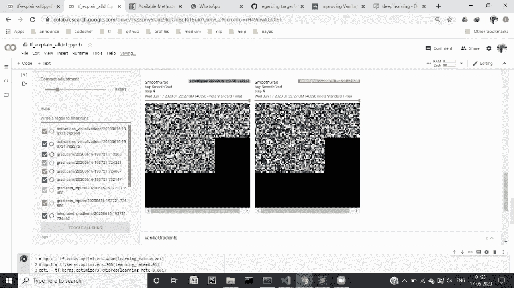

# TF-解释如何使用 tensorboard

> 原文：<https://medium.com/analytics-vidhya/tf-explain-working-283a311f1276?source=collection_archive---------13----------------------->


tf-explain 是一个完全基于 tensorflow 2.0 构建的 pip 可安装库，与 tf.keras 一起使用。它有助于更好地理解我们当前正在训练的模型。在 tf.keras 中，我们在训练时提供给模型的回调中使用它的所有 API。

毫无疑问，tf-explain 不是 tensorflow 的官方产品，但它完全是基于 tensorflow 2.0 构建的。它的一个主要优势是使用 tensorboard，它以更好的视图和清晰的图形为我们提供与图像相关的信息。

完整代码在[https://github . com/ashishgusain 17/Grad-CAM-implementation/blob/master/TF _ explain _ methods . ipynb](https://github.com/AshishGusain17/Grad-CAM-implementation/blob/master/tf_explain_methods.ipynb)中。各种方法在图像上的实现可以在下面的图形中看到。

# **安装:**

```
pip install tf-explain
pip install tensorflow==2.1.0
```

# **使用他们的 API:**

1.)构建一个 tf.keras 模型

```
img_input = tf.keras.Input((28,28,1))
x = tf.keras.layers.Conv2D(filters=32, kernel_size=(3, 3), activation=”relu” , name=”layer1")(img_input)
x = tf.keras.layers.Conv2D(filters=64, kernel_size=(3, 3), activation=”relu”, name=”layer2")(x)x = tf.keras.layers.MaxPool2D(pool_size=(2, 2))(x)
x = tf.keras.layers.Dropout(0.25)(x)
x = tf.keras.layers.Flatten()(x)
x = tf.keras.layers.Dense(128, activation=”relu”)(x)
x = tf.keras.layers.Dropout(0.5)(x)
x = tf.keras.layers.Dense(10, activation=”softmax”)(x)model = tf.keras.Model(img_input, x)
model.summary()
```

2.)为任何特定的标签创建验证数据集，该标签将作为 API 的输入给出。我们使用了包含 60，000 幅训练图像和 10，000 幅测试图像的 mnist 数据集。它有 10 类图像，数字范围从 0 到 9。让我们将标签 0 和 4 的元组创建为 validation_class_zero 和 validation_class_four，如下所示。

```
# Here, we choose 5 elements with one hot encoded label “0” == [1, 0, 0, 0, 0, 0, 0, 0, 0, 0]validation_class_zero = (
    np.array(
       [
           el
           for el, label in zip(test_images, test_labels) 
           if np.all(np.argmax(label) == 0)
       ][0:5]
    ),None) # Here, we choose 5 elements with one hot encoded label “4” == [0, 0, 0, 0, 1, 0, 0, 0, 0, 0]validation_class_four = (
    np.array(
       [
           el
           for el, label in zip(test_images, test_labels)
           if np.all(np.argmax(label) == 4)
       ][0:5]
    ),None)
```

3.)实例化回调:

现在，让我们实例化将提供给模型的各种回调。这些回调将针对数字 0 和 4。在其中的一些，你可以看到所提供的层的名称，在上面的模型中可以看作是一个卷积层。

```
callbacks = [tf_explain.callbacks.GradCAMCallback(validation_class_zero, class_index=0, layer_name=”layer2"),
tf_explain.callbacks.GradCAMCallback(validation_class_four, class_index=4, layer_name=”layer2"),tf_explain.callbacks.ActivationsVisualizationCallback(validation_class_zero, layers_name=[“layer2”]),
tf_explain.callbacks.ActivationsVisualizationCallback(validation_class_four, layers_name=[“layer2”]),tf_explain.callbacks.SmoothGradCallback(validation_class_zero, class_index=0, num_samples=15, noise=1.0),
tf_explain.callbacks.SmoothGradCallback(validation_class_four, class_index=4, num_samples=15, noise=1.0),tf_explain.callbacks.IntegratedGradientsCallback(validation_class_zero, class_index=0, n_steps=10),
tf_explain.callbacks.IntegratedGradientsCallback(validation_class_four, class_index=4, n_steps=10),tf_explain.callbacks.VanillaGradientsCallback(validation_class_zero, class_index=0),
tf_explain.callbacks.VanillaGradientsCallback(validation_class_four, class_index=4),tf_explain.callbacks.GradientsInputsCallback(validation_class_zero, class_index=0),
tf_explain.callbacks.GradientsInputsCallback(validation_class_four, class_index=4)
]
```

4.)加载张量板:

```
%reload_ext tensorboard
%tensorboard — logdir logs
```

5.)模型的训练:

```
opt1 = tf.keras.optimizers.Adam(learning_rate=0.001)model.compile(optimizer=opt1, loss=”categorical_crossentropy”, metrics=[“accuracy”])
model.fit(train_images, train_labels, epochs=20, batch_size=32, callbacks=callbacks)
```

6.)结果:

我得到的结果是损失:0.4919 —准确度:0.8458。这些是在仅仅 4-5 个时期后获得的。我尝试了各种优化器，SGD 和 AdaGrad 花费了大约 15 个时期的最大时间。

7.)Tensorboard 结果:

编号为 0 和 4 的图像的激活可视化:



编号为 0 和 4 的图像的 GradCAM 实现:



编号为 0 和 4 的图像的梯度输入:



编号为 0 和 4 的图像的普通渐变:


整合编号为 0 和 4 的图像的梯度:



编号为 0 和 4 的图像的平滑渐变:



这都是我这边的。您可以通过以下方式联系我:

电子邮件:ashishgusain12345@gmail.com

github:[https://github.com/AshishGusain17](https://github.com/AshishGusain17)

领英:[https://www.linkedin.com/in/ashish-gusain-257b841a2/](https://www.linkedin.com/in/ashish-gusain-257b841a2/)

演职员表:[https://tf-explain.readthedocs.io/en/latest/](https://tf-explain.readthedocs.io/en/latest/)