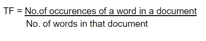
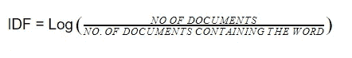
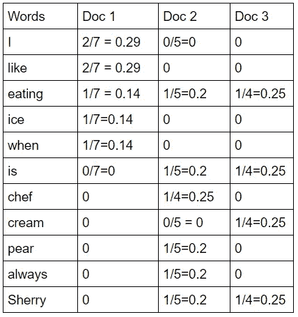
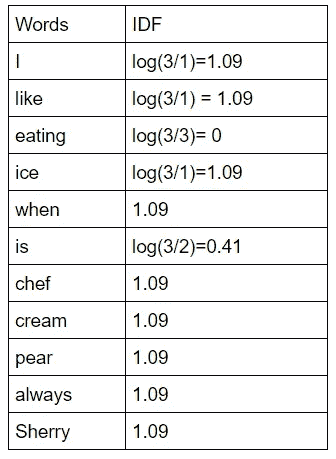
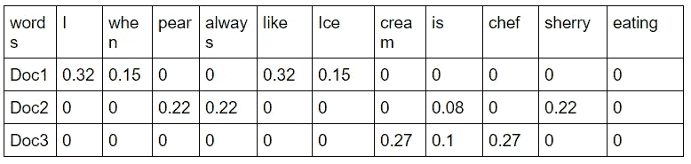

# TF-IDF 基本信息和逻辑。

> 原文：<https://medium.com/analytics-vidhya/tf-idf-basic-information-and-logic-2e416ee9866f?source=collection_archive---------15----------------------->

Tf-idf 代表“术语频率-逆文档频率”。它是一种算法或程序，基本上用于文本挖掘/分析或信息检索。简而言之，Tf-idf 是一种算法，用于提供权重，即句子或文档(单词集)中单词的相关性。这种提供权重的方法用于对单词或句子进行评分和排序，称为页面排序。重要性与单词在文档中出现的次数成比例地增加，但是将随着单词在语料库(数据集)中的频率而变化。

程序:

tf-idf 是一种加权方案，它根据术语频率(tf)和逆文档频率(idf)为文档中的每个术语分配一个权重。具有较高权重分数的术语被认为更重要。

术语频率-有几种方法可以计算 tf 或 idf，简单而基本的公式是

逆文档频率:-它是文档频率的简单逆，即

综合资料的文件（intergrated Data File）

Log 用于当单词和文档的数量增加时，idf 值可能会爆炸，并且将很难获得值。因此，通过输入 log even，我们可以得到一个精确的值。有时“+1”被加到分母上，使得 log 0 等于无穷大，假设 log 0 发生在例外情况下

示例:-考虑 3 个文档:

文件 1-喜欢的时候喜欢吃冰。

文件 2-雪莉总是吃梨。

文件 3-厨师正在吃奶油。

对于上述文档，请考虑获取 tf。“I”在 7 个单词的第一个文档中出现两次，即 2/7 = 0.29。

tf 示例

以 idf 为例。要知道 idf 是针对所有文档的。“是”出现在两个文档(2 和 3)中，总文档是 3，即日志(3/2)。

idf 示例

现在，通过使用公式计算单词的最终权重并找到单词包

相关性=tf(文档，单词)*idf。

“I”的 tf 为文档 1“0.29”，idf 为“1.09”

0.29*1.09 = 0.3161~0.32.

“一袋袋的话”

因此，计算出该包或单词，并可用于进一步分类。Tf-idf 等特征提取使得分类更加高效，提高了准确率。