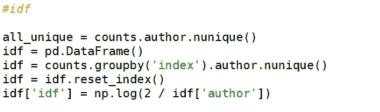

# 印度语 TF-IDF

> 原文：<https://medium.com/analytics-vidhya/tf-idf-on-hindi-language-483a6dffa882?source=collection_archive---------1----------------------->

查尔斯·福尔舍尔在 [Unsplash](https://unsplash.com?utm_source=medium&utm_medium=referral) 上的照片

**什么是 TF-IDF？**

**tf-idf** 代表词频-逆文档频率。 **tf-idf** 权重是信息检索和文本挖掘中经常使用的权重。搜索引擎经常使用 **tf-idf** 加权方案的变体对给定查询的文档相关性进行评分和排名。该权重是一种统计度量，用于评估一个单词对集合或语料库中的文档有多重要。重要性与单词在文档中出现的次数成比例增加，但是被单词在语料库中的频率抵消。

大多数情况下 **tf-idf** 是用英语完成的；这让我对它在其他语言上的表现感到好奇。所以，我试着用我的母语，即印地语来做这件事，结果相当有趣。

**tf-idf** 基本上是一种加权方案，它根据术语频率(tf)和逆文档频率(idf)为文档中的每个术语分配一个权重。具有较高权重分数的术语被认为更重要。

通常情况下， **tf-idf** 要求如下:

1.  标记化
2.  标准化词频
3.  反向文档频率(idf)

**标记化:**

标记化是将大量文本分成称为**标记**的较小部分的过程。自然语言处理用于构建诸如文本分类、智能聊天机器人、情感分析、语言翻译等应用。为了达到上述目的，理解文本中的模式变得至关重要。这些记号对于寻找这样的模式非常有用，并且被认为是词干化和词汇化的基础步骤。

自然语言工具包有非常重要的模块**标记**,它进一步损害了子模块

1.  单词标记化
2.  句子标记化

**词频:**

这只是为了计算每个单词在每个文档中出现的次数，并且停用词也将在这里被删除

**逆项频率:**

IDF 公式:

**逆文档频率**是一个衡量单词提供多少信息的指标，即它在所有文档中是常见的还是罕见的。它是包含该单词的文档的[对数标度的](https://en.wikipedia.org/wiki/Logarithmic_scale)逆分数(通过将文档总数除以包含该词的文档数，然后取该商的对数获得)

**它能用在什么地方？**

这可以用来判断一个人的词汇量有多丰富。因此，首先我从纳伦德拉·莫迪的演讲中摘录了一大段文字(印地语)。

(文本文件截图)

为了执行 tf-idf 计算，我必须首先从像 *cltk.tokenize.sentence* 和*cltk . stop . classic _ Hindi . STOPS 这样的库中导入某些模块，如 *TokenizeSentence* 和*STOPS _ LIST*。STOPS _ LIST*将生成一个印地语的停用词列表，而 *TokenizeSentence* 将进一步帮助标记印地语句子。

(停用词截图)

**计算 TF :**

这段代码将帮助我们计算词频。术语频率的定义如上所述。在运行这个程序时，我们将得到一个由频率(单词频率)、单词总数(单词总和)和单词的词频(词频)组成的数据帧

(数据帧截图)

**计算 IDF :**

本节将计算 idf 部分。idf 的定义如前所述。

计算 TF-IDF:

基本上，将这两个项相乘将得到指定权重的所需列。

有趣的是，出现次数为 1 的单词将产生以下输出:

(第 174 个字的权重为 0.000504)

并且出现次数最多的单词的权重具有以下输出:

在这里，权重在单词中的分布是非常明显的。具有高频率的单词具有最大的权重；而那些出现最少的词，即 1，具有最小的权重。

**一般使用案例:**

这个模型可以用来比较许多人的印地语词汇。