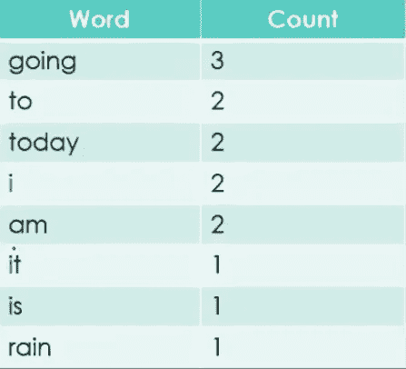
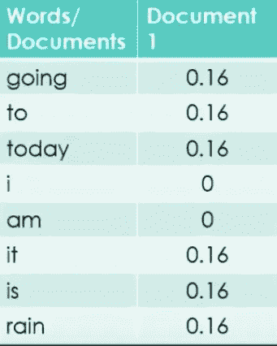
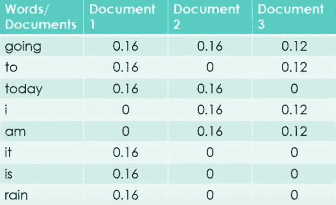
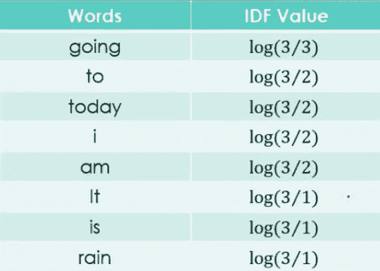
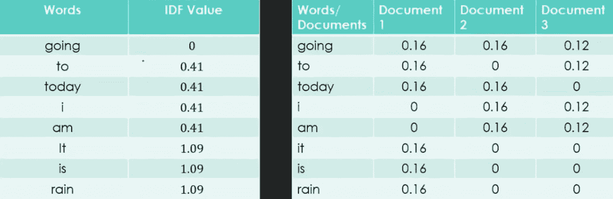
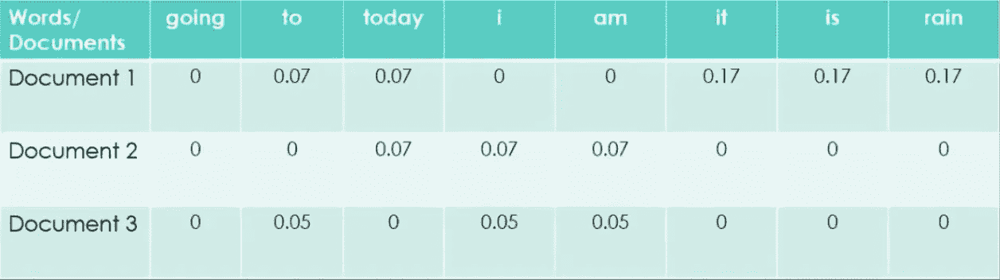

# TF-IDF/词频技术:使用 Python(聊天机器人词汇训练)对自然语言处理中文本分类的最简单解释

> 原文：<https://medium.com/analytics-vidhya/tf-idf-term-frequency-technique-easiest-explanation-for-text-classification-in-nlp-with-code-8ca3912e58c3?source=collection_archive---------0----------------------->

## 或者如何找到句子和文档的意思

TF-IDF 或(术语频率(TF)-逆密集频率(IDF))是一种用于发现由单词组成的句子的含义并抵消单词袋技术的能力的技术，该技术有利于文本分类或帮助机器读取数字中的单词。然而，当你要求它理解句子或文档的意思时，它就在你面前爆炸了。

我强烈建议您在阅读本文之前先阅读一下 BoW，了解一下上下文

[](/swlh/bag-of-words-code-the-easiest-explanation-of-nlp-technique-using-a-python-8a4fdfb8598c) [## 单词包代码——使用 python 对 NLP 技术最简单的解释

### 我的乘客朋友们，你好，(跳到代码末尾)

medium.com](/swlh/bag-of-words-code-the-easiest-explanation-of-nlp-technique-using-a-python-8a4fdfb8598c) 

# 那么它是什么，你想用一个例子来理解吗？

假设一台机器正在试图理解这个的意思—

> 今天是美好的一天

你在这里关注什么，但是作为一个人而不是一台机器告诉我？

这句话讲的是**今天**，它也告诉我们今天是**美好的一天**。心情**愉快/积极**，还有什么牛仔？

美丽显然是这里使用的形容词。从 BoW 方法来看，所有的单词都被分解成计数和频率，没有对某个特定单词的偏好，这里所有的单词都有相同的频率(在这种情况下是 1)，显然机器没有强调美感或积极的情绪。

这些词只是被分解，如果我们谈论重要性，“a”和“日”或“美”一样重要。

但是与“美”相比,“a”真的能告诉你更多关于句子上下文的信息吗？

不，这就是为什么单词袋需要升级。

此外，另一个主要缺点是，假设一个文档有 200 个单词，其中“a”出现了 20 次，“the”出现了 15 次，等等。

许多反复出现的词在最终的特征构建中被赋予了更大的重要性，而我们却忽略了那些重复较少但却很重要的词，比如雨、美丽、地铁、名字。

因此，如果由机器阅读，很容易错过作者的意思，它提出了一个 TF-IDF 解决的问题，所以现在我们知道**为什么我们使用 TF-IDF。**

# 现在让我们看看它是如何工作的，好吗？

TF-IDF 通过引入一个叫做**逆文档频率的重要概念，在解决单词袋的主要缺点方面很有用。**

这是一个分数，机器会评估句子中使用的单词，并测量它与整个文档中使用的单词相比的用法。换句话说，这是一个突出每个单词在整个文档中的相关性的分数。它的计算方法是-

> IDF =Log[(#文档数)/(包含单词的文档数)]和
> 
> TF =(文档中单词的重复次数)/(文档中的单词数)

好的，现在让我们假设 TF 回答这样的问题—**beauty 在整个文档中使用了多少次**，给我一个概率，IDF 回答这样的问题:beauty 这个词在整个文档列表中有多重要，**它是所有文档中的共同主题吗**。

因此，使用 TF 和 IDF 机器可以理解文档中的重要单词以及贯穿所有文档的重要单词。

## 回答我这个问题—

> 想象一下，有一个充满句子的文档，打破它的最好方法是什么，以便机器可以理解它是什么？
> 
> 1.用语言打破它
> 
> 2.用字母打破它
> 
> 3.把它分成句子
> 
> 4.按字节分解

你能回答吗？

# 时间到了。

*目前的答案是选项 3* 。把它分解成句子。

为什么？因为当你把一个文档分成多个句子时，每个句子都有多个单词，这些单词为句子提供了一些上下文，这些句子作为一个整体为文档提供了一些上下文，然后我们可以向机器提问，

> 【Siri 有哪些互相类似的文档？

通过评估 TF-IDF 或多个*“句子中使用的单词与整个文档中使用的单词”，*我们了解-

1.  一个单词对一个句子有多有用(帮助我们理解一个单词在句子中的重要性)。
2.  一个单词对一个文档有多有用(帮助我们理解文档中出现频率较多的重要单词)。
3.  帮助我们忽略拼写错误的单词(使用 n-gram 技术),下面我将介绍一个例子

想象一下，在一个文档中，你把“example”拼错成了“example ”,而你忘记了在把它交给机器阅读之前回去修改它

在 BOW 的情况下,“example”和“example”将被视为不同的单词，并被赋予相同的重要性，因为它们的频率是相同的。

但是在 TD-IDF 的情况下，因为 IDF 的分数，这个错误被纠正，因为我们知道 example 作为一个单词比 example 更重要，所以我们把它当作一个无用的单词。

现在，因为这些分数，我们的机器对这些文件有了更好的理解，并且可以被要求比较这些文件，找到相似的文件，找到相反的文件，找到文件中的相似之处，并且可以被机器用来推荐你接下来要读什么，酷吧？

现在，我想在我告诉你怎么做之前，你需要一分钟的时间来回顾和理解这个概念，当然，我会举一个例子，所以如果你在概念上模糊不清，但几乎很清楚，一旦你用这个例子练习，你就肯定没问题了。

# 找到一个文档的 TF-IDF 的方法是什么？

使用 TF-IDF 查找文档含义的过程非常类似于单词袋，

1.  清理数据/预处理—清理数据(标准化数据)、规格化数据(全部小写)、词条化数据(所有单词到词根)。
2.  用频率标记单词
3.  查找单词的 TF
4.  查找 IDF 单词
5.  矢量化词汇

(如果你不熟悉这些是什么，我建议阅读我在上面分享的文章 BOW，以清楚地了解如何做到这些)。

我将使用这些技术来涵盖下面的例子，所以我希望你熟悉它们。

## 让我们以三个文档为例-

今天会下雨。

**文件 2** 今天我不出去了。

**文件 3** 我要去看第三季首播。

要找到 TF-IDF，我们需要执行上面列出的步骤，让我们开始吧。

# 步骤 1 清理数据并标记化



文件词汇

# 寻找 TF

**文件 1** —

> 今天会下雨。

找到它的 TF =(文档中单词的重复次数)/(文档中单词的数量)



句子 1 的 TF

继续余下的句子-



文档的 TF

# 寻找 IDF

查找文档的 IDF(我们仅对没有停用词的功能名称/词汇进行此操作)

IDF =Log[(文档数)/(包含该单词的文档数)]



文档的 IDF

# 步骤 4 建立模型，即把所有单词一个接一个地堆叠起来—



3 份文件的 IDF 值和 TF 值。

# 比较结果，用表格提问



记住，最后的等式= TF-IDF = TF * IDF

使用该表可以很容易地看出，像**‘it’，‘is’，‘rain’**这样的词对文档 1 很重要，但对文档 2 和文档 3 不重要，这意味着文档 1 和 2 & 3 在谈论 rain 时是不同的。

你也可以说文件 1 和文件 2 谈的是某件事**‘今天’**，文件 2 和文件 3 因为有了**‘我’这个字，所以讨论了作者的某件事。**

这张表帮助你找到相似和不相似的 btw 文件，文字和更多更好的比弓。

> 如果你想看我选的例子的视频，可以看看同样的视频。[查看视频](https://www.youtube.com/watch?v=ouEVPRMHR1U)

# 让我们编写这个代码，自己看看

## **挑战是使用这些句子，并使用 TF-IDF 找到赋予这些句子意义的单词，好吗？**

我们开始吧

***#第 1 部分申报所有文件并分配给 Vocab 文件***

```
Document1= “It is going to rain today.”
Document2= “Today I am not going outside.”
Document3= “I am going to watch the season premiere.”
Doc = [Document1 ,
 Document2 , 
 Document3]
print(Doc)
***Output*>>>** *[‘It is going to rain today.’, ‘Today I am not going outside.’, ‘I am going to watch the season premiere.’]*
```

***#第二部分—初始化 tfidf 矢量器***

```
from sklearn.feature_extraction.text import TfidfVectorizervectorizer = TfidfVectorizer()
```

部署 TF-IDF 有多简单，对吗？

***#第 3 部分—获取我们将用于标记文档的最终单词的特征名称***

```
analyze = vectorizer.build_analyzer()print(‘Document 1’,analyze(Document1))print(‘Document 2’,analyze(Document2))print(‘Document 3’,analyze(Document3))print(‘Document transform’,X.toarray())***Output*>>>***Document 1 [‘it’, ‘is’, ‘going’, ‘to’, ‘rain’, ‘today’]**Document 2 [‘today’, ‘am’, ‘not’, ‘going’, ‘outside’]**Document 3 [‘am’, ‘going’, ‘to’, ‘watch’, ‘the’, ‘season’, ‘premiere’]* *Document transform [[0\. 0.27824521 0.4711101 0.4711101 0\. 0\. 0\. 0.4711101 0\. 0\. 0.35829137 0.35829137 0\. ] [0.40619178 0.31544415 0\. 0\. 0.53409337 0.53409337 0\. 0\. 0\. 0\. 0\. 0.40619178 0\. ] [0.32412354 0.25171084 0\. 0\. 0\. 0\. 0.4261835 0\. 0.4261835 0.4261835 0.32412354 0\. 0.4261835 ]]*
```

看看每个句子是如何分解成单词的，每个单词又是如何被机器表示成一个数字的，我已经把上面两个都分解了。

***#第 4 部分—矢量化或创建所有三个文档的矩阵，并找到特征名称***

```
X = vectorizer.fit_transform(Doc)print(vectorizer.get_feature_names())***Output*>>>** [‘am’, ‘going’, ‘is’, ‘it’, ‘not’, ‘outside’, ‘premiere’, ‘rain’, ‘season’, ‘the’, ‘to’, ‘today’, ‘watch’]
```

输出表示为 3 个句子添加上下文的重要单词。这是在所有三个句子中都很重要的单词，现在你可以向机器问任何你喜欢的问题，比如

> 什么是类似的文件？
> 
> 什么时候会下雨？
> 
> 我做完了，接下来读什么？

因为机器有一个分数来帮助回答这些问题，TF-IDF 证明是一个很好的工具来训练机器回答聊天机器人的问题。

如果你想看完整的代码-

点击这里查看我的 Github >[**查看包字代码**。](https://github.com/rmadan16/TF-IDF)