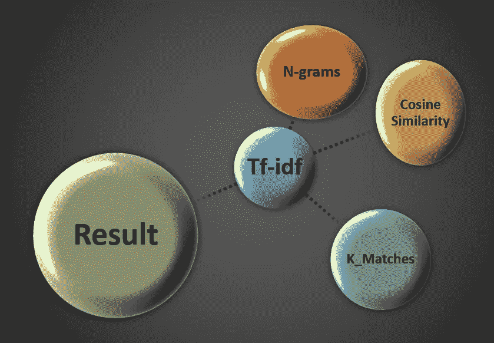

# tfidf-matcher:超快速字符串匹配包

> 原文：<https://medium.com/analytics-vidhya/tfidf-matcher-the-super-fast-string-matching-package-918faba40ed8?source=collection_archive---------8----------------------->

如果你在数据领域工作，那么你可以把这个人看作是一个从大量数据中寻找正确数据的人。这是一项非常关键且非常耗时的工作。在人工智能领域，如果你的数据正确，那么你就可以通过第一关。这个博客是关于我的一个项目，我需要从一个大型数据库中找到匹配的字符串，同时考虑时间复杂性。

从外行人的角度来看，时间复杂度指的是从某项工作得到产出所花费的总时间。而定义指出算法的**时间复杂度**表示程序运行到完成所需要的总时间。算法的时间复杂度通常用大 O 符号来表示。这是一个表示时间复杂度的渐近符号。

在我的上一篇博客中，我已经使用 fuzzy-wuzzy 完成了我的工作，并且我已经使用了这个软件包。结果很好，但是服务器需要时间，特别是当我处理大数据集的时候。所以，我搜索别人，发现了这个惊人的包。

**安装:** [pip 安装 tfidf-matcher](https://pypi.org/project/tfidf-matcher/)

【TF-IDF 匹配器的重要节点】

在数据集中找到匹配之前，我们需要对数据集进行排序。因为如果数据集经过排序，匹配会更容易。所以我们的首要任务是处理数据集。

1.  使用熊猫导入数据集
2.  使用 n-grams 进行清洁，并制作连续的 **n** 个项目
3.  使用`from sklearn.feature_extraction.text import TfidfVectorizer`将项目制作成 tfidf 矩阵
4.  将 K-最近邻模型拟合到稀疏矩阵。
5.  使用`import tfidf_matcher as tm`将待匹配的字符串列表矢量化并传递到 KNN 模型中计算余弦距离，使用`tm.matcher()`调用 matcher 函数。
6.  将其与您的查找数据进行匹配。

在我的工作中，我在几秒钟内从一个数据集中获得了 9859 个匹配行。所以，确实很快。正如我们看到的，用这种方法创建的匹配确实很有价值，比率确实给了我们一种方法来查看行的匹配比率百分比。最大的优势就是速度。

带给你的是-

COE-AI(CET-BBSR)-由 CET-BBSR、Tech Mahindra 和 BPUT 发起，旨在通过 ML 和 IoT 提供现实世界问题的解决方案

[www.coeaibbsr.in](http://www.coeaibbsr.in/)

[https://coeai19.wixsite.com/](https://coeai19.wixsite.com/)

[https://www.facebook.com/CoEAIBBSR/](https://www.facebook.com/CoEAIBBSR/)