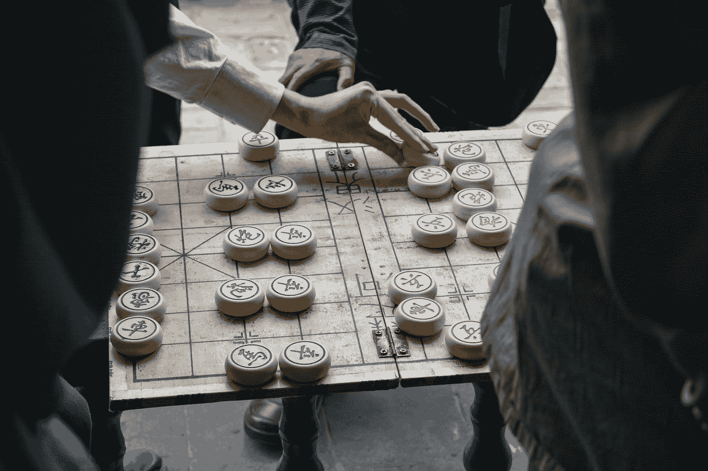
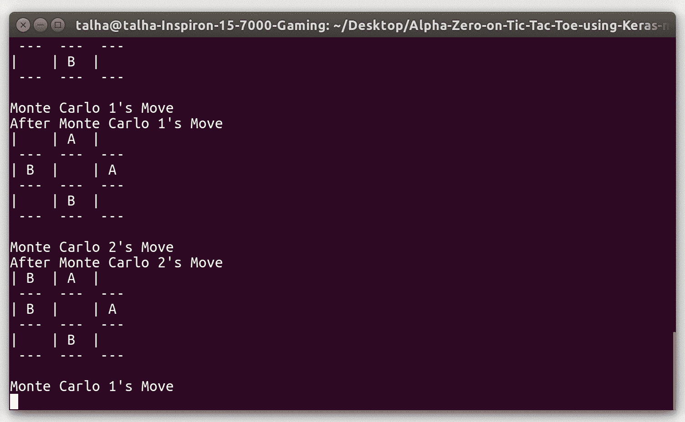

# 谢谢你，先生

> 原文：<https://medium.com/analytics-vidhya/thank-you-sir-d02dabee2ab6?source=collection_archive---------17----------------------->

## 我是如何为井字游戏实现著名的 DeepMind 算法的

达米安·帕特考斯基在 [Unsplash](https://unsplash.com?utm_source=medium&utm_medium=referral) 上拍摄的照片

所以，我无事可做，因为我的 gpu 正忙着做一些计算，而我在想我毕业后和我的本科生导师度过的时间，准确地说是 9 个月。我记得他告诉我，我可以写一篇关于我的工作的文章，这是我在那段时间完成的一篇论文。

那是 2017 年，我计划开始我的 MS，但不知何故它推迟了一年，我决定回去和我的主管一起做一些项目。最初，我从事几个项目，包括盲文本去模糊、汽车模拟中的自动驾驶和神经隐写术。过了一段时间，我的导师去参加一个会议，他不在的时候，我读了他的一些论文和他的博士论文(其中一些)。当他回来时，我让他告诉我一个想法，他让我读一读“阿尔法围棋”。

> 接下来是我读完之后的回忆。

我了解了以下事实:

> 2016 年 3 月，Deepmind 的 AlphaGo 以 4 比 1 击败世界冠军围棋选手 Lee Sedol。
> 
> 2017 年 10 月 18 日，AlphaGo Zero 以 100 比 0 击败了 AlphaGo。
> 
> 2017 年 12 月 5 日，DeepMind 发布了另一篇论文，展示了 AlphaGo Zero 如何在国际象棋和 shogi 中击败世界冠军程序 StockFish 和 Elmo。
> 
> 一种在没有任何人类专家策略先验知识的情况下擅长某事的算法诞生了。

我对此感到非常惊讶，所以我决定自己实现它，我的主管给了我一篇关于在 Connect4 上实现相同算法的文章，但我无法掌握任何东西，所以我决定从头开始，在(3x3) Tic Tac Toe 上实现它，因为这样更容易实现游戏的逻辑，而且我可以在更短的时间内检查我的进度。下面的文章在整个过程中对我帮助很大。

 [## 如何使用 Python 和 Keras 构建自己的 AlphaZero AI

### 通过自我游戏和深度学习，教机器学习 Connect4 策略。

medium.com](/applied-data-science/how-to-build-your-own-alphazero-ai-using-python-and-keras-7f664945c188)  [## AlphaGo Zero -工作方式和原因

### 2016 年 3 月，DeepMind 的 AlphaGo 成为第一个击败顶级人类围棋选手的人工智能，引起了轩然大波。这个版本…

tim.hibal.org](http://tim.hibal.org/blog/alpha-zero-how-and-why-it-works/) 

> 在与 DeepMind 的论文[ [1](https://discovery.ucl.ac.uk/id/eprint/10045895/1/agz_unformatted_nature.pdf) ， [2](https://arxiv.org/pdf/1712.01815.pdf) ]一起反复阅读了许多文章之后，我对该算法有了如下理解。

# **概述**

通过 self play 使用当前最佳玩家生成训练数据，以训练第二最佳玩家，然后对照最佳玩家评估其性能，如果其赢得 55%的时间，则在下一次迭代中用最佳玩家替换它。

# 目标

目标是预测两件事:

> 在每一点上，采取哪一步棋实际上是学习政策。
> 
> 在每一点上，直接的回报是什么，实际上是学习价值函数。

# 方法学

> 自我游戏
> 
> 网络权重优化
> 
> 网络评估

> 接下来是我对实现该算法所需的构件的翻译。世界应该是什么样子？如何表现不同的阶段？如何存储数据？

# 自我游戏

> 通过蒙特卡罗树搜索移动选择
> 
> 每次移动时，都会存储以下信息:
> 
> 游戏状态
> 
> 搜索概率
> 
> 获胜者

# 表现

> 0 表示在该位置没有移动
> 
> 1 代表参与人 1
> 
> 2 代表参与人 2

# 状态

> 在任何情况下，游戏的条件是一种依赖于表现的状态。
> 
> 这里，是完整的迷宫:
> 
> 0000000001
> 
> 0000000002
> 
> 以及一个转向指示器
> 
> (上面显示的是正在考虑的游戏的初始状态)

# 儿童

> 从一个状态可能的移动被认为是它的孩子。
> 
> 儿童游戏的初始状态是:
> 
> 100000000
> 
> 010000000
> 
> 001000000
> 
> 000100000
> 
> 000010000
> 
> 000001000
> 
> 000000100
> 
> 000000010
> 
> 000000001
> 
> 一个孩子储存五种价值观
> 
> N →采取行动的次数
> 
> W →国家总值
> 
> Q →状态的平均值
> 
> P →政策功能预测
> 
> V →价值函数预测

# 蒙特卡罗树搜索

> 给定一个状态，通过选择最佳子节点来浏览树，直到到达一个叶节点。
> 
> 在叶节点，预测它的每个子节点的概率。
> 
> 从叶向后传播到根，在这种情况下，根是输入，并更新 N、W 和 q 的值。
> 
> 重复这个循环一段时间。
> 
> 从一堆动作中选出最好的一个。

# 儿童选择

> 基于等式 Q+U 选择孩子
> 
> Q →状态的平均值
> 
> U →一个 P 和 N 的函数，如果一个动作相对于其他动作没有被深入研究，或者如果该动作的先验概率很高，则该函数增加
> 
> 在这种情况下，u 是零件号
> 
> 所以等式变成了(P/N)+Q
> 
> 因为在模拟的早期，U 应该占主导地位(更多的探索)，但是后期 Q 更重要(开发)
> 
> 因此需要一个小的修改，即(ε*(P/N))+Q

# 值更新

> 在反向传播过程中，这些值更新如下:
> 
> N = N+1
> 
> W = W+V
> 
> Q = W/N

# 插曲

从头到尾玩的一局就是一集。

# 数据生成

> 一旦一集结束，所有执行的步骤都将被标记。
> 
> 获胜玩家所走的所有步骤将被分配+1，而所有其他步骤将被分配-1。
> 
> 类似地，每一步都将被分配一个 CNN 提供的概率。

# 深度神经网络

> 这是一个具有 1 个卷积层和 40 个残差层的网络，具有双头输出、值头和策略头。
> 
> Value head 给出一个范围[-1，1]内的单一预测，实际上是试图预测游戏的结果。
> 
> 保单负责人给出了 9 种概率，实际上是试图预测孩子之间的概率分布。
> 
> 为了更快的收敛，我把模型分成不同的头部。
> 
> 价值头情况下的损失函数是均方误差，而策略头情况下的损失函数是软最大交叉熵。

# 网络权重优化

> 一旦使用当前最好的玩家通过自我游戏生成了数据，现在就该使用最好的玩家生成的数据重新训练第二好的玩家了。
> 
> 从数据中抽取小批量样本。
> 
> 在这些岗位上对当前网络进行再培训。

# 网络评估

在训练之后，是时候对照迄今为止最好的网络来评估重新训练的网络的性能，如果重新训练的网络赢得 55%的游戏，它将成为新的最好的网络，并且对于下一次迭代，角色将被改变，因为新的最好的网络将产生用于训练先前最好的网络的数据。

# 一些超参数

> 训练时期的数量:1
> 
> 训练迭代次数:20
> 
> 自我游戏时的游戏数量:100
> 
> 评估期间的游戏数量:40
> 
> 批量:256 个
> 
> 样本量:512
> 
> 蒙特卡洛模拟:100
> 
> 正则化常数:0.0001
> 
> 学习率:0.01
> 
> 动量:0.9
> 
> 优化器:SGD

# 结果

> 在 100 场比赛后，以 40 比 0 击败了未经训练的算法
> 
> 200 场比赛后，以 40 比 0 击败第一名

> 到目前为止，我已经尝试解释了算法的整体工作原理，现在我将尝试解释我的代码结构。

# 节点类

节点类包含以下属性

> n 是一个动作被执行的次数
> 
> **w** 是下一个状态的总值
> 
> **q** 是下一个状态的平均值
> 
> p 是选择行动 a 的先验概率
> 
> **状态**包含游戏的当前状态
> 
> **动作**包含当前状态的可能动作
> 
> **p** 包含移动概率
> 
> **v** 是状态值(针对当前玩家)

# 功能

# 行动

它以索引的形式从当前状态返回可能的动作。

# 儿童

它返回更新的节点，子数组包含状态形式的可能动作，父数组包含当前状态。

# 结论

如果玩家赢了，它返回 1；如果对手赢了，它返回 2；如果游戏没有结束，它返回-1；如果游戏打平，它返回 0。

# 模拟

它执行完整的蒙特卡罗模拟，并返回移动概率。

# mcst

它通过执行多个模拟来执行蒙特卡罗树搜索，并返回最佳移动、当前移动概率。

# 打印 _ 迷宫

它以板的形式打印输出。

# 插曲

它使用蒙特卡罗树搜索执行游戏的完整一集，并返回 pi_model 提供的移动概率、z_model 提供的状态值和 states 在一集期间提供的不同状态的预测，如果是玩家 1 的移动，则附加值为 1，如果是玩家 2 的移动，则附加值为 2。

演示

> 代码可在[这个](https://github.com/thanif/Alpha-Zero-on-Tic-Tac-Toe-using-Keras)存储库中获得。

那么，下一步是什么？嗯，我正在研究骑自行车的人的检测，并在这个过程中完成了另一篇论文。我希望尽快写下它。