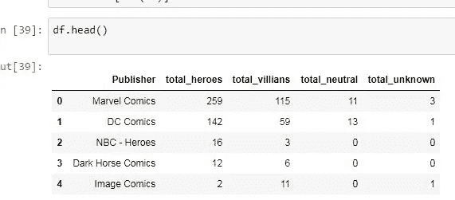
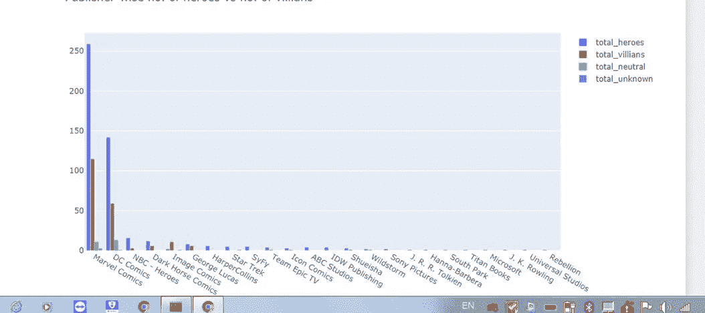

# 用代码进行数据分析

> 原文：<https://medium.com/analytics-vidhya/thanos-or-spectre-who-can-beat-captain-marvel-data-analysis-b9bfff5bc4b2?source=collection_archive---------17----------------------->

## 漫威和特区漫画人物的数据分析

萨诺斯

几个月过去了，灭霸已经死了。我们知道即使没有无限之石他也有多强大。但让我们假设他还活着，他正在寻找无限宝石，现在我们有了一个来自 DC 的超级恶汉，也是“幽灵”。

幽灵

**是的，所以漫威 VS DC。**

让我再加一个转折，一个漫威英雄也是一个叛徒，那就是漫威队长，她现在也在 infinity stones 后面。我们将看到谁有更多的权力，谁是无限宝石的合适人选。

这叫做阴谋。

数据是从 kaggle 导入的，我会把链接放在最后，为了数据可视化我用过 matplotlib 库，sns 库和 plotly 库。

加载所有必需的包，然后加载所有数据。

让我们找出哪些行的权重为空，然后找出所有要素中缺失值的总和。

让我们定义一个函数，它将为任何数据帧的任何特征给出所有的空值。

删除不必要的列

用 NAN 替换所有负值，并找出身高和体重中 NaN 值的数量。

使用中位数输入值，并创建一个仅包含身高和体重的新数据框。

每个出版物的超级英雄分布

当英雄的数量多于恶棍的数量时就没什么意思了，所以让我们来看看

英雄数量对恶棍数量

让我们使用 plotly 库来绘制它

数据可视化

条形图

让我们找出性别分布并画出来。

性别分布按好的排列，坏的排列，中性的排列，未知的排列并画出来。

按性别排列的分布

让我们导入另一个数据集。

让我们看看有多少超级英雄能像金刚狼一样自愈

让我们计算每个英雄的身体质量指数，看看谁是最健康的，谁是最懒惰的。

五大肥胖英雄

现在让我们看看灭霸和幽灵的总能量

这里很清楚，DC·维利安将击败漫威·维利安，并将成为无限宝石的最佳候选人。

但是惊奇队长会让这种事情发生吗？

让我们看看惊奇队长的全部力量

可悲的是，如果我们只是假设总力量是获得无限宝石的标准，那么 ***SPECTRE 将击败漫威队长*** 。

根据数据集，DC 有这样令人兴奋的别墅，为什么我们没有在电影中看到？

可能以后吧。

也许复仇者联盟可以限制 SPECTRE 在未来获得无限宝石。