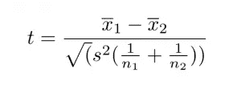

# t-test 上的那个 1 题！

> 原文：<https://medium.com/analytics-vidhya/that-1-question-on-t-test-3b8658597316?source=collection_archive---------30----------------------->

在你的面试中，有没有被 t 检验/t 值问题陈述卡住过？

在浏览了很多关于 t-test 的好文章后，我准备了一份所有提问的总结，以及你需要**在 t-test 上拥有**的信息！

# 问:什么是 t 检验？

t 检验是一种*统计检验*，用于比较两个不同组的平均值。它通常用于假设检验，以检查两组是否有任何相似之处，换句话说，如果两组的均值差异为零。

> 零假设:它是对你感兴趣的变量之间没有关系的预测。
> 交替假设:与零假设正好相反，意思是我们感兴趣的变量之间存在关系。

由[咖啡极客](https://unsplash.com/@coffeegeek?utm_source=medium&utm_medium=referral)在 [Unsplash](https://unsplash.com?utm_source=medium&utm_medium=referral) 上拍摄的照片

# 问:t 检验测量什么？

t 检验测量我们感兴趣的两组平均值的差异除以两组平均值的合并标准误差。

来源:谷歌

> 在这个公式中， *t* 是 t 值， *x* 和 *x* 2 是被比较的两组的平均值， *s* 是两组的合并标准差， *n* 1 和 *n* 2 是每组的观察次数。

通过这种方式，它计算出一个数字(t 值),该数字说明了正在比较的两组平均值之间的差异大小

# 问:有哪些不同的 t 检验，何时选择它们？

有 3 种类型的 t 检验:

1.  配对 t 检验
2.  单样本 t 检验
3.  双样本 t 检验

如果您正在研究一个群体，使用**配对 t 检验**比较一段时间内或干预后的群体平均值，或使用**单样本 t 检验**比较群体平均值与标准值。如果您正在研究两个群体，请使用**双样本 t 检验**。

如果您只想知道是否存在差异，使用**双尾测试**。如果你想知道一组平均值是大于还是小于另一组，使用左尾或右尾**单尾测试**。

# 问:我们可以使用 t-test 测试 2 个以上的组吗？

不，t 检验不能用于 2 组以上，它最多只接受 2 组，对于 2 组以上的检验，我们使用 ANOVA 检验。(一篇即将发表的文章)。

我希望这能在你准备的时候派上用场！大家多联系，多分享知识。

[LinkedIn](https://www.linkedin.com/in/lokeshrathi/)

您可能想关注我以获得更多这种直观和信息丰富的内容！