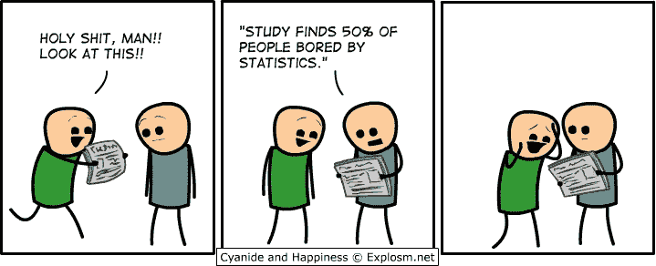
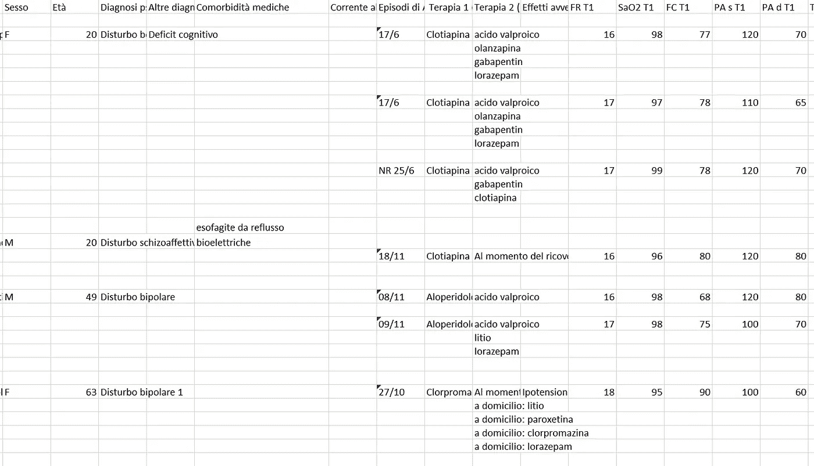

# 那一次，我同意帮助我的反技术朋友进行数据分析

> 原文：<https://medium.com/analytics-vidhya/that-time-i-agreed-to-help-my-anti-tech-friend-with-his-data-analysis-937a2c7b7a03?source=collection_archive---------19----------------------->

我用来清理和分析一堆乱七八糟的研究数据的代码。



到目前为止，我很幸运地处理了或多或少干净和组织良好的数据:公司有完整的团队，他们每天都在努力设计最有效的数据结构，对数据进行质量保证，并以无缝、快速、优雅的方式将新收集的数据添加到旧数据中。当然，这里或那里有一些 nan，数据类型中有一些奇怪之处(例如，当我试图对一个数据帧的两个纯数字列求和时，后来才发现——很久很久以后——事实上，并不是所有的值都是浮点数)，但总体上没有什么出乎意料的。当我儿时最亲密的一个朋友为了他的论文请我帮他分析数据时，我知道自己是一个非常娇惯的分析师。

我和我朋友现在还保持着联系:高中的时候我们一起学经典，后来我选了物理，他选了医学，我们就分道扬镳了。他即将在我们的祖国意大利最负盛名的学校之一完成他的学位，最后一次打开一本与统计数据模糊相关的书是在十年前。我立即同意**帮助他**，以纪念我们合作用一半时间完成的所有希腊文和拉丁文作业。

我没有考虑到的是，他不知道可以用(Python，R，…)硬编码你的统计测试的软件的存在，因此当涉及到数据结构化时，他完全忽略了任何好的实践。据他自己承认，他觉得进行一些数据分析舒服的唯一方法是购买一些昂贵软件的许可证。但是，正如许多学生可以联系到的，他破产了，真的买不起几千欧元的软件，他最多用两次。

他的论文在于评估某些特定疗法对精神病患者的疗效。应将结果与之前的相关研究进行比较，并根据性别、诊断和年龄对患者进行亚类分析，以揭示某种治疗是否更有效。我的朋友在当地医院的精神科轮班工作，日复一日地在 Excel 表格上填写每个病人的姓名、性别、年龄、诊断、住院日期和接受的治疗。他还记录了治疗前后的一些重要参数，用于评估治疗效果。

**数据集，也就是手写的 Excel 表格**，非常小(~500 行)，而且满满的，全是空行。事实上，名单上的每一个病人显然都服用了一堆“二级治疗”药物，每一种药物都占据了自己的特殊位置。这是数据集的一个例子，出于隐私原因，病人的名字被删掉了——数据也是随机的，保持了原来的形状:



我将在下面解释导致我交付 Python 笔记本的过程，在那里我一步一步地解释分析，这是完全可配置的，所以我的朋友可以摆弄数字，并至少享受一些统计的美丽。

由于我认为我遇到的问题可能非常普遍，并且我为解决这些问题编写的代码可能有用，所以我决定分享这些代码——这显然不是所有类型的杂乱数据集的解决方案，但我相信它可以概括我的学习。

首先，很明显，数据集需要经过彻底的…

# 清洁

我有足够的经验来担心当数据集看起来不太有希望时查询单个列，因此，我毫不犹豫地…

## **1。去掉所有空白的列名**

在列名的开头、中间或结尾使用空格？全都消失了，很简单，在熊猫身上:

```
import pandas as pd
df = pd.read_csv('Dati.csv')new_cols = []
for col in df.columns:
    new_cols.append(col.strip().replace(" ", ""))df.columns = new_cols
```

现在我确信所有的列都可以被查询而不会出现键错误。

得知诊断和药物名称是由人在中**输入的，可能是在一个很长的轮班结束时，在意大利中部一个资金不足的精神病科，在有史以来最热的一个夏天的开始，我开始怀疑是否存在一些拼写错误。**

此外，我知道我的朋友真的不关心保证列数据类型的一致性:开始是浮点型的，可能不会一直是浮点型。患者拒绝测量重要参数(float)吗？那么，相应的细胞将不会是空的，它会说“il pazinte ri fiuta”——病人拒绝。这样你就有了:一个主要由浮子和少量细绳组成的柱子。但并不总是相同的字符串:“Il pazinte rifiuta”很可能变成“Il pazinte ri fiuta”——大写的“I”，或者仅仅是“ri fiuta”。

谢天谢地，这两个问题有一个共同的解决方案，我用三个步骤来实现。首先我…

## 2.将所有字符串转换为小写

并消除了整个数据集中的所有空格。是的，也是在这种情况下，拜拜字符串中的空格。为什么？我之前提到过 floats 和 string 可以在同一个列中找到，为了识别字符串并去掉它们，我将使用方法 *isalpha()* ，正如我将解释的那样，*不会将空格识别为字符串。*

```
for col in df.columns:
    if df[col].dtypes == object:
        df[col] = df[col].str.replace(" ", "").str.lower()
```

请注意，我将去掉空格并转换为小写的列的数据类型是“object”:当一个列由浮点和字符串组成时，情况总是如此，就像我的例子一样。

之后，我…

## **3。将数字列中的字母字符替换为‘nan’**

为此，我使用方法 *isalpha()* 来标识字符串，然后使用 *replace()* 将字符串转换为‘nan’(字符串)，最后将列数据类型更改为 float，以确保这些‘nan’不会被标识为数字，而不是字符串。如果字符串包含一个空格，那么组合 *isalpha()* 和 *replace()* 将不能成功地识别和转换文本，除非我消除空格——正如我在上一步中提到的。

不想要的字母值指的是拒绝测量重要参数的患者:所以我认为在分析中包含这些值是不明智的，我选择用 NaNs 代替零。

```
for col in df.columns:if df[col].dtypes == object and df[col].any().isnumeric():df[col]=df[col].apply(lambda x: x.replace(x,'nan') if type(x)==str and x.isalpha() else x).astype(float)
```

最后，我积极地…

## **4。检查拼写错误**

下面的代码返回一列中单词(或数字)的**出现次数**，将它们**存储在按照**降序**排序的 dict** 中。我将此代码用于只包含字符串的列，例如药品名称或诊断，并且我主要关注最少出现的项目的拼写。不止一次以同样的方式拼错一个单词的几率有多大？通常很低。的确，一些诊断可能很少，或者一些药物很少使用，因此只发生在一两个病例中，但是这些低发生率值可能是简单的错误。

这里是函数 *func()* ，它统计各种项目的出现次数，并根据出现次数对字典进行排序(我之所以擅长处理字典，是因为 Python 为大家做了贡献，[https://www.py4e.com/](https://www.py4e.com/)，我强烈推荐这款工具):

```
import operator
def func(i): 
    d = dict()
    for c in i.dropna():
        d[c] = d.get(c,0) + 1
    sorted_d=dict(sorted(d.items(),key=operator.itemgetter(1), reverse=True))
    return sorted_d
```

在这里，我将 *func()* 应用于对象类型的列，排除那些至少包含一个浮点值的列(因为，正如您现在所知道的，有些列同时包含浮点和字符串，在这个阶段我真的对它们不再感兴趣):

```
for col in df.columns:
    if df[col].dtypes==object and df[col].any().isnumeric()==False:
        print(func(df[col]))
```

我向您展示了一个拼错单词时可能发生的情况。这是给药的说明。查看出现次数最多和最少的项目:

```
{'clotiapina': 73, 'aloperidolo': 19, 'promazina': 15, 'clorpromazina': 10, 'talofen': 1, 'zuclopentixolo': 1, 'clotiapona': 1, 'alopridolo': 1}
```

如你所见，*‘clotiapina’*是最受欢迎的，其次是’*aloperidolo*，而*‘clotiapona’，‘alopridolo’，‘zuclopentixolo’*和*‘talofen’，*另一方面*，*只出现一次。现在，***我不是精神病医生****但是我很确定*【克洛蒂亚波娜】*和*【阿洛普多罗】*分别是*的*名字分别是*【克洛蒂亚皮娜】*和*【阿洛佩多罗】*，而*【祖克洛佩顿】**

```
*df[*col_name*]=df[*col_name*].str.replace(‘clotiapona’, ‘clotiapina’)*
```

*到目前为止，我非常自信地认为我已经给了数据集它所希望的最好的形状，并最终为一些…*

# *分析*

*我的朋友有兴趣调查的主要有四点:样本的一些描述性分析，基于治疗前后重要参数的治疗效果，他的研究和以前的研究之间的比较，在样本中发现比其他人更受益于特定治疗的潜在子类。*

*我将代码放在适当的位置，并试图让完全不熟悉 Python 的人能够轻松地操作它并得到他们想要的东西。以下小段代码为任何所需的(数字)列提供了一些统计指标，主要是与测量的重要参数相关的列:*

## *1.样本数量的平均值、标准误差*

```
*def stats(i):
    return round(i.dropna().mean(),1), round(i.dropna().sem(),1), len(i.dropna())print(stats(df[*col_name*]))*
```

*鉴于一个值和下一个值之间的许多许多 NaNs，dropna() 是必要的，我在文章前面已经指出了。*

*获得的平均值是指在特定治疗前后测量的一些重要参数，因此可以监测其有效性，也可以与在类似研究中获得的相同指标进行比较。为了实现比较，我编写了一个函数来执行一个…*

## *2.t 检验*

**ttest_ind_from_stats()* 是库 *Scipy* 中的一个快速简单的方法，它使用一些描述性统计参数(平均值、误差、样本数)对两个独立样本的平均值进行 T 检验。它返回所用参数的计算 t 统计值*‘tstat’*和 p 值*‘pvalue’*。*

*如果测试得出的 p 值小于所选的置信区间，则比较的两个平均值在统计上是不同的。如果治疗前后一个重要参数的平均值在统计学上有所不同，那么这意味着治疗产生了效果:好的或坏的，我的朋友将决定应用他在过去十年左右的学习中所学到的概念。*

```
*import scipy def ttest(my_data_mean, my_data_sem, my_data_len, other_data_mean, other_data_sem, other_data_len):
    tstat, pvalue = ttest_ind_from_stats(my_data_mean, my_data_sem, my_data_len, other_data_mean, other_data_sem, other_data_len)
    if pvalue<0.001: 
            return 'T stat:', round(tstat,2), 'p-value <0.001 -> the averages are statistically different'
    elif pvalue>=0.001:
            return 'T stat:', round(tstat,2), 'p-value >=0.001 -> the averages are NOT statistically different'
    else:
            return 'Too few data!'*
```

*如果数据点太少(例如，只有 1 —或 0)，该函数将会报错:在这些条件下，T 测试将不会成功，返回的*‘tstat’*和*‘pvalue’*将为 NaN。*

*该函数的结构允许将我朋友的数据集中的数据或者他的数据与其他人的数据进行比较(假设“其他人”的研究的统计参数是已知的)。*

*最后，也是最具挑战性的任务，是编写一个函数，根据样本子类别(性别、年龄、诊断)来比较特定治疗成功程度的差异。在这种情况下，策略在于使用 Python *groupby()* 实际上是按照期望的子类别和实施的治疗对数据点进行分组。然后，我评估了上述子类别的统计参数，并遍历了所有确定的子类别，对每一对可能的子类别进行了 T 检验。*

*例如，我的朋友有兴趣发现基于*克罗匹那*和*阿罗匹多*的治疗效果是否因性别而异。请记住，治疗的成功是通过测量特定的生命参数来评估的，在我为他编写的 Python 笔记本中，我指定只需插入*analysis _ by _ group*('*sex*'，' *vital_param* ')即可涵盖该病例。*

*进行的 T 检验将在治疗后分别对男性和女性的指定'*生命参数'*测量值进行比较。我并不确切知道一个特定的重要参数与另一个参数的相关性，所以我让专家，我的朋友，来摆弄它们。*

*下面，我用来执行 a 的代码:*

## *3.按类别进行 t 检验*

```
*def analysis_by_group(category, vital_param):
    grouped_cat = df.groupby([category, '*Therapy*']).mean()
    grouped_cat_sem = df.groupby([category, '*Therapy*']).sem()
    grouped_cat_count = df.groupby([category, '*Therapy*']).count()
    var = []
    lst = []
    for i in grouped_cat.index:
        lst = [i, grouped_cat.loc[i][vital_param], grouped_cat_sem.loc[i][vital_param], grouped_cat_count.loc[i][vital_param]]
        var.append(lst)
    for a, b in itertools.combinations(var, 2):
            print ('\nCategorie da comparare:',a[0], b[0],a[3],b[3], 'T-test:', ttest(a[1], a[2], a[3], b[1], b[2], b[3]))print(analysis_by_group('*category*', '*vital_param*'))*
```

*您可以在代码中看到， *groupby()* 首先作用于一个子类别，然后作用于疗法，为分组的数据集提供统计参数。之后，使用我在分析的步骤 2 中展示的函数对每一对进行 T 检验。*

# *一些最后的想法…*

*总而言之，我在这个项目中获得了很多乐趣。对我来说，最吸引人的事情是成功操纵医疗数据集的能力，尽管我完全不熟悉我正在看的东西的本质细节(或者说，当比较各种子类别的患者时)。*

*我写了这段代码，希望能让不知道 Python 存在的人容易理解。我还不知道我是否成功完成了这项任务，因为我的朋友还没有从意大利的圣诞节庆祝活动中恢复过来，没有时间去看作品——是的，在意大利，你需要在圣诞节假期后休息*，消化两周的食物。我希望他能分享我在摆弄他的数据时的一点乐趣，也许还能学到拥有一个干净、一致的数据集有多重要。**

*最后，一个考虑…我不知道世界上其他地方的医学课程是否像意大利一样缺乏现代性。我认为，在技术以光速发展的现实中，同样重要的是，20 年前不必与计算机打交道的类别，至少也要获得最低限度的技术接触。如果我朋友一生中至少经历过一次杂乱数据的乐趣，那么我分析他的数据集的速度会快多少？正如您可能已经理解的那样，我花了比分析更长的时间来清理数据，我知道这是数据科学中的通常情况。*

**