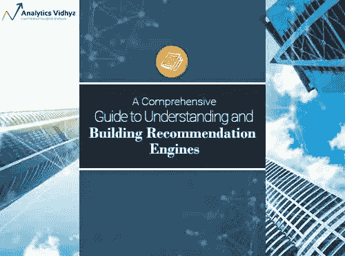
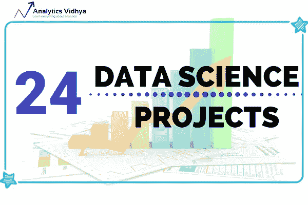
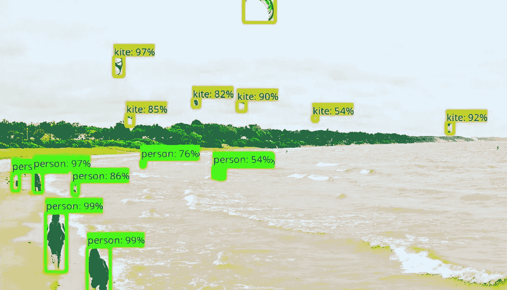
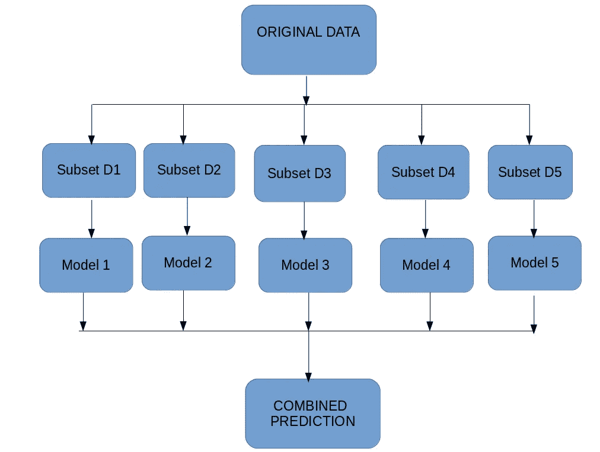
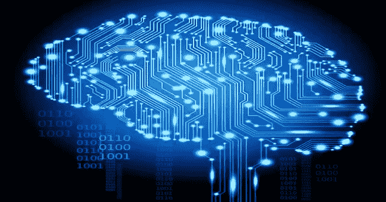
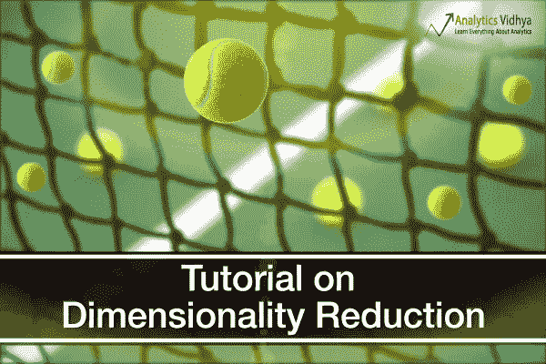
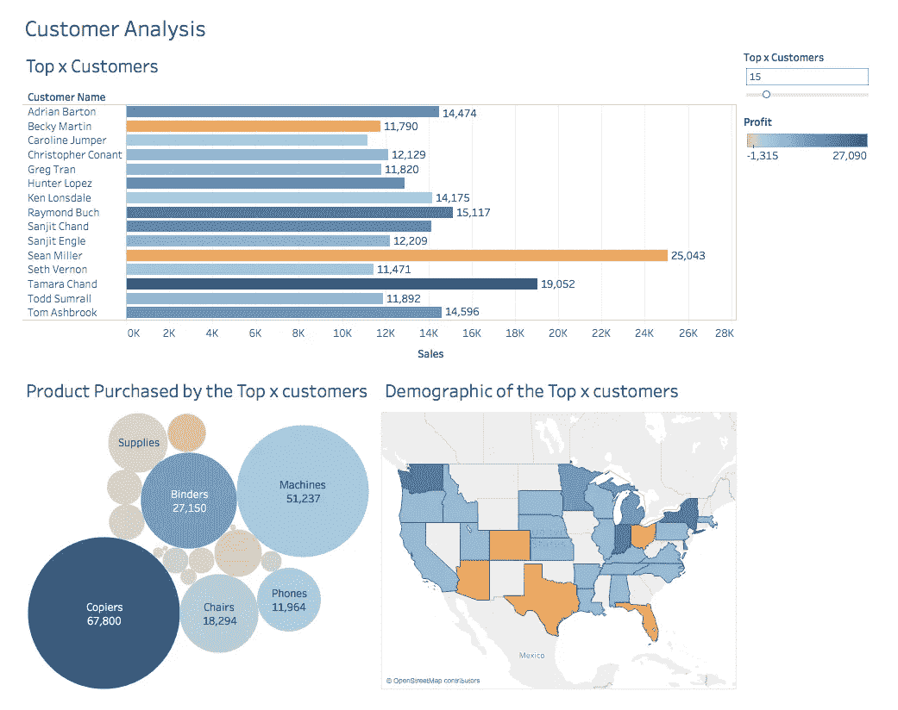
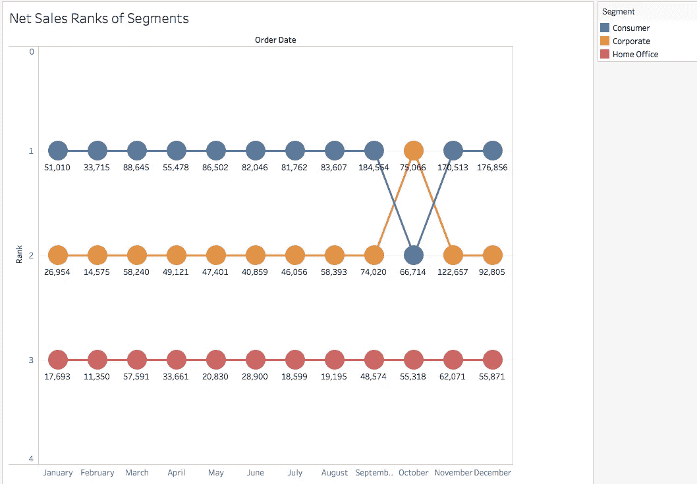
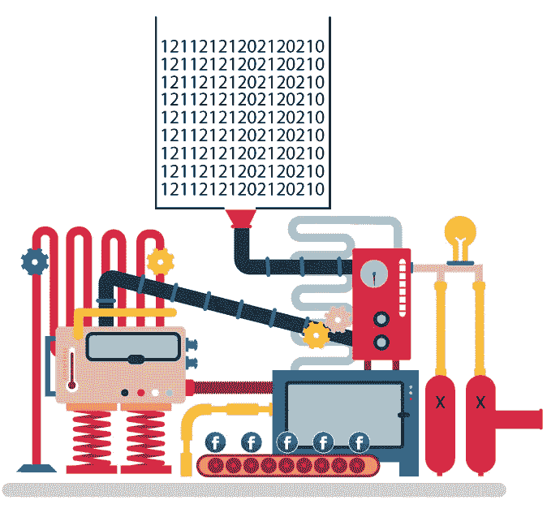

# 2018 年关于分析的 15 篇最受欢迎的数据科学和机器学习文章

> 原文：<https://medium.com/analytics-vidhya/the-15-most-popular-data-science-and-machine-learning-articles-on-analytics-vidhya-in-2018-1d4ae47c9d56?source=collection_archive---------1----------------------->

Analytics Vidhya 自成立以来，一直以发布高质量和无与伦比的内容而闻名。2018 年也不例外。今年，我们将数据科学和机器学习内容提升到了一个全新的水平。

我们推出了一些高质量和受欢迎的培训课程，发布了知识丰富的机器学习和深度学习文章和指南，我们的博客访问量每月超过 250 万次。非常感谢我们的社区对我们的支持，以及你们对这个领域永不满足的兴趣！

当我们为美好的 2018 年拉下帷幕时，我们希望与我们美好的社区分享这一年中最好的时光。这篇文章是那个系列的一部分，看看你，亲爱的读者，最喜欢的文章。请查看我们迄今为止的其他回顾文章:

*   [2018 年 AI & ML (NLP，计算机视觉，强化学习)技术概述【2019 年趋势](https://www.analyticsvidhya.com/blog/2018/12/key-breakthroughs-ai-ml-2018-trends-2019/)
*   【2018 年 GitHub 上你不容错过的 25 个最佳数据科学项目

在这个集合中，我总结了每篇文章，并根据它们各自的领域对它们进行了分类。每篇文章还包含内容摘要。如果你有任何其他你认为特别有用的文章，我们很乐意听到。请在下面的评论框中告诉我们。

现在事不宜迟，让我们来看看 2018 年发表在 Analytics Vidhya 上的热门文章！

# 本文涵盖的主题

*   机器学习和深度学习——终极搭档
*   商业智能和数据可视化
*   数据科学职业
*   自然语言处理
*   播客

# 机器学习和深度学习——终极搭档

# [从头开始构建推荐引擎的综合指南(Python 语言)](https://www.analyticsvidhya.com/blog/2018/06/comprehensive-guide-recommendation-engine-python/)

推荐技术已经存在了几十年(如果不是几个世纪的话)。机器学习的兴起无疑加速了这些技术的改进过程。我们不再需要依赖直觉和对行为的人工监控——将数据与正确的技术结合起来，瞧！你有一个非常有效和有利可图的组合。

这篇文章是你能在任何地方找到的关于这个主题的最全面的指南之一。它涵盖了各种类型的推荐引擎算法和用 Python 创建它们的基础。Pulkit 首先解释什么是推荐引擎，以及它们是如何工作的。然后，他用 Python 进行了一个案例研究(使用流行的 MovieLens 数据集),并用它来解释如何构建某些模型。他关注的两个主要技术是协同过滤和矩阵分解。

一旦你建立了你的推荐引擎，你如何评价它？我们如何知道它是否如我们计划的那样工作？Pulkit 通过展示我们可以用来验证我们的模型的六种不同的评估技术来回答这个问题，从而完善了指南。

# [24 个终极数据科学项目，提升您的知识和技能(&可免费访问)](https://www.analyticsvidhya.com/blog/2018/05/24-ultimate-data-science-projects-to-boost-your-knowledge-and-skills/)

这是维迪亚有史以来最受欢迎的文章之一。最初于 2016 年发布，我们的团队用来自各行业的最新数据集对其进行了更新。这些数据集被分为三个职业级别，每个级别都迎合了你职业生涯的不同阶段:

*   **初级:**这一级别的数据集相当容易操作，不需要复杂的数据科学技术
*   **中级:**这个级别由本质上更具挑战性的数据集组成。它由中型&大型数据集组成，需要一些严肃的模式识别技能
*   **高级:**这个级别最适合理解神经网络、深度学习、推荐系统等高级主题的人。

还有锦上添花？每个项目都有一个相关的教程！因此，无论您是想从头开始学习，还是在某一点上停滞不前，或者只是想用一个基准分数来评估您的结果，您都可以添加书签并回到该教程。

# [在 Python 中从头开始理解和构建对象检测模型](https://www.analyticsvidhya.com/blog/2018/06/understanding-building-object-detection-model-python/)

物体检测在 2018 年真正起飞。它可以帮助自动驾驶汽车安全地穿越交通，在拥挤的地方发现暴力行为，帮助运动队分析和建立侦察报告，确保制造过程中零件的适当质量控制，等等。而这些仅仅是物体检测技术所能做到的皮毛！

在这篇文章中，Faizan Shaikh 首先解释了什么是对象检测，然后深入研究了可以用来解决对象检测问题的不同方法。他从最基本的方法开始，将图像分成不同的部分，并对每个部分使用图像分类器。然后，本文以此为基础，每一步都有所改进，最终展示了深度学习如何用于构建端到端的对象检测模型。

*如果这个话题让你着迷，并且你正在寻找一个地方开始你的深度学习之旅，我推荐你去看看令人敬畏的'* [*计算机视觉使用深度学习*](https://trainings.analyticsvidhya.com/courses/course-v1:AnalyticsVidhya+CVDL101+CVDL101_T1/about) *'课程。*

# [集成学习综合指南(带 Python 代码)](https://www.analyticsvidhya.com/blog/2018/06/comprehensive-guide-for-ensemble-models/)

一旦我们掌握了基本的机器学习算法，集成学习就会出现。这是一个迷人的概念，并且在本文中得到了很好的解释。有大量的例子可以帮助把复杂的话题分解成容易理解的想法。

由于本指南的综合性，Aishwarya 通过大量的技术指导我们——装袋、助推、随机森林、LightGBM、CatBoost 等等。所有信息都集中在一个地方！

你会经常在黑客马拉松中遇到这种方法——这是一种行之有效的爬上排行榜的方法。

# [每个数据科学家都必须使用的 25 个用于深度学习的开放数据集](https://www.analyticsvidhya.com/blog/2018/03/comprehensive-collection-deep-learning-datasets/)

学习和巩固一个概念的最好方法是什么？学习理论是一个好的开始，但是边做边学才是我们真正理解这项技术如何工作的时候。对于像深度学习这样广阔的领域来说尤其如此。

磨练你技能的数据集并不缺乏——但是你应该从哪里开始呢？哪些数据集最适合构建您的个人资料？你能得到特定领域的数据集来帮助你熟悉这一行吗？为了帮助你，我们搜索了互联网，并精心挑选了前 25 个开放深度学习数据集。

这些数据集分为三类:

*   图像处理
*   自然语言处理
*   音频/语音处理

所以选择你的兴趣，今天就开始吧！

# [12 种降维技术的终极指南(带 Python 代码)](https://www.analyticsvidhya.com/blog/2018/08/dimensionality-reduction-techniques-python/)

啊，维度的诅咒。我们都喜欢更多的数据，拥有足够大的训练集总是有帮助的。但是正如大多数数据科学家将会证明的那样，拥有太多的数据最终会令人非常头疼。当你面对一个有 1000 个变量的数据集时，你该怎么办？不可能在粒度级别上分析每个变量。

这就是降维技术发挥如此重要作用的地方。在不丢失(太多)信息的情况下减少特征的数量是我们都在努力的目标。正如 Pulkit 在这篇综合文章中所展示的，降维是一种非常有效的方法。检查 12(是的 12！)技术及其在 Python 中的实现，包括主成分分析(PCA)、因子分析和 t-SNE。

# 商业智能和数据可视化

# [数据科学和商业智能专业人员中级 Tableau 指南](https://www.analyticsvidhya.com/blog/2018/01/tableau-for-intermediate-data-science/)

Tableau 是分析手头数据的一个非常好的工具。但是它不仅仅局限于产生漂亮的可视化效果——您还可以在其中执行类似 Excel 的任务。Tableau 的扩展功能真正将“智能”放在了 BI 中。

本文面向熟悉 Tableau 基本功能并希望扩展其工具知识的用户。作者涵盖的主题包括连接、数据混合、执行计算、分析和理解参数等。这是一篇插图精美的文章，会让你想打开画面！

你可以先浏览一下 [Tableau 初学者指南](https://www.analyticsvidhya.com/blog/2017/07/data-visualisation-made-easy/)，以防你需要快速复习。

# [学习高级 Tableau 的分步指南——面向数据科学和商业智能专业人士](https://www.analyticsvidhya.com/blog/2018/03/tableau-for-advanced-users-easy-expertise-in-data-visualisation/)

本指南是你阅读完中间文章后合乎逻辑的下一步。我们超越 Tableau 的“演示”功能，在此探索高级图表。正如帕夫林如此雄辩地指出的那样——“这些高级图表的宏伟令人兴奋和着迷”。

本文涵盖了不同的图表——运动图、凹凸图、甜甜圈图、瀑布图和帕累托图。此外，还将向您介绍 Tableau 中 R 编程的概念。当您希望将数据科学与 BI 相结合时，这非常方便！

# 数据科学职业

# [你需要的最全面的数据科学&机器学习面试指南](https://www.analyticsvidhya.com/blog/2018/06/comprehensive-data-science-machine-learning-interview-guide/)

我很高兴把这本指南放在一起。面试通常是有抱负的数据科学家面临的最大绊脚石，通过面试需要某些技能的组合。如果你来自非技术背景(像我一样)，破解这些面试会变得更有挑战性。

一般会问什么样的问题？面试官在寻找什么？所需的技术和软技能的正确组合是什么？这些可能令人望而生畏..除非你没准备好。这就是撰写这篇冗长而详细的指南背后的想法。

这篇全面的帖子涵盖了多个主题，提供了大量资源，包括数据科学和机器学习问题、工具特定的测验、各种案例研究、谜题、猜测，甚至还有几个真正鼓舞人心的故事来指引你走向终点！

# [业余数据科学家常犯的 13 个错误以及如何避免它们](https://www.analyticsvidhya.com/blog/2018/07/13-common-mistakes-aspiring-fresher-data-scientists-make-how-to-avoid-them/)

有抱负的数据科学家在匆忙进入该领域时犯了大量错误。我也犯过很多这样的错误，并且写下了我见过的其他人经历过的 13 个最常见的错误。相信我，成为一名数据科学家是一条艰难的道路，并且你不是唯一一个犯这些错误的人。

从别人的错误中吸取教训也可能是一次职业生涯的决定性经历。因此，我还提供了一个资源列表以及每一点，目的是帮助您克服这些障碍，加速您迈向数据科学乐土的旅程。

# [想成为一名数据工程师？这里有一个全面的资源列表，可以开始使用](https://www.analyticsvidhya.com/blog/2018/11/data-engineer-comprehensive-list-resources-get-started/)

到目前为止，我们主要讨论了数据科学家。但是数据科学领域还有其他各种各样的角色，现在最热门的角色是数据工程师。它们在所有数据科学家的宣传中被忽略了，但是在任何 DS 项目中它们都是非常重要的。

目前没有一个结构化的路径可以让你成为一名数据工程师。你在工作中学习，别无选择。我希望这篇文章将有助于提供一个不同的选择。这里有大量的免费资源，包括电子书、视频课程、基于文本的文章等。

一旦我们了解了什么是数据工程师，以及这个角色与数据科学家的角色有何不同，我们就可以直接进入您需要了解的各个方面，以便让这个角色成为您自己的角色。我还提到了一些在数据科学界受到尊重的数据工程认证。

# 自然语言处理

# [处理文本数据(使用 Python)的终极指南——面向数据科学家&工程师](https://www.analyticsvidhya.com/blog/2018/02/the-different-methods-deal-text-data-predictive-python/)

这是一本你需要阅读的指南。这是基本的 NLP 初学者指南，它从一些基本概念开始，逐渐向更高级的技术发展，如单词包和单词嵌入。有相当多的方法可以解决文本数据问题，您将在这里了解这些不同的方法。

特征提取、预处理和高级技术——这些都包含在文本数据中。每种技术都使用 Python 代码和开放数据集进行展示，因此您可以边学边编码。

*你也可以查看综合的'* [*自然语言处理使用 Python*](https://trainings.analyticsvidhya.com/courses/course-v1:AnalyticsVidhya+NLP101+2018_T1/about) *'课程来开始你自己的 NLP 生涯。*

# [用 Python 构建 FAQ 聊天机器人——信息搜索的未来](https://www.analyticsvidhya.com/blog/2018/01/faq-chatbots-the-future-of-information-searching/)

2018 年是聊天机器人达到顶峰的一年。它们是自然语言处理(NLP)最常见的上市应用。可以理解，越来越多的人想学习如何建立一个。嗯，你来对地方了！

本文探讨了如何通过提取与印度最近引入的商品和服务税(GST)相关的信息，用 Python 构建一个聊天机器人。商品及服务税-常见问题机器人！作者使用了拉沙-NLU 图书馆来构建这个机器人。

# [使用 Python 中的 ULMFiT 和 fastai 库进行文本分类(NLP)的教程](https://www.analyticsvidhya.com/blog/2018/11/tutorial-text-classification-ulmfit-fastai-library/)

这是一个非常重要的话题——对于初学者和高级 NLP 用户都是如此。ULMFiT 框架是由塞巴斯蒂安·鲁德和杰瑞米·霍华德开发的，它为其他迁移学习库铺平了道路。这篇文章更适合那些熟悉基本 NLP 技术并希望扩展其投资组合的人。

Prateek Joshi 以一种简化的方式向我们介绍迁移学习、ULMFiT 以及如何在 Python 中实现这些概念。正如 Sebastian Ruder 所说，“NLP 的 ImageNet 时刻已经到来”，是你跳上马车的时候了。

# 播客

# [你必须听的 10 个数据科学、机器学习和人工智能播客](https://www.analyticsvidhya.com/blog/2018/01/10-data-science-machine-learning-ai-podcasts-must-listen/)

播客是一种在旅途中消费信息的伟大媒介。不是所有人都有时间通读文章。播客出色地填补了这一空白，让我们了解机器学习的最新发展。这 10 大播客的集合在出版的时候就像病毒一样传播开来，并且从那以后一直在榜首。

我们今年还推出了自己的播客系列，名为 DataHack Radio。DHR 以数据科学和机器学习行业的顶级领导者和从业者为特色，并迎合数据科学社区的所有级别。在**[**iTunes**](https://itunes.apple.com/in/podcast/datahack-radio/id1397786677?mt=2)当然还有 [**我们自己的网站**](https://www.analyticsvidhya.com/blog/category/podcast/) ！**

# **结束注释**

**再次向我们的社区大声疾呼，感谢他们对数据科学的持续支持和关注。让我们一起努力，让 2019 年成为一个更好更大的一年，并承诺保持我们对学习的渴望完好无损，并得到良好的推动！明年见。**

***原载于 2018 年 12 月 31 日*[*www.analyticsvidhya.com*](https://www.analyticsvidhya.com/blog/2018/12/most-popular-articles-analytics-vidhya-2018/)*。***