# 2018 年 GitHub 上你不应错过的 25 个最佳数据科学项目

> 原文：<https://medium.com/analytics-vidhya/the-25-best-data-science-projects-on-github-from-2018-that-you-should-not-miss-8231744f405e?source=collection_archive---------1----------------------->

*2018 年是开源机器学习项目的巨大一年。以下是我们的精选，项目分为不同的类别。*

什么是托管您的代码、与团队成员协作以及作为在线简历展示您的编码技能的最佳平台？问任何一个数据科学家，他们都会给你指出 GitHub。近年来，它是一个真正革命性的平台，改变了我们托管甚至编写代码的方式。

但这还不是全部。它也是一种学习工具。你会问，怎么会？给你个提示——开源！

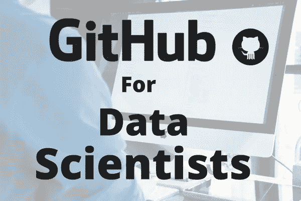

世界领先的科技公司通过发布其流行算法背后的代码，在 GitHub 上开源他们的项目。2018 年，谷歌和脸书等公司的发布量激增。这些版本最好的部分是代码背后的研究人员也提供了预训练的模型，这样像你我这样的人就不必浪费时间从头开始构建困难的模型。

此外，我们经常看到面向编码人员和开发人员的热门趋势知识库——这包括备忘单、视频链接、电子书、研究论文链接等资源。无论你处于职业生涯的哪个阶段(初学者、已建立或高级)，你总能在 GitHub 上找到新的东西来学习。

正如我们将很快看到的那样，2018 年在许多数据科学子领域都是超越性的一年。自然语言处理(NLP)无疑是社区中谈论最多的领域，像 ULMFiT 和 BERT 都是开源的。为了给我们这个令人敬畏的社区带来最好的东西，我全年都在做一个月度系列，在这个系列中，我精心挑选了每个数据科学家都应该了解的前 5 个项目。你可以在下面查看整个系列:

*这里和我的* [*文章覆盖 2018 年 AI 和 ML 最大突破*](https://www.analyticsvidhya.com/blog/2018/12/key-breakthroughs-ai-ml-2018-trends-2019/) *会有一些重叠。也一定要看看那篇文章——它基本上是我觉得这个领域的每个人都需要知道的所有主要发展的列表。另外，还有专家的预测——这是你不想错过的。🙂*

现在，准备好探索新项目，在 2019 年成为数据科学明星，并向下滚动！只需点击每个项目标题，就可以进入 GitHub 上的代码库。

# 我们将在本文中讨论的主题

*   工具和框架
*   计算机视觉
*   生成对抗网络
*   其他深度学习项目
*   自然语言处理
*   自动机器学习
*   强化学习

# 工具和框架

让我们看看工具、库和框架方面的顶级项目。既然我们在谈论软件存储库平台，那么用这一部分来打开话题是合适的。

技术进步很快，计算成本比以往任何时候都低，所以我们正在处理一个又一个的大规模发布。我们可以称之为机器学习中编码的黄金时代吗？这是一个悬而未决的问题，但有一点我们都同意——这是成为数据科学程序员的大好时机。在这一节(以及整篇文章)中，我试图尽可能地使语言多样化，但是 Python 不可避免地占据了主导地位。

# [ML.NET](https://github.com/dotnet/machinelearning)

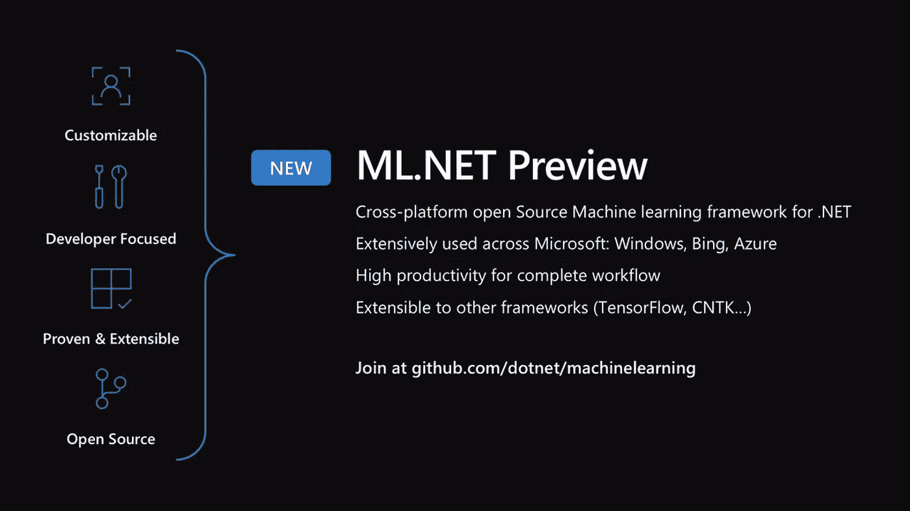

你们都怎么样。NET 开发人员想要学习一点机器学习来补充您现有的技能吗？这里是让这个想法开始的完美仓库！NET 是微软的一个项目，是一个开源的机器学习框架，允许你在. NET 中设计和开发模型

您甚至可以将现有的 ML 模型集成到您的应用程序中，而不需要明确了解 ML 模型是如何开发的。ML.NET 实际上用于微软的多个产品，如 Windows、必应搜索、微软 Office 等。

ML。NET 运行在 Windows，Linux 和 MacOS 上。

# [TensorFlow.js](https://github.com/tensorflow/tfjs)

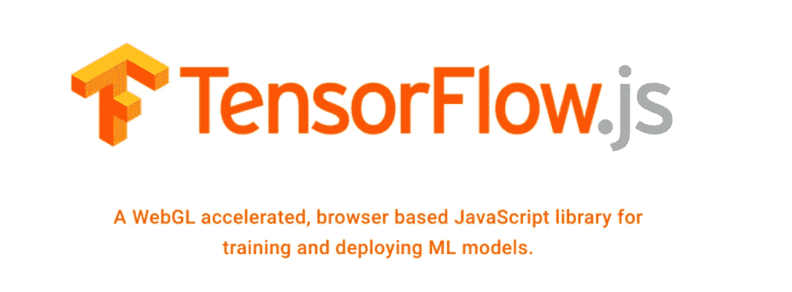

浏览器里的机器学习！几年前一个虚构的想法，现在变成了惊人的现实。这个领域的很多人都被自己最喜欢的想法束缚住了，但是 TensorFlow.js 有可能改变你的习惯。自从今年早些时候发布以来，它已经成为一个非常受欢迎版本，并继续以其灵活性令人惊叹。

正如存储库所述，TensorFlow.js 主要有三个主要特性:

*   在你的浏览器本身中开发机器学习和深度学习模型
*   在浏览器中运行预先存在的 TensorFlow 模型
*   重新培训或微调这些预先存在的模型

如果你熟悉 Keras，那么高层 API 看起来会很熟悉。GitHub 资源库中有大量的例子，所以请查看这些例子，以加快您的学习曲线。

# [PyTorch 1.0](https://github.com/pytorch/pytorch)

皮托赫已经一年了。它已经赢得了全球数据科学家和 ML 研究人员的青睐和项目。它易于掌握、灵活，并且已经在一些高知名度的研究中得到应用(您将在本文后面看到)。最新版本(1.0 版)已经大规模支持许多脸书产品和服务，包括每天执行 60 亿次文本翻译。如果您一直想知道何时开始涉足 PyTorch，现在正是时候。

如果你是这个领域的新手，一定要看看 [Faizan Shaikh 的 PyTorch](https://www.analyticsvidhya.com/blog/2018/02/pytorch-tutorial/) 入门指南。

# [证件代码](https://github.com/zziz/pwc)

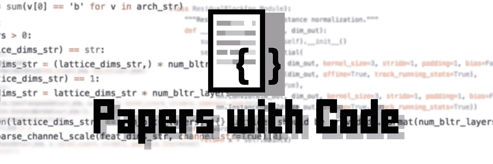

虽然不是严格意义上的工具或框架，但这个存储库是所有数据科学家的金矿。我们大多数人都在努力通读一篇论文，然后实施它(至少我是这样)。我们的机器上有许多运动部件似乎不工作。

这就是“带代码的文件”出现的原因。顾名思义，他们有过去 6 年左右发布的所有主要论文的代码实现。这是一个令人兴奋的收集，你会发现自己奉承。他们甚至添加了 NIPS (NeurIPS) 2018 上提交的论文中的代码。快去那边！

# 计算机视觉

由于计算成本的下降和顶级研究人员突破的激增(我觉得这两者可能有联系)，深度学习比以往任何时候都有更多的人可以接触到。在深度学习中，计算机视觉项目无处不在——本节中您将看到的大多数存储库将涵盖一种或另一种计算机视觉技术。

这只是目前深度学习中最热门的领域，在可预见的未来将继续如此。无论是物体检测还是姿态估计，似乎所有的计算机视觉任务都有一个存储库。现在是了解这些发展的最佳时机——许多工作机会可能很快就会来到你面前。

# [脸书的探测器](https://github.com/facebookresearch/Detectron)


Detectron 在 2018 年初推出时引起了巨大的轰动。由脸书的人工智能研究团队(FAIR)开发，它实现了最先进的对象检测框架。令人惊讶的是，它是用 Python 编写的，并帮助实现了多个项目，包括 DensePose(我们很快就会谈到它)。

这个库包含代码和 70 多个预训练的模型。错过太好的机会了，你同意吗？

# [英伟达的 vid2vid 技术](https://github.com/NVIDIA/vid2vid)

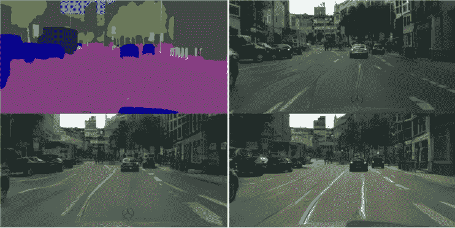

图像中的物体检测很棒，但在视频中做呢？不仅如此，我们能不能扩展这个概念，把一个视频的风格翻译成另一个？是的，我们可以！这是一个非常酷的概念，NVIDIA 已经很慷慨地发布了 PyTorch 实现供您使用。

该存储库包含该技术的视频、完整的研究论文，当然还有代码。NVIDIA 的例子中使用了 [Cityscapes 数据集](https://www.cityscapes-dataset.com/)，可在注册后公开获取。2018 年我最喜欢的项目之一。

# [在 18 分钟内在 ImageNet 数据集上训练一个模型](https://github.com/diux-dev/imagenet18)

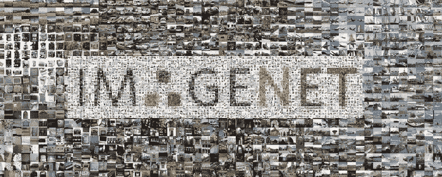

18 分钟训练一个深度学习模型？同时无法使用高端计算资源？相信我，已经有人做过了。Fast.ai 的杰瑞米·霍华德和他的学生团队在流行的 ImageNet 数据集上建立了一个模型，甚至优于谷歌的方法。

我鼓励你至少通过这个项目来了解这些研究人员是如何构建他们的代码的。不是每个人都可以访问多个 GPU(甚至一个),所以这对小鱼来说是一个相当大的胜利。

# [物体探测综合文集](https://github.com/hoya012/deep_learning_object_detection)

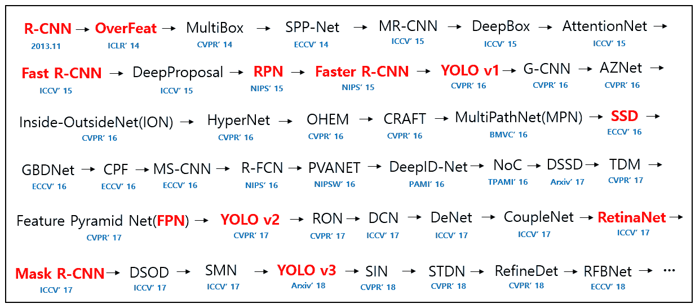

另一个研究论文收藏库！了解您选择的主题在多年的时间跨度内是如何演变的总是很有帮助的，这个一站式商店将帮助您在物体检测方面做到这一点。这是一个从 2014 年至今的论文综合收集，甚至尽可能包括代码。

上图展示了物体检测框架在过去五年中是如何发展和转变的。很迷人，不是吗？甚至还有一个 2019 年的条目，所以你有很多事情要做。

# 脸书的密集区

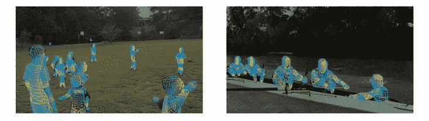

让我们把注意力转向姿态检测领域。今年我偶然发现了这个概念，并从此对它着迷。上面的图像捕捉到了这个知识库的精髓——野外密集人类姿态估计。

这里包含了训练和评估您自己的 DensePose-RCNN 模型的代码。也有笔记本可以用来可视化 DensePose COCO 数据集。这是开始姿势估计学习的好地方。

# [大家现在跳舞——姿势估计](https://github.com/nyoki-mtl/pytorch-EverybodyDanceNow)

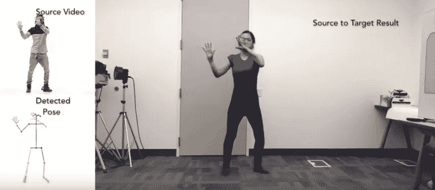

上面的图片(取自视频)真的激起了我的兴趣。我在 8 月份报道了研究论文的发布，并一直对这项技术保持敬畏。这项技术使我们能够在不同视频中的人体对象之间转移运动。我提到的视频可以在资源库中找到——它会让你大吃一惊！

这个存储库进一步包含了这种方法的 PyTorch 实现。这种方法能够拾取和复制的复杂细节的数量令人难以置信。

# 甘斯

我敢肯定，你们中的大多数人一定都遇到过 GAN 应用(即使你们当时可能没有意识到)。2014 年，伊恩·古德菲勒(Ian Goodfellow)提出了 GANs，即生成性对抗网络，并从此火了起来。他们擅长执行创造性的任务，尤其是艺术任务。看看这本由 Faizan Shaikh 编写的关于 GANs 世界的介绍性指南,以及用 Python 编写的实现。

我们在 2018 年看到了太多基于 GAN 的项目，因此我想为此创建一个单独的部分。

# [深度画风调和](https://github.com/luanfujun/deep-painterly-harmonization)

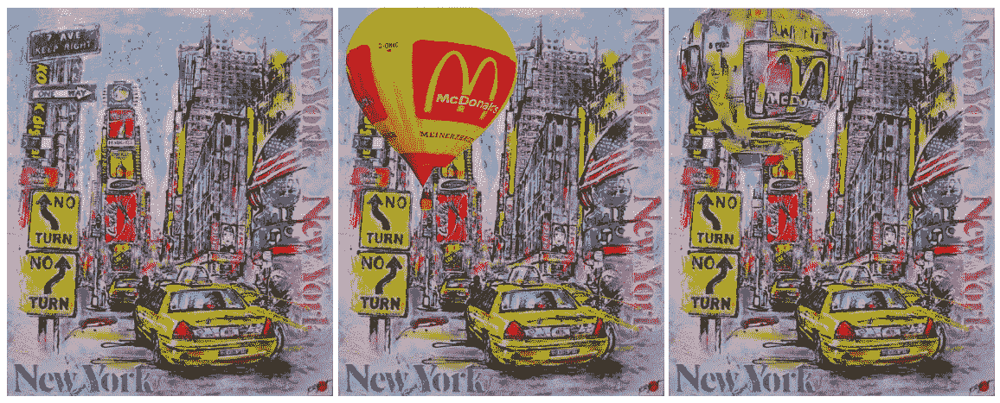

让我们从我最喜欢的一个开始。我想让你花点时间欣赏一下上面的图片。你能说出哪个是人做的，哪个是机器做的吗？我当然不能。这里，第一帧是输入图像(原始)，第三帧是通过这种技术生成的。

很神奇，对吧？该算法将你选择的外部物体添加到任何图像中，并设法使它看起来像没有东西碰过它。确保您检查了代码，并尝试自己在一组不同的图像上实现它。真的真的很有趣。

# [图像加色](https://github.com/bendangnuksung/Image-OutPainting)

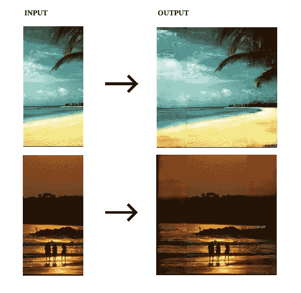

如果我给你一张图片，让你想象整个场景被拍摄下来时的样子，从而扩展边界，会怎么样呢？可以理解，你会求助于一些图像编辑软件。但是这里有一个好消息——你可以用几行代码实现它！

这个项目是对斯坦福大学的图像打印论文的 Keras 实现(非常酷并且有插图的论文——这是大多数研究论文应该有的样子！).您可以从头开始构建一个模型，也可以使用这个库的作者提供的模型。深度学习奇迹永远不会停止令人惊讶。

# [可视化和理解 gan](https://github.com/CSAILVision/gandissect)

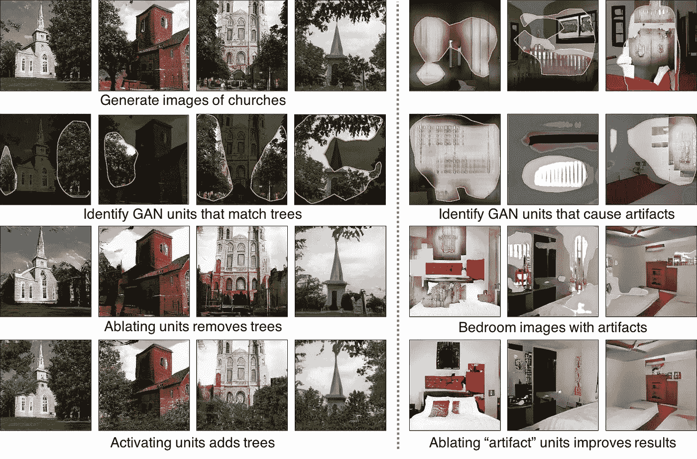

如果你还没有掌握 GANs，试试这个项目。由麻省理工学院 CSAIL 部门的研究人员首创，它帮助你可视化和理解甘斯。你可以通过检查和操纵它的神经元来探索你的 GAN 模型学到了什么。

我想把你带到麻省理工学院的官方项目页面上，那里有足够的资源让你熟悉这个概念，包括一个视频演示。

# [组织信息](https://github.com/albertpumarola/GANimation)

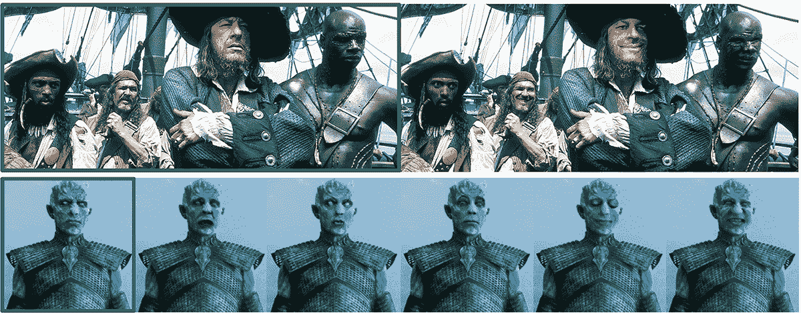

这种算法使你能够改变图像中任何人的面部表情。这既令人兴奋又令人担忧。上面的图片在原件的绿色边框内，其余的是由 GANimation 生成的。

该链接包含初学者指南、数据准备资源、先决条件和 Python 代码。正如作者提到的，不要把它用于不道德的目的。

# [英伟达的 FastPhotoStyle](https://github.com/NVIDIA/FastPhotoStyle)

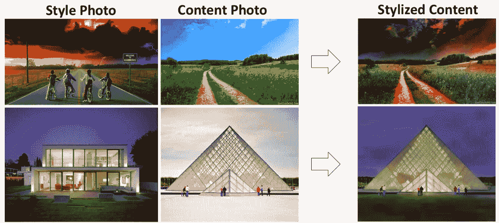

这个项目与我们之前看到的深度绘画协调非常相似。但它值得一提，因为它来自英伟达自己。如上图所示，FastPhotoStyle 算法需要两个输入—一个样式照片和一个内容照片。然后，该算法以两种方式之一生成输出——要么使用照片真实感图像风格化代码，要么使用语义标签地图。

# 其他深度学习项目

计算机视觉领域有可能掩盖深度学习中的其他工作，但我想强调一下它以外的几个项目。

# [英伟达的 WaveGlow](https://github.com/NVIDIA/waveglow)

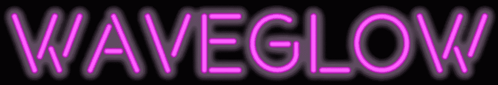

音频处理是深度学习开始崭露头角的另一个领域。它不仅仅局限于生成音乐，你还可以完成音频分类、指纹识别、分段、标记等任务。还有很多东西有待探索，谁知道呢，也许你可以利用这些项目开拓出一条通往巅峰的道路。

这里有两篇直观的文章可以帮助你熟悉这一行:

而 NVIDIA 又来了。WaveGlow 是一个基于流的网络，能够生成真正高质量的音频。它本质上是一个用于语音合成的单一网络。

这个库包括 WaveGlow 的 PyTorch 实现，以及一个预先训练好的模型，您可以下载。研究人员还列出了如果你想从头开始训练自己的模型可以遵循的步骤。

# [天文网](https://github.com/google-research/exoplanet-ml)

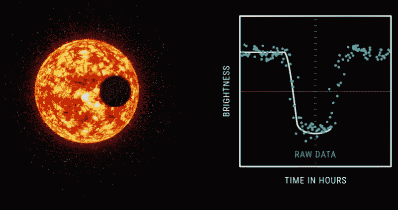

想发现自己的星球？这可能有点言过其实，但这个 AstroNet 库肯定会让你更接近。谷歌大脑团队在 2017 年 12 月通过应用 AstroNet 发现了两颗新行星。这是一个深度神经网络，用于处理天文数据。它显示了机器学习的广泛应用，是一个真正的里程碑式的发展。

现在，该技术背后的团队已经开源了全部代码(提示:该模型基于 CNN！)为 AstroNet 提供动力。

# [VisualDL —可视化深度学习模型](https://github.com/PaddlePaddle/VisualDL)

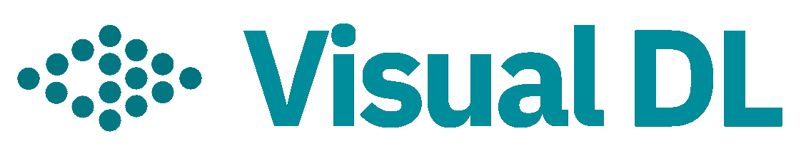

谁不喜欢可视化？但是，想象深度学习模型如何工作可能会有点令人生畏——其中涉及太多的移动部件。但 VisualDL 通过设计具体的深度学习工作，在缓解这些挑战方面做得很好。

VisualDL 目前支持以下用于可视化作业的组件(您可以在资源库中看到每个组件的示例):

*   数量
*   柱状图
*   图像
*   声音的
*   图表
*   高维

# 自然语言处理

看到 NLP 在这个列表中如此靠后感到惊讶吗？这主要是因为我在本文中涵盖了几乎所有主要的开源版本。我强烈建议你看看这个列表，以便掌握你的 NLP 游戏。我在这里提到的框架包括 ULMFiT、Google 的 BERT、ELMo 和脸书的 PyText。我将在此简要提及 BERT 和其他几个资料馆，因为我发现它们非常有用。

# [谷歌的伯特](https://github.com/google-research/bert)

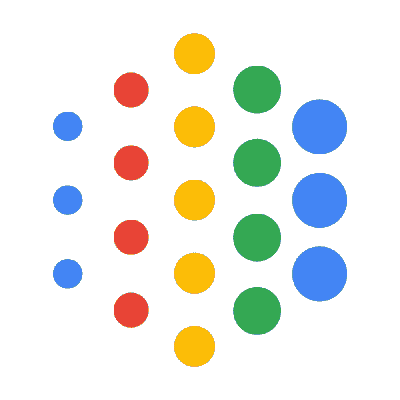

我不可能不提到伯特就放过这一部分。谷歌人工智能的发布打破了赢得 NLP 爱好者和专家的心的记录。继 ULMFiT 和 ELMo 之后，BERT 凭借其出色的性能彻底击败了竞争对手。它在 11 个 NLP 任务上获得了最先进的结果。

除了我上面链接的官方 Google 知识库，BERT 的 [PyTorch 实现也值得一试。它是否标志着一个新时代的到来，我们很快就会知道。](https://github.com/huggingface/pytorch-pretrained-BERT)

# [MatchZoo](https://github.com/NTMC-Community/MatchZoo)

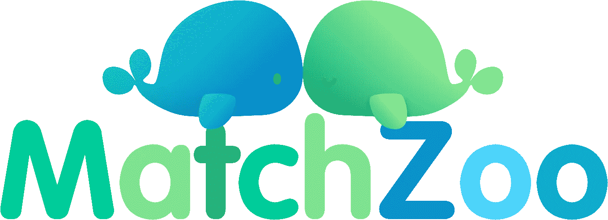

了解您的模型相对于某个基准的表现通常会有所帮助。对于 NLP，特别是深度文本匹配模型，我发现 MatchZoo 工具包相当可靠。与 MatchZoo 相关的潜在任务包括:

*   会话
*   问题答案
*   文本蕴涵
*   信息检索
*   释义识别

MatchZoo 2.0 目前正在开发中，所以期待看到更多的东西被添加到这个已经很有用的工具包中。

# [NLP 进度](https://github.com/sebastianruder/NLP-progress)

这个知识库是由塞巴斯蒂安·鲁德创建的。这个项目的目的是跟踪 NLP 的最新进展。这包括数据集和最先进的模型。

任何你想了解更多的自然语言处理技术——很有可能它已经在这里了。该知识库涵盖了传统的和核心的自然语言处理任务，如阅读理解和词性标注。如果你对这个领域有一点点兴趣的话，就必须给这个知识库打上星号/书签。

# 自动机器学习

对 AutoML 来说是多好的一年。随着各行业寻求将机器学习集成到其核心任务中，对数据科学专家的需求持续增长。目前需求和供给之间存在巨大差距。AutoML 工具有可能填补这一空白。

这些工具是为那些没有数据科学专业知识的人设计的。虽然确实有一些令人难以置信的工具，但大多数工具的价格都远远高于大多数个人的承受能力。因此，我们令人惊叹的开源社区在 2018 年拯救了我们，发布了两个备受瞩目的版本。

# [汽车角](https://github.com/jhfjhfj1/autokeras)

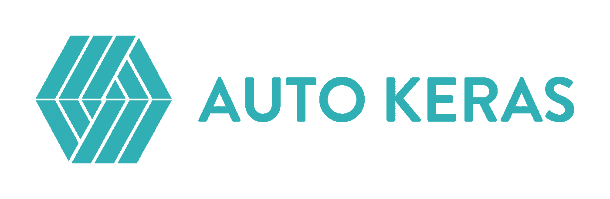

这在几个月前发布时引起了不小的轰动。为什么不会呢？长期以来，深度学习一直被认为是一个非常专业的领域，因此一个可以自动化大多数任务的库是一个受欢迎的迹象。引用他们官方网站的话，“AutoML 的最终目标是向数据科学或机器学习背景有限的领域专家提供易于访问的深度学习工具”。

您可以从 pip 安装该库:

```
pip install autokeras
```

该存储库包含一个简单的示例，让您了解整个事情是如何工作的。不客气，深度学习爱好者。🙂

# [谷歌的 AdaNet](https://github.com/tensorflow/adanet)

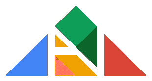

AdaNet 是一个自动学习高质量模型的框架，不需要编程专业知识。因为这是 Google 的发明，所以框架是基于 TensorFlow 的。您可以使用 AdaNet 构建集合模型，甚至将其用于训练神经网络。

GitHub 页面包含代码、示例、API 文档和其他一些有用的东西。相信我，AutoML 是我们领域的下一个大事件。

# 强化学习

因为我已经在我的 2018 年概述文章中介绍了一些强化学习版本，所以我将保持这一部分相当简短。我希望包括一个 RL 部分，在那里我可以促进我们社区的讨论，并希望加快在这一领域的研究。

首先，请确保您查看了 OpenAI 的旋转知识库，这是一个针对初学者的详尽的教育资源。然后前往[谷歌的多巴胺页面](https://github.com/google/dopamine)。这是一个加速这一新兴领域研究的研究框架。现在，让我们看看其他一些资源。

# [模仿秀](https://github.com/xbpeng/DeepMimic)

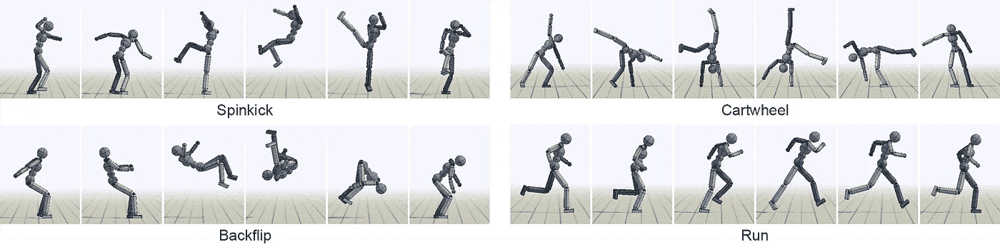

如果你在社交媒体上关注一些研究人员，你一定会看到以上视频形式的图片。一个人在一个地形上奔跑，或者试图站起来，或者类似的事情。亲爱的读者，这就是强化学习在起作用。

这是一个典型的例子——一个训练模拟人形机器人模仿多种运动技能的框架。您可以通过上面的链接获得代码、示例和一步一步的操作。

# [强化学习笔记本](https://github.com/Pulkit-Khandelwal/Reinforcement-Learning-Notebooks)

这个库是从理查德·萨顿和安德鲁·巴尔托的书和其他研究论文中收集的强化学习算法。这些算法以 Python 笔记本的形式呈现。

正如这份报告的作者所提到的，只有当你继续学习的时候，你才能真正学到东西。这是一个复杂的话题，放弃或像读故事书一样阅读资源将会使你一事无成。

# 结束注释

这就是我们 2018 年旅程的终点。多好的一年啊！撰写这篇文章是一次愉快的经历，一路上我学到了很多新东西。

我很想听到你对这篇文章的反馈。您使用过哪个存储库？你觉得哪个最有用？我错过了哪一个？使用下面的评论部分，让我知道。

*原载于 2018 年 12 月 26 日*[*www.analyticsvidhya.com*](https://www.analyticsvidhya.com/blog/2018/12/best-data-science-machine-learning-projects-github/)*。*