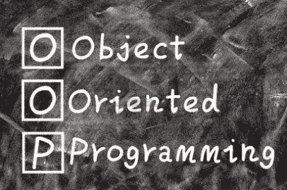

# OOP 的三大支柱

> 原文：<https://medium.com/analytics-vidhya/the-3-pillars-of-the-oop-4308edeb6230?source=collection_archive---------30----------------------->



几天前，我参加了一个 Python 开发人员的面试，除了学习该语言的语法之外，我认为再看一眼“面向对象编程的三大支柱”是一个不错的主意。换句话说，这仅仅意味着**是什么使得一个 OOP 语言成为一个 OOP 语言。**

在网上资源中，你可能不会只找到 3 个，而是 4 个，甚至 5 个，它们可以用不同的方式调用，但定义是一样的。

没关系，但在我看来，我们可以恢复我将在这篇文章中解释的所有内容。

我喜欢从根本上理解事物，所以让我们快速看一下 OOP 是什么。

来自[维基百科](https://en.wikipedia.org/wiki/Object-oriented_programming)定义:

**面向对象编程** ( **OOP** )是一种基于[对象](https://en.wikipedia.org/wiki/Object_(computer_science))概念的[编程范式](https://en.wikipedia.org/wiki/Programming_paradigm)，它可以包含[数据](https://en.wikipedia.org/wiki/Data)，以[字段](https://en.wikipedia.org/wiki/Field_(computer_science))(通常称为*属性*或*属性*)的形式，以及代码，以过程的形式(通常称为 [*方法*](https://en.wikipedia.org/wiki/Method_(computer_science)) )

面向对象的语言有 [Java](https://en.wikipedia.org/wiki/Java_(programming_language)) 、 [C++](https://en.wikipedia.org/wiki/C%2B%2B) 、 [C#](https://en.wikipedia.org/wiki/C_Sharp_(programming_language)) 、 [Python](https://en.wikipedia.org/wiki/Python_(programming_language)) 、 [PHP](https://en.wikipedia.org/wiki/PHP) 、 [JavaScript](https://en.wikipedia.org/wiki/JavaScript) 、 [Ruby](https://en.wikipedia.org/wiki/Ruby_(programming_language)) 、 [Perl](https://en.wikipedia.org/wiki/Perl) 等等。

现在，它们是一些特定的特性，一门编程语言必须能够提供这些特性，才能被称为面向对象的语言。正如我之前所说，我将在 3:

*   **封装**
*   **专精**
*   **多态性**

从现在开始，我将附上用 **Python** 语言代码编写的例子，因为这是迄今为止我最喜欢的一个。**不要担心**，当然这些概念仍然适用于其他所有面向对象语言，并且也是基于 [hacker.io](https://hackr.io/blog/best-programming-languages-to-learn-2020-jobs-future) 最流行的语言统计数据，Python 做得一点也不差！。

## 包装

你定义的每一个类都应该是完全封装的，这意味着每一个定义的类都应该包含整个类的数据和操作这些数据的函数。

从[或](https://www.oreilly.com/library/view/programming-visual-basic/0596004389/ch04s04.html)上的例子可以看出:

“如果你创建一个雇员对象，从你程序的角度来看，这个雇员对象应该完整地定义每个雇员的所有信息。

通常，您不希望一个类定义雇员的工作信息，而另一个不相关的类定义雇员的联系信息。相反，您希望将所有这些信息封装在 Employee 类中，也许是通过将联系信息聚合为 Employee 类的成员。"

在我们的例子中，我们将引入一个“Person”类:

```
class Person():
    ''' Person class '''def __init__(self, name='Noname', age=0, gender='None', sexuality='None', religion='None'):
        '''Initialize person'''
        self.__name = name
        self.__age = age
        self.__gender = gender
        self.__sexuality = sexuality
        self.__religion = religiondef get_name(self):
        '''Return person name'''
        return self.__namedef set_name(self, name):
        '''Set person age'''
        self.__name = name
        return self.__namedef get_age(self):
        '''Return person age'''
        return self.__agedef set_age(self, n):
        '''Set person age'''
        self.__age = n
        return self.__agedef get_gender(self):
        '''Return person gender'''
        return self.__genderdef set_gen(self, gen):
        '''Set person age'''
        self.__gender = gen
        return self.__genderdef get_sexuality(self):
        '''Return person sexuality'''
        return self.__sexualitydef set_sex(self, sex):
        '''Set person sexuality'''
        self.__sexuality = sex
        return self.__sexualitydef get_religion(self):
        '''Return person religion'''
        return self.__religiondef set_rel(self, rel):
        '''Set person rel'''
        self.__religion = rel
        return self.__religion
```

假设这是一个人需要的所有信息和数据，我们将假设我们只需要提取和更新这些信息。我们可以注意到，所有的数据和处理这些数据的函数( [**方法**](https://www.tutorialspoint.com/difference-between-method-and-function-in-python) )都在类本身的定义中。然后我们可以说这个类完全被**封装了**。

## **专业化**

专门化允许你在你的类之间建立层次关系。这意味着可以定义一个从另一个现有类派生的类。通过这样做,“子”类将继承“父”类的特征。

> 这对于避免不必要的重复代码非常有用。

我们将创建一个“教师”类来更好地理解这一点。

**想一想:**老师本身就是人对吗？

我想强调的是，没有必要为了返回或设置教师的信息(如姓名、年龄或 person 类中已经存在的任何其他属性)而复制代码。

> 这就是**继承**有用的地方！

```
class Teacher(Person):
    '''Teacher class inherits from Person class'''def __init__(self, knowledge, experience):
        '''Initializing teacher'''
        super().__init__()
        self.__knowledge = knowledge
        self.__experience = experiencedef get_knowledge(self):
        '''Return teacher knowledge'''
        return self.__knowledgedef set_knowledge(self, know):
        '''Set teacher knowledge'''
        self.__knowledge = know
        return self.__knowledgedef get_experience(self):
        '''Return teacher experience'''
        return self.__experiencedef set_experience(self, exp):
        '''Set teacher experience'''
        self.__experience = exp
        return self.__experience
```

你看到了吗？…使用这一原则，我们不必为教师类重新定义相同的属性和方法，而只需为教师类专门定义这些属性和方法。

为了调用父类方法，我们使用了 **super()** 内置函数。如果你想了解更多，点击[这里](https://www.programiz.com/python-programming/methods/built-in/super)。

## 多态性

但是..请稍等。如果老师不想分享一些私人信息，如他/她的宗教信仰或性取向，该怎么办？。

我们应该完全尊重这个决定，对吗？

正确的做法应该是先问老师他/她是否想公开这些信息，你不这样认为吗？

也就是说，我们现在知道**get _ religion()方法必须不同于 Person 类 one。**

这就是多态性发挥作用的地方:

来自[overig.com](https://overiq.com/python-101/inheritance-and-polymorphism-in-python/):

从字面上来看，多态性意味着采取各种形式的能力。在 Python 中，多态性允许我们在子类中定义与其父类同名的方法。

众所周知，子类继承了父类的所有方法。但是，您会遇到从父类继承的方法不太适合子类的情况。在这种情况下，您必须在子类中重新实现方法。这个过程称为方法重写。"

覆盖教师类的 get_religion()方法:

```
def get_religion(self):
        '''
        Return teacher religion
        if he/she wants to
        '''print('Do you want to share this?')
answer = input()if answer == 'yes':
            print('Thank you for your consent')
            return (super().get_religion())if answer == 'no':
            print('Sorry person doesn't want to share religion')
            returnelse:
            print('Answer needs to be yes or no')
            return
```

> 有道理吧？

让我们做一个小测试:

```
man = Person('sech', 34, 'Male', 'Hetero', 'Christian')
print('Person religion is: ', man.get_religion())Teacher_1 = Teacher('Math', 4)
Teacher_1.set_rel('Catolic')
print('Teacher Religion is: ', Teacher_1.get_religion())
```

输出:

```
Person religion is:  Christian
Do you want to share this?
yes
Thank you for your consent
Teacher Religion is:  Catolic
```

如果你想要代码来做你自己的测试，欢迎点击这里[**。**](https://github.com/sechchr22/Educative/blob/master/3_OOP_principles.py)

**希望这对你有所帮助。**

> **归根结底，知识是属于每个人的**
> 
> **下次见！**