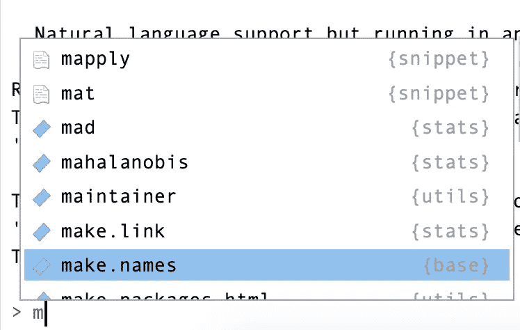

# 你需要知道的 3 个 RStudio 键盘快捷键

> 原文：<https://medium.com/analytics-vidhya/the-3-rstudio-keyboard-shortcuts-you-need-to-know-7d118192162?source=collection_archive---------7----------------------->

当我第一次开始用 R 编写代码的时候，有*那么*许多新东西要学，感觉势不可挡。虽然有很多人兴奋地向我提供建议，但我很难知道某件事是必要的、可选择的，还是仅仅是个人偏好。如果你不打算长期使用 R，下面的键盘快捷键从技术上来说是可选的*。然而，如果你想超越早期的 noob 状态，他们直接从可选的*到必要的*。*

**

*格伦·卡斯滕斯-彼得斯在 [Unsplash](https://unsplash.com/s/photos/computer-man?utm_source=unsplash&utm_medium=referral&utm_content=creditCopyText) 上的照片。*

# *1.Ctrl + Enter*

*此键盘快捷键允许您在脚本中执行代码。它要么执行光标所在的代码行，要么执行任何突出显示的代码。这使您可以快速运行代码，而不必在键盘和鼠标之间切换。*

# *2.标签*

*制表符对于自动填充和代码完成很有用。您可以使用 tab 键 1)提示建议，或 2)选择建议。例如，如果您键入 *m* 然后按 tab 键，RStudio 将为自动填充提供几个建议。要选择建议，只需再次点击 tab 键。*

**

*图片作者。*

*制表符可以节省您的打字时间，同时避免拼写错误。如果你有拼写错误的倾向，我强烈建议你经常使用 tab。*

# *3\. ⬆️*

*如果您在控制台中工作，向上箭头将逐行浏览您的历史记录。因此，如果您在控制台中执行了一行代码，然后出现了错误，您不需要再次键入整行代码。只需点击向上箭头，进行所需的更改。*

# *奖金:fn + F1*

*这个键盘快捷键不是必需的，但它是一个很好的快捷键！如果你想查看一个函数的 R 文档，你总是可以输入'？功能”到控制台中。但是如果您的光标在函数名上，您可以按 fn + F1 来立即调出文档。哇哦！点击两个按钮即可轻松访问功能详情。*

**原载于 2019 年 9 月 22 日*[*https://thatdarndata.com*](https://thatdarndata.com/the-3-rstudio-keyboard-shortcuts-you-need-to-know/)*。**