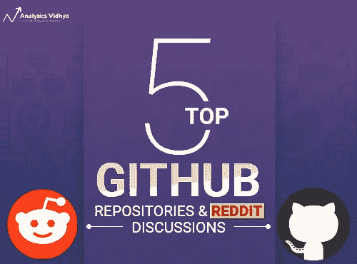

# 2018 年 8 月的 5 个最佳机器学习 GitHub 知识库和 Reddit 线程

> 原文：<https://medium.com/analytics-vidhya/the-5-best-machine-learning-github-repositories-reddit-threads-from-august-2018-57bf62a03e54?source=collection_archive---------0----------------------->

当我去年初开始使用 GitHub 时，我从未想过它会对我如此有用。最初我只是用它来上传我自己的代码，假设这是 GitHub 能够证明其有用性的程度。但随着我加入 Analytics Vidhya，我的研究范围扩大，我被这个平台的巨大所吸引。

除了允许我访问来自谷歌、微软、英伟达、脸书等顶级公司的开源代码和项目。，它开辟了与机器学习爱好者合作现有项目的途径。我无法告诉你为别人使用的项目做贡献的感觉有多棒。这是一种独一无二的感觉。当然，这也促使我写了这个每月一次的系列文章，希望对你的工作有所帮助。

本月的文章包含了一些非常可爱的知识库。NVIDIA 有一个项目关注视频到视频的翻译，这是一个整洁的谷歌知识库，使强化学习比以往任何时候都更容易学习，我还包括了一个有用的自动对象检测库。下面还有很多信息，包括一个有趣的 R 包。

在我们的 Reddit 部分，我们有各种各样的讨论，从朱莉娅的多个专家评论到现实生活中的数据泄露故事。作为一名数据科学家，您需要随时掌握最新动态，这包括了解所有最新发展。Reddit 和 [AVBytes](https://www.analyticsvidhya.com/blog/category/avbytes/) ，绝对应该在你的首选列表上。

*你可以看看下面我们每个月报道的 GitHub 顶级仓库和 Reddit 顶级讨论(从四月开始):*

*   [*一月*](https://www.analyticsvidhya.com/blog/2018/02/top-5-github-repositories-january-2018/)
*   [*二月*](https://www.analyticsvidhya.com/blog/2018/03/top-5-github-repositories-february-2018/)
*   [*三月*](https://www.analyticsvidhya.com/blog/2018/04/top-7-github-repositories-march-2018/)
*   [*四月*](https://www.analyticsvidhya.com/blog/2018/05/top-5-github-reddit-data-science-machine-learning-april-2018/)
*   [*五月*](https://www.analyticsvidhya.com/blog/2018/06/top-5-github-reddit-data-science-machine-learning-may-2018/)
*   [*六月*](https://www.analyticsvidhya.com/blog/2018/07/top-github-reddit-data-science-machine-learning-june-2018/)
*   [*七月*](https://www.analyticsvidhya.com/blog/2018/08/best-machine-learning-github-repositories-reddit-threads-july-2018/)

# GitHub 仓库

# [英伟达的 vid2vid 技术](https://github.com/NVIDIA/vid2vid)

在图像到图像的翻译领域已经有了巨大的进步。然而，视频处理领域近年来很少出现突破。直到现在。

NVIDIA 已经在使用深度学习进行图像和视频处理方面处于领先地位，它开源了一种视频到视频翻译的技术，取得了令人兴奋的结果。他们在 GitHub 上开源了他们的代码，所以你现在就可以开始使用这项技术了。该代码是 *vid2vid* 的 PyTorch 实现，您可以使用它来:

*   将语义标签转换成逼真的真实视频
*   创建多个输出以合成从边缘地图说话的人
*   从给定的姿势生成人体(不仅仅是结构，而是整个身体！)

点击查看我们对这个库的报道[。](https://www.analyticsvidhya.com/blog/2018/08/nvidia-open-sourced-video-to-video-translation-pytorch/)

# [多巴胺由谷歌](https://github.com/google/dopamine)

如果你曾在强化学习领域工作或研究过，你就会知道复制现有的方法有多困难(如果不是不可能的话)。Dopemine 是一个 TensorFlow 框架，已经创建并开源，希望加速该领域的进展，并使其更加灵活和可复制。

如果你一直想学习强化学习，但是被它的复杂程度吓到了，那么这个资源库就是一个绝好的机会。只有 15 个 Python 文件，代码附带了详细的文档和免费的数据集！

此外，您还可以在此阅读该知识库[。](https://www.analyticsvidhya.com/blog/2018/08/google-ai-open-source-tensorflow-reinforcement-learning/)

# [自动化物体检测](https://github.com/yaksoy/SemanticSoftSegmentation)

对象检测在深度学习社区中蓬勃发展，但对于新人来说，这可能是一个令人生畏的挑战。要映射多少像素和多少帧？如何增加一个非常基础的模型的精度？你从哪里开始？你再也不需要为此过于烦恼了——这要归功于麻省理工学院的算法，它能以惊人的精度自动检测物体。

他们的方法被称为“语义软分割(SSS)”。专家需要花费 10 分钟来手工编辑的东西，你现在可以在几秒钟内完成！上面的图像很好地说明了这个算法是如何工作的，以及当你在你的机器上实现它时它会是什么样子。

点击查看我们对这一技术的更详细报道[。](https://www.analyticsvidhya.com/blog/2018/08/mits-open-source-algorithm-automates-object-detection-images/)

# [人体姿态估计](https://github.com/Microsoft/human-pose-estimation.pytorch)

今年，姿势估计引起了研究人员的极大兴趣，像麻省理工学院这样的出版物已经发表了标志着该领域进展的研究。从帮助老年人接受正确的治疗到像让人类虚拟跳舞这样的商业应用，姿势估计将成为商业上的下一个最佳选择。

这个库是微软的官方 PyTorch 实现他们的流行论文— [*人体姿态估计和跟踪的简单基线*](https://arxiv.org/abs/1804.06208) 。他们提供了足够好的基线模型和基准，有望在这一研究领域激发新的想法。

# [和弦](https://github.com/r-music/chorrrds)

这是给所有 R 用户的。我们通常从 CRAN 下载 R 包，所以我个人觉得没有必要去 GitHub，但这个包是我觉得非常有趣的一个。 *chorrrds* 帮助你提取、分析、整理音乐和弦。它甚至预装了几个音乐数据集。

你实际上可以直接从 CRAN 安装，或者使用 devtools 包从 GitHub 下载。在本文的[中找到更多关于如何做到这一点的信息和更多细节。](https://www.analyticsvidhya.com/blog/2018/08/chorrrds-r-package-analyzing-working-music-data/)

# Reddit 讨论

# [OpenAI Five 输掉第一场职业 Dota 比赛](https://www.reddit.com/r/MachineLearning/comments/99ix2d/d_openai_five_loses_against_first_professional/)

如果你在过去的几个月里没有关注 OpenAI，他们的团队一直在努力宣传他们的最新创新——[open ai Five](https://www.analyticsvidhya.com/blog/2018/06/openai-five-a-team-of-5-algorithms-is-beating-human-opponents-in-a-popular-game/)。这是一个由五个神经网络组成的团队，他们共同努力，以更好地玩 Dota。这些神经网络做得非常好，直到他们遇到了第一支职业 Dota 比赛队。

这篇 Reddit 的帖子从各个角度看团队的失败，机器学习的视角真的很突出。即使你没有读过他们的研究论文，这篇文章也有足够的信息让你迅速跟上。有超过 100 个关于这个话题的评论，一个真正的知识丰富的讨论。

# [使用笔记本电脑完成机器学习任务的不同视角](https://www.reddit.com/r/MachineLearning/comments/9a7usg/d_i_dont_like_notebooks/)

数据科学和机器学习领域的大多数人都使用笔记本来完成各种任务，如数据清理、模型构建等。实际上，我还没有遇到过在数据科学之旅中没有使用过笔记本的人。我们一般不会质疑这些笔记本的局限性吧？

现在，这里有一个关于为什么笔记本实际上没有我们想象的那么有用的有趣观点。请确保您浏览了整个讨论，其中有一些来自数据科学家同事的好奇且有见地的评论。此外，你还可以看看制作精良的展示板。

# [TensorFlow 2.0 即将到来](https://www.reddit.com/r/MachineLearning/comments/97b84a/d_tensorflow_20_is_coming/)

TensorFlow 2.0 在几周前被谷歌取笑，预计将在未来几个月内推出。这个帖子既有趣又严肃。来自世界各地的 TensorFlow 用户给出了他们所期待的，以及他们希望看到添加的内容。相当多的评论是围绕急切执行的有用性。

这是一个期待已久的更新，所以大的事情正在被期待。谷歌会兑现吗？

# [机器学习 Julia 的评论](https://www.reddit.com/r/MachineLearning/comments/994dl7/d_hows_julia_language_mit_for_ml/)

Julia 编程语言最近在社交媒体上流传，此前有几篇文章讨论了它在未来如何取代 Python。我收到了评论这种语言的请求，并让每个人都来看这个帖子。有什么地方比一个核心的 ML Reddit 线程更能检验一种编程语言的优缺点呢？

与阅读一个视角不同，你可以阅读多个评论，每个评论都增加了一个独特的观点。我喜欢这个讨论的原因是很多现有的 Julia 用户已经加入了他们的意见。人们一致认为它很有前途(尤其是最新发布的 Julia 1.0)，但是它要赶上 Python 还有一段时间。

# [现实世界 ML 项目中的数据泄露事件](https://www.reddit.com/r/MachineLearning/comments/965zgf/d_tell_me_about_how_you_were_a_victim_of_data/)

我们都忙于解决现实世界中的问题，而容易忘记现有项目中可能出现的问题。你可能会对人们在这里讲述的故事感到惊讶，包括他们在一行中有重复条目的故事，这使得模型大量超拟合训练数据。这里也有一些有用的链接，可以让你进一步阅读业内出现的数据泄露问题。

你曾经是数据泄露的受害者吗？在这个 Reddit 帖子中分享你的故事，并参与讨论！

# 结束注释

我非常喜欢每个月整理这篇文章，因为我浏览了数百个库和数十个 Reddit 讨论线程，将其中的精华带给你。在这个过程中，我学习并尝试了大量的新技术和工具。

享受这个月的文章，我希望你能尝试上面提到的几个库！如果你觉得有任何其他的库或 Reddit 主题是社区应该知道的，请在下面的评论区告诉我。

*原载于 2018 年 9 月 2 日*[*【www.analyticsvidhya.com】*](https://www.analyticsvidhya.com/blog/2018/09/best-machine-learning-github-repositories-reddit-threads-august-2018/)*。*