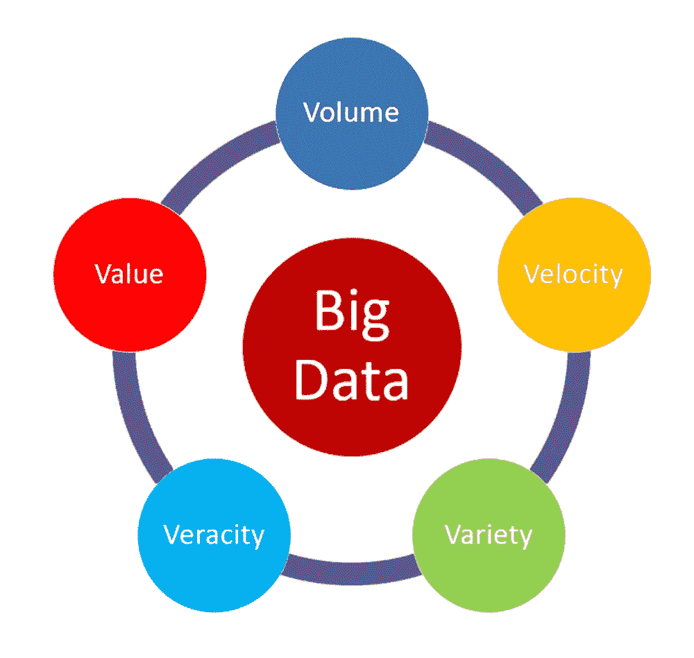
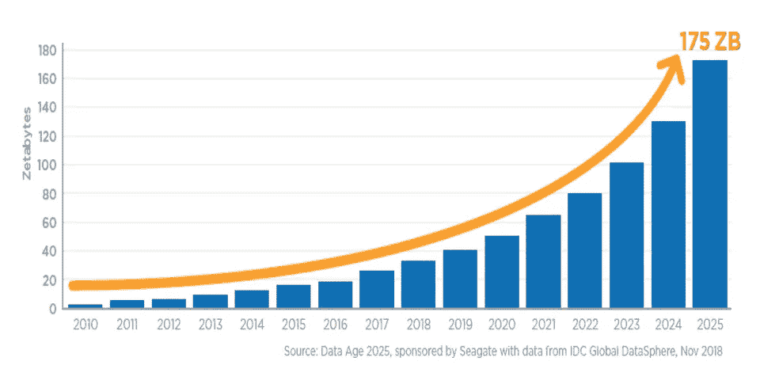
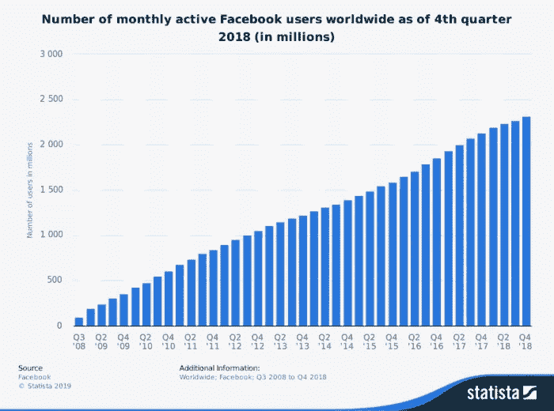
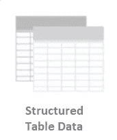
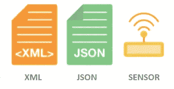
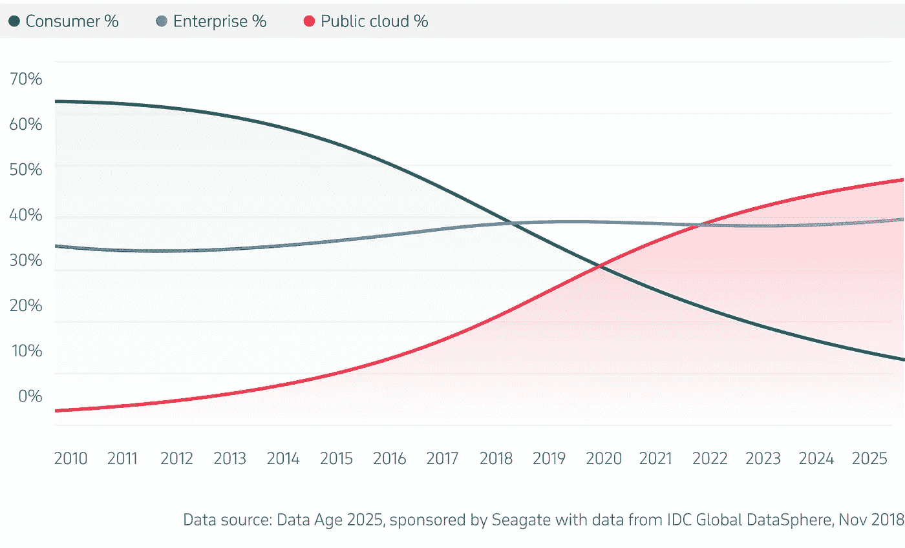

# 数据科学:大数据的 5 V

> 原文：<https://medium.com/analytics-vidhya/the-5-vs-of-big-data-2758bfcc51d?source=collection_archive---------0----------------------->

数量、速度、多样性、准确性、价值

5V 的大数据

## 历史

它始于 2001 年的 3 V，即**体积、速度和变化**。然后**的真实性**得到了补充，使其成为 4 V 的。然后加上**值**，使其为 5V。后来出现了 8v，10v 等。我们将讨论重要的(5V 的)量、速度、多样性、准确性和价值。

## **1)音量**

指的是大数据的大小。数据能不能算大数据是基于体量的。云计算流量、物联网、移动流量等导致数据量快速增长。

数据增长预测

## **2)速度**

它指的是数据积累的速度。这主要是由于物联网、移动数据、社交媒体等。

2000 年，谷歌每天接收 3280 万次搜索。至于 2018 年，谷歌每天接收 56 亿次搜索！

截至 2018 年的月活跃用户大概:
脸书:24.1 亿
insta gram:10 亿
Twitter:3.2 亿
LinkedIn:5.75 亿

自 2008 年以来脸书每月活跃用户增长

## **3)品种**

由于人类或机器产生的数据来源不同，它是指**结构化**、**半结构化**和**非结构化**数据。

**结构化数据:**是经过组织的符合数据形式结构的传统数据。这些数据可以存储在关系数据库中。例如:包含日期、时间、金额等的银行对账单。

**半结构化数据:**是半组织化的数据。它不符合数据的正式结构。例如:日志文件、JSON 文件、传感器数据、csv 文件等。

**非结构化数据:**它不是一种有组织的数据，不适合关系数据库的行列结构。例如:文本文件、电子邮件、图像、视频、语音邮件、音频文件等。

## 4) **准确性**

指对数据的**质量/完整性/可信度/准确性**的保证。由于数据是从多个来源收集的，我们需要在将数据用于业务洞察之前检查数据的准确性。

## 5)价值

仅仅因为我们收集了大量的数据，它就没有任何价值，除非我们从中获得一些见解。价值是指数据在决策中的有用程度。我们需要使用适当的分析方法提取大数据的价值。

## 其他的 V 是什么？

**粘度**(复杂性或相关程度)**可变性**(数据流中的不一致性)**波动性**(持久性或数据有效的时间以及应该存储多长时间)**生存能力**(保持活跃的能力)**有效性**(可以理解为发现隐藏的关系)。

## 大数据存储在哪里？

**感谢**阅读！请👏如果你喜欢这篇文章，请跟我来，因为它鼓励我写更多！