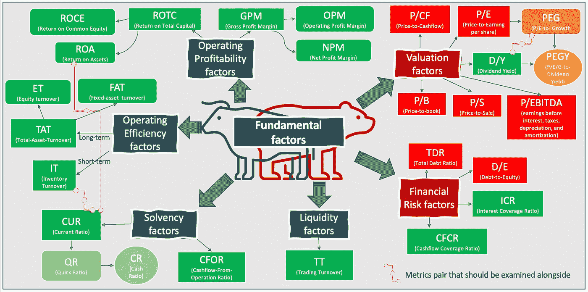

# 预测股票回报的 6 个基本因素及其基本指标

> 原文：<https://medium.com/analytics-vidhya/the-6-fundamental-factors-and-their-underlying-indicators-to-predict-stock-return-df68ce2689f5?source=collection_archive---------2----------------------->

## 如何评估一家公司的基本业绩并与其他公司进行比较

几个典型因素，包括经济(宏观经济)、基本面、技术和其他替代因素，如分析师因素、公司财务政策因素和社会责任因素，在理解公司业绩和预测股票回报方面都很有用。在相同的经济因素/宏观经济条件下，对股票表现影响最大的可能是**基本面因素(FFs)——公司的财务状况**。在数据科学时代，人们投入了大量精力来收集能够反映公司基本绩效的相关指标/衡量标准。为了便于在基于 FFs 预测股价时进行简单的定性评估和/或机器/统计学习测试，我们试图总结构成 **6 个典型 FFs 的财务指标/指标，包括** ***估值、运营盈利能力、运营效率、偿付能力、财务风险和流动性因素、*** *在下面的单一图解格式中。*

基本思维导图

# **解读和使用思维导图指南:-**

> ***红框****—***较低因素/指标*的公司通常被发现** **表现优于**指标/比率较高的公司。*
> 
> ****绿框*** —通常发现 ***因子/指标*较高的公司比** **指标/比率较低的公司表现更好。***
> 
> ****颜色越浅——级别越高，越有助于将公司与之前较低级别的*** 区分开来。例如， ***一个更好的公司*** 可以从一系列具有同样高的市盈率(P/E)的公司中辨别出来，使用一个 ***较低的市盈率与增长率之比*** ，即市盈率除以 a 公司的增长率。PEG 背后的想法是，如果一家公司的收益预计在未来几年内大幅增长，那么该公司的高市盈率就更有道理，因此有助于将其与其他市盈率过高的公司区分开来。此外，一家 ***更有吸引力的公司*** 可以从具有相似 PEG 比率的公司中识别出来，具有更低的**价格对收益对增长对股息收益率(PEGY)比率**。股息率也可以作为确定公司成熟度和增长前景的无价辅助工具——稳定、成熟的企业往往会产生足够的现金流，并提供相对较高的股息率。*
> 
> ****洋红色链接—一些指标/度量通常与其他度量一起检查*** 。例如，流动比率(CR)将流动资产除以流动负债，它给出了在突发/不可预见的危机情况下，公司处理短期(< 1 年)负债/债务能力的一般意义。由于得出 CR 时使用的流动资产包括库存、应收账款、现金和其他预计在不到一年的时间内清算或转化为现金的资产，因此应该与库存周转率(it)和资产回报率(ROA)等其他比率一起进行检查，以确保高 CR 不是由于较低的运营效率和现金或其他可销售等价物的低效使用。大量库存增加了 CR，但可能是该公司产品堆积如山、卖不出去的迹象，甚至很快就会过时或过季。*
> 
> **接下来，您可能有兴趣将公司财务指标分解成一些典型的基本面因素 *用于预测模型。**

# ***参考:***

*[1] *钦卡里尼&金。*量化股票投资组合管理——投资组合构建和管理的积极方法。麦格劳-希尔公司 2006 年；ISBN:0071459405。*