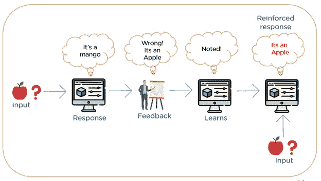

# 强化学习的绝对基础

> 原文：<https://medium.com/analytics-vidhya/the-absolute-basics-of-reinforcement-learning-97402c444be1?source=collection_archive---------8----------------------->

# 强化学习

强化学习。它是什么，有什么作用？在本文中，您将对强化学习有一个基本的了解。

**首先，我们从一个基本定义开始:**

强化学习是机器学习的一个领域。

它包括软件代理学习在不确定的环境中导航，以获得最大回报。它从互动体验中学习，并利用来自其行动的反馈。基本上，机器人会因为它的动作而得到分数。它可以加分也可以减分。代理通过 RL 学习的方式和我们人类学习的方式是一样的。

把它想象成一个电子游戏，你会因为你的行为而得到惩罚或奖励。在大多数电子游戏中，你可以通过获得更多分数或进入下一关来获得奖励，而你会受到失去一条生命或死亡的惩罚。

在 RL 算法内部

## **我们想让代理自己学习。**

强化学习算法有三个基本要素:

首先，我们得到了代理所处的**环境**。环境向代理提供反馈，告诉它所做的是对还是错。换句话说，环境告诉代理人它所采取的行动是否导致了奖励或惩罚。

接下来，我们有了**代理**代理是选择它所采取的动作的人。

最后，我们得到了**奖励**。报酬是代理人的目标。代理人的激励。

RL 算法如何学习

现在，如果我们回到视频游戏的例子，环境将是你看到的游戏屏幕，代理人将是你，因为你是做决定和玩游戏的人，奖励将是更多的分数或进入下一个级别。

**那么它与其他机器学习技术相比如何:**

有 3 种基本的机器学习技术；监督学习，非监督学习，当然还有强化学习。

这些技术的主要区别在于目标。

无监督学习的目标是发现数据点之间的异同，而监督学习的目标是根据给定的标签对数据进行排序。当然，正如我们所知，强化学习的目标是获得最大的回报。

RL 与其他 ML 技术

**RL 在哪里最有用？**

强化学习技术特别有用，因为它们不需要大量预先存在的知识或数据来提供有用的解决方案，或者在有许多未知的地方。

**今天用在哪里？**

目前，RL 正被用于机器人、空中交通管制、数据处理、创建培训系统等领域！RL 上的应用是无止境的，几乎可以在任何地方使用。谷歌的 Deep Mind 团队已经使用 RL 让一个代理学习和识别数字，并独自玩游戏 Atari！

这是谷歌 Deepmind 算法玩雅达利的视频。[https://www.youtube.com/watch?v=V1eYniJ0Rnk](https://www.youtube.com/watch?v=V1eYniJ0Rnk)

**RL 的挑战**

任何新技术都会带来挑战，对 RL 来说也不例外。RL 最大的问题之一是试图大规模使用它。学习任务需要大量的训练时间和大量的迭代。RL 学习的方式是通过反复试验。在现实世界中做到这一点几乎是不可能的。让我们以一个代理试图在一个环境中导航以避开人群为例。然后，代理将尝试不同的操作，然后选择最适合该环境的操作。在环境不断频繁变化的现实世界中，这变得很难做到。

[https://towards data science . com/the-ultimate-beginners-guide-to-reinforcement-learning-588 c 071 a f1 EC](https://towardsdatascience.com/the-ultimate-beginners-guide-to-reinforcement-learning-588c071af1ec)

[https://www . kdnugges . com/2018/03/5-things-reinforcement-learning . html](https://www.kdnuggets.com/2018/03/5-things-reinforcement-learning.html)

[https://medium . com/@ BonsaiAI/why-reinforcement-learning-may-be-best-ai-technique-for-complex-industrial-systems-FD E8 b 0 EBD 5 FB](/@BonsaiAI/why-reinforcement-learning-might-be-the-best-ai-technique-for-complex-industrial-systems-fde8b0ebd5fb)

[https://towards data science . com/applications-of-enforcement-learning-in-real-world-1a 94955 BCD 12](https://towardsdatascience.com/applications-of-reinforcement-learning-in-real-world-1a94955bcd12)

[https://www.guru99.com/reinforcement-learning-tutorial.html](https://www.guru99.com/reinforcement-learning-tutorial.html)

[https://www . futurithmic . com/2019/04/12/why-you-should-study-ai-machine-learning-how-do-it/](https://www.futurithmic.com/2019/04/12/why-you-should-study-ai-machine-learning-how-did-it/)

 [## 强化学习:必要性和挑战

### 简介:

towardsdatascience.com](https://towardsdatascience.com/reinforcement-learning-its-necessity-and-challenges-febef1470e9a) 

[https://towards data science . com/an-introduction-to-reinforcement-learning-1e 7825 c 60 bbe](https://towardsdatascience.com/an-introduction-to-reinforcement-learning-1e7825c60bbe)