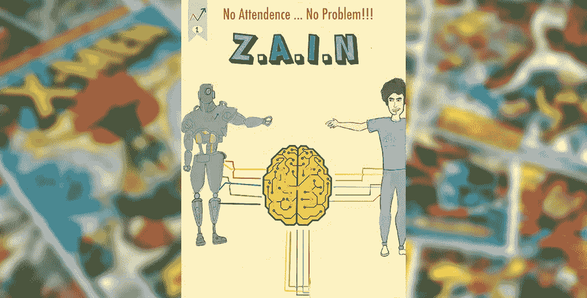
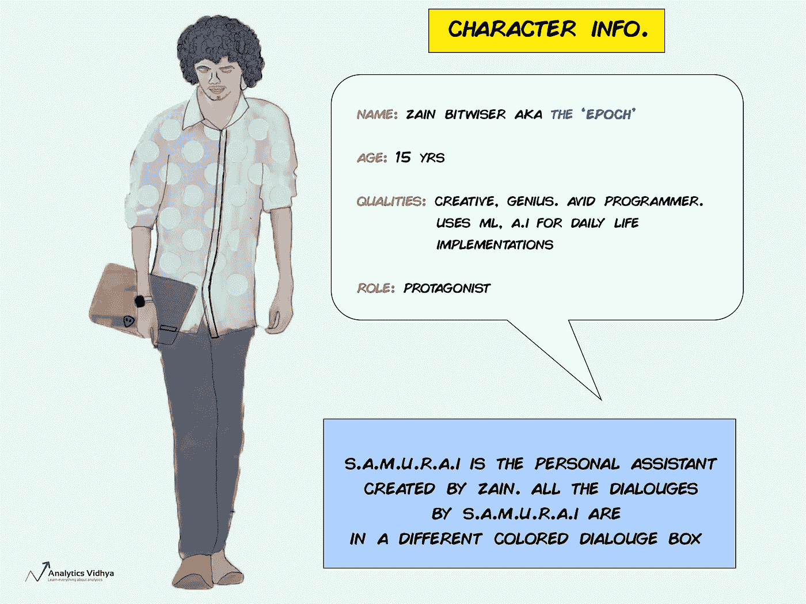
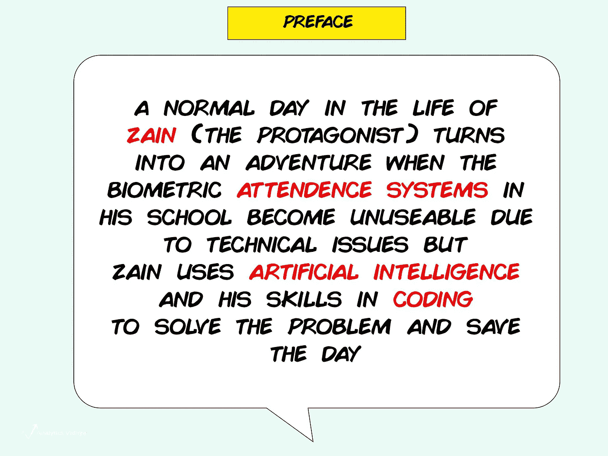

# 人工智能漫画:Z . a . I . n——问题#1:使用计算机视觉实现考勤自动化

> 原文：<https://medium.com/analytics-vidhya/the-ai-comic-z-a-i-n-issue-1-automating-attendance-using-computer-vision-f012ec00a5d6?source=collection_archive---------1----------------------->

> 物质可以同时以粒子和波的形式存在

上面的概念对你来说可能只是一个简单的事实——但是我很难按照我的一个班级教授的方式来学习。我实际上是在一部漫画中实现它的时候学会的，我跟踪的一个超级英雄用它来解决一个困难的挑战。

我一直敬畏漫画的力量，它以简单直观的方式帮助我们理解概念。故事的潮起潮落、情节的建立和高潮通常会让像我这样的人呆上几个小时。

现在，想一篇技术文章。你还记得几个月前读过的一篇关于特定技术的博客吗？我猜你不知道。我当然没有！

> *这就是为什么我们 Analytics Vidhya 想出了世界上第一部人工智能(AI)漫画的想法！我们相信漫画是通过互动讲故事来学习概念的一种很棒的方式。简而言之，这是学习复杂数据科学主题的绝佳方式。*

通过这个人工智能漫画系列，我的目标是为了数百万孩子和朋友的利益发挥我的想象力。我的目标是帮助他们理解人工智能和人工智能将如何改变我们的世界。我希望，几年后，他们会记得 Z.A.I.N 是帮助他们理解机器的超能力的超级英雄！

我们将把先进的博客内容和关于机器学习和人工智能的代码与漫画的讲故事风格结合起来。你准备好潜入人工智能漫画的世界了吗？让我们开始吧，欢迎来到第一期！

# 关于 Z.A.I.N。

> *Z.A.I.N .是 Analytics Vidhya 的人工智能(AI)漫画系列的第一期，该系列成功地将技术和复杂的人工智能实现与阅读漫画的乐趣融合在一起。*

漫画系列结合了这两种元素:

1.  一个有趣的故事情节以及人工智能的日常生活实现
2.  技术人工智能内容，包括用 Python 实现的**全功能代码**等等！

这是 Kunal Jain，Analytics Vidhya 的创始人兼首席执行官，和我一起，给你一瞥这个人工智能漫画系列

# 通过 Z.A.I.N 沉迷于漫画世界

以下是你需要知道的关于这个漫画系列的主要人物的所有信息:

**你可以在这里** **下载阅读完整漫画** [**！**](https://discuss.analyticsvidhya.com/t/download-link-launching-analytics-vidhyas-ai-comic-issue-1-automating-attendance-using-computer-vision/81302)

*   注意:请确保在继续之前阅读漫画，以便更好地理解编码部分并连接到故事。

# Python 代码和解释

看人工智能漫画开心吗？现在，让我们来了解一下考勤系统背后的代码。没错——我们将实现我们刚刚看到的 Python 代码！

在本节中，我们将使用以下库:

*   **OpenCV:** 通过内置的眼睛和人脸级联分类器检测人脸和眼睛。
*   **Matplotlib:** 用于读取和绘制两幅图像。
*   **NumPy:** “互补”——空前的经典库！

接下来，我们阅读。jpg 文件并使用 matplotlib 库绘制它。在这种情况下，我们使用的是一张单人脸(托尼·斯塔克)的照片，在这里保存为“TS3.jpg”:

阅读并绘制图像后，我们来到主代码块:

这里，我们使用人脸和眼睛级联分类器来分别获得人脸和眼睛的顶角和底角的坐标。这些坐标/点存储在变量中:

然后，我们用这些坐标在脸部和眼睛周围画出矩形。**基本的思维过程是数出人脸周围矩形的个数，从而数出人脸的个数:**

让我们在教室的图片上实现相同的代码块。记住，我们的目的是计算班上的人数。这正是 Z.A.I.N .拯救世界的方法！现在轮到我们了。

教室的图像被保存为“face-detection.jpg”。您可以从这里下载图像，并按照我们很快就会看到的代码进行操作。你甚至可以随意选择一张图片。我坚信学习一个概念的最好方法是通过实验！

让我们回教室吧。以下代码在教室中的大部分人脸周围制作矩形:

厉害！我们已经成功地建立了使用计算机视觉的自动考勤系统！Z.A.I.N 的冒险才刚刚开始。

# 结束注释

AV 的人工智能漫画《Z.A.I.N》的第一期讲述了计算机视觉如何改善我们的日常生活。你猜怎么着？有许多这样的冒险等待着他和我们所有人。

第 2 期即将推出。拿起你的爆米花，准备好参与另一个令人敬畏的人工智能冒险，因为下一期将把我们的学习带到一个全新的水平。

**感谢您的阅读。请在下面的评论区留下你的想法、经验和宝贵的反馈。**

*原载于 2019 年 6 月 3 日 https://www.analyticsvidhya.com***。**