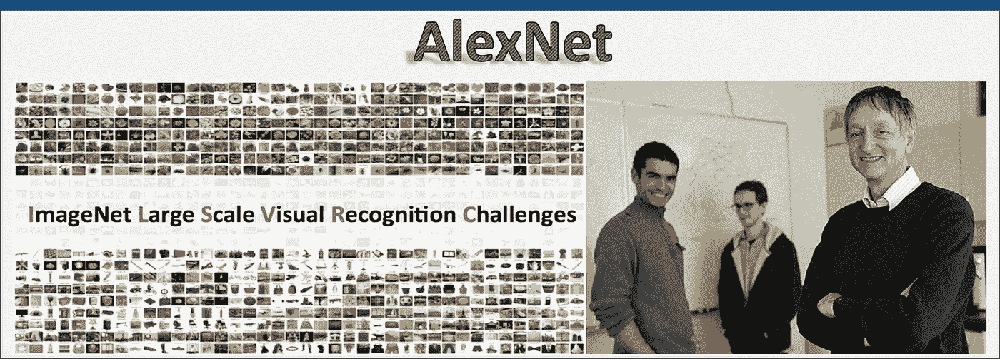

# AlexNet 的体系结构与实现

> 原文：<https://medium.com/analytics-vidhya/the-architecture-implementation-of-alexnet-135810a3370?source=collection_archive---------13----------------------->

## 获胜者🏆ILSVRC-2012 竞赛

[**图片来自 Aifrontiers.com**](https://cdn-images-1.medium.com/max/1600/1*Urg7rLQ55-7IoRMzY_mA9A.png)

在我的上一篇博客中，我对[**LeNet-5 架构**](/towards-artificial-intelligence/the-architecture-implementation-of-lenet-5-eef03a68d1f7?source=friends_link&sk=83c32229b48ef1ec3226e657450b56a5) **做了详细的解释。**在这篇博客中，我们将探索它的增强版 AlexNet。

A lexNet 获得了由 *Alex Krizhevsky* 、 *Ilya Sutskever* 提交的 2012 Imagenet 大规模视觉识别挑战赛***(ils vrc-2012)***…