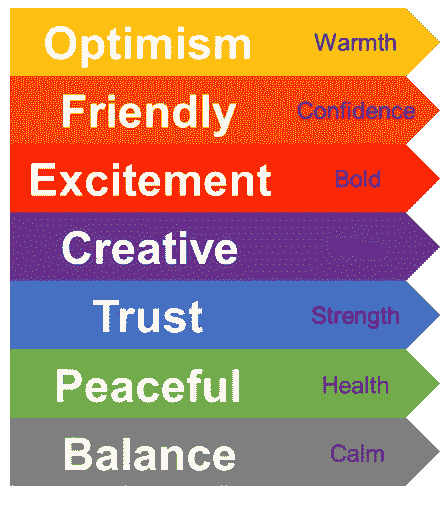

# 视觉化的色彩艺术

> 原文：<https://medium.com/analytics-vidhya/the-art-of-color-in-visualization-621696c45c60?source=collection_archive---------33----------------------->

## 可视化使数据科学家能够讲述一个惊人的故事，而颜色赋予了可视化。

# 介绍

我们正在进入可视化时代，每天都会生成关于医疗保健、交通、体育比赛、股票市场和商业报告等任何主题的信息图表，以有效地分发可消化的信息。通过可视化在几秒钟内交付复杂信息，继续推动[信息图形](https://venngage.com/blog/what-is-an-infographic/)在世界各个领域的流行。

然而，寻求理解我们周围的信息并不新鲜，因为可视化有着数千年的丰富历史。从描绘日常生活的古代洞穴壁画到使用符号代表单词、字母和概念的埃及象形文字，可视化艺术继续发展成为现代信息图形。

今天，可视化已经发展成为科学和艺术的结合，是数据科学的一个[组成部分。复杂数据科学技术的出现使可视化成为一种重要的技术，可以交流来自数据的各种见解，以优化决策。因此，设计](https://www.sas.com/en_my/insights/big-data/data-visualization.html)[可理解的信息图形](https://www.creativebloq.com/graphic-design-tips/information-graphics-1232836)的能力在数据科学社区是一项非常有价值的技能。

可视化有许多方面，如绘制简单的图形、开发交互式仪表板和创建信息图形。然而，有一个重要的因素影响着视觉化的效率，那就是色彩的艺术。一个好的色彩组合是一个有影响力的视觉形象的本质，因为它定义了吸引观众的审美取向。

本文旨在描述色彩设计的类型和色彩心理学在创造视觉冲击力方面的作用。

# 配色方案的类型

我们必须了解配色方案的类型，以利用颜色强度的变化来更好地讲述我们的分析输出。在可视化中有三种主要类型的通用配色方案，其中每种方案都用于实现不同的目标。

*   定性方案
*   顺序方案
*   发散方案

在我们进一步讨论之前，如果你好奇，本文剩余部分的图形是使用 Python 中的 [Seaborn](https://seaborn.pydata.org/) 包和 [Microsoft PowerPoint 创建的。](https://louisem.com/7130/how-to-make-graphics-in-powerpoint)

## 定性方案

定性配色方案用于以任意顺序为[分类数据](https://www.statisticshowto.com/qualitative-variable/)提供视觉表示，例如国家、性别和种族。选择颜色以确保不同的类别是可区分的，其中每个类别由一种颜色表示。

定性方案

## 顺序方案

顺序方案用于表示有序的[数值变量](https://www.statisticshowto.com/quantitative-variables-data/)的连续体，以说明没有强调中心值的变量的低值和高值之间的对比。

配色方案通过改变颜色的亮度来促进数量差异的比较。根据经验，颜色的强度随着值的增加而增加，其中低值分配给浅色，高值分配给深色。

顺序方案

## 发散方案

与顺序方案相反，当有序数值变量具有有意义的中心参考值时，发散方案用于表示连续统。发散方案是至少两个连续方案的组合，其中低于和大于中心值的值被分配给不同的颜色。

发散方案

# 视觉化中的色彩心理学

上面的插图表明，控制颜色强度的变化是创建可视化效果的一个重要因素。然而，除了图表的选择和变化的色彩强度，对[色彩心理学](https://www.verywellmind.com/color-psychology-2795824)的理解对提高你的视觉化技能也有着至关重要的作用。

你们中的一些人可能会思考为什么颜色在可视化中很重要。从本质上讲，颜色对视觉效果的感知有着巨大的影响。尽管从分析中获得了重要的见解，但明智地利用颜色来展示见解和吸引注意力是很重要的。

因此，理解颜色情感是数据科学家需要的一项技能，以产生有影响力的可视化效果，因为颜色能够简化复杂的图形并包含数据的深度。

下面的信息图总结了[每种颜色的含义](https://www.canva.com/learn/color-meanings-symbolism/)，以及人们如何看待这种颜色，从而产生不同的感受。

色彩情感

# 结论

可视化既是科学也是艺术，它是数据科学中的一个[关键元素](https://www.kdnuggets.com/2019/08/simpliv-data-visualization-data-analyst.html)，因为它是数据科学家交流我们的分析结果并促进决策制定的舞台。因此，获得在可视化中创建与利益相关者相关的关键元素的知识和技能是至关重要的。