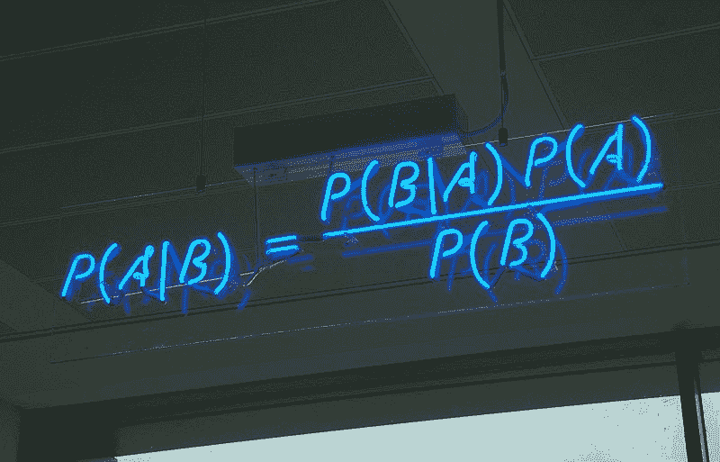
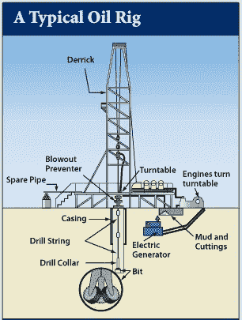
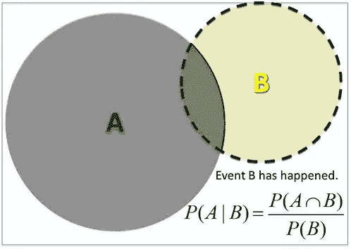
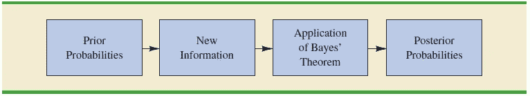
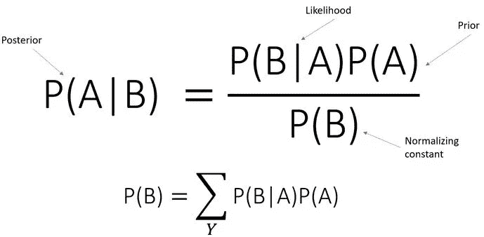
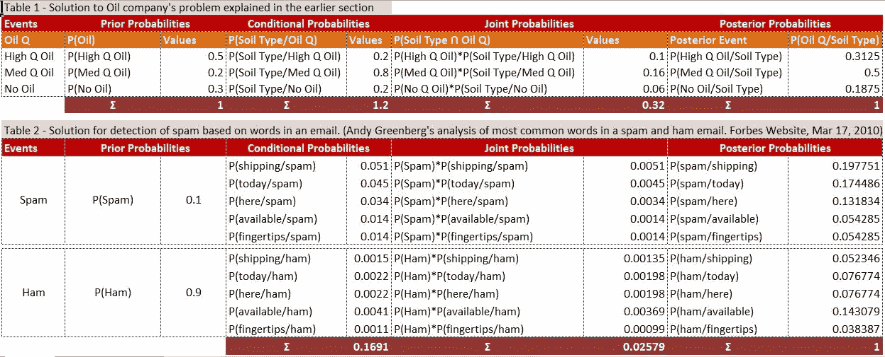

# 将后知后觉转化为预见的艺术~贝叶斯定理！

> 原文：<https://medium.com/analytics-vidhya/the-art-of-converting-hindsight-to-foresight-bayes-theorem-f307f32d2e53?source=collection_archive---------2----------------------->



> “后知后觉是一件美好的事情，但远见更好，尤其是在拯救生命或一些痛苦的时候！”威廉·布莱克

这些都是明智的话，往往是事后才说的。如果我们有能力预先知道什么是行不通的，对吗？有趣的是，贝叶斯定理表明，我们可以将后知之明作为远见，做出改变人生的决定。



来源:[杜克石油博物馆](https://welldrillingbasicinfo.wordpress.com/images-of-oil-drilling-rig/exhibit4-6/)

让我们通过考虑任何一家石油公司的典型情况来理解这一点的含义。如果一家石油公司有能力估计钻探石油的成功率，它将永远感到幸运。想象一下，石油公司有这样的信息，如果他们在某个位置挖掘，他们有 70%的机会找到石油(50%的机会找到高质量的石油，20%的机会找到中等质量的石油)。

有 30%的几率找不到任何石油。在第一口井钻了 200 英尺后，他们了解了土壤类型(进行了相关测试)。

根据类似钻井任务的历史记录，发现这种土壤类型的概率为 20 %,前提是钻井能产出高质量的石油。同样，如果钻井完成后产出中等质量的石油，则有 80%的机会找到这种土壤类型。有趣的是，发现这种土壤类型的几率只有 20 %,因为在油井完全挖好之后没有发现石油。

如果公司除了发现特定土壤类型的可能性之外一无所知，这有什么帮助吗？大概不会！

对他们更有用的是，一旦他们知道了土壤类型，他们就能知道找到石油(中等或高质量)的可能性。通过进行相关的土壤测试，他们可以在项目的早期发现土壤类型。如果找不到石油的可能性很高，他们可以放弃这个项目，去探索其他更好的地方。贝叶斯定理的应用有助于实现这一点。这有助于公司在项目的早期阶段具有远见卓识，为他们提供后见之明的优势，即他们可以根据土壤类型找到石油(高质量或中等质量)的可能性。

本文将试图帮助理解这是如何通过贝叶斯定理实现的。该主题将涵盖的内容如下

1.  **先验概率**
2.  **条件概率**
3.  **贝叶斯定理的推导——条件概率反演得到后验概率**
4.  **使用表格法解决上述机油问题**

**先验概率-** 如前所述，贝叶斯定理从感兴趣的特定事件的概率开始。它们被称为先验概率。先验概率通常是基于成功与成功机会的历史记录而得到的。在上面解释的石油例子中，先验概率是发现高质量、中等质量或没有石油的概率。见下文

P(高 Q 油)= 0.5，P(中 Q 油)= 0.2，P(无油)=0.3

然后，当接收到附加信息时，利用它，计算后验概率。

**条件概率-** 一般来说，当我们获得新信息时，我们对不确定事件的信念会改变。条件概率为我们提供了一种方式来精确地说出我们的信念是如何变化的。


来源:[https://www . your quote . in/upa shna-Singh-somvanshi-s8x 9/quotes/probability-when-ur-mind-understand-statistics-life-after-it-if pbv](https://www.yourquote.in/upashna-singh-somvanshi-s8x9/quotes/probability-when-ur-mind-understand-statistics-life-after-it-ifpbv)

在数学上，它可以表述为一个事件发生的概率，假定另一个相关事件已经发生。图示如下。回到讨论中的石油示例，获得新信息(关于土壤类型)后的条件概率可表示如下



计算给定 B 的概率的条件概率方程的图形表示已经出现。

p(土壤类型/高 Q 油)= 0.2

p(土壤类型/中油量)= 0.8

p(土壤类型/无油)= 0.2

上面推导的条件概率基本上构成了给定钻探结果的土壤类型的三个相应概率。

**贝叶斯定理的推导——条件概率反演得到后验概率**

该定理提供了一种在给定新的或额外的证据的情况下修正现有预测或理论(更新概率)的方法。参见下面的步骤



资料来源:商业和经济统计——安德森·斯威尼·威廉姆斯

在石油公司的运行示例的上下文中，先验概率在第 1 节中提供。基于接收到的新信息的条件概率也是可用的，如前面章节中所解释的。

在上一节中，我们计算了在给定项目结束时的预期结果的情况下找到土壤类型的条件概率。它们是我们想要逆转的条件概率，这样公司就可以有有用的信息来进行决策。

石油公司感兴趣的领域是找出项目结束时高 Q 油、中 Q 油或无油的概率，即 P(高 Q 油/土壤类型)、P(中 Q 油/土壤类型)、P(无油/土壤类型)。假设土壤类型已确定，找到优质石油的条件概率公式如下

```
P(HighQ Oil/Soil Type)=P(HighQ Oil ꓵ Soil Type)/P(Soil Type)--(1)
***#Which means***
P(HighQ Oil ꓵ Soil Type)=P(HighQ Oil/Soil Type)*P(Soil Type)--(2)
**#Similarly** P(Soil Type/HighQ Oil) = P(High Q Oil ꓵ Soil Type)/P(HighQ Oil)
#Which means
P(HighQ Oil ꓵ Soil Type)=P(Soil Type/HighQ Oil)*P(HighQ Oil)--(3)
```

在这种情况下，土壤类型的概率可以通过以下三个条件概率(也称为联合概率)的总和来确定

```
P(High Q Oil ꓵ Soil Type)+ P(Med Q Oil ꓵ Soil Type)+ P(No Oil ꓵ Soil Type)
```

因此，使用等式 3，找到感兴趣的土壤类型的概率可以计算如下

```
P(Soil Type) = P(High Q Oil ꓵ Soil Type)+ P(Med Q Oil ꓵ Soil Type)+ P(No Oil ꓵ Soil Type)**#Which Means**
P(Soil Type) = P(High Q Oil)*P(Soil Type/High Q Oil)+ 
               P(Med Q Oil)*P(Soil Type/Med Q Oil)+
               P(No Oil)*P(Soil Type/No Oil)             ------(4)
```

使用等式 1 中的等式 3 和 4，后验概率可以定义如下

```
P(HighQ Oil/Soil Type)= (0.5*0.2)/0.32 = 0.3125
P(MedQ Oil/Soil Type) = (0.2*0.8)/0.32 = 0.5
P(No Oil/Soil Type) = (0.3*0.2)/0.32 = 0.18
```

下面给出了上述计算的一般形式，称为贝叶斯公式。



运用贝氏定理，石油公司现在可以利用手头的先验信息来估计找到石油的机会。这给了他们后知后觉的优势。挖了 200 英尺后，他们估计有 82%的机会找到石油。如果结果是相反的，即更高的概率没有石油，他们将有机会中止和挽救公司的损失。

**使用表格法解决上述石油公司的问题。**

除了围绕石油公司需求的运行案例研究之外，以下部分还提供了一个使用贝叶斯规则的垃圾邮件过滤器的类似解决方案。应用贝叶斯定理的过滤器能够预测电子邮件是否是垃圾邮件的概率。这些计算是基于电子邮件中某个句子中某些单词的存在。



# **尾音**

由英国牧师托马斯·贝叶斯在 18 世纪发现，公式很简单:最初的信念+最近的客观数据=一个新的和改进的信念。法国数学家皮埃尔·西蒙·拉普拉斯对它进行了翻新，每次他得到新的数据时都重新计算方程，这样他就可以区分可能性很高的假设和不太有效的假设。通过以概率分布的形式表达所有信息，Bayes 可以从不足和不确定的证据中产生可靠的估计。

在现代世界中，贝叶斯规则是人工智能中使用的一个重要原则，用于在给定机器人已经执行的步骤的情况下计算机器人下一步的概率。贝叶斯规则帮助机器人决定如何根据新的证据更新知识。

谷歌的无人驾驶汽车使用安装在车辆顶部的传感器提供的新道路和交通数据来更新从地图上检索到的信息。谷歌希望机器人汽车有一天能将道路死亡人数减半，减少能源消耗，让通勤者从事更有生产力的活动。