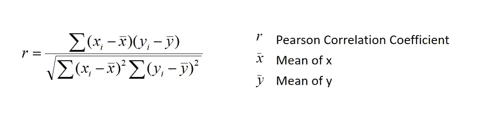
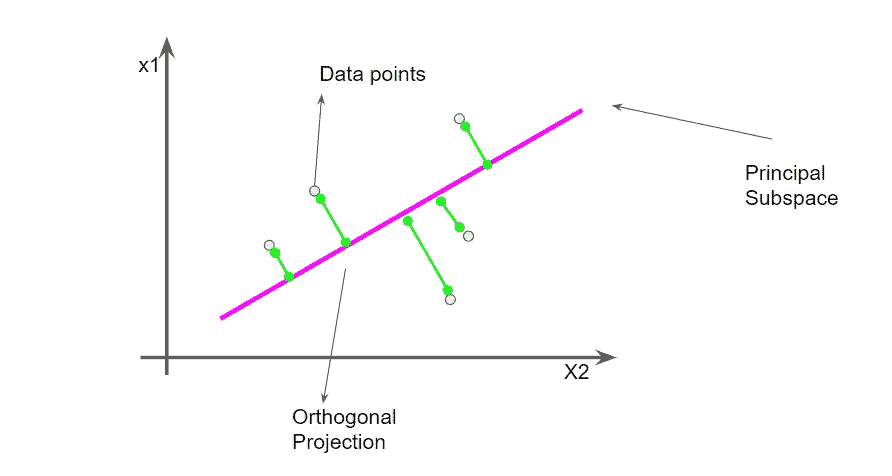

# 降维的艺术

> 原文：<https://medium.com/analytics-vidhya/the-art-of-dimensionality-reduction-80fded9726c5?source=collection_archive---------12----------------------->

## 灾难恢复是预测建模问题中最关键的步骤之一。世界正在产生大量的大规模数据。因此，优化数据的维度空间至关重要。

粉色是一种浅红色，通常与爱情和浪漫联系在一起。人们将**色**与通常被认为是女性的品质联系在一起，比如温柔、善良、亲切和同情(照片由 [Isi Parente](https://unsplash.com/@isiparente?utm_source=unsplash&utm_medium=referral&utm_content=creditCopyText) 在 [Unsplash](https://unsplash.com/s/photos/projection?utm_source=unsplash&utm_medium=referral&utm_content=creditCopyText) 上拍摄)

# 什么是降维？

假设您想要解决一个预测性建模问题，出于同样的原因，您开始收集数据。你永远不知道你想要什么样的特性，需要多少数据。因此，你去寻找上限，并收集所有可能的特征和观察。

因此，你意识到你已经收集了大量的数据。而且，这些额外的功能加剧了噪音和时间。

1.  **噪声**:可能有一些特征，模型发现不相关。因此，他们只是给模型增加了噪声。
2.  **时间**:我说的时间是计算时间。对于每个额外的特征，我们需要计算它的梯度并优化它。

我们做灾难恢复有两个原因。第一，减少噪音，这使得我们的模型更健壮。第二，减少计算时间。

因此，我们将讨论一些降低数据帧维度的标准方法。

**我们将讨论** :
1。相关系数
2。主成分分析
3。k 选择:特征重要性

# 1.相关系数

线性回归的假设之一是特征是独立的。如果它们是相关的，那么结果可能会误导。这使得不可避免地要移除高度相关的特征。

一种直觉是，如果两个特征高度相关，它们将向模型提供相似的信息。因此，我们可以删除其中一个特征。这也将减少数据集的维度。

同样值得注意的是，最常用于寻找相关性的矩阵是皮尔逊系数。并且它仅测量线性关系的程度。因此，任何非线性相关特征将导致零皮尔逊系数。

皮尔逊相关系数

# 2.主成分分析

主相关系数是一种将数据投影到低维空间以使方差最大的技术。如果我们考虑线性投影，那么均方差是最小的。

PCA:线性投影

在图示中，我们试图最大化线性投影的方差。数据点以这样的方式投影，使得**均方距离**最小。

我们可以使用主成分分析来显著降低数据的维数。我们还可以检查新空间中的数据解释了多少差异。一旦我们感知到重要的结果，我们就可以使用这个投影空间。

# 3.k 选择

Sci-kit 学习库中的 **SelectKBest** 选择 K 个最佳特征，方差低的特征被丢弃。

选择 K 个最佳特征的另一种方式是通过使用来自决策树或随机森林的特征重要性图表。

我们可以训练基于树的模型，并且可以直接得到每个特征的重要性。大多数数据科学家也使用这种技术。此外，这是一种简单有效的降低数据维数的方法。

# 摘要

博士很重要！它不仅减少了噪声和计算量，而且提供了特征的重要性。

在本文中，我们讨论了灾难恢复的三个关键技术，即相关性、主成分分析和 K 选择。

希望你喜欢这篇文章，我相信你会在现实世界的问题中应用这些技术。

想了解更多关于机器学习和数据科学的内容，请订阅我的 youtube 频道。

 [## 阿尤什·奥斯特瓦尔[IITK]

### 合十礼！！！🙏🙏这个频道是给想学数据科学和机器学习的人看的。我已经花了很多…

www.youtube.com](https://www.youtube.com/channel/UCqq_T7ktsZO62k7CaibgQvA) 

**坚持学习！
继续享受！**