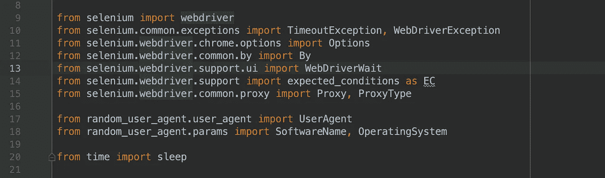
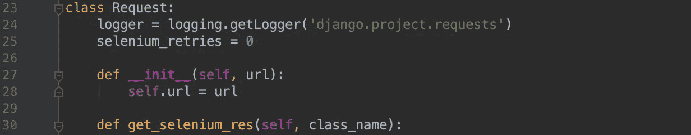
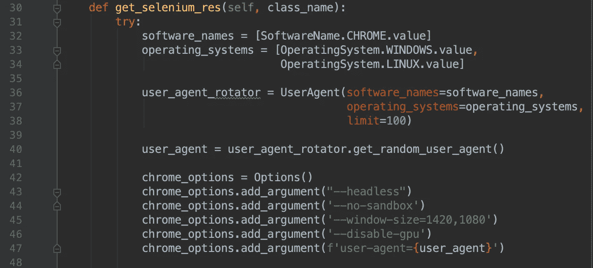
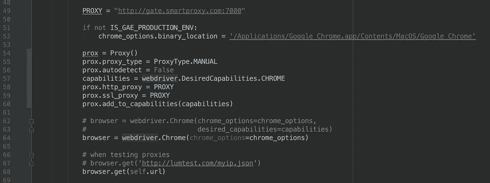
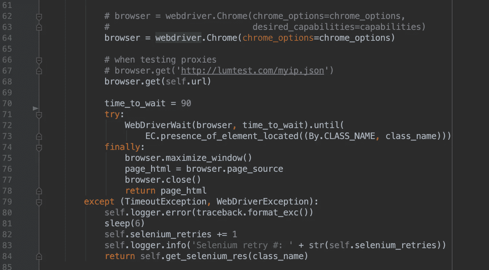

# 不被阻塞的艺术:我如何使用 Selenium & Python 来处理脸书和 Tiktok

> 原文：<https://medium.com/analytics-vidhya/the-art-of-not-getting-blocked-how-i-used-selenium-python-to-scrape-facebook-and-tiktok-fd6b31dbe85f?source=collection_archive---------0----------------------->


[凯·皮尔格](https://unsplash.com/@kaip?utm_source=medium&utm_medium=referral)在 [Unsplash](https://unsplash.com?utm_source=medium&utm_medium=referral) 上的照片

不久前，获取 facebook 用户数据还非常容易。graph-api 是一个允许程序员自由访问公共用户/页面数据的解决方案。自从剑桥分析公司倒闭，数据隐私成为一个大问题，这一现实已经发生了变化。脸书让大规模挖掘用户数据变得不可能。

Tiktok(原名 Musically)也选择不提供任何合法手段来挖掘他们的数据。它非常关注他们(大多数)青少年用户的隐私，并希望确保该平台不会创造掠夺性数据获取的手段。

在本教程中，我将使用 Python 为您设置 selenium 驱动程序。更重要的是，我将与你分享有价值的基本规则，这将有助于你不被脸书/Tiktok 系统管理员阻止。

首先，我们来讨论一下为什么需要硒。

# Selenium:一个浏览器模拟器

如果我们尝试向 facebook 或 tiktok 发出一个常规的 GET 请求，我们将获得部分 html dom。一些元素将会丢失，主要是来自标签。

脸书和 Tiktok 是基于 Javascript 的页面，urllib 不知道如何解析它们。

Selenium 将打开 Chrome(或者 Firefox，如果您愿意的话)，转到所需的 url，等待 javascript 加载，然后获取并返回 html。

现在让我们深入研究代码。



以上是我们将使用的导入。这将要求您安装以下 python 依赖项:

1.  硒==3.141.0
2.  随机用户代理==1.0.1

你还需要在你的机器上安装 chrome。



我正在创建一个名为 Request 的新**类，如果你的算法中有不同类型的请求，这将很好地为你服务。**

**logger** 只是 python 的 print()的一个版本，记录到 stderr。
你可以忽略！

**selenium retries 变量**将帮助我们跟踪 selenium 请求失败的次数。相信我，考虑到我们正在处理脸书/Tiktok 这将是至关重要的。

## 深入研究 get_selenium_res()函数:



函数 1/2

您首先看到的是一些用户代理变量的设置，这些变量使用我导入的 random_user_agent 外部模块依赖项，为我进行的每个 selenium 调用自动获取一个随机用户代理。

一个**用户代理**看起来是这样的:
Mozilla/5.0(Linux；安卓 8 . 0 . 0；SM-G960F Build/R16NW)apple WebKit/537.36(KHTML，像壁虎一样)Chrome/62 . 0 . 3202 . 84 Mobile Safari/537.36

把它想象成你作为用户访问网站的方式；
一个标识符。请记住，我们不是在这里被抓，而抓取数据，因此；对于每个新请求，我们将假装成不同的用户代理。

最后，我设置了 **chrome 选项**。一旦我们声明了一个 selenium 浏览器实例，这些将在后面使用。

## Chrome 选项:逐个参数

1.  “—无头”:Chrome 浏览器不会在你的机器上打开，因此；减少机器 cpu 的负载。我建议玩玩这个功能，在本地运行的时候试试开和关。一方面，无头运行 selenium 可以让你的机器保持“凉爽”,但是它可能会让你被当成一个铲运机。系统管理员可以轻松地发现无头请求。
2.  “—无沙箱”:让 chromedriver 无标题打开的唯一方法。如果你用的是 Firefox，你可以忽略这一点。
3.  “— disable-gpu”:显然只在 windows 机器上需要，但我展示它只是为了安全。
4.  "— window-size=1420，1080": Selenium 的行为类似于普通的 web 浏览器，因为它只会返回需要加载的 dom。所见即所得。因此，想象一下浏览器打开一个小窗口——您看不到多少 dom，因此在响应中也不会获得多少 html。因此，我们必须扩大窗口大小。

## 如何使用代理



函数 2/2

上面的代码块处理代理的使用。稍后，我将透露一些关于使用代理在我们的案例中是否真的有用的见解:

但是学习如何在 selenium 中合并代理并没有在网上很好地介绍。让我们一起回顾一下:

首先设置一个**代理变量。**你可以在[这里](https://hidemyna.me/en/proxy-list/)获得一个免费的。一个随机代理看起来像这样:“http://123 . 45 . 678 . 21:8080”
(“http://IP:PORT”)确保你得到一个活动的 https 驻留代理。

**二进制位置**被设置为将 chrome 指向我本地驱动器上正确的驱动位置。如果没有声明这个变量，您可能会遇到一个“bug”。它与代理使用无关，我把它包括进来是因为它可能会带来麻烦。

我稍后初始化了一个 **Proxy()对象的实例。**我将它设置为 Manual，并将 **autodetect 标记为 False** 以确保我们不会向外界声明我们正在使用手动代理。然后我继续赋予它 Chrome 默认的期望功能。
我将 **http 和 ssl poxy 设置**设置为我们之前声明的代理变量。最后一步，我必须**将这些功能**添加到 Proxy()实例中，这样设置就完成了。

关于代理话题的最后一句话:
如果你打算使用代理提供商，使用一个能够让你把你的本地 IP 列入白名单的代理提供商，并且不需要通过 selenium 输入用户名和密码就可以请求一个随机的住宅代理。[为此建议使用智能](https://smartproxy.com/?gclid=Cj0KCQjwsvrpBRCsARIsAKBR_0IeS39ZIG5c-LN-9D_F53VP0t_8GSdFnp0VSGjctTOKGgzHtZ9xJCgaAqvmEALw_wcB)代理。将代理变量设置为代理旋转 api 的 host:port 地址。

## 启动网络浏览器

您可以通过更改启动新浏览器实例的方式来轻松切换代理的使用:

```
# **browser** = webdriver.Chrome(**chrome_options**=chrome_options,
#                            **desired_capabilities**=capabilities)
  **browser** = webdriver.Chrome(**chrome_options**=chrome_options)
```

请注意，我将在没有代理的情况下启动浏览器，原因我将在本教程的后面介绍。

## 使用 Selenium 浏览器

如果你正在使用一个代理，你可能想要测试它是否真的在工作。

使用:

```
# when testing proxies
browser.**get**('[http://lumtest.com/myip.json](http://lumtest.com/myip.json)')
```

上述地址将返回一个 json，其中包含您正在模仿的位置。如果代理设置不成功，您将看到您计算机的当前(真实)IP 地址。

我们将向我们宣布请求对象的 url 发送一个 GET 请求…

```
browser.**get**(self.url)
```

如果您没有无头运行，上面的行将在您的计算机上打开一个浏览器窗口，并转到所需的 url。

到目前为止还好吗？现在事情变得更有趣了:



在本教程中，我将使用一个显式的等待，我认为这是一个“最佳实践”。这意味着 Chrome 不会在呈现特定元素之前关闭或返回 dom 给我们。**presence _ if _ element _ located((By。CLASS_NAME，class_name))** 是我们告诉浏览器等待的方式，直到一个指定的特定类的元素完成渲染。

非常重要:class_name 是一个必须传递给请求方法的变量。在这个例子中，你可以传递一个你想等待的类的名字，比如:Request('www.facebook.com ')。get _ selenium _ RES(' name _ of _ class ')

一旦呈现了这个元素，我就命令浏览器最大化窗口(我们已经在 chrome 设置中设置了它——但是这里我展示了一种额外的方法),这样我们就获得了整个 dom。

**浏览器**。 **page_source** 是用来读取 html 并存储在内存中的命令。

不要忘记使用 **browser.close()关闭浏览器。**

## 处理异常

当 selenium 请求无法在设置的时间范围(time_to_wait)内获得任何响应时，将发生超时异常。这是一个经典的街区。除非您提供的 url 有问题，否则这应该是自动防火墙被激活以阻止您挖掘数据的信号。

一个 WebDriverException 主要出现在我准备用于生产的 Unix 机器上。这个例外不是脸书/Tiktok 公司阻止你的结果。

如果有异常；我只是返回相同的 get_selenium_res 函数(创建一个潜在的 selenium 失败的永无止境循环)…我这样设置它是因为我知道脸书/Tiktok 会阻止我，我想自动重试。对 GET 请求进行重复尝试有时可能会成功。

既然你已经具备了提出 selenium GET 请求的技术能力，那么让我与你分享一些我在后剑桥分析时代刮 Tiktok 和脸书的经验所带来的极有价值的见解。

# 脸书和 Tiktok:(避开)街区聚会

脸书和 Tiktok 都在寻找数据挖掘者。他们不简单地检查用户代理和 IP 地址来找到我们“爬虫”。以下是一些要点:

1.  **Proxy + Headless = "请屏蔽我"。**
    被屏蔽的最好方法是在运行 selenium 时使用代理。记住，Tiktok/脸书知道你没头的时候有事情发生，因为他们能看到。如果您没有使用代理，它们通常会在减慢并最终关闭响应之前允许良好的请求流…如果您使用代理运行 selenium 大约在 20 次请求之后，我已经预测响应将开始变慢，直到收到响应。如果你坚持你的行为，尽管他们会让你慢下来，他们会完全停止聚会。
2.  **无头硒浏览器流畅！**不戴头盔运行 selenium 不会对你接收响应的能力产生任何影响，只要你没有使用代理。它为本地测试创造了更好的体验。
3.  如果你和一个同步工人一起工作，**一次做一个请求，**Tiktok/脸书会在降低响应时间之前允许大量的请求通过。如果你一周不超过几百个请求，你也许能不间断地勉强度日。最佳策略可能是调整你的请求。
4.  当我每小时超过**100 个请求**时，响应时间会立即变慢……Selenium 超时异常将是一个强烈的信号。提出这些要求时，节奏和间距是关键。据我推断，他们的防火墙有基于每小时配额的自动拦截逻辑。
5.  **所有得到请求的人都必须死。**不考虑你选择的方法论，或者你的算法可能有多不可预测；最终，脸书/Tiktok 会放慢给你回复的速度。在这一点上，对抗他们的防火墙是没有意义的…不要在建议的 3 小时内提出请求。

请随意分享你的硒刮经验。