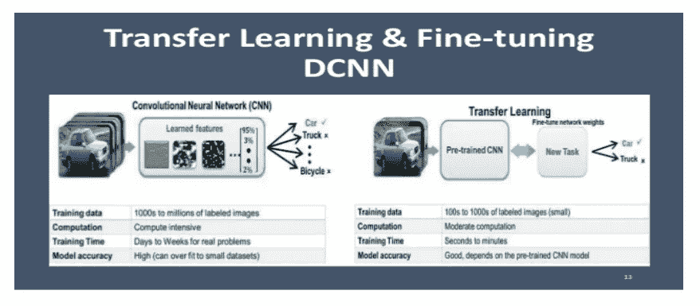
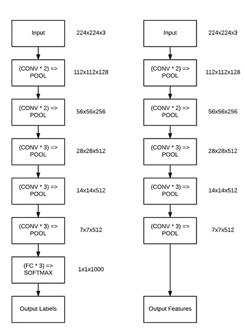
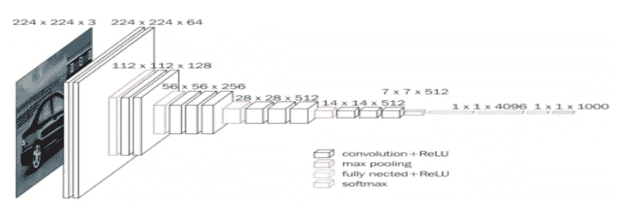
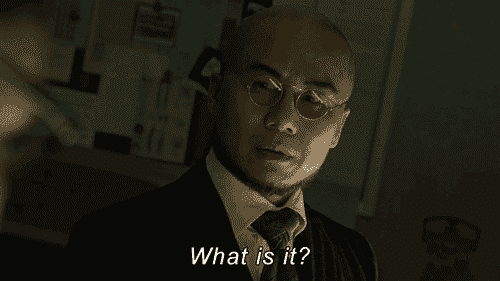
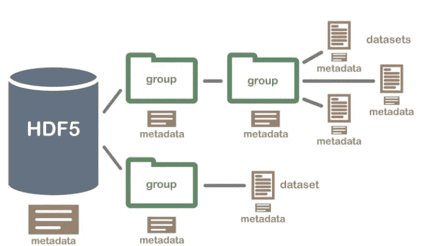

# 迁移学习的艺术(上)

> 原文：<https://medium.com/analytics-vidhya/the-art-of-transfer-learning-e6aea8fc0b8c?source=collection_archive---------25----------------------->

图片来源:由 [Unsplash](https://unsplash.com/images/nature/sunset?utm_source=unsplash&utm_medium=referral&utm_content=creditCopyText) 上的 [Recal Media](https://unsplash.com/@recalmedia?utm_source=unsplash&utm_medium=referral&utm_content=creditCopyText)

嗨，朋友们，今天在这篇博文中，我将向你们概述迁移学习的概念。这个博客分为两部分，在这一部分，我将尝试解释不同类型的迁移学习技术的理论概念，以及如何存储和使用特征向量来制作一个相当准确的图像分类器。

完成本博客后，您将能够:

*   了解当应用于计算机视觉的深度学习时，有哪些不同类型的迁移学习。
*   从预先训练的 CNN 中提取特征。
*   对 HDF5 数据格式的基本理解。

**1。什么是迁移学习:**

> **迁移学习(TL)** 是[机器学习](https://en.wikipedia.org/wiki/Machine_learning) (ML)中的一个研究问题，它专注于存储在解决一个问题时获得的知识，并将其应用于另一个不同但相关的问题。

来源:[https://en.wikipedia.org/wiki/Transfer_learning#Definition](https://en.wikipedia.org/wiki/Transfer_learning#Definition)

这是一个标准的定义，让我进一步简化一下。我们可以把迁移学习想象成使用预先训练好的模型作为从最初没有训练过的数据中学习模式的捷径的能力。仍然不清楚让我们举一个标准机器学习问题的例子，其中我们给出了两个分类问题:

1:我们的首要任务是训练一个能够在摩托车和自行车之间进行分类的 CNN(卷积神经网络)。

2:第二个任务是对轿车、SUV 和跑车等 3 类汽车进行分类

现在，使用机器学习、神经网络和深度学习中的标准实践，我们会将这视为两个独立的问题。首先，我们将在自行车和摩托车标签上收集足够的数据，然后在数据集上训练模型。第二个任务遵循类似的过程，只是这一次，收集不同汽车类别的图像，然后在标记的汽车数据集上训练模型。

> 现在，迁移学习提出了一种不同的训练范式:-如果我们可以使用现有的预训练分类器，并将其用作新分类任务的起点，会怎么样？

在上述挑战的背景下，我们将首先训练 CNN 对自行车和摩托车进行分类。然后，我们将使用同样的 CNN 训练过的自行车和摩托车数据来区分汽车类别，

> 即使汽车数据没有与自行车和摩托车数据混合。

这有多异想天开？

图片来源:谷歌 gif 的

因此，上述方法听起来很有希望成为现实，但不幸的是，这并不是因为这种类型的迁移学习只对真正深度的神经网络有好处，并且是在大规模数据集上训练的，如 [Image-net](http://www.image-net.org/) 数据集。这些网络在迁移学习任务方面表现出色，因为这些网络学习一组丰富的、有区别的特征来识别 1000 个单独的对象类别。这些过滤器可以被*重用*用于分类任务，而不是 CNN 最初训练的内容，这是有道理的。

一般来说，当应用于计算机视觉的深度学习时，有两种类型的迁移学习:

***1。将网络视为任意特征提取器。***

2.****

描述迁移学习的第二种技术[的图像](https://www.google.com/url?sa=i&url=https%3A%2F%2Fwww.slideshare.net%2FPyData%2Fpy-datasf&psig=AOvVaw2_K1d5BetTs_l3Q5bDWAvd&ust=1598595545340000&source=images&cd=vfe&ved=0CAIQjRxqFwoTCKi_-9PcuusCFQAAAAAdAAAAABAP)。

在这篇博客中，我们将主要关注迁移学习的第一种方法，将网络视为特征提取器。

**2。从预先训练的 CNN 中提取特征:**

我们总是将 CNN 视为端到端的图像分类器，如下所示:

1.我们将图像输入网络。

2.图像通过网络向前传播。

3.我们从网络的末端获得最终的分类概率。

然而，并没有严格的规则来遵循上述步骤并总是通过整个网络传播图像。相反，我们可以在网络的任意部分停止传播，例如激活层或汇集层，此时从网络中提取值，并将其用作特征向量。通过这个例子，我们可以更好地理解它

作为特征提取器的 VGG16 网络架构

这是一个标准的 [VGG16](https://neurohive.io/en/popular-networks/vgg16/) 架构，或者可以被视为基于 Imagenet 数据集的标准预训练模型。图像的左侧是原始的 VGG16 网络架构，它输出 1000 个 ImageNet 类标签中每个标签的概率，图像的右侧描绘了网络结构，其中最终的全连接层从 VGG16 中移除，而不是返回最终的[池](https://machinelearningmastery.com/pooling-layers-for-convolutional-neural-networks/)层的输出。这个输出将作为我们提取的特征。除了网络中的层之外，我们还包括了每个层的体积的输入和输出形状。在这种将网络视为特征提取器的方法中，我们基本上尝试在任意点“切割”网络，通常在完全连接的层之前完成，但这实际上取决于数据集和用例。

**2.1 了解流程:**

具有过滤器和池层计算的 VGG16 网络架构。

在上面图像的右侧，最后一层是 max-pooling 层，假设有 512 个大小为 7 x 7 的过滤器，其输出形状将为 7 x 7 x 512。如果在移除 FC 层的情况下通过网络向前传播映像，我们将剩下 512，7 x 7 个激活，这些激活基于映像内容而激活或不激活。因此，我们实际上可以将这些 7 x 7 x 512 = 25，088 个值作为量化图像内容的特征向量。现在，如果我们对整个图像数据集(包括 VGG16 最初未被训练的数据集)重复这一过程，我们将获得 N 个图像的设计矩阵，每个图像具有 25，088 列，用于量化它们的内容(即特征向量)。因此，通过使用这些特征向量，我们可以在该特征的基础上训练任何机器学习模型，如线性 SVM、逻辑回归分类器或随机森林，以获得识别图像新类别的分类器。CNN 本身不能识别这些新的类别，相反我们把它作为一个中间的特征提取器。底层的 ML 模型将负责从 CNN 提取的特征中学习模式，但是通过应用迁移学习，我们能够毫不费力地构建*超精确图像分类器*。诀窍是*提取*这些特征并以有效的方式存储它们。为了完成这项任务，我们需要 HDF5。

**2.1.1 什么是 HDF5？**

图片来源:[谷歌 gifs](https://www.google.com/url?sa=i&url=https%3A%2F%2Fgiphy.com%2Fgifs%2Fgotham-fox-3o7qDP28LG5LrVYfde&psig=AOvVaw2fpN_mp2AN3EMZAM54LGVL&ust=1598601729626000&source=images&cd=vfe&ved=0CAIQjRxqFwoTCLjAh9nzuusCFQAAAAAdAAAAABAW)

分层数据格式版本 5 (HDF5)是一种支持大型、复杂、异构数据的开源文件格式。HDF5 使用类似“文件目录”的结构，允许您以多种不同的结构化方式组织文件中的数据，就像您在计算机上处理文件一样。在 HDF5 中，我们在计算机上称之为“目录”或“文件夹”的称为“组”，在计算机上称之为“文件”的称为“数据集”。HDF5 中有两个重要术语，它们是:

*   **组:**HD F5 文件中的文件夹状元素，其中可能包含其他组或数据集。
*   **数据集:**包含在 HDF5 文件中的实际数据。数据集通常(但不是必须)存储在文件的组中。

*包含组、数据集和相关元数据的示例 HDF5 文件结构。*

*数据集*可以被认为是同构数据类型(整数、浮点、Unicode 等)的多维数组(即 NumPy 数组)。).HDF5 是用 C 写的；然而，通过使用 h5py 模块([h5py.org](http://www.h5py.org/))，我们可以使用 Python 编程语言访问底层的 C API。h5py 之所以如此牛逼，是因为它与数据交互的便捷性。我们可以在我们的 HDF5 数据集中存储*大量的*数据，并以类似 NumPy 的方式操作这些数据。例如，我们可以使用标准 Python 语法来访问和切片存储在磁盘上的*多 TB 数据集*中的行，就好像它们是加载到内存中的简单 NumPy 数组一样。由于专门的数据结构，这些切片和行访问变得很快。将 HDF5 与 h5py 配合使用时，您可以将您的数据想象成一个巨大的 NumPy 数组，它太大而无法放入主内存，但仍然可以访问和操作。也许最好的是，HDF5 格式是标准化的，这意味着以 HDF5 格式存储的数据集具有内在的可移植性，可以由使用不同编程语言(如 C、MATLAB 和 Java)的其他开发人员访问。

非常感谢朋友们阅读这篇文章，在下一篇即将发表的博客文章中，我将试着写一篇自定义的 Keras 和 python 代码，并给你们演示一下，这些代码能够接受输入数据并使用迁移学习。我们将使用预先训练的 CNN 模型，如 VGG16、Resnet、Alexnet 等作为特征提取器，并以 HDF5 文件格式存储各自的特征。使用得到的特征向量，我们将尝试建立一个很棒的图像分类器，所以请保持关注。

**参考文献:**

[https://en.wikipedia.org/wiki/Transfer_learning](https://en.wikipedia.org/wiki/Transfer_learning#Definition)

[https://www . pyimagesearch . com/2019/05/20/transfer-learning-with-keras-and-deep-learning/](https://www.pyimagesearch.com/2019/05/20/transfer-learning-with-keras-and-deep-learning/)

 [## ImageNet

### ImageNet 是一个根据 WordNet 层次结构(目前只有名词)组织的图像数据库，其中每个…

www.image-net.org](http://www.image-net.org/)  [## VGG16 -用于分类和检测的卷积网络

### VGG16 是由英国牛津大学的 K. Simonyan 和 A. Zisserman 提出的卷积神经网络模型。

神经蜂巢. io](https://neurohive.io/en/popular-networks/vgg16/) 

[https://www . neon science . org/about-HD F5 #:~:text = The % 20 hierarchical % 20 data % 20 format % 20 version，with % 20 files % 20 on % 20 your % 20 computer。](https://www.neonscience.org/about-hdf5#:~:text=The%20Hierarchical%20Data%20Format%20version,with%20files%20on%20your%20computer.)