# 迁移学习的艺术(下)

> 原文：<https://medium.com/analytics-vidhya/the-art-of-transfer-learning-part-ii-7bc4370e9b8f?source=collection_archive---------19----------------------->

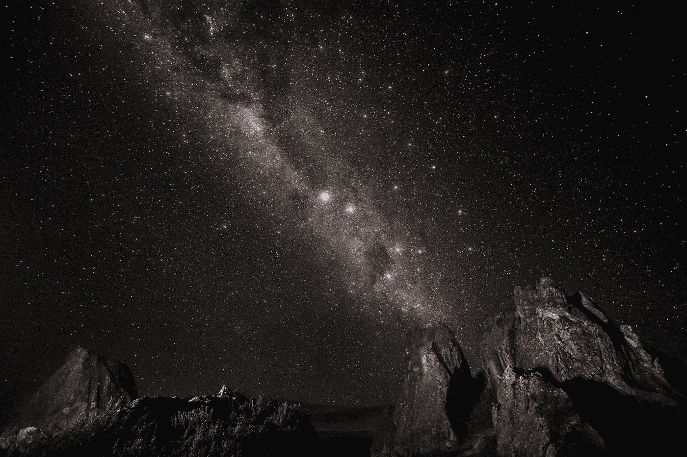

布鲁斯·蒂曼纳在 [Unsplash](https://unsplash.com/images/nature?utm_source=unsplash&utm_medium=referral&utm_content=creditCopyText) 上拍摄的照片

各位读者好，很高兴看到大家回来，今天的博文是我之前关于迁移学习的博文的第二部分，如果你错过了，我建议你浏览一下，你可以点击下面的链接 [***这里***](/@hd150295/the-art-of-transfer-learning-e6aea8fc0b8c) 。在本帖中，我将尝试在 [Keras](https://keras.io/) 和 python 编程语言中实现第一种迁移学习技术，我在之前的博客中解释过这种技术是 ***“网络作为任意特征提取器”*** 。

完成本博客后，您将能够实现:

*   ***将要素写入 HDF5 数据集格式的自定义类。***
*   ***如何从不同的输入图像数据集中提取特征，这些数据来自一个预先训练好的模型，而这个模型最初并没有被训练过。***
*   ***在提取的特征上训练图像分类器，并显示分类器在不同类别上的性能。***

所以让我们开始吧，如果你想跳过阅读并想要代码，那么你可以按照这个 [***链接***](https://github.com/harishdasari1595/Personal_projects/tree/master/transfer-learning) 。

来源:[谷歌 gif 图片](https://www.google.com/url?sa=i&url=https%3A%2F%2Fgiphy.com%2Fexplore%2Fkpop-starts&psig=AOvVaw1CylXNLx0YkuCe1LXOJX70&ust=1599305200099000&source=images&cd=vfe&ved=0CAIQjRxqFwoTCKD-x6Cwz-sCFQAAAAAdAAAAABAQ)

以下项目的目录结构是:

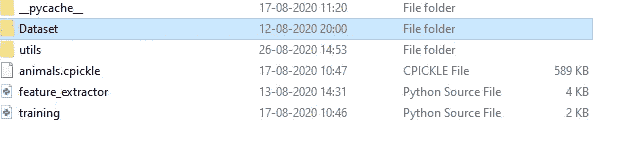

外部目录结构。

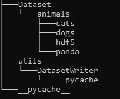

内部目录结构

在上面两张图片中，你可以看到我们的特征提取项目的目录结构，我们将在这个博客中探索每个文件。

1.  **数据集集合:**

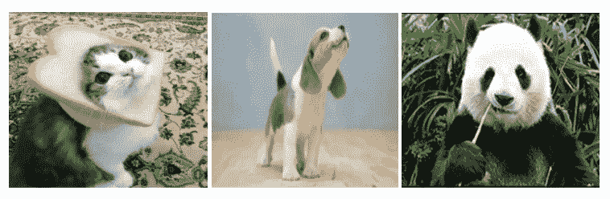

来自动物数据集的猫、狗和熊猫样本图像。

为了解决任何与人工智能相关的任务，我们首先必须收集相关的数据，因此创建一个名为 Dataset 的新文件夹，其中我使用了 Kaggle 的 [***动物数据集***](https://www.kaggle.com/ashishsaxena2209/animal-image-datasetdog-cat-and-panda) ，其中有三个类，如 ***狗*** 、 ***猫、*** 和 ***熊猫。*** 我将数据集保存在一个名为 animals 的文件夹下，您可以在上面的图像中看到，它还有一个名为 hdf5 的文件夹，其中有各自的功能。hdf5 文件，这样您可以保存多个类别数据集。

**2。HDF5 数据集创建脚本:**

现在有一个 utils 文件夹，其中将包含项目所需的所有实用程序文件。在 DatasetWriter 文件夹下有我们的第一个名为***hdf 5 DatasetWriter . py***script 的脚本。选择一个代码编辑器，创建一个名为 HDF5DatasetWriter.py 或任何相关内容的脚本。

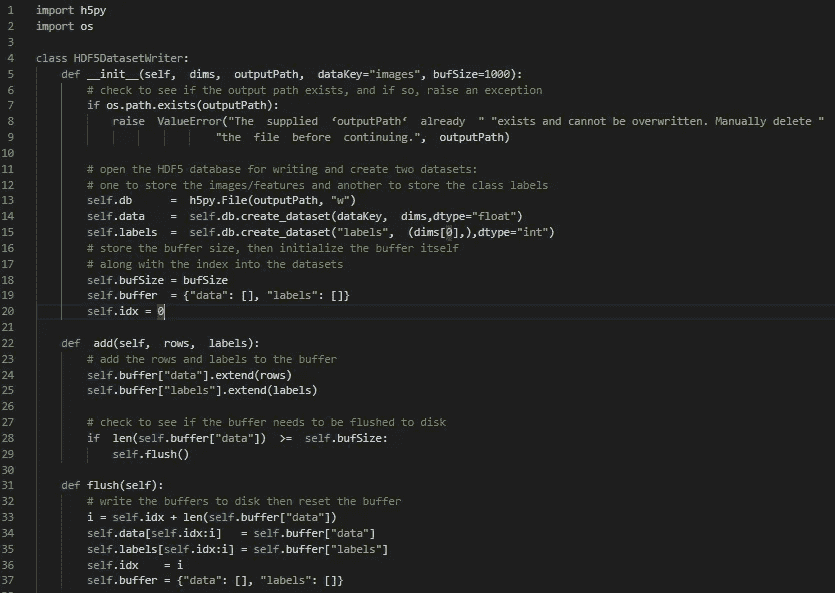

Hdf5DatasetWriter.py 代码片段 2.1

在整个博客中，我将尝试解释代码的主旨和每个方法或函数的核心功能，因为逐行代码解释会非常长，您很容易迷路，所以请耐心听我说一会儿。从上面的代码片段可以看出，我基本上创建了一个名为 HDF5DatasetWriter 的类，构造函数接受四个参数，其中两个是可选的。

**dims:**dims 参数控制我们将存储在数据集中的数据的*尺寸*或*形状*。把 dims 想象成。NumPy 数组的形状。如果我们存储 28 ^ 28 = 784**数据集的(展平的)原始像素亮度，那么 dims=(70000，784)因为在 MNIST 有 70，000 个例子，每个例子的维数为 784。在未来的脚本中，我们将使用 VGG16 网络进行特征提取，获取池图层的最终输出。展平后，输出图层形状将为(512 X 7 X 7) = 25，088 特征向量。dims = (N，25088)其中 N 是我们数据集中的图像总数。**

****Outputpath:** 这是一个必需的参数，指定我们的输出 HDF5 文件在磁盘上的存储路径。**

****dataKey:** 它是一个可选参数，指定 HDF5 文件的名称，默认为“images”，因为我们主要只处理图像。**

****bufSize:**另一个可选参数 bufSize 控制我们的内存缓冲区的大小，我们默认为 1000 个特征向量/图像。一旦达到 bufSize，我们将把缓冲区刷新到 HDF5 数据集。**

**此外，我们正在使用 ***数据键*** 创建一个数据库，并创建两个数据集，一个用于存储图像/特征，另一个用于存储类别标签，然后初始化缓冲区。**

**add 方法:add 方法需要两个参数:我们将要添加到数据集的行，以及它们对应的类标签。行和标签都被添加到它们各自的缓冲区，一旦缓冲区满了，就调用 flush 方法将缓冲区写入文件并重置它们。**

****刷新方法:**刷新方法用于将当前索引记录到下一个可用索引中，我们可以在该索引中存储数据(不覆盖现有数据)。它还应用 NumPy 数组切片来存储缓冲区中的数据和标签，然后重置缓冲区。**

**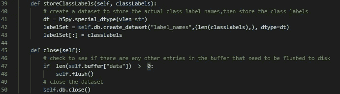**

**Hdf5DatasetWriter.py 代码片段 2.2**

**在上面的代码片段中，还剩下两个方法，它们是:**

****storeclassplabels 方法:**在调用此方法时，它会将类标签的原始字符串名称存储在一个单独的数据集中**

****关闭方法:**该方法用于检查缓冲区中其他需要刷新到磁盘的条目，然后关闭数据库。**

**正如你所看到的，这些方法不需要任何花哨的深度学习库，也没有执行任何深度学习特定的功能，它主要是一个以 HDF5 数据格式存储数据的简单类。**

****3。特征提取过程:****

**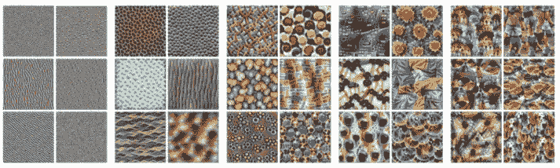**

**深度学习系统如何建立对图像的理解的内部表示，从第一层的边缘和纹理到更深层的图案、零件和对象**

**现在我们的 HDF5DatasetWriter 已经实现，我们可以继续使用预训练的卷积神经网络实际提取特征。启动编辑器，定义一个名为 feature _ extractor . py&follow me 的 python 脚本**

**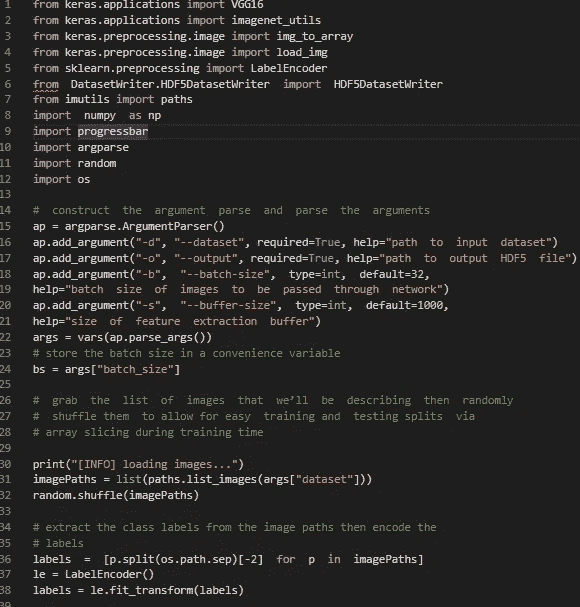**

**3.1 feature_extractor.py 代码片段**

**在上面的代码片段中，我首先导入了必要的库，然后声明了 argparse 类的一个对象，用于将不同的参数作为输入数据集的路径、HDF5 文件的路径、图像的批处理大小以及前面脚本的缓冲区大小的输入。在随机排列一系列图像之后，这使得训练和测试分割变得容易。类别标签是从图像路径中提取的，例如，如果从混洗中随机选择一张猫图像，那么它的路径看起来将是这样的***" Dataset \ animals \ cats \ cats _ 00026 "***，因此由**"**分隔的倒数第二个字符，即" ***cats"*** ，将被编码为整数 ***(我们将在训练过程中执行一次热编码)*** ，使用**

**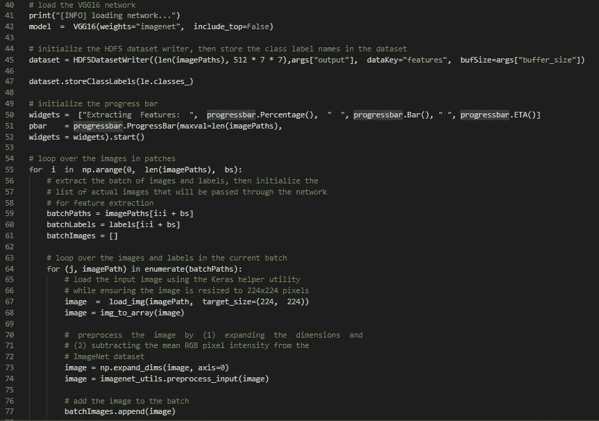**

**3.2 Feature_extractor.py 代码片段**

**现在，在排列了来自 Keras 库的标签之后，我们将首先加载预训练模型 VGG16，直到最终的 ***池*** 层，忽略最终的 ***FC*** 层，方法是写入下面的行***“vgg 16(weights = " imagenet "，include_top=False)”。*** 这里取 imagenet 权重，所以我们做的和我之前的 [***博客***](/@hd150295/the-art-of-transfer-learning-e6aea8fc0b8c#2c01-2fa448dbc886)*中解释的完全一样，会把 **VGG16** 当作任意的特征提取器。名为 ***"dataset"*** 的 HDF5DatasetWriter 类对象是通过将参数值设置为***"(dims =(len(image paths)，512 * 7 * 7)，args["output"]，dataKey="features "，bufSize=args["buffer_size"])来创建的。*** 关于各参数的深入解释，请参考 HDF5DatasetWriter 代码解释部分。根据标签编码器的类标签的字符串名存储在 ***【数据集】*** 对象中。***

**现在是执行实际特征提取的时候了:从 L **ines** **57** 到 **77** 这基本上是一个外循环中的孪生 for 循环在外 for 循环中，我们开始以批量大小循环我们的图像路径。**第 59 行和第 60 行**提取相应批次的图像路径和标签，而**第 61 行**初始化一个列表，以存储将要加载并送入 VGG16 的图像。为特征提取准备图像与通过 CNN 为分类准备图像完全相同:在内部 for 循环中，我们遍历批处理中的每个图像路径。每个图像从磁盘加载并转换成 Keras 兼容的数组(**行 67 和 68** )。然后，我们对第**行第 73 和 74** 行的图像进行预处理，随后将其添加到批量图像中(**行第 77** )。为了获得批量图像中图像的特征向量，我们需要做的就是调用。模型的预测方法。**

**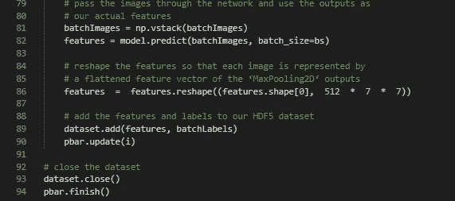**

**3.3 feature_extractor.py 代码片段**

**我们使用。第 81 行的 NumPy 的 vstack 方法“垂直堆叠”我们的图像，使它们具有形状(N，224，224，3 ),其中 N 是批次的大小。通过我们的网络传递 batchImages 产生了我们实际的特征向量——记住，我们在 VGG16 的头部切断了完全连接的层，所以现在我们只剩下最后的 max-pooling 操作之后的值(**第 82 行**)。但是，池的输出具有(N，512，7，7)的形状，这意味着有 512 个过滤器，每个大小为 7 X 7。为了将这些值作为一个特征向量，我们需要将它们展平成一个形状为(N，25088)的数组，这正是**行 86** 所完成的。**第 89 行**将我们的特性和批处理标签添加到我们的 HDF5 数据集，最后几行处理关闭我们的 HDF5 数据集。**

**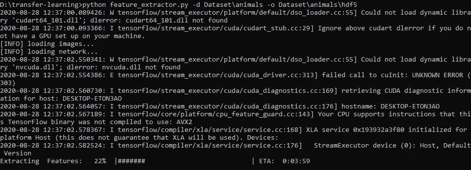**

**3.4 CMD _ 输出快照。**

**在上面的代码片段中，feature extractor.py 的用法命令显示为"***python feature _ extractor . py-d Dataset \ animals-o Dataset \ animals \ hdf "***，这是我们脚本的名称，后面跟有输入参数，如 ***-d "输入数据集的路径"，"-o 输出路径，用于以 HDF5 格式存储提取的要素。"。*** 请忽略下面的警告，我们观察这个" ***提取特征:100% | # # # # # # # # # # # # |时间:0:04:46"*** 你可以在上面看到一个进度条，它给出了提取特征的进度，我花了大约 4 分 46 秒从所有 3000 张图像中提取特征，如果你有 GPU，它会变得更快。**

*****4.1 在提取的特征上训练一个分类器。*****

****

**由于我们已经使用预训练的 CNN 模型成功地从我们的目标数据集提取了特征，让我们看看 ***如何区分*** 这些特征，*尤其是*鉴于 VGG16 是在 ImageNet 和*而不是*动物上训练的。因此，让我们看看线性模型在这些提取的特征之上会有多好，以及我们在模型精确度方面能达到多高？任何超过 90%的都是非常好的，所以让我们创建一个名为 training.py 的新 python 文件，并开始编写下面的代码。**

**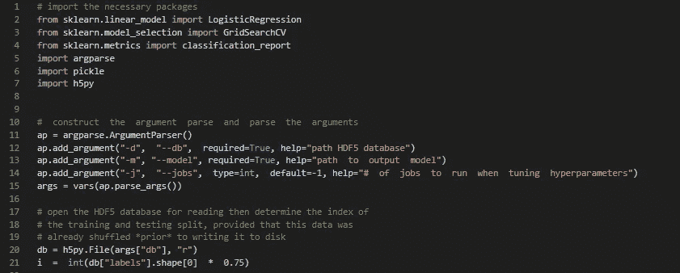**

**4.1 training.py 代码片段。**

**在上面的代码片段中，您可以看到从 ***第 2–7 行*** 所需的 python 包在脚本开始时被导入，我们使用一个 ***sklearn*** 包来导入[***LogisticRegression***](https://en.wikipedia.org/wiki/Logistic_regression#:~:text=Logistic%20regression%20is%20a%20statistical,a%20form%20of%20binary%20regression).)*作为我们的图像分类器的线性模型，该分类器将对 3 种类型的类标签进行分类，即**(狗、猫、猫 ***GridSearchCV*** 用于调优超参数 ***分类报告*** 用于显示我们新分类器在各种指标方面的报告，如**精度**，R **ecall，**和 ***精度。*** 我们将在培训后使用 ***pickle*** 将我们的逻辑回归模型序列化到磁盘中。最后，将使用 ***h5py*** ，这样我们就可以与我们的 HDF5 要素数据集进行交互。*****

**现在我们声明参数解析器，用于从用户 ***-d*** 获取输入:包含提取的特性和类标签的 HDF5 数据集的路径**

*****-m:*** 存储线性模型输出模型文件的路径**

*****-j:*** 用于选择同时作业的数量，同时使用网格搜索技术调整线性模型的超参数。**

**在之前的脚本中，在创建 HDF5 特征数据库时，我们有意打乱了图像路径，原因已在第 20 至 21 行*中阐明。鉴于我们的数据集太大，无法放入内存，我们需要一种有效的方法来确定我们的训练和测试分割。由于我们知道 HDF5 数据集中有多少条目(并且我们知道我们希望将 75%的数据用于训练，25%用于评估)，我们可以简单地将 75%的索引 I 计算到数据库中。之前的任何数据*索引 **i** 都被认为是训练数据 **i** 之后的任何数据都是测试数据。****

**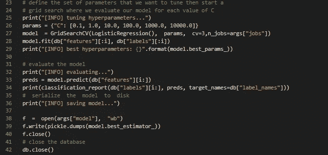**

**4.2 training.py 代码片段。**

**既然我们已经有了训练和测试分割，现在我们可以通过使用 ***GridSearchCV*** 从调整超参数“ ***C*** ”开始训练我们的逻辑回归分类器，在这里您还可以指定各种参数来有效训练我们的模型。的。拟合模型被称为采用(X，Y)的模型，因此这里 X 是我们的***db[特征][:i]*** *，Y 是我们的类标签****db[标签][:I]*【T27]，一旦找到最佳超参数，我们就对来自 ***行 32 到 34 的测试数据评估分类器。*** 注意这里我们的*测试数据*和*测试标签*是通过数组切片访问的:****

**索引 I 是我们测试集的一部分。即使我们的 HDF5 数据集驻留在磁盘上(并且太大而不适合内存)，我们仍然可以将其视为 NumPy 数组，这是将 HDF5 和 h5py 一起用于深度学习和机器学习任务的*巨大*优势之一。最后，我们将 LogisticRegression 模型保存到磁盘并关闭数据库。**

*****4.2 在动物数据集上训练分类器:*****

**要在通过动物数据集上的 VGG16 网络提取的特征上训练逻辑回归分类器，只需在输出快照中执行以下命令。**

**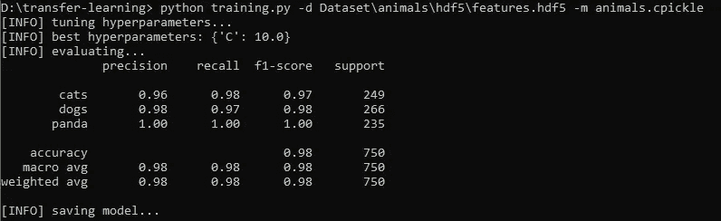**

**4 . 2 . 1 training . py 的输出快照**

**在上面的快照中，您可以看到我们得到的最佳超参数是***【C】:10.0，*** ，在对测试数据进行模型评估后，我们得到了宏观和加权平均准确度、精确度、召回率，f1 值约为 98%，这对于一个不费力的图像分类器来说是非常好的。**

**你可以从我的 Github 资源库中找到博客中使用的代码:[https://Github . com/harishdasari 1595/Personal _ projects/tree/master/transfer-learning](https://github.com/harishdasari1595/Personal_projects/tree/master/transfer-learning)**

# *****概要:*****

1.  ****我们可以使用两个*extract _ features . py*&*train _ model . py*来基于从预训练的 CNN 提取的特征快速构建鲁棒的图像分类器。****
2.  ****显然，VGG 等网络能够执行迁移学习，将它们的区别特征编码到输出激活中，我们可以使用这些输出激活来训练我们自己的自定义图像分类器。****
3.  ****在这里，我们严格关注迁移学习的特征提取能力，证明深度预训练的 CNN 能够执行强大的特征提取机器，甚至比手工设计的算法更强大，如**[***HOG***](https://www.learnopencv.com/histogram-of-oriented-gradients/)**[***SIFT***](/data-breach/introduction-to-sift-scale-invariant-feature-transform-65d7f3a72d40)******和** [****](https://www.pyimagesearch.com/2015/12/07/local-binary-patterns-with-python-opencv/)********
4.  ********每当用深度学习和卷积神经网络处理一个新问题时，总是要考虑应用特征提取是否会获得合理的准确性——如果是这样，你可以完全跳过网络训练过程，为你节省大量的时间、精力和头痛。********

# *********参考文献:*********

****** [## 动物图像数据集(狗、猫和熊猫)

### 图像分类实践数据集

www.kaggle.com](https://www.kaggle.com/ashishsaxena2209/animal-image-datasetdog-cat-and-panda)  [## 特征可视化

### 越来越多的人意识到神经网络需要能够被人类理解。神经网络领域…

蒸馏. pub](https://distill.pub/2017/feature-visualization/)  [## 3 深度特征提取和迁移学习的优势

### 没有真正的新闻表明特征提取[1]是任何机器学习的基础步骤…

amethix.com](https://amethix.com/deep-feature-extraction-and-transfer-learning/)******