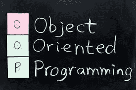

# 在 Python 中使用 OOP 的艺术——第 1 部分

> 原文：<https://medium.com/analytics-vidhya/the-art-of-using-oop-in-python-part1-1679d6eec046?source=collection_archive---------23----------------------->

这篇文章介绍了面向对象编程，它的好处和它的广泛应用。

# **简介**

关于 OOP 是什么，有许多复杂而精密的定义，但简单来说，它只是一种结构化的编程方式，其中编程风格围绕着对象。

例如，这是一个购物中心，里面有很多商店。我们被赋予一项任务，我们必须创建一个应用程序，这将有助于商场管理有效地支付工资。

这看起来很简单，但实际上并非如此。如果我们对每个人都采用程序化的编程风格，我们必须写出他们的工资函数，因为所有的雇员都没有共同的工资。可能有经验丰富的员工或经理或销售人员，他们的工资取决于给他/她的每月销售目标。

那么，我们如何解决这个问题。简单的答案显然是你所期望的 OOP。

现在，在回答上述问题之前，我们必须了解的主要问题是什么时候使用过程式编程，什么时候使用 OOP。

一般来说，在过程式编程中，当我们有大量重复代码时，我们会将其封装到一个函数中。但是不同应用中的各种类似功能，属于一个特定集合的功能呢？例如，考虑一个销售裤子的男人/女人。现在我们要考虑的参数是:

1.  销售的数量
2.  年龄

这些将用于评估员工的工资。现在考虑一个经理，我们不能用同一套参数来计算经理的工资。但是不同分支机构的所有经理都可以根据统一的政策获得工资。

这就是当我们使用 OOP 时，我们可以看到函数进入一个 hood，有代码重复或者一个文件中的代码可能被另一个程序访问。

有趣的事实:几乎所有的 python 库都是使用 OOP 编程创建的。

因此，除了使用 OOP，我们还需要知道何时使用它，何时不使用它。

# 应用程序

1.  构建神经网络
2.  一般应用
3.  编写库
4.  创建数据库

# 代码示例

我在下面附上了一个 GitHub 库链接。您可以浏览存储库中的文件。所有的代码都有很好的注释，很容易理解。

 [## srimanthtenneti/OOP101

### 这是 OOP 的一个基本思想。。在 GitHub 上创建一个帐户，为 srimanthttenneti/OOP 101 开发做出贡献。

github.com](https://github.com/srimanthtenneti/OOP101) 

# 结论

这是基本的面向对象程序设计的结束。在下一篇文章中，我将讨论 OOP 中有趣的魔法方法。

# 接触

如果你没有得到的概念，并希望获得进一步的帮助，随时通过我的 LinkedIn 与我联系。

 [## Srimanth Tenneti -自由职业者-自由职业者| LinkedIn

### 我是 Srimanth Tenneti，一名 20 岁的硬件设计师和软件开发人员。目前就读于北京理工大学二年级…

www.linkedin.com](https://www.linkedin.com/in/srimanth-tenneti-662b7117b/)