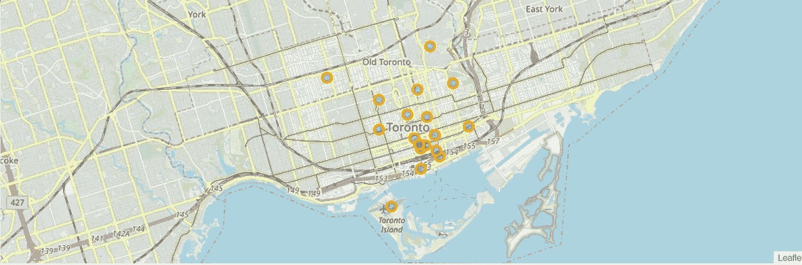
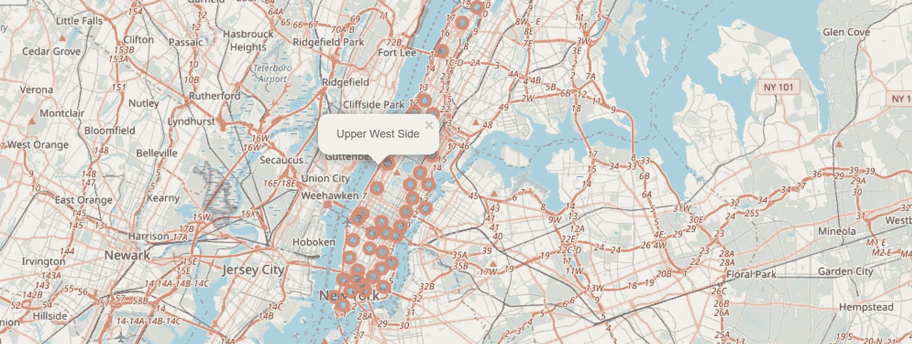
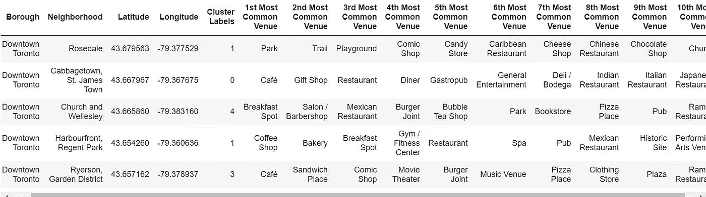
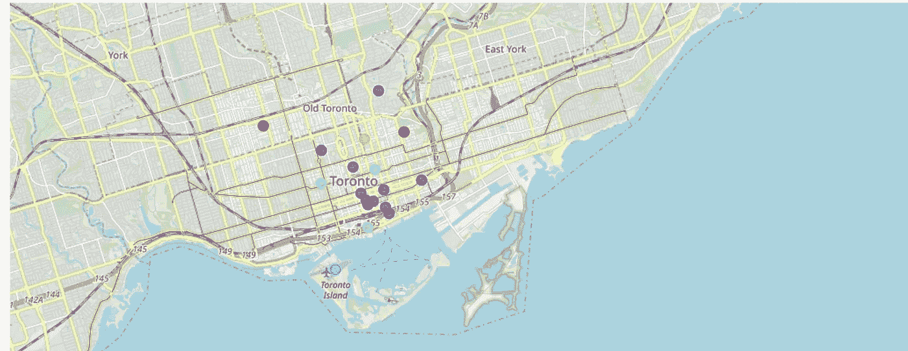
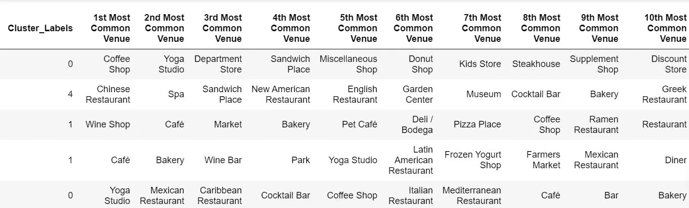
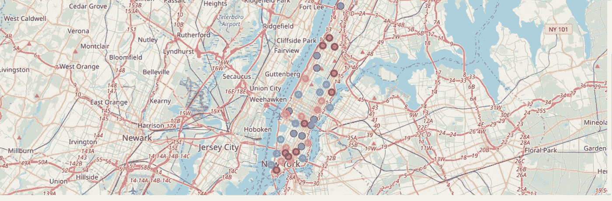
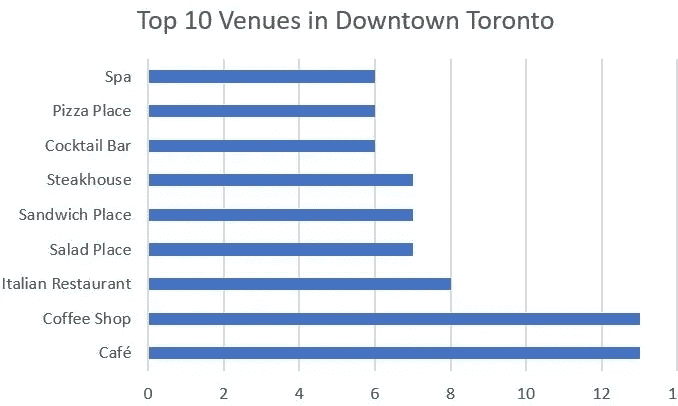
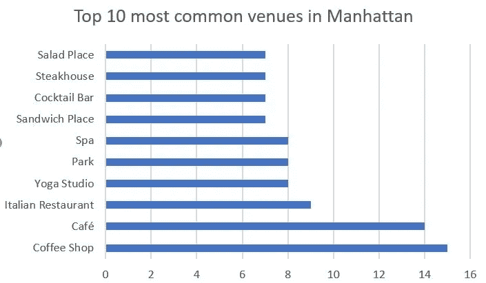

# 邻里之战

> 原文：<https://medium.com/analytics-vidhya/the-battle-of-neighborhoods-2394095052ca?source=collection_archive---------17----------------------->

# 商业问题

杰里是一个国际商人，他总是在世界各地寻找新的机会。最近，他想在北美开始他的餐馆生意。经过大量的研究，他最终选择了两个城市:纽约和多伦多。这两个城市都非常多样化，都是各自国家的金融之都。Jerry 认为最安全的方法是比较这两个城市的社区，并确定它们有多相似或不相似。然后他可以获得更多有助于他做决定的信息。

# 数据描述

首先，我们需要从 Foursquare API 获取并探索这两个城市的邻居数据。我们要关注的信息是餐馆、咖啡店和娱乐场所。我们将从每个城市中选择一个社区:曼哈顿代表纽约，市中心代表多伦多。我们需要应用邻域细分和聚类来分析邻域数据，并根据客流量和餐馆类型来确定两个城市中最佳餐馆位置的优先级。最后，我们可以决定哪个城市是 Jerry 开始的更好的地方。

# 方法学

我们需要用同样的方法逐一探索两个城市。首先，我们将从第 3 周开始获取经过处理的多伦多数据，但对于本项目，仅包括多伦多市中心。对于纽约曼哈顿的数据，我们将从前面的数据文件中提取这部分数据，然后使用 Foursquare API 探索这两个城市，并分别可视化结果。

# 地图可视化

我使用叶图书馆可视化两个城市的地理概况。关键是基于邻域使用适当的纬度和经度值。

多伦多市中心街区概述

曼哈顿街区概述

# API 可视化和聚集社区中的场馆

我使用 Foursquare API 来探索邻近地区的场馆，根据每个区的纬度和经度，将限制设置为 20 个场馆和半径 500 米。

我用 KMeans 聚类法对每个区的前 10 个场馆进行了排序。kcluster 的值设置为 5。

十大场馆-多伦多市中心

## 聚类结果-多伦多市中心场馆

十大场馆-曼哈顿

## 聚类结果-曼哈顿场馆

## 最常见的场地

多伦多市中心

曼哈顿

# 建议和结论

正如我们从聚类结果中看到的:曼哈顿比多伦多市中心有更多多样的餐厅和娱乐场所，这意味着它可以吸引更多的人流量和机会。此外，社区里的餐馆和咖啡馆越多样化，人们就越能接受不同类型的饮食文化。这也可以降低风险，杰里开始他的餐馆业务，因为潜在的客户群在曼哈顿。