# 邻里之战——洛杉矶版

> 原文：<https://medium.com/analytics-vidhya/the-battle-of-the-neighbourhoods-la-edition-152edcc72c53?source=collection_archive---------5----------------------->

## 确定在洛杉矶新开一家意大利餐厅的最佳位置

## 简介:业务问题

洛杉矶是加州人口最多的城市，也是美国人口第二多的城市。它是南加州的文化、金融和商业中心。这座城市以其地中海气候、种族多样性、好莱坞、娱乐产业及其庞大的大都市而闻名。

在洛杉矶住了一年多，我可以肯定这也是最棒的就餐地点之一，因为这里有各种各样的国际美食和一些世界上最有才华的厨师。洛杉矶繁荣的经济、多元文化的人口结构、丰富的原料和丰富的季节性产品使其成为餐馆繁荣发展的理想之地。

这个项目的目标是确定可以开设餐馆的最佳潜在社区。一项国际 YouGov 对 24 个国家的 25，000 多人进行的研究发现，披萨和意大利面是世界上最受欢迎的食物，因为意大利美食胜过所有人。根据他们的分析，88%接受调查的美国人喜欢意大利食物。记住这一点，这个顶点的焦点将是意大利餐馆。因此，这个项目的分析和结果会引起对在洛杉矶开一家意大利餐馆感兴趣的利益相关者的兴趣。

因为在洛杉矶有数不清的餐馆，那些不是已经挤满餐馆的街区会被首先挑选出来。随后的过滤器将是附近意大利餐馆数量最少的街区。离市中心更近的社区将会受到青睐。邻里租金是另一个需要考虑的因素。

## 数据

根据上述标准，影响最终决定的因素如下

*   **附近现有餐馆的数量(任何类型的餐馆)**
*   **附近意大利餐馆的数量和距离**
*   **居民区离市中心的距离**
*   **平均邻里租金**

提取/生成所需信息需要以下数据源:-

*   洛杉矶所有街区列表—[https://en . Wikipedia . org/wiki/List _ of _ districts _ and _ neighborhoods _ of _ Los _ Angeles](https://en.wikipedia.org/wiki/List_of_districts_and_neighborhoods_of_Los_Angeles)
*   所有街区和场馆的坐标-地理名称地理编码
*   每个街区的餐馆数量及其类型和位置——four square API
*   LA rent data—[https://www . rent cafe . com/average-rent-market-trends/us/ca/los-Angeles/](https://www.rentcafe.com/average-rent-market-trends/us/ca/los-angeles/)

## 分析

通过抓取在数据段中指定的相应网页来获得 LA 中所有邻居的列表。网页上的数据是列表形式的，并且是通过在使用对所需项目进行分组的定义特征之前搜索所有列表项目来收集的。使用 GeoPy Nominatim 地理定位器，可以获得邻域坐标，从而形成完整的邻域数据框架:-

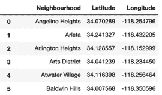

用叠加的邻近标记创建洛杉矶的叶子地图

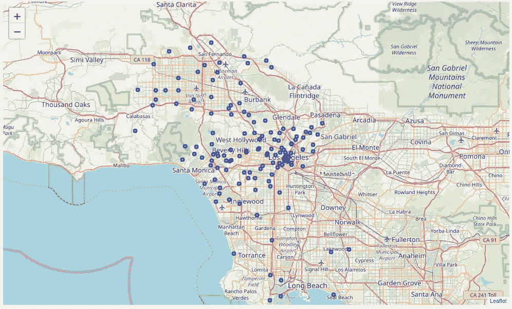

利用 Foursquare 位置数据获得所有邻居的附近地点，并将其加载到数据帧中。在一个比较受欢迎的街区开一家餐馆是有意义的，这样餐馆会吸引更多人的注意。因此，获得了具有 10 个或更多地点的所有邻近地区的列表。场馆数据框被更新为仅包括这些街区中的场馆

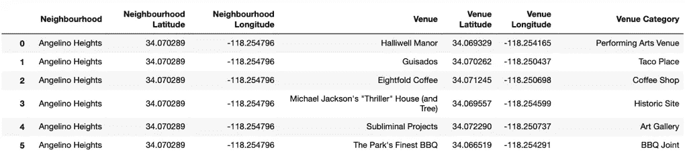

上述数据框中的行按邻域分组，取每个类别出现频率的平均值

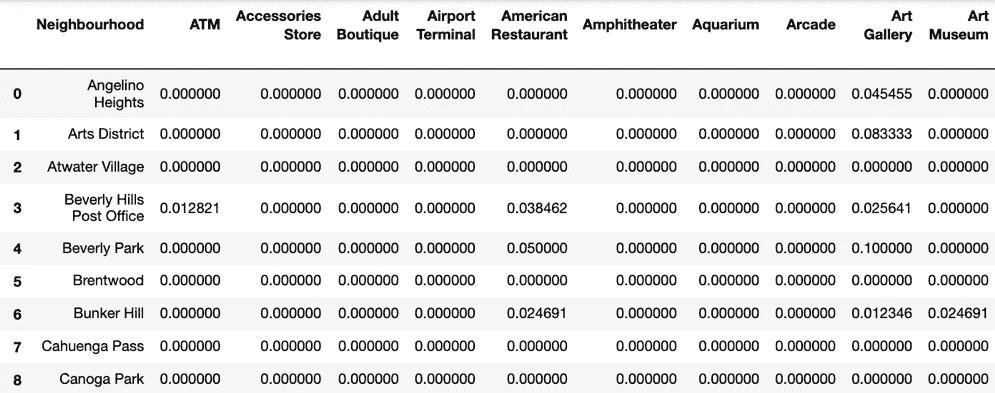

对邻域进行聚类的第一步是确定数据集的最佳 K 值。这是使用轮廓系数法进行的。然后发现，当聚类数为 4 时，轮廓系数最高。因此，应当使用 k-均值聚类将邻近区域分成 4 个聚类(k=4)。

创建一个新的数据框，该数据框包括该聚类以及每个邻域的前 10 个地点。由此产生的邻域聚类也在地图上可视化

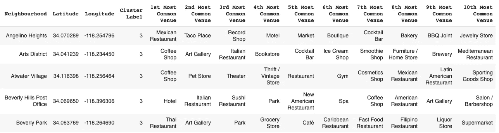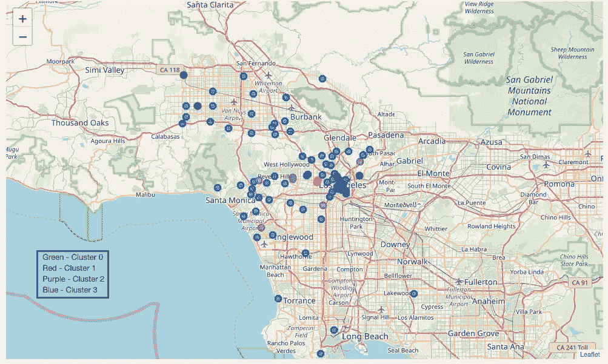

生成一个水平条形图，显示每个聚类中排名前 10 的场所，并突出显示食品场所:-

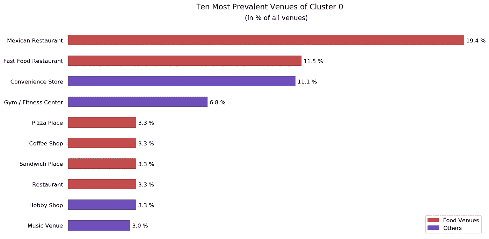

集群 0 的前 10 名中有 6 个美食场馆，墨西哥餐厅占所有场馆的近 20%。这些事实表明，就建立一家新餐馆而言，集群 0 不是最好的选择。

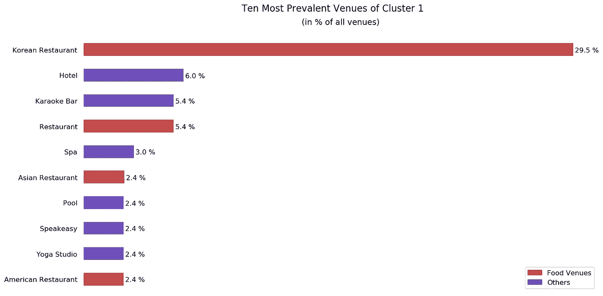

在第一组的前 10 名中，有 4 个美食场馆，其中韩国餐馆占了绝大多数(近 30%)。这并不奇怪，因为集群 1 只包括韩国城和另外一个街区。虽然前 10 名中只有 4 个美食场所，但韩国餐馆在该地区的完全主导地位表明，第 1 类社区的人们可能不会接受其他美食。因此，第一组不需要进一步研究。

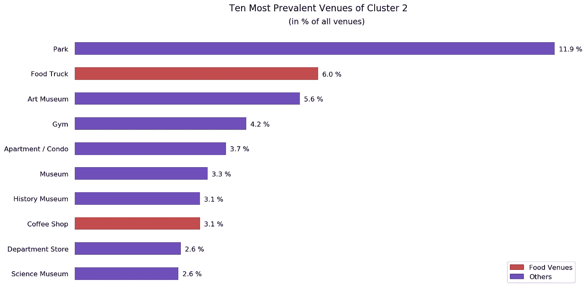

集群 2 的前 10 个场馆中只有 2 个美食场馆。除此之外，这两个地方是食品车和咖啡店，而不是真正的餐馆。该集群中有相当数量的公共场所，如公园、博物馆、健身房和百货商店等客流量大的场所。这份名单中出现的公寓区也表明这些街区每平方单位的人口很高。所有这些观察都指向第 2 组被指定为进一步探索的组。话虽如此，探索第二组的决定只能在研究第三组之后才能确定

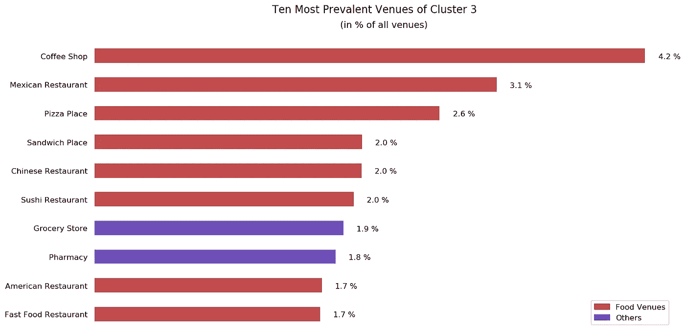

集群 3 的前 10 个场馆中有 8 个美食场馆，这是一个巨大的百分比。除了最常见的场地(咖啡店)，其他的美食场地都是正规的餐厅。这表明聚类 3 中的邻近区域已经被餐馆饱和，并且在开新餐馆时不需要考虑。现在可以安全地确认进一步调查**群集 2** 并排除所有其他群集的决定。

下面显示了聚类 2 中每个街区最近的意大利餐馆，以及相应的距离(米):-

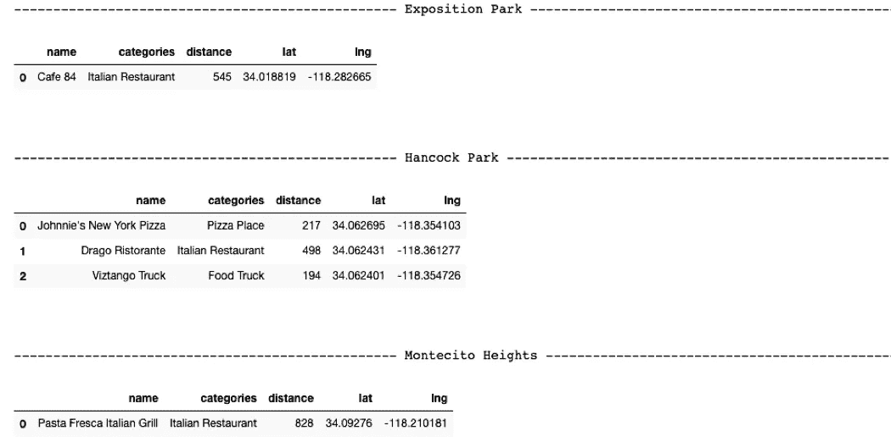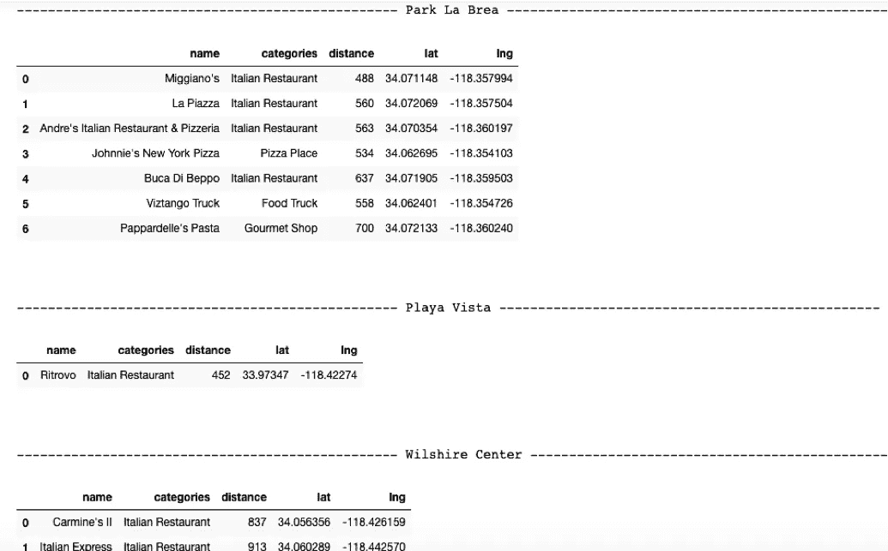

从上面的数据框中可以观察到，Park La Brea 在其中心 700 米范围内有 7 家意大利餐厅。汉考克公园(Hancock Park)较少(3 个)，但其中两个距离市中心不到 250 米。这表明拉布雷亚公园和汉考克公园不适合开设意大利餐馆，因此可以不予考虑。

计算每个剩余街区与 LA 中心的距离，并将其作为一列添加到现有数据框中

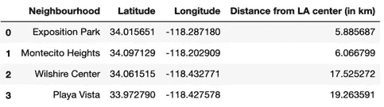

从上面的数据框中可以清楚地看出，博览园(~ 6 公里)和 Monte cito Heights(~ 6 公里)比威尔希尔中心(~ 17.5 公里)和 Playa Vista(~ 19 公里)更靠近洛杉矶市中心。由于离洛杉矶中心的距离是选择最佳社区的一个标准，威尔希尔中心和 Playa Vista 不是合适的选择。

在此之后，通过抓取相关网页获得洛杉矶所有街区的平均租金列表。从表中可以看出这两个街区及其平均租金

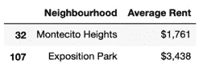

博览园的平均租金是蒙特西托高地平均租金的近两倍。这意味着博览园是一个明显更昂贵的社区。然而，这并不意味着 Montecito Heights 是更好的选择。要考虑的一个因素是股东有兴趣开设的餐厅类型。

举例来说，如果需要建立一家高端的高级餐厅，那么平均租金较低的街区就不适合。这样做的原因是，这样的社区通常是低收入人群的家园，这样的餐馆可能不会吸引大量的人。

另一方面，如果需要建立一个快速休闲/休闲餐厅，高租金的街区将不是理想的，因为餐厅将负担不起租用的空间。

## 结论

分析将竞争者的数量减少到了两个街区——博览园和 T2 的蒙特西托高地。平均邻里租金数据被调用，虽然它提供了有趣的见解，但它不能仅用手头的信息来影响决策。

分析结果强调了仅根据地理位置和与竞争对手的接近程度就可能开设意大利餐厅的潜在社区。这只是整个调查的一个起点，因为还有很多其他因素——商业空间的可用性、每个位置的吸引力、靠近主要道路、通过公共交通到达等。影响这样一个决定。

就个人而言，我不介意选择博览园，因为它离南加州大学不远。我相信有很多像我一样饥饿的特洛伊人会张开双臂欢迎一家新的意大利餐馆！

> 这篇文章是 Coursera 申请 IBM 数据科学专业证书的应用数据科学顶石的一部分。
> 
> 你可以在这里找到我的顶点项目[的 Github 库。](https://github.com/IshaanVasant/Data_Science_Capstone)