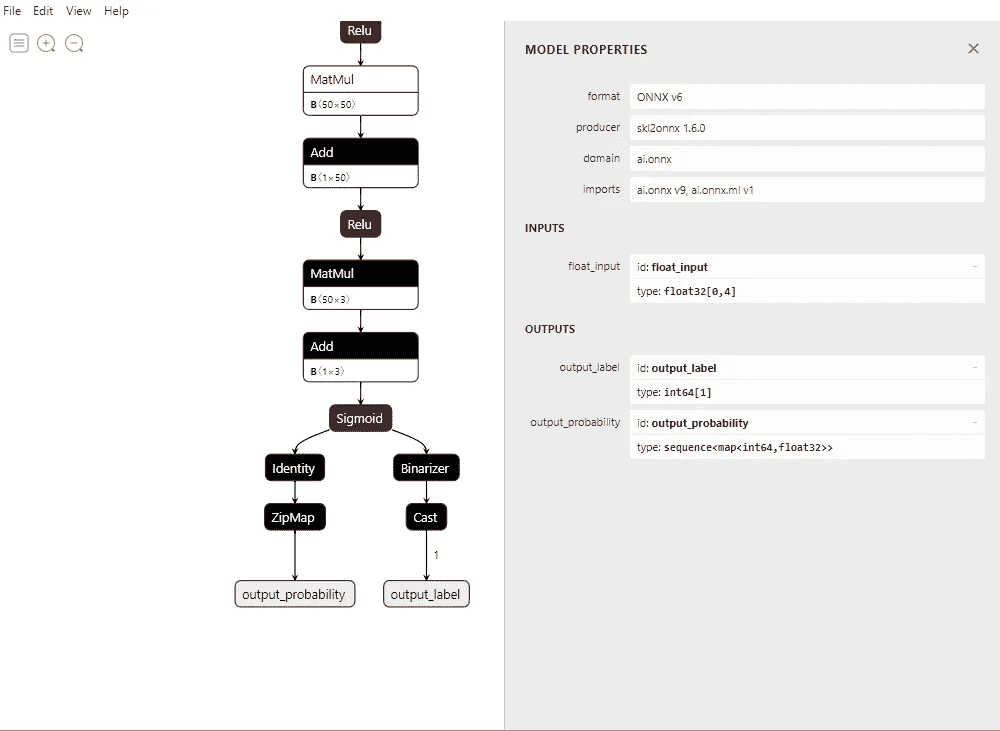

# 在 Movidius / Myriad 计算机棒上运行我的定制网络的战斗

> 原文：<https://medium.com/analytics-vidhya/the-battle-to-run-my-custom-network-on-a-movidius-myriad-compute-stick-c7c01fb64126?source=collection_archive---------12----------------------->


在 [Unsplash](https://unsplash.com?utm_source=medium&utm_medium=referral) 上由[路易斯·里德](https://unsplash.com/@_louisreed?utm_source=medium&utm_medium=referral)拍摄的照片

# 英特尔移动

[英特尔 Movidius 神经计算棒 2](https://software.intel.com/en-us/neural-compute-stick) 吸引了我的注意，因为它是一种廉价且看似简单的可能性，可以在边缘设备上运行神经网络并进行一些严肃的人工智能推理(例如树莓 Pi)。它的价格大约是 70€，非常实惠。在我的大学里，越来越多的科研人员身边都有一个——不知道该拿它怎么办。由于我的部门并不真正做视觉或 NLP，我们不想从模型动物园移植一个标准模型，而是在 Movidius 上运行我们自己的网络。所以我开始思考如何做到这一点——结果并不那么简单。为了让其他人更容易理解，我决定写这篇博文。希望有帮助！从 Scikit-Learn、Pytorch 和 Keras 转换简单 NN 的示例代码可在我的 [github](https://github.com/Elli1993/custom_net_on_movidius) 上获得。

# 构建和训练您的模型

我们希望我们的模型训练方法尽可能通用。在尝试使用类似于 [Oviyum](/@oviyum/how-to-port-a-custom-tensorflow-model-to-movidius-ncs-6c2d2ba75977) 的 NCSDK 直接从 Tensorflow 2.0 移植模型时，我感到有些绝望，之后我发现了一种使用 [ONNX](https://onnx.ai/index.html) 格式的相当简单的传输方式。使用它，我们可以在 PyTorch、Tensorflow、Keras 甚至 SciKit Learn 中构建和训练我们的网络——以及任何能够导出到 ONNX 的内容。在他们的主页上，他们提供了可能的框架和功能的概述。但并非所有功能都得到英特尔的支持，可以在[这里](https://docs.openvinotoolkit.org/latest/_docs_MO_DG_prepare_model_Supported_Frameworks_Layers.html)找到这些功能的列表。我计划在未来的某个时候拥有一个完整的转换器，但是到目前为止，你必须自己检查你的所有层/功能是否都被支持。

# 装置

首先，我们需要 [Openvino Toolkit](https://docs.openvinotoolkit.org/2019_R3.1/_docs_install_guides_installing_openvino_windows.html) 将我们的 ONNX 模型转换成称为中间表示(IR)的 Movidius 格式。我在我的 Windows 10 上运行了它，并使用我的 Anaconda Shell 测试了这些示例——不要忘记在每次打开一个新的 Shell 时运行 bash 脚本来首先设置环境变量！此外，你还需要 python(第 3 版——在 Windows 上运行时，我推荐使用 [Anaconda](https://docs.anaconda.com/anaconda/install/) )、一个你自己选择的 IDE(我更喜欢 [PyCharm](https://www.jetbrains.com/de-de/pycharm/) )和一些额外的包(最好安装在[虚拟环境](https://docs.conda.io/projects/conda/en/latest/user-guide/tasks/manage-environments.html))。你需要一个框架来创建你的模型(Pytorch，Keras 或者 SciKit Learn 或者其他什么)，ONNX 包，也许还有你的框架附带的转换器。例如，对于 Keras 转换，您需要运行:

```
conda install scikit-learn, keras, pandas
pip install keras2onnx
```

# 导出您的模型

训练完模型后，您必须将模型和权重导出为 ONNX 格式。真的很简单。对于您的 keras 模型，您只需:

```
import keras2onnx
import onnxonnx_model = keras2onnx.convert_keras(model, model.name)
onnx.save_model(onnx_model, 'keras_iris_model.onnx')
```

你可以在我的 [github](https://github.com/Elli1993/custom_net_on_movidius) 上从 keras、pytorch 和 sklearn 中找到将你的模型保存为 onnx 的代码示例。如果可能，尝试保存不带训练参数的模型。

现在让我们看看我们的模型，并检查我们保存了哪些参数。



使用 sklearn 创建的网络的一部分(使用 Netron 可视化)

要打开 onnx 文件，我推荐 Netron。它可以让你看到你所有的层，连接，甚至重量。漂亮！但是正如你所看到的，我们的网络不仅仅是明确定义的层。取决于你的框架，这个模型仍然有一些训练参数或者一些方便的解码参数，就像这个 sklearn 模型。例如，这里的 Zip-Map 将输出索引映射到一个具体的类名——这很好，但是对于 Openvino 模型转换来说是不可能的。

# 修剪您的模型

为了成功地使用 Openvino 转换你的模型，你(有时)需要修剪它。这意味着，您必须删除所有模型不需要的或者对 Openvino 转换不可用的内容。使用 python onnx 包，可以很容易地删除 ONNX 中调用的层或节点。

```
import onnx
onnx_model = onnx.load(model_path)
graph = onnx_model.graph
graph.node.remove(graph.node[9])
onnx.save(onnx_model, save_path)
```

我知道这不是干净的方法，但它仍然有效。这里的长期目标是一个图形修剪程序，删除所有对 Openvino 不可用的节点，如果模型不可转换，就会抛出一个错误。如果你有这样的事情，不要害羞，分享一下。在此之前，我们需要手动操作。

# 将您的模型转换为 Openvino IR 格式

既然我们已经有了“完美的”ONNX 模型，我们就可以按照“极其丰富的”[英特尔教程](https://docs.openvinotoolkit.org/latest/_docs_MO_DG_prepare_model_convert_model_Convert_Model_From_ONNX.html)来进行转换。—这不是很有帮助……所以还是按照这些说明去做吧:

1)以管理员身份打开一个 Shell(Anaconda)
2)激活 setupvars.bat
3)确保安装了正确的[先决条件](https://docs.openvinotoolkit.org/2019_R3.1/_docs_install_guides_installing_openvino_windows.html#set-the-environment-variables)
4)转到英特尔模型优化器目录(C:\ Program Files(x86)\ Intel swtools \ Open vino \ deployment _ tools \ model _ optimizer \)
5)运行提供输入形状和模型目录的 mo.py 脚本

```
python mo.py — input_model Path\to\your\model.onnx — input_shape [10,4] — log_level WARNING
```

6)查看成功信息并举行小型聚会
7)复制。xml 和。模型优化器给你的 bin 文件到你选择的目录

我花了一些时间才弄明白这一点，所以这里是我遇到的最常见和最神秘的错误:

-并非所有输出形状都是为节点“Add”推断或完全定义的。-->意味着您需要设置输入形状
-无法推断节点“ZipMap”的形状或值。
[错误 op = " ZipMap "的节点" ZipMap "没有注册的" infer "函数。请在扩展中实现此功能。- >这意味着您需要修剪您的模型，因为 ZipMap 函数对 Openvino 不可用
- PermissionError: [Errno 13]权限被拒绝:“Path”->您需要以管理员身份启动 shell

# 在 Movidius 上运行您的模型

在这里，我们可以再次依赖英特尔提供的精彩的[文档和用户指南](https://docs.openvinotoolkit.org/latest/_docs_IE_DG_inference_engine_intro.html)——不！

唯一对我有帮助的是看了下 C:\ Program Files(x86)\ Intel swtools \ open vino \ _ 2019 . 3 . 379 \ deployment \ _ tools \ inference \ _ engine \ samples \ python \ _ samples 下工具包附带的例子——尽管它们不包含太多注释。如果您想在您的 IDE 中运行代码，请确保在从同一个 shell 启动您的 IDE 之前激活 setupvars.bat(或任何其他方式进行设置)。为了运行我们的网络，我们需要导入两个类 IECore 和 IENetwork。我们加载我们的模型，定义输入和输出 blobs，加载棒上的网络，现在终于准备好推断一些东西了！在我的 [github](https://github.com/Elli1993/custom_net_on_movidius) 上还有一个更深入的代码。

```
from openvino.inference_engine import IECore, IENetwork
ie = IECore()
net = IENetwork(model=model_xml, weights=model_bin)
input_blob = next(iter(net.inputs))
out_blob = next(iter(net.outputs))
exec_net = ie.load_network(network=net, device_name=’MYRIAD’)
res = exec_net.infer(inputs={input_blob: X_test[:10,:]})
res = res[out_blob]
```

我希望这有助于您开始使用适用于定制型号的 Movidius 计算棒，并避免您对我遇到的英特尔文档感到恼怒和绝望。如果您有一些提示或改进，请随时分享！