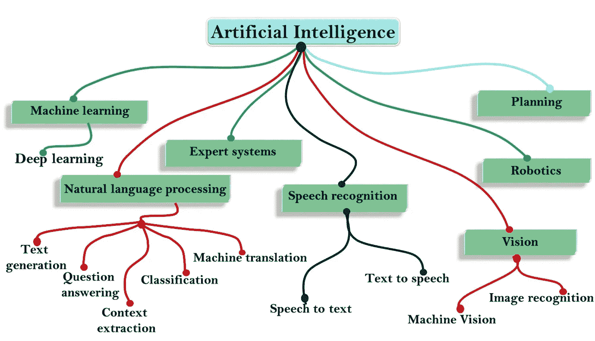
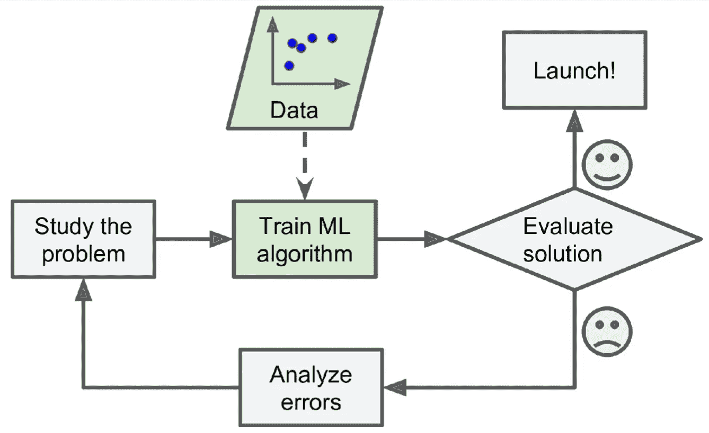
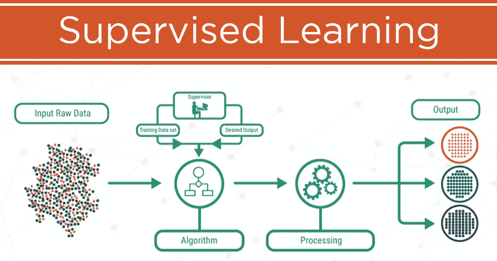
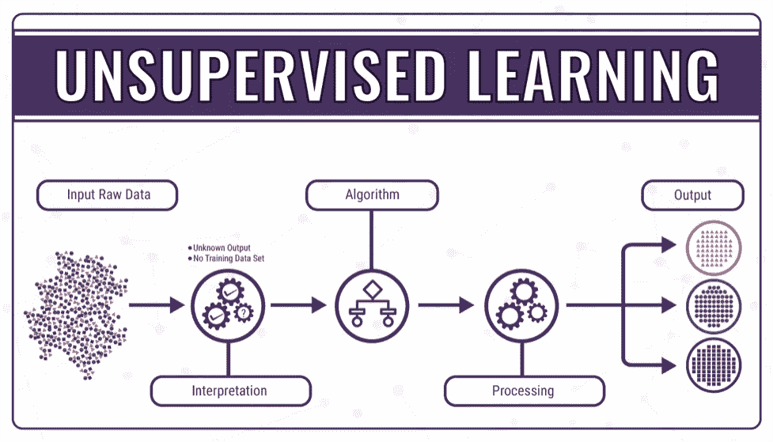
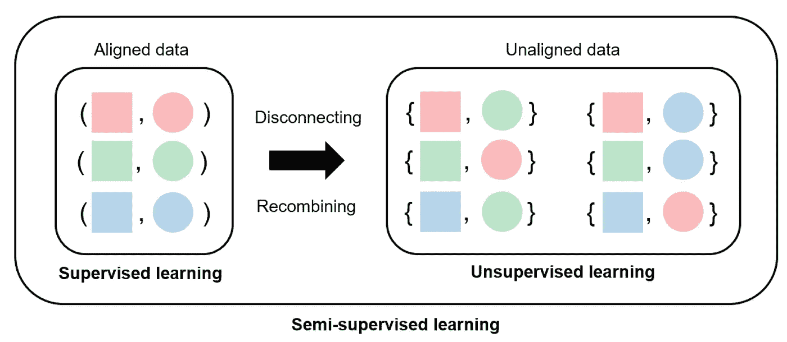
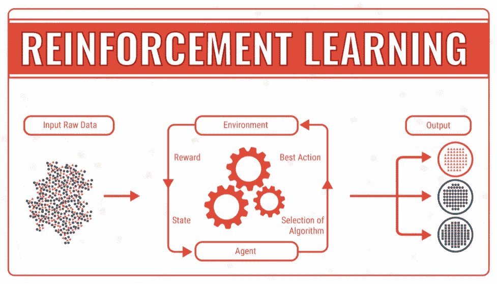

# 开始。机器学习简介

> 原文：<https://medium.com/analytics-vidhya/the-beginning-intro-to-machine-learning-66e041dc4934?source=collection_archive---------32----------------------->

人工智能的子科学

随着当今科技的发展，我们知道数据有多重要。我们知道一切都可能被互联网之类的东西所控制。但是你听说过什么是人工智能吗？有吗？很好！你能描述一下那是什么吗？如上图所示，我们知道人工智能有七个子科学，其中之一是“机器学习”。那是什么？

> 机器学习，以下称为“ML”，是一个无需显式编程即可赋予计算机学习能力的领域。机器学习使用统计学家的方法使计算机能够学习和识别数据的模式

那又怎样？机器学习有显著的好处吗？的确如此。它有很多好处，我们有时可能没有意识到。其中之一是电子邮件中的垃圾邮件过滤。在我们将一些电子邮件标记为垃圾邮件后，此功能才起作用。然后，计算机会学习它的习惯，并预测随后的电子邮件。如果计算机知道某些电子邮件包含垃圾邮件，它会将该电子邮件移至“垃圾邮件”类别。

如今，机器学习的实现越来越多，比如 Youtube 或 Google Assistant 的视频推荐。然而，机器学习是如何工作的？下图中，问题会按照流程图来回答。

机器学习的流程图

一般来说，机器学习根据其学习方法分为四类，分别是:

1.  监督学习

监督学习算法

在监督学习中，用作标签的数据集。标签是数据的标记或标识符。例如，果实具有绿色属性，重量超过 500 克，果皮坚硬，多刺，有刺激性气味，果肉甜。具有约定特征的水果被认定为榴莲，因此属性的标签为榴莲。上面的垃圾邮件分类是监督学习的一个例子。

2.无监督学习

无监督学习算法

在无监督学习中，使用的数据集没有标签。无监督模型进行自我学习以标记或分组数据。无监督案例的一个例子是，从一个网站的 100 名访问者的数据中，模型将自行学习对访问者进行分类。可能基于访问时间、访问时长、点击次数等等。此外，计算机将根据这些知识进行聚类。

3.半监督学习

半监督学习算法

半监督学习是监督学习和非监督学习的结合。在半监督模型中，用于训练的数据集部分已标记，部分未标记。我们经常使用的半监督模型的实现，例如在 Google Photos 上。在 Google 相册中，我们可以给照片中的每个人添加标签。因此，当我们上传一张有我们之前标记的人的脸的新照片时，Google 相册会自动识别该人。半监督模型的一个例子是深度信念网络(DBN)。(我们稍后再谈😊).

那么，以上 3 种算法有什么区别呢？下图将会回答你的问题。

4.强化学习

强化学习是一种学习使用奖励和惩罚系统的模式。学习的模式是不断获得奖励，避免惩罚。Alpha Go 是强化学习的一个著名例子。Alpha Go 是谷歌 DeepMind 开发的一个程序，用来玩起源于中国的棋盘游戏 Go。阿尔法围棋在数百万场围棋比赛中学习每一步，以继续获得赢得比赛的奖励。阿尔法围棋在成为第一个成功击败职业棋手的计算机程序后一举成名。

这部分到此为止。你有什么建议给我吗？请在下面留下您的评论，以便我可以阅读和注意:)

感谢大家，祝大家有美好的一天:)