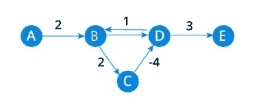
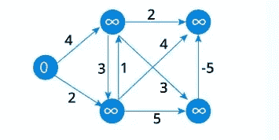
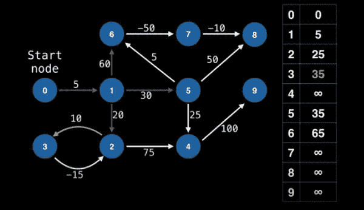
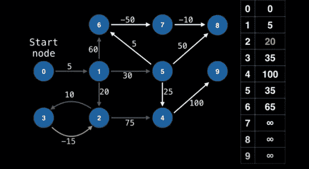
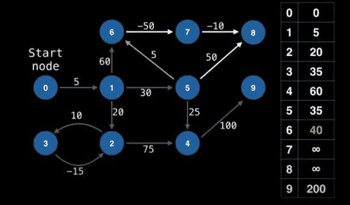

# 贝尔曼-福特算法

> 原文：<https://medium.com/analytics-vidhya/the-bellman-ford-algorithm-a0801afc333f?source=collection_archive---------9----------------------->

给你一个加权图。您知道源，需要通过最短路径到达所有其他顶点。你是怎么解决这个问题的？你选择 Dijkstra 的算法。但是如果包含了负权重呢？Dijkstra 不能解决这个问题。我们现在需要一个新的算法。

贝尔曼-福特算法是一种类似于 Dijkstra 的算法，即它在图中找到从单个源顶点到加权图中所有其他顶点的最短路径，但即使在存在负权重时它也能工作。

**灰暗的图表**

一个灰暗的图就是我所说的负权重的图。它实际上不叫这个，但是这个名字很合适，不是吗？负权重就像正权重一样，是边缘顶部的值。为什么有人会有负权重的图呢？因为它们并不像看起来那么没用。负权重可以解释很多现象，例如您的储蓄，其中正边缘可以代表花费的金钱，但负边缘将是您想要获取的边缘，因为它将代表获得的现金，或者热反应，其中每个正权重将代表热耗散，每个负权重将显示热吸收，并且必须计算发现最小能量的反应集。

但是那么悲观的部分呢？它来了。为**负周期**让路。这是需要小心的。循环是指第一个和最后一个顶点相同的路径，也就是说，它是一条封闭的路径。所以一个负循环就变成了一个加起来是负值的循环。最短路径算法不能检测到这种循环并给出不正确的结果。这是连贝尔曼·福特算法都无法战胜的。请看下面的插图，以获得更好的想法。



在此图中，顶点 B、C 和 D 形成一个循环，其中起始节点是 B，它也是结束节点。此外，这个循环也是一个负循环，因为总值总和为负值-1。

**算法**

关于这个算法要知道的第一点是，它不适用于像 Dijkstra 这样贪婪的算法。是的，他们相似但不相同，咄！采用动态规划方法来实现该程序。继续深入理解这个算法。

```
function bellmanFord(G, S)
	for each vertex V in G
			D[V] <- infinite

	D[S] <- 0
	for each vertex V in G				
		for each edge (U,V) in G
		  tempDistance <- D[U] + edge_weight(U,V)
			if tempDistance < D[V]
			   D[V] <- tempDistance 	for each edge (U,V) in G
		If D[U] + edge_weight(U, V) < D[V]
			Error: Negative Cycle Exists
                        return print D[]
```

暂时不要进入恐慌状态。我们会详细讨论。

先说定义，贝尔曼-福特算法的工作原理是首先**高估从起始顶点到所有其他顶点的路径长度**。然后，它通过寻找比先前高估的路径更短的新路径来迭代地放松那些估计。最后，它**检查负周期**

更简单地说，假设 V 是顶点的数量，E 是边的数量，S 是起始节点，D 是跟踪源节点和其余顶点之间的最佳距离的数组。好吗？

在高估步骤之后，我们将数组中的每个条目设置为+无穷大，类似于 Dijkstra。这是因为到每个节点的距离最初是未知的，所以我们分配可能的最高值。现在我们指定 D[S]=0 的原因很明显，因为从源到源的最小距离是，猜猜看？明明是 0。所以我们已经达到了如下所示的状态



```
for each vertex V in G
			D[V] <- infinite
			previous[V] <- NULL
	distance[S] <- 0
```

现在，无限的水平对我们来说太高了，压力正在增加。所以是时候重新开始了！在这一步，我们的目标是找到我们一直在寻找的东西，到每个顶点的最短路径。我们开始一个循环，对每条边运行 V 次，因为在最坏的情况下，一个顶点的路径长度可能需要调整 V 次。在循环中，对于每条边，我们从边开始的地方取顶点的值(D[U])并将其添加到边成本中。这个增加的值是它们与边结束的顶点的值(D[V])的比较。如果发现总和值更小，则结束顶点值(D[V])变得等于总和。

```
for each vertex V in G				
		for each edge (U,V) in G
		  tempDistance <- D[U] + edge_weight(U,V)
			if tempDistance < D[V]
			   D[V] <- tempDistance 
```

举个例子，我们将通过几个步骤来理解其功能。



在此图中，0 被视为源顶点。从循环开始，我们取的第一条边是 0 →1，之后 1 被赋值为 5。接下来，取边 1→2、1 →5 和 1 →6，由此，6 的值变为(5+60，即源顶点 1 的成本加到边的成本，60)= 65，2 变为(5+20)= 25，5 变为(5+30)= 35。同样，3 的值变成 35。



在确定了 3 的成本之后，我们取下一个边，它们是 3 →2 和 2→4。**这使得 2 的值为(35 -15)=20** ，4 的值为 100。20 是从先前的 25 降低的值。



继续循环，边 4 →9 使 9 的值为 200。**现在另一个优化点需要仔细注意。**我们取边 5→6，使得 6 的值(35+5)=40。类似地，取边 5→4 合计 4 到 60 的值。这些值比以前的值更少或更多。

这就是放松的步骤是如何工作的

移动到第三步也是最后一步，发现我们的敌人，**消极循环。**现在，为什么我们的算法在负周期面前会失败？这是因为贝尔曼福特放松所有的优势。它会找到全局最优解，因此如果出现负循环，该算法将无限期地继续下去。它总会不断寻找一个更优化的，也就是比以前更负的值。所以有必要确定这些周期。但是怎么做呢？

我们再次运行相同的循环，获得边缘并放松它们。因为我们已经达到了一个优化值，所以如果我们可以再次放松一个边缘，这意味着我们遇到了一个负面的循环。一旦发生这种情况，IF 条件变为真，执行 return 语句，结束函数，否则打印数组 D。

```
for each edge (U,V) in G
		If D[U] + edge_weight(U, V) < D[V]
			Error: Negative Cycle Exists
                        returnprint D[]
```

我们现在已经成功地完成了贝尔曼-福特算法。耶！

**比较吉克斯特拉和贝尔曼-福特**

我们已经讨论了以下主要差异

*   两者都是最短路径算法，但是吉克斯特拉降低了武器对抗负权重，而贝尔曼-福特赢得了战争。
*   吉克斯特拉使用贪婪的方法，而贝尔曼-福特使用动态规划。

到目前为止我们还没有触及的区别是

*   吉克斯特拉速度很快。贝尔曼·福特的时间复杂度高于吉克斯特拉。但是，如果最佳时间不是最高优先级，那么毫无疑问贝尔曼福特是一个更好的最短路径算法。

这就完成了我们的贝尔曼-福特算法之旅。我相信理查德·贝尔曼和小莱斯特·福特会为你感到骄傲的，他们会在坟墓里微笑着睡觉。(是的，我在那里偷偷放了一点历史事实！).

我希望你们喜欢这个博客。一定要留下一些反馈，我真的很期待。尽情享受吧！