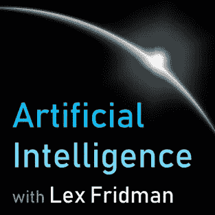

# 最佳 10 个人工智能播客(2020 人工智能)

> 原文：<https://medium.com/analytics-vidhya/the-best-10-artificial-intelligence-podcasts-2020-a-i-5b7e39502ab2?source=collection_archive---------14----------------------->

在一个完全数字化的时代，播客是当今不可忽视的新信息来源之一，以便了解更多的主题和发现新的激情。对于人工智能爱好者，我总结了现有的最好的英语播客。

# Lex fridman 的《人工智能》

莱克斯·弗里德曼的《人工智能》