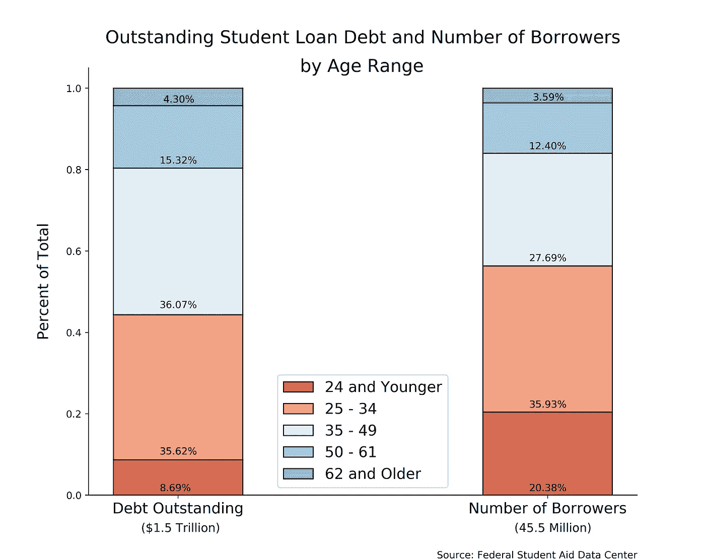

# 有效可视化创建(MVP)的最佳技巧

> 原文：<https://medium.com/analytics-vidhya/the-best-tip-for-effective-visualization-creation-mvp-72ea81f896b2?source=collection_archive---------17----------------------->

作为数据科学家，我们充当翻译，将大量非结构化数据转化为定性的可操作项目。然而，大多数人不想阅读您的 Python 代码，或者可以通过浏览列和行轻松获得洞察力。分享你的结果的一个好方法是创建一个容易跟随和清楚标记的可视化。

# 渐增性开发

我学到的一个创建有效可视化的实用技巧，尤其是在时间紧迫的情况下，就是梦想要远大，但要从小处着手，涵盖所有基础。然后根据重要性顺序不断提高你的视觉效果。这样，你总是有一个“工作”成品。这通常被称为[最小可行产品](https://www.google.com/search?q=minimum+viable+product&oq=minimum+viable+product&aqs=chrome..69i57j0l6j69i61.2178j0j7&sourceid=chrome&ie=UTF-8)。

几年前，Henrik Kniberg 画了这幅图来描述敏捷开发中的误解。

通知下的“像这样！”标题，在第一次迭代中，一个工作产品被呈现出来，它将把客户从 A 点带到 b 点。他们并不是 100%满意，但是开发人员从每次迭代中获得的是有用的反馈以进行改进。在“不是这样的…”标题下，客户首先会收到一个车轮，他们自己根本无法使用它。一旦汽车最终生产出来，你可以肯定它可能充满了缺陷或错误，因为汽车还没有经过充分的测试。

# 例子

在收集和分析了美国学生贷款债务的数据后，我想创建一个图表，显示基于年龄的借款人总数与他们所欠债务额之间的关系。在我开车之前，看一下我的一些迭代。

我的滑板在这里有我想在一个颜色分离，堆叠条形图传达的所有信息。我的头衔和斧头都有标签，我有一个传说。了解正在发生的事情容易吗？

在我的中间迭代中，我尝试了不同的图表样式元素，比如大小和颜色。

最后是我的车！你看，我仍然在传达我想让我的读者理解的所有细节。然而，我的图表在没有通用颜色或单调色标的情况下更具视觉吸引力；更容易看出一个年龄范围的界限。我改变了坐标轴的标签和标题，以便读者更好地理解他们在看什么。我增加了图例的大小，在条形上添加了边缘线，用相应的百分比标记了每个条形的子部分，增加了图形大小以拉伸 y 轴，并将顶部和右侧脊线的可见性设置为 false。我对我的滑板很满意，但我爱我的车。