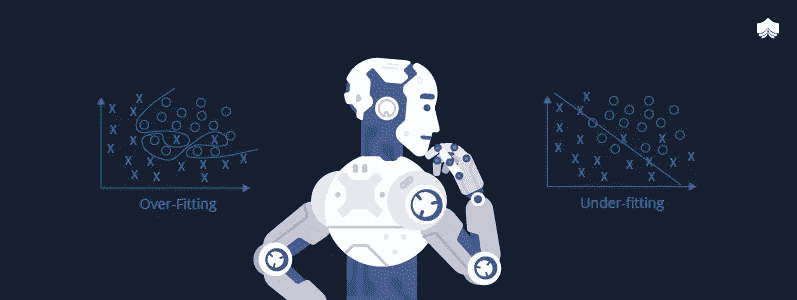

# 偏差-方差权衡

> 原文：<https://medium.com/analytics-vidhya/the-bias-variance-trade-off-ee613811ba72?source=collection_archive---------3----------------------->

机器学习模型的最终目标是对新的未知数据做出可靠的预测。考虑到这个目的，我们希望我们的算法捕捉现有数据中的关系，并在新条目中复制它们。同时，我们不希望我们的算法因为它训练的数据而产生偏见。

在第一种情况下，我们试图减少我们的模型的偏差，这是…