# 年度最大的体育赛事:超级碗历史分析

> 原文：<https://medium.com/analytics-vidhya/the-biggest-sports-event-of-the-year-a-superbowl-history-analysis-1dc13e4be78?source=collection_archive---------29----------------------->

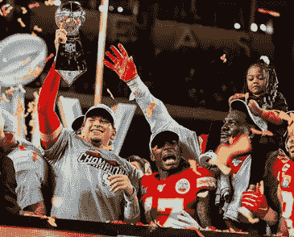

堪萨斯城酋长队，第 54 届超级碗冠军

超级碗是美国国家橄榄球联盟(NFL)冠军赛的通俗名称。这是一年一度世界上最受关注的单日体育赛事。不像其他职业体育联盟在一系列比赛中决定他们的冠军(通常是 7 胜制)，NFL 通过一场比赛决定冠军，所以有一种紧迫感，通常是尽可能激动人心的。除此之外，还有场外的东西:像苹果、索尼、可口可乐和其他公司为几秒钟的广告支付数百万美元，一些世界上最畅销的音乐家每年都在半场秀上表演，等等。

在本文中，我们将分析与这一重大事件相关的一些统计数据。一些基本的问题，比如谁赢得了最多的冠军？哪个州举办了最多的比赛？还有:就胜率而言，奥运会是不是一年比一年更接近了？最有可能获得 SB MVP 的职位是什么？让我们开始吧！

数据集以及完整的笔记本和 R 代码可在此处获得:

[https://www . ka ggle . com/rafabelokurows/the-biggest-sports-event-a-Superbowl-analysis](https://www.kaggle.com/rafabelokurows/the-biggest-sports-event-a-superbowl-analysis)

使用的数据集非常简单，它有基本信息，如年份，谁赢了，谁输了，每次得分多少，等等。

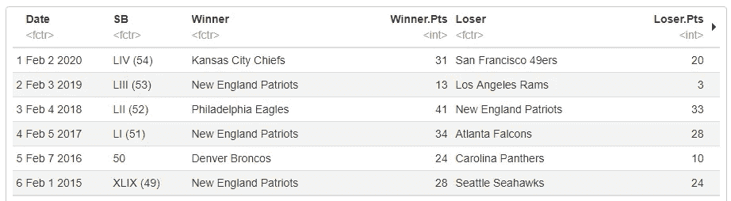

需要注意一些事情:

*   没有丢失的值，这很好。
*   初始日期格式不太容易处理，所以我们要转换它

完成了这些之后，你可以在完整的笔记本中详细检查，让我们深入数据，首先检查一些关于 MVP 的事情。

# 最有价值球员

首先，我们画出了获得 MVP 最多的球员，也就是说，因为它分布在许多获得 MVP 的球员中，我们关注的是获得不止一个 MVP 的球员。

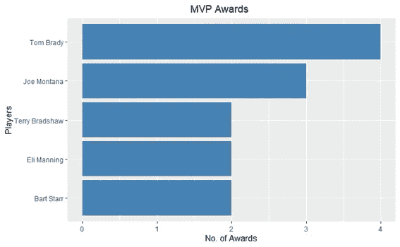

**得 4 分的汤姆·布拉迪**和**得 3 分的乔·蒙塔纳**迅速脱颖而出，他们出现在关于谁是有史以来最伟大的球员的每一次谈话中，这绝非巧合。无论对话倾向于哪种方式，在最大的舞台上尽最大努力应该是决定性因素之一。

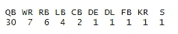

我们还看到，54 个 SB MVP 奖项中有 30 个颁给了 QB 。我想，这个职位如此重要，不应该如此令人惊讶。此外，一名 FB 和一名 KR 获得了该奖项。让我们稍后再来研究这个问题。

在桌子上看到一个后卫看起来很奇怪，所以我必须仔细检查，因为在今天的比赛中一个后卫是如此罕见。但是我们能一眼看出两件事:1。这是 70 年代，游戏是非常不同的，当时和 2。是拉里·孔卡，一个经常持球的家伙。

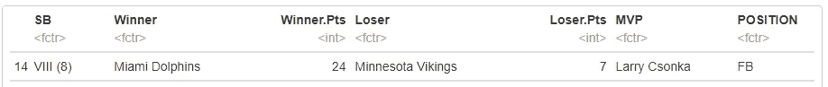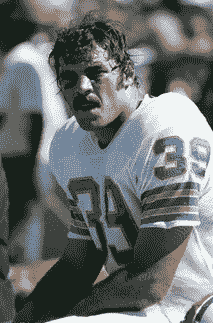

拉里·孔卡，SB 8 的最有价值球员

他有 145 个冲码和 2 个冲分，所以尽管他被列为一个飞人，但在今天的比赛中，他会是一个“普通”的 RB。你把他的表演和他的胡子结合起来，你怎么能不给这个家伙 MVP 呢，对吗？

我还想看看 MVP 的另一个奇怪的部分，一个回踢手被授予 MVP。

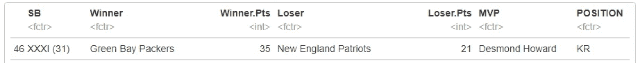

是的，是包装工队的 WR·德斯蒙德·霍华德，他实际上回踢了一个触地得分，锁定了比赛，但没有其他影响，0 码 0 次接球。

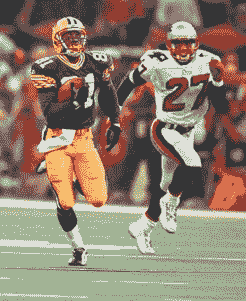

德斯蒙德·霍华德，SB 31 的最有价值球员

由此，我们可以看到有两种基本的(如果你可以称之为)方法可以被选为 SB MVP:在整场比赛中发挥作用，或者在最重要的时候做出决定性和有影响力的比赛。

# 胜利的边缘:奥运会临近了吗？

大多数超级碗非常接近，正如你所期望的那样，这是全国最好的两支球队之间的比赛。最接近的比赛是 1991 年的超级碗，巨人队仅以一分之差击败比尔队。另一方面，在那之前一年，49 人队以 45%的优势击败了野马队。

平均胜率是 14 ，相当大，但是一直都是这样吗？

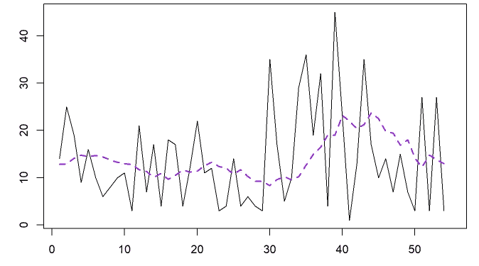

在这里，我们绘制了每场比赛(Y 轴)相对于 SB (X 轴)的胜利差额，我们可以看到，在 SB 30 之前，比赛确实很接近，然后我们在 2000-2005 年有几次爆发，增加了平均水平，但**趋势似乎正在下降，回到平均水平 14。**

我们还必须考虑到 NFL 球队现在得分更多，尤其是规则鼓励更多的进攻。

# 哪个州举办了最多的超级碗

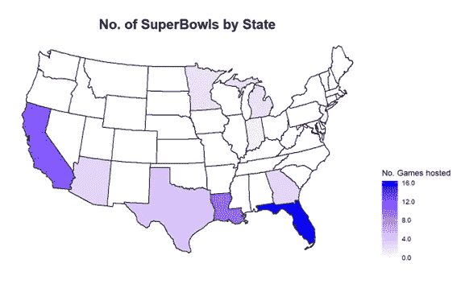

出于后勤原因，天气较暖的州似乎是普遍的选择。举办超级碗最多的州是佛罗里达州(16 次)、加利福尼亚州(12 次)、路易斯安那州(10 次)和得克萨斯州(4 次)。

# 超级碗输赢:谁赢的最多，谁输的最少

最后，所有 32 个 NFL 特许经营权和球迷的最重要的数字。哪个队赢得了最多的超级碗？

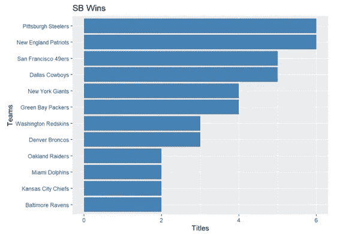

**新英格兰爱国者**和**匹兹堡钢人**以 6 个 SB 头衔占据第一。49 人队和牛仔队在过去 20 年左右的时间里没有赢得过冠军，现在落后了 5 分。

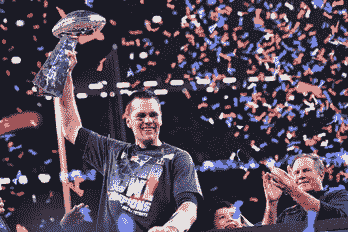

汤姆·布拉迪举起 6 座奖杯中的一座

至于损失最多的球队，再次是**爱国者**，以及**丹佛野马**是损失 SBs 最多的球队，有 5 个。

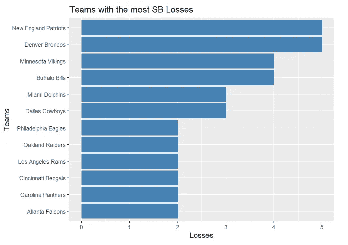

这种分析的一个悲哀之处是水牛比尔队在 90 年代连续四次进入超级碗，但四次都输了。但那是以后的事了。

# 外卖食品

尽管该数据集中可用的数据有点有限，但从该分析中可以得出许多有趣的事实:

*   爱国者队和钢人队是赢得 SB 最多的球队(6)
*   爱国者队和野马队是 SB (5)中输球最多的球队
*   举办 SBs 最多的州是:佛罗里达州(16)，加利福尼亚州(13)——天气温暖
*   QB 是产生最多 SB MVPs 的位置——这并不奇怪
*   在过去的几年中，胜利的差距在缩小，失败的队伍使得比赛比 10 年前更加激烈

我希望你喜欢这个分析。这很有趣也很有挑战性，因为这是我在 r 的第一个笔记本。