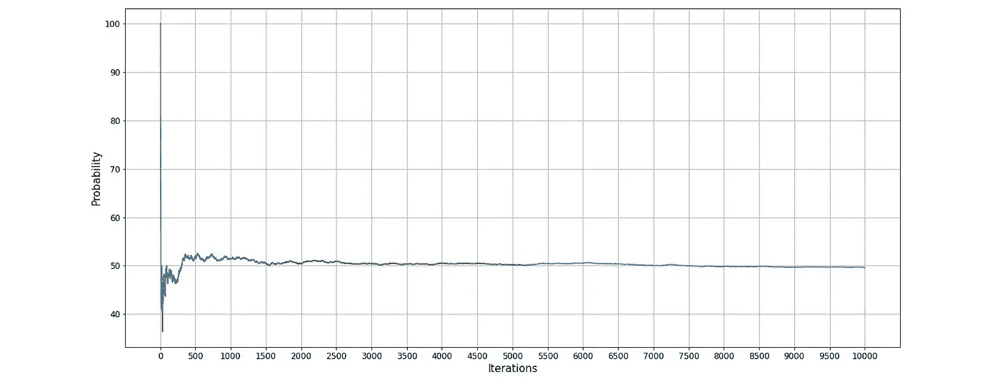

# 生日问题

> 原文：<https://medium.com/analytics-vidhya/the-birthday-problem-577a333e7494?source=collection_archive---------17----------------------->

一个简单但令人困惑的数学问题


让我以问一个问题开始这篇文章。假设有一个 23 人的小组。群里至少有两个人同一天生日的概率是多少(只有年月日，没有年份)？我们大多数人认为至少两个人在一个小组里过同一天生日的可能性非常小，因为一年有 365 天，而小组里只有 23 个人。但是如果我(抱歉不是我，数学)告诉你，23 个人中有两个人同一天生日的可能性是 50%左右。

简单来说，假设有 100 组，每组有 23 个随机选择的人。那么在这 100 个组中，大约 50 个组至少有两个人同一天生日。奇怪的是，如果在一个给定的环境中有 60 个人，那么这个概率增加到 99%。这似乎不现实，因为在一个有 365 天的系统中，在给定的情况下，与进入我们生活的任何 22 个人中的任何一个人同一天生日的概率应该非常低，但仍然相当高，约为 50%。这是**的生日问题**。我会用数学来解释这个问题，但最好也是最简单的方法是通过**模拟**实验来说服自己这是真的。

# 模拟

模拟是对计算机或模型进行编程，使其表现得就像真实发生的事情一样。模拟比实际操作要容易得多。我用 python 语言模拟过生日问题。我创建了一个名为 **prob_of_same_birthday 的函数。**它以组大小作为参数。假设是 **N** 。因此，对于这 N 个人，我随机分配了生日，并检查是否有一对两个人同一天生日。同样的事情我做了 10，000 次(为什么这么多次，我将在本文的后面部分解释)。因此，该函数返回至少有两个人同一天生日的组的总数。用这个数除以 10，000，我找到了一组 N 个人中至少两个人同一天生日的概率。

现在，我对 1 到 365 的群体做了同样的事情。因为如果组大小大于 365，那么组中至少两个人同一天生日的概率是 100%，因为一年有 365 天。

# 结果

然后我从上面的代码中画出了两个变量:- X 和 y，这是我们模拟的结果。


这里，X 轴表示组大小，Y 轴表示概率。这里我们可以看到，对于 23 人的小组，概率略高于 50%，对于 60 人的小组，概率约为 99%。所以，从这个模拟中，我们可以说生日问题是真的存在的。

# 大数定律

现在，让我们讨论一下，为什么我为每个组的大小选择了 10，000 个试验(或组)。这是因为“[大数定律](https://en.wikipedia.org/wiki/Law_of_large_numbers) s”。根据法律…

> **从大量试验中获得的结果的平均值应该接近预期值，并且随着更多试验的进行，该平均值会变得更接近。**



以上两个图完全相同，唯一的区别是，一个有一个常规规模的 x 轴，而另一个有一个对数规模的 x 轴。在这些图中，我们可以看到，在前 1000 次迭代中，概率会随着每次迭代而发生很大变化。所以，更少的试验会导致错误的结果。而且随着迭代次数的增加，概率越来越接近期望概率。这就是为什么我选择了高数量的试验(10，000)。现在，我们知道了这个难题，但我们仍然不知道为什么会发生这种情况。让我们来看看。

# 说明

假设，我们有一组 **N** 人。我们想找出 N 个人中至少有两个人同一天生日的概率。


所以，现在我们想找出一组 N 个人中没有人同一天生日的概率。

*   第一个人可以在任何一天出生。所以，我们就给他 **365/365** 的概率。
*   下一个人现在有 364 个可能的日子。所以，我们就给他 **364/365** 的概率。
*   第三个人现在有 363 个可能的日子。所以，我们给他的概率是 **363/365** 。

所以，对于一组 N 个人来说，没有人同一天生日的概率是…


所以，至少两个人同一天生日的概率是…


试着放 N = 23，答案会是 0.5073%。

现在，对于 1 到 365 的组，我们将找到概率并绘制图表。


我们可以看到，根据公式绘制的图形与根据模拟结果绘制的图形相同。所以，我们可以说这个难题在模拟和纸上(理论上)有相同的结果。

# 现实生活中的例子

我们在模拟和理论上看到了这个难题。但问题是，我们在现实生活中哪里可以看到生日问题。答案很简单，无处不在！


让我们以足球为例。在国际足联世界杯上，每个队总共有 23 名球员。而我们知道，一个 23 人的群体中，至少有两个人同一天生日的概率是 50.73%。2018 年国际足联世界杯有 32 支球队。所以至少 16 支球队应该至少有两名球员同一天生日。现在，让我们来看看详细的研究。我已经使用这个[数据集](https://pastebin.com/djNgEsrm)进行了分析。


```
Names of players who shared same birthday in FIFA 2018, team-wise.**1- Russia** -> Aleksei Miranchuk & Anton Miranchuk
**2- Iran** -> Saman Ghoddos & Pejman Montazeri
**3- Morocco** -> Yassine Bounou & Ahmed Reda Tagnaouti, Younès Belhanda & Nabil Dirar
**4- Portugal** -> Manuel Fernandes & Cristiano Ronaldo, Raphaël Guerreiro & José Fonte, João Moutinho & Bruno Fernandes
**5- Spain** -> Koke & David Silva
**6- Australia** -> Aziz Behich & Tom Rogic
**7- France** -> Benjamin Pavard & Steve Mandanda
**8- Peru** -> Jefferson Farfán & Nilson Loyola
**9- Crotia** -> Mateo Kovačić & Marko Pjaca
**10 - Nigeria** -> Wilfred Ndidi & Tyronne Ebuehi
**11- Brazil** -> Alisson Becker & Roberto Firmino, Filipe Luís & Willian
**12- Costa Rica** -> Bryan Oviedo & David Guzmán
**13- Germany** -> Niklas Süle & Jérôme Boateng
**14- South Korea** -> Koo Ja-cheol & Kim Young-gwon
**15- England** -> Kyle Walker & John Stones
**16- Poland** -> Wojciech Szczęsny & Łukasz Fabiański, Michał Pazdan & Jacek Góralski, Grzegorz Krychowiak & Rafał Kurzawa, Łukasz Teodorczyk & Łukasz Piszczek
```

如你所见，正好有 16 支球队(50%)至少有 2 名球员同一天生日。你想，这是 FIFA 2018 的巧合吗。所以，我们来看看国际足联 2010 年和 2014 年的数据。


所以，这不是巧合。正常情况下，人类大脑在指数思维方面有困难，生日问题靠直觉解决。我希望你喜欢这篇文章。请和我分享你的想法！

模拟程序链接:-[https://github . com/niravpansuriya/the _ birthday _ problem _ simulation](https://github.com/niravpansuriya/the_birthday_problem_simulation)