# 通过现代 JavaScript 和 HTML 构建的“书板球”游戏

> 原文：<https://medium.com/analytics-vidhya/the-book-cricket-game-built-via-modern-javascript-html-b52b7eaee2e8?source=collection_archive---------13----------------------->

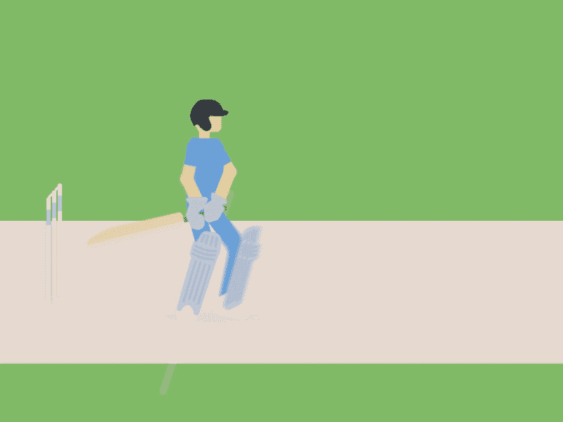

> 嗨，我又回来了，带来了另一个基于现代 JavaScript 和一点 HTML 的“媒体”技术故事。

我们将制作一款名为“书板球”的游戏，这是我上学时经常玩的游戏。对于那些不了解这款游戏的人，我给大家简单介绍一下。

“Book Cricket”在两名玩家之间进行&因为名字“Cricket”的后半部分暗示跑得多的玩家赢得比赛。

# 我们在“学生时代”是如何玩耍的？

1.  我们过去常常选择“书”(越厚越好！)&每个球员的“三柱门总数”。
2.  每个玩家在轮到他/她的时候都会把书翻到一个“随机页码”。
3.  然后我们习惯记下那个“随机选择的页码”的最后一个数字。例如，如果我将书随机翻到第 102 页，那么我在这一特定回合的得分将被计算为“2 分”。
4.  记下得分后，书被“合上”并再次“打开”到一个“随机页码”并遵循步骤“2 和 3”。
5.  如果玩家得到一个“页码”，其最后一个数字为“0”(例如 120 或 40)，那么玩家将失去一个小门。
6.  在每一回合中，得分都被“添加”到玩家在他/她“先前”回合中的得分上。这种情况一直持续到玩家失去他/她的所有“三柱门”或该玩家得分的“跑垒得分”超过其他玩家得分的跑垒得分。
7.  “唯一的目的”是在失去所有“三柱门”之前，通过比对手得分“更多”来“赢得”游戏。

我知道，对一些人来说这听起来很熟悉&对一些人来说有点困惑。但我们应该着眼于“大局”,这是构建这个游戏的逻辑代码。

# 所以现在让我们从编码部分开始吧！！

我们将把游戏分为两部分:

FHTML 的第一部分，

我们将使用基本的 HTML 组件构建游戏的“用户界面”,例如:

*   标题的“H2”和“标签”标签
*   2 个“输入”字段，用于输入有关“书籍尺寸”和“总边门”的信息。
*   3 个“按钮”标签，用于事件处理程序的“玩家 1”、“玩家 2”和“新匹配”。

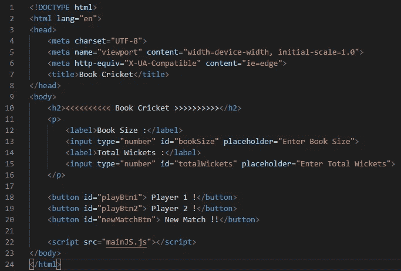

index.html

一个简单而冷静的游戏用户界面(我们优先考虑的是它的功能)

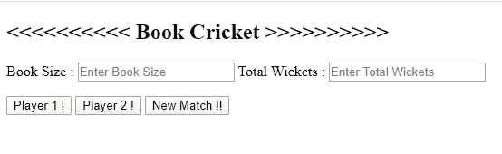

输出:index.html

JavaScript 的第二部分，

我们将根据子部分的功能分别对“mainJS.js”进行编码:

*   在**的第一个**子部分，我们将初始化我们的“全局变量”。

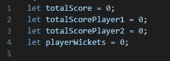

全局变量初始化

*   在**第二个**子部分中，定义了 playerWin()函数，该函数将比较两个玩家的最终得分，以决定获胜者。

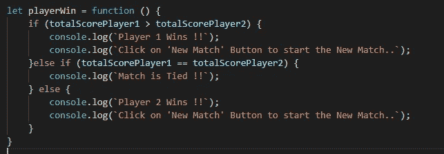

playerWin()函数

*   在第三个子部分中，我们将为链接到“玩家 1”的按钮定义一个“事件监听器”。这个“事件监听器”将触发两个函数。第一个函数是“calPlayerScore()”，它将使用 JavaScript 的“数学函数”计算玩家每回合的得分。第二个函数是' playerTurn1()'，它将跟踪得分和为' Player 1 '留下的三柱门。

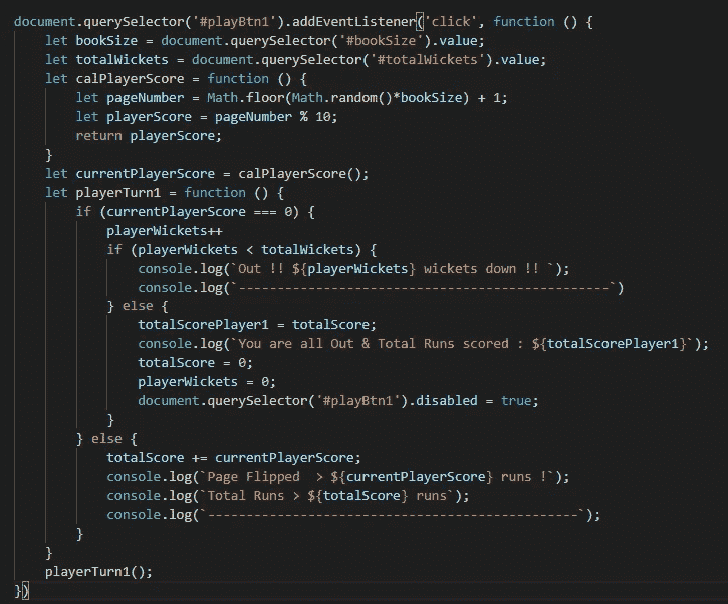

“玩家 1”按钮的事件监听器

*   在**的第四个**子部件中，我们将为链接到“玩家 2”的按钮定义一个“事件监听器”。这个“事件监听器”将触发两个函数。第一个函数是“calPlayerScore()”，它将使用 JavaScript 的“数学函数”计算玩家每回合的得分。第二个功能是“playerTurn2()”，它将跟踪得分和为“玩家 2”留下的三柱门。

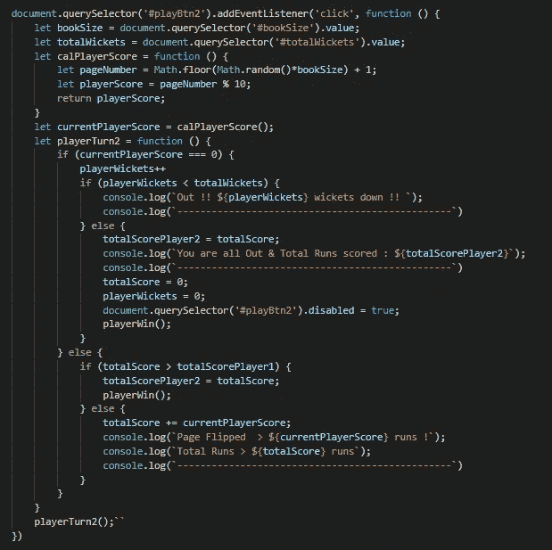

“玩家 2”按钮的事件监听器

*   在**的第五个**子部分，我们将为“新匹配”按钮定义一个“事件监听器”。这个“事件监听器”将清除控制台，并启用新比赛的“玩家 1”&“玩家 2”按钮。它还会将全局变量重置为默认值。

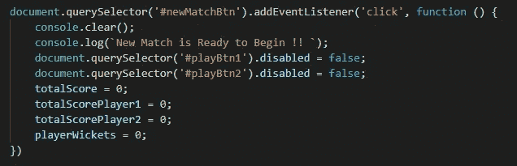

“新匹配”按钮的事件监听器

# 最后，是时候看看下面的代码了:

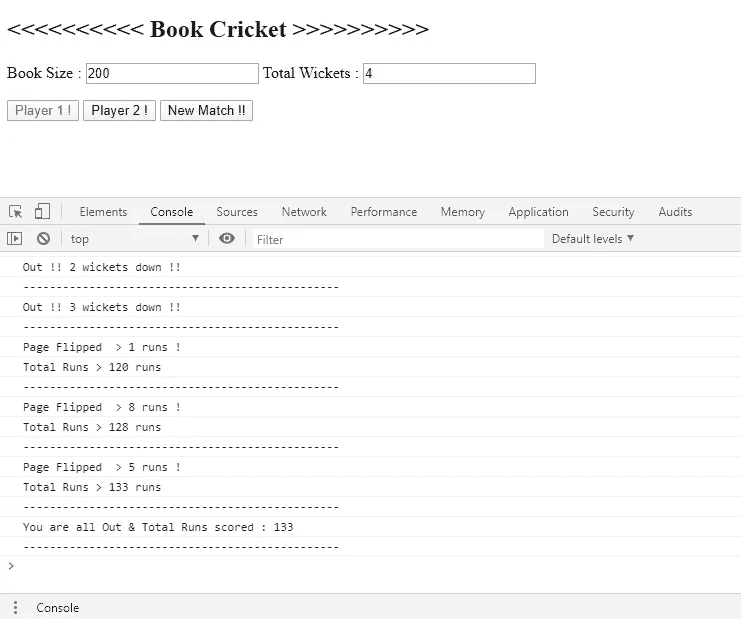

玩家 1 得分

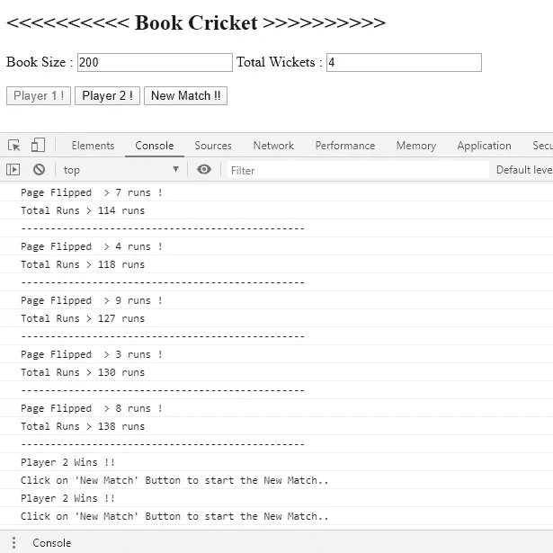

玩家 2 得分

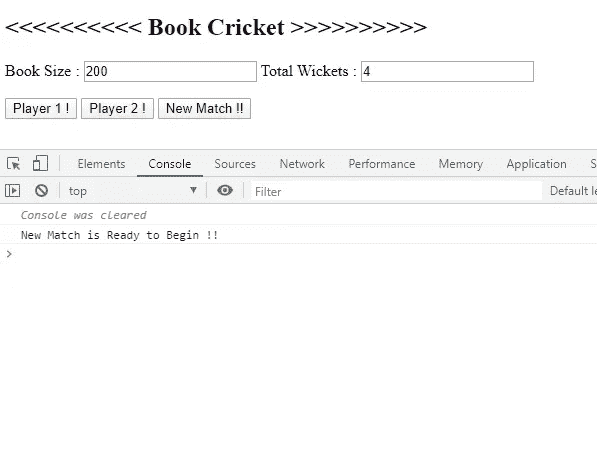

新匹配

# 通过公共 GitHub gist 链接附在代码下面。

index.html 要点

mainJS.js 要点

> 如果你喜欢我的努力，请通过轻拍拍手(最多 50 次)来鼓励这个故事。
> 
> 我感谢你的支持。
> 
> 谢谢大家！