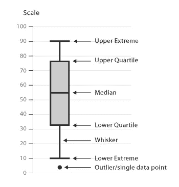
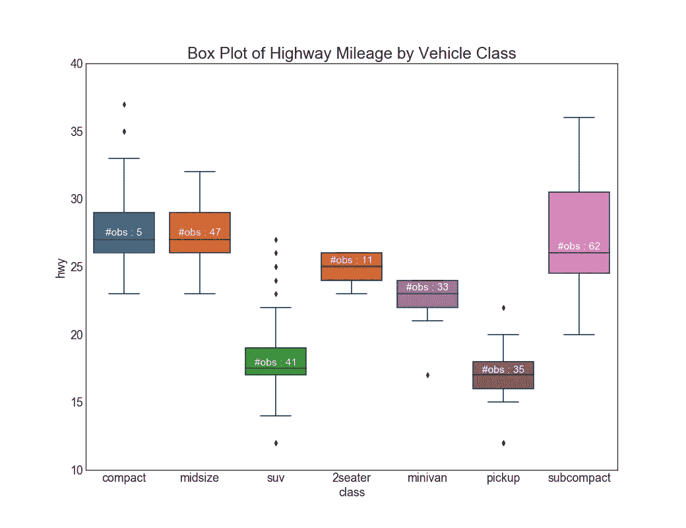
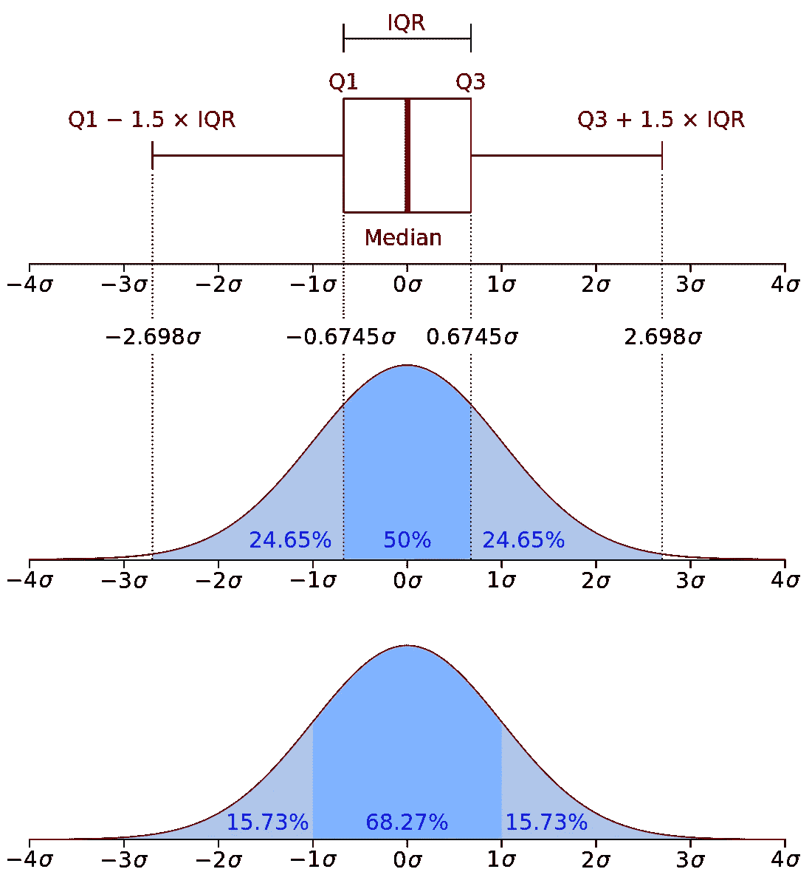
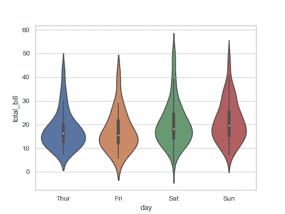

# 箱线图:一个简单但信息丰富的可视化

> 原文：<https://medium.com/analytics-vidhya/the-box-plot-a-simple-but-informative-visualization-cacc20d9ff25?source=collection_archive---------7----------------------->

嘿伙计们！我再次回来谈论另一个数据科学话题！今天，我想谈谈一种有点被人诟病的数据可视化形式:盒状图。

图片来自[https://datavizcatalogue.com/methods/box_plot.html](https://datavizcatalogue.com/methods/box_plot.html)

什么是箱线图？盒状图，或者盒须图，是相对简单的数据可视化。在我看来，它们的简单是一种优势！箱形图可以非常快速地显示大量汇总统计数据。通常情况下，如果你在查看数据的分布情况(比如，MPG 对应的汽车类型[https://www . machine learning plus . com/plots/top-50-matplotlib-visualizations-the-master-plots-python/# 26。-Box-Plot](https://www.machinelearningplus.com/plots/top-50-matplotlib-visualizations-the-master-plots-python/#26.-Box-Plot) ，你必须单独绘制每英里每加仑与汽车风格。这些图占用了大量空间，并且很难在不同的独立变量之间进行比较。例如，如果你使用汽车风格 mpg 的直方图，你必须为每种汽车风格制作一个直方图，然后将这些直方图与其他汽车风格的直方图进行比较。

图片来自[https://www . machine learning plus . com/plots/top-50-matplotlib-visualizations-the-master-plots-python/# 26。-箱线图](https://www.machinelearningplus.com/plots/top-50-matplotlib-visualizations-the-master-plots-python/#26.-Box-Plot)

箱线图在一个图上显示分布的最小值、中值、四分位数和最大值，甚至可以包括异常值。

这么多数据是如何在每个可视化中显示的？那么，绘制一个框，其中 25%四分位值用于左边缘或下边缘(取决于框的方向)，75%四分位值是框的另一个边缘。25%和 75%四分位边缘之间的距离意味着离差。穿过中间值画一条线。这条中线落在哪里也意味着偏斜。如果中位数在 25%和 75%四分位数边缘的中间，那么总体很可能是正态分布的。胡须从长方体的边缘开始绘制，并在最小值和最大值处结束。

[https://commons.wikimedia.org/wiki/File:Boxplot_vs_PDF.svg](https://commons.wikimedia.org/wiki/File:Boxplot_vs_PDF.svg)

在某些情况下，我看到异常值在胡须外的图上被绘制成散列，但这似乎不是典型的惯例。

我真的很喜欢这方面的酒吧情节！对于数据的正态分布，这可以快速显示大量信息。这允许快速探索性数据分析和进一步推进工作。再加上剧情简单易懂，不用多解释。

一个方框图怎么改进？其中一个主要问题是，没有默认的方法来显示数据的样本大小。您可以在框中添加观察次数来稍微解决这个问题。这也是饼图的一个类似限制。饼图擅长显示比例，但是如果不知道样本大小或绝对观察计数，就很难从图表中得出有意义的结论。

盒子情节的主要限制？他们以易于理解的方式向人们呈现大量信息的能力掩盖了一个主要的复杂性:无论是谁呈现或分析数据，都应该对数据本身有透彻的理解。当以箱线图呈现时，数据看起来可能遵循正态分布，但它可能完全是其他东西。例如，你可以有一个双峰[https://academic . oup . com/JAC/article-abstract/33/6/1251/785152](https://academic.oup.com/jac/article-abstract/33/6/1251/785152)分布【http://compbio.ucsd.edu/box-plot-blunders/】T2。

对盒子情节的一些改进是在 http://compbio.ucsd.edu/box-plot-blunders/的[中提到的小提琴和豆子情节。为什么不用小提琴和豆子剧情？嗯，bean plots 似乎还没有内置到一些 Python 绘图库中，Python 目前是我在数据科学职业生涯中的首选工具。Violin plots 位于 seaborn](http://compbio.ucsd.edu/box-plot-blunders/)[https://seaborn . py data . org/generated/seaborn . violin plot . html](https://seaborn.pydata.org/generated/seaborn.violinplot.html)中，但仍可能受到小数据集的误报。

图片来自[https://seaborn . pydata . org/generated/seaborn . violin plot . html](https://seaborn.pydata.org/generated/seaborn.violinplot.html)

我第一次接触箱线图是在研究生院的时候。我的导师不喜欢它们，也不喜欢它们在某些学术领域如此普遍。因为是几年前的事了，我的记忆已经模糊了，但是我相信她对它们的主要问题是使用它们的论文没有显示用于生成图的观察数量。一些人也没有透露胡须是否显示异常值，最小和最大值，或标准偏差值。你可以想象，只有 3 个点和大四分位数和胡须的研究与有成千上万个点和适当揭示图形含义的研究并不意味着相同。

我试图记住的一件事是，任何和所有的可视化都是工具。它们必须被恰当地使用，以充分地向其他观众传达信息，但这并不意味着只有一个应用于所有或许多情况。就像俗话说的“当你只有一把锤子时，一切看起来都像钉子”。箱线图应与其他显示数据的方法结合使用。

这就是我今天的全部内容！如果你对任何你喜欢的可视化有什么想法，或者对使用它们的其他人有什么改进方框图的方法，请随时联系我或在下面评论！

其他来源:

[https://www . khanacademy . org/math/statistics-probability/summaring-quantitative-data/box-whisker-plots/A/box-plot-review # target text = A % 20 box % 20 and % 20 whisker % 20 plot，the%20box%20at%20the%20median。](https://www.khanacademy.org/math/statistics-probability/summarizing-quantitative-data/box-whisker-plots/a/box-plot-review#targetText=A%20box%20and%20whisker%20plot,the%20box%20at%20the%20median.)

https://en.wikipedia.org/wiki/Box_plot