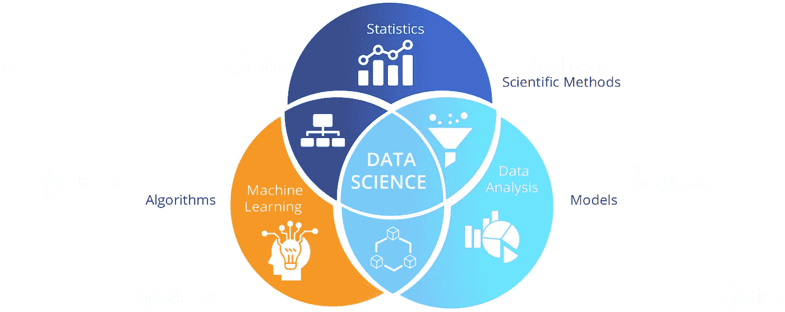

# 数据科学的简短“嗨”故事

> 原文：<https://medium.com/analytics-vidhya/the-brief-hi-story-of-data-science-45fc3c6e196c?source=collection_archive---------14----------------------->

> 如果你是机器学习、深度学习、数据科学等技术的新手。我几乎可以肯定，你会对这些词感到困惑，你可以通过阅读这篇文章来消除这些困惑。

内容:

# 1.什么是数据科学

# 2.数据科学中的 5 项任务

# 3.关于数据科学和人工智能的神话

# 4.什么是机器学习和深度学习&它与数据科学有什么关系？

> 什么是数据科学

我们可以从数据科学的历史开始。“数据科学”一词最早出现在 20 世纪 60 年代。同样在 20 世纪 90 年代，密歇根大学的一位教授称数据科学是统计学的同义词。

## -但是当数据科学随着计算机科学背景变得更受欢迎时？

这是当数据变得更容易访问的高方差，速度，量。即。当我们开始使用互联网时。

数据科学是一个领域，它是各种学科的集合，包括编程、计算、统计、分析、可视化等。它不是数据分析，也不是数据工程，但它是所有这些的集合。

## -为什么统计学和数据科学是不同的？

统计学是一个数学领域，处理数字数据的收集、组织、表达、分析和解释。

那为什么“数据科学”很重要呢？数据科学在 21 世纪初开始流行。互联网成为我们生活的一部分，我们得到了如此多的结构化和非结构化数据。但是人类不能处理这些数据，因为它太大了。所以，电脑来帮忙了。为了指导计算机，数据科学家必须学习编程。因此，它成为数据科学家工作不可或缺的一部分。所以，你不能只做统计学家就成为数据科学家。虽然统计很重要。

> 数据科学中的 5 项任务

## 1.收集数据

案例 1:数据将在组织中可用，并且在大多数情况下，它将是结构化数据。所以，数据科学家的工作很简单。

案例 2:数据将在社交媒体和其他平台上可用，但它将是非结构化的，数据科学家希望从这些网站抓取数据，他需要准备数据。

情况 3:数据不会存在于任何地方。所以，他需要进入现场收集数据。但在这种情况下，他必须设计统计实验，并找到更好的解决方案来收集数据。

## 2.存储数据

有各种各样的数据，比如

> -交易和运营数据

病人记录

客户记录

员工记录

保险索赔

> -来自多个数据库的数据

银行账户

信用卡

投资

在早期，我们使用数据仓库

数据仓库是通过集成来自支持分析报告、结构化查询和决策制定的多个异构源的数据而构建的。

但是，当涉及到包括图像、视频、语音等各种类型数据的大数据时。数据仓库变得效率低下。于是，就有了数据湖的概念。现在，几乎每个大公司都有拥有大量数据的数据湖。

## 3.处理数据

数据处理可分为 3 个部分。

A.数据争论或数据管理:它包括数据的提取、转换和加载。

B.数据清理:它包括缺失值、标准化关键字标签、纠正拼写错误、识别和删除异常值。

C.数据缩放、规范化、标准化:我将在另一篇博客中讨论这些主题(敬请关注)。

## 4.描述数据

在这项任务中，我们需要可视化我们的数据，从中获得洞察力。现在我们可以使用 Matplotlib、Seaborn、Tableau 等工具。在少量代码的帮助下，很容易地将我们的数据可视化。还有，我们要总结我们的数据进行数据分析。

## 5.建模数据

在数据科学中，我们使用统计建模，并构建简单稳健的统计分析模型，提供统计保证，如 p 值和拟合优度测试。此外，我们制定和测试假设。

> 关于数据科学和人工智能的神话🤖

#1.数据科学不是大数据和深度学习。是的，在大数据和某种程度上的深度学习中存在数据科学。

关于数据科学的一些神话是，它可以像科幻电影中的机器人一样做任何事情。或者有人认为是人工智能。但事实并非如此。人工智能是另一个行为截然不同的领域。构成人工智能的任务是

-解决问题

-知识表示

-推理

-决策

-感知、交流、驱动

我不打算深入这些主题，但我可以指出，AI 与数据科学有很大不同。反正这些学科之间是有联系的。

这有什么联系？在人工智能中，决策很重要，要做出决策，我们需要数据的支持，我们需要用一些数据来训练人工智能模型。这就是数据的来源。因此，我们需要人工智能中数据科学的帮助。

#2.另一件事是“DS 并不总是成功的”,如果你有数据，这并不意味着你可以从这些数据中创造出价值 100 万美元的想法。有时候数据并不能给出有价值的见解。有时，数据中没有可操作的见解，例如:有一家保险公司，他们通过数据分析了解到，属于较低经济群体的人没有从该公司购买足够的保险。这是“一种见解”，但“不可操作”。他们不能敦促这些客户购买保险，因为这些人会有其他比购买保险更紧急的优先事项。

#3.在数据科学中，“机器做一切”的观点是错误的。因为人类正在收集数据。为了储存数据，他使用电脑。他分析数据，处理数据。他通过绘图、总结来描述数据。此外，对于建模数据，他需要测试假设，提出模型等。计算机帮助他估计参数，因为计算机有强大的计算能力。

> 什么是机器学习和深度学习，以及它与数据科学的关系？

用于从 0 到 9 分类数字的神经网络

机器学习&深度学习是数据科学的一部分。还有，深度学习是机器学习的扩展形式。***在机器学习中我们使用算法建模来代替数据科学中的统计建模。*** 我们可以使用复杂的函数。我们用最优化技术来估计函数。在机器学习中，我们只关心预测，我们不关心底层现象。机器学习和深度学习的简单区别在于，在机器学习中，人类将决定从数据中进行特征提取的函数。但是在深度学习中，这项工作也是由计算机完成的。因为我们有计算能力这样做，这是很容易的。有时，它会在数据中提供一些人类无法发现的隐藏见解。这也是深度学习在这个时代更受欢迎的原因。要进行深度学习和机器学习，我们需要一台具有良好计算能力的好机器。但是做数据科学我们不需要那么多的计算能力，有时我们也不需要计算机😎😎。

> **💛🧡，谢谢你。我想你已经了解了什么是数据科学以及 ML、DL、AI 之间的区别。祝你的事业和生活旅途愉快。下一篇博客再见。**