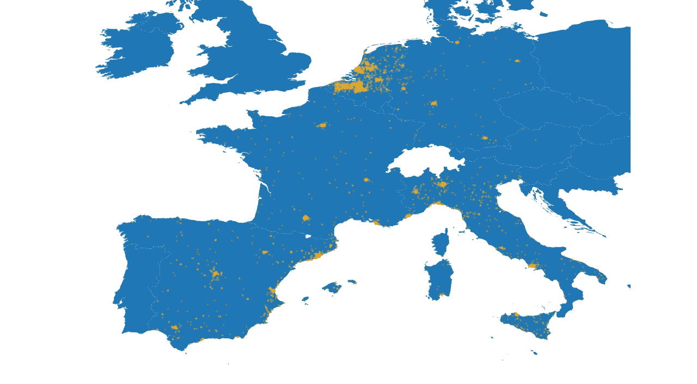

# 数十亿的日历触手可及

> 原文：<https://medium.com/analytics-vidhya/the-calendar-of-billions-at-your-fingertips-fa3dc2939fb2?source=collection_archive---------4----------------------->

**谷歌流行时报数据在学术界和商界的未开发机会**

> ***简言之:***
> 
> *[1]我解释了为什么谷歌流行时报的数据对研究人员来说是一座尚未开发的数据金矿。*
> 
> *[2]我建立了自己的谷歌地图抓取器，收集了欧洲 13，000 多个地方的流行时间数据。*
> 
> *[3]我展示了如何免费对所有这些位置进行地理编码和地图绘制，以及如何利用这些数字痕迹来深入了解时间预算的跨文化差异(即特定文化中的人们倾向于如何支配时间)*
> 
> *[4]在使用谷歌《大众时报》数据时，我关注偏见的来源和其他潜在的陷阱，未来的研究人员在建立他们的研究时应该努力解决这些问题*。

在过去十年左右的时间里，学术界的研究人员称赞了不断增加的数字痕迹产品带来的可能性，从而彻底改变了我们研究社会现实的方式。通过研究搜索结果、图片、推文等的模式，我们可以通过在线视角研究线下世界。总是魅力四射的里查德·罗杰斯教授是这种新方法的最著名的倡导者之一，或多或少是我们今天所说的“数字方法”的教父。

罗杰斯的一些想法立即被采纳，现在已经成为数据分析师工具箱的一部分。以所谓的“谷歌趋势”研究为例，记者、博客作者和学者用它来辨别公共领域“热门话题”的兴衰。或者用同样的数据来预测流感季节的爆发会怎么样呢？尽管取得了一些成功，但罗杰斯的方法论范式——正是因为其富有感染力的热情和乐观——也是无可救药的天真，冒着掩盖伴随数字痕迹分析的一些陷阱的风险。总的来说，网络世界充满了偏见，从倾斜的和自我选择的人群到结构性平台限制和算法计算都会扭曲曝光。每当我看到新闻播音员在推特上愤怒地谈论人们对最近事件的看法时，我就会想起这一点；一个平台，代表了受过高等教育、左倾、相对年轻的自我选择的人口子样本，被他们自己的算法过滤器泡沫政治极化。将知识从网上翻译到网下世界应该会引发各种各样的警报，并且在任何情况下都应该伴随着研究者的其他阅读和解释。

尽管如此，我写这篇文章是为了让你相信，有一个被忽视的数字跟踪数据金矿随时可用，即**谷歌流行时报数据**。当你在谷歌地图上搜索一个特定的地方时，你可能会注意到流行时间图。图表**显示了一个地方在一周的任何给定时间内相对于其最繁忙的时间**(这代表了规模的上限，因此是“100%繁忙”)通常有多繁忙(0%-100%)。图表看起来像这样:

图一。新的数字方法大放异彩

在这篇博文中，我将讨论(a)为什么这种类型的数据对学术和商业研究有用，以及(b)你如何收集、探索和分析流行时报数据。我将编写自己的 Google maps scraper 来收集 30 个欧洲城市的餐馆和超市的数据，并用 Python 进行一些探索性的分析。我还将向您展示如何免费自动进行正向地理编码，以及如何要求批量 Geojson 地图轻松可视化地理数据。这里的最终目标是**激励未来的研究人员思考新的途径，以新的和令人兴奋的方式利用这种数据来洞察我们的社会世界。我将尽量减少这里展示的 Python 代码的数量。这不是一步一步的指导，而是一个相对简短的演示。**

# **作为未知领域的流行时代数据**

如果你是一个 Android 用户，很有可能你已经在谷歌的流行时报数据库中做出了贡献，甚至没有意识到这一点。使用您设备的地理位置数据，Google 将您的坐标与特定的 Google maps 地点(如餐厅、商店等)进行匹配。)并估计几个月内某一天某一小时在所述地方的平均访客量*。如果有足够多的数据可用，谷歌将制作流行时间图表供所有人查看。这一指标为您提供了一个关于一个地点*通常*有多繁忙的相当可靠的估计，这意味着流行时间数据不容易受到异常和意外的流行高峰和突破的影响。这使得**成为辨别大趋势**的理想选择，这正是大多数学者和私营部门一些长期研究项目感兴趣的事情。然而，那些对流量的暂时突然变化感兴趣的人仍然可以利用流行时间图的“实时”估计，尽管这不是本文的重点。*

*Google popular times 数据的一个重要而独特的特征是它已经标准化了:与特定地点最繁忙的时间相比，这个尺度(0%-100%)代表了一个地点的繁忙程度*。根据手头的研究问题，这可能是优势也可能是劣势。当你对原始数据感兴趣时，比如全国哪家快餐店的访客量最高，你就不走运了。然而，大多数情况下，您希望过滤掉源于人口密度变化的偏差来源。否则，比方说，纽约和洛杉矶的所有麦当劳连锁店将持续“忙碌”,而乡下的麦当劳将永远不会达到任何“最高人气”。**这种偏见是有害的，因为它与现实中对‘忙碌’的实际*感知*不一致**。如果 50 个人同时在时代广场上点一份巨无霸菜单，那看起来就和平常的一天没什么两样。餐厅的内部装修、员工的规模以及他们的工作流程都是为了服务大量的顾客而调整的。然而，把这 50 个人放在我当地的麦当劳里，看起来就像是直接入侵。这使得**这种类型的数据对于任何对人们进出某个地方的“相对”流动感兴趣的人来说都是理想的。****

*让我们回顾一下学术界和私营部门中的一些可能应用:*

*   *学术应用:
    1。*跨文化“时间预算”分析*:人们倾向于如何度过跨文化的时间(例如北欧和南欧的餐饮文化差异)
    2。*分析特定事件对交通模式的影响:*2020 年全球 COVID 疫情如何改变时间预算模式？这假设了一个纵向透镜，这意味着至少应该有两波数据收集用于分析。
    3。*“映射”一个地区的特定地点类别，并将其与外部数据源相关联*(例如，收入分配、种族……):基本(社交)服务在一周中何时达到受欢迎程度的峰值？这是否可能对某些弱势群体或工人(例如，被迫在周末、晚上等时间工作的服务行业工人)产生影响。)?
    4。*一般城市研究中的研究:*什么时候某些地区(过度)拥挤？这种交通(人和/或车辆)对这些社区的基础设施和人们有什么影响？*
*   *商业应用:
    1。*改善客户服务:*公共交通公司可以使用流行时间数据来估计其火车站的乘客流量，最终得到更可靠的延误乘客人数估计。他们可以使用这些估计来确定需要新基础设施的热点。
    2。*密切关注竞争对手和顾客:*一家餐馆可以“绘制”他们的特定城市，并估计人们倾向于在家里吃饭的时间(即，所有餐馆倾向于经历低流行时间值的时间)。他们可以增加广告预算，在社交媒体上围绕这些“呆在家里”的热点推广他们的食品配送服务。*

*当然，问题仍然是这里存在什么样的偏见。我们是在谈论少数谷歌地图用户的运动吗？他们明确自愿参加某种谷歌全景监狱？不完全是。理论上，Android 用户必须将他们的谷歌账户与他们的设备关联起来，并且必须“明确”同意选择“位置历史”服务，但人们应该意识到，Android 手机的设计方式使用户很容易被引入这一选择。谷歌地图不仅预装在每个安卓设备上，而且终端用户也被大力鼓励将他们的谷歌账户与他们的安卓设备相结合。当这两个组件匹配时，位置数据的收集是完全自动的，并且是在移动中完成的，无需用户方的任何干预。出于这个原因，**这些数据较少受到大多数数字痕迹中普遍存在的几个邪恶和众所周知的偏见来源的影响，例如社交媒体活动**(例如，【 [1](https://www.tandfonline.com/doi/abs/10.1080/1369118X.2012.678878) ， [2](https://www.tandfonline.com/doi/abs/10.1080/15230406.2018.1434834) )。**例如，与社交媒体帖子不同，创建这些数字痕迹所需要的只是*存在于*中；数据被记录和收集，而不需要使用谷歌地图。**当然，这里有几个注意事项:*

*   **应启用设备的 GPS 功能。然而，我有理由相信绝大多数智能手机用户都是如此。2019 年，我在一项学术研究中探索了约 15，000 名智能手机用户的广泛数据集。我们跟踪了我们的样本大约 18 个月，收集了各种数据，从他们打开的应用程序，到他们使用智能手机时的精确位置(如果有的话)。该数据显示，我们的样本中大约 80%的人一直都打开了他们智能手机的 GPS 功能*，而大约 90%的人大部分时间都启用了这一功能(10%到 40%的用户缺少地理位置数据)。***
*   ***用户已经选择进入谷歌的位置历史注册。*这听起来是一个相当大的障碍。哪个头脑正常的人会有意识地允许谷歌追踪他们的详细位置历史，对吗？当然，谷歌非常善于说服他们的用户接受对自己设备的跟踪，并将其作为一个漂亮的功能来销售，为用户提供各种额外的好处。此外，人们正在习惯于“隐私声明”的轰炸，特别是自从欧洲 GDPR 迫使公司要求用户为收集的每一种个人数据征求许可以来。这可能会增加研究人员所说的“隐私疲劳症”(privacy fatigue):感觉在网上管理自己的隐私是一件令人厌倦、几乎无法控制的事情。人们不是采取行动，而是对这种认知超载做出反应，变得自满，对自己处理在线隐私的机构持怀疑态度。谷歌指望这种玩世不恭，再加上适量的纯粹懒惰:当你第一次打开谷歌地图时，它会给你一长串权限(如位置历史服务)，在列表底部有一个漂亮的“全部同意”按钮。与其经历所有的麻烦去阅读和考虑你想要启用哪个服务，不如一次接受所有的服务更容易。
    为了证明隐私疲劳的威力，我在我的十个朋友中进行了一个小实验(我知道这并不是真正的随机样本)，并询问他们在访问相应的[谷歌设置页面](https://myactivity.google.com/activitycontrols?hl=en&gl=EN&continue=https://www.google.com/maps/timeline?pb&pli=1&authuser=0&settings=location)时的位置设置。无一例外，所有人都报告启用了位置历史记录。他们中的一些人感到惊讶，但大多数人对此不屑一顾，认为这只是科技巨头的“又一次隐私侵犯”，表明了隐私疲劳症特有的愤世嫉俗的态度。我的小调查结果与皮尤研究中心(PEW research center)2012 年的研究(有些过时)非常吻合(此处引用)，据报道，只有 19%的美国智能手机用户关闭了他们的位置跟踪。**

**所以**像许多在线隐私行为一样，大多数 Android 用户坚持专家所说的** [**隐私悖论**](https://onlinelibrary.wiley.com/doi/abs/10.1111/j.1745-6606.2006.00070.x?casa_token=ojsXPJO-6-QAAAAA:F0yK2YCO4ppT1QS8LQ-cVK-3gFbcr2uB4k5-pR6EJo-5frYOb9PyHAKqJ3fFaKvmUq1ILGy3maldmcpL) **:** 虽然每个人*都声称*他们的隐私是最重要的，但大多数人都懒得实际做些什么。尽管谷歌最近对隐私政策进行了修改，要求谷歌只保留你 18 个月的位置记录，但这并不妨碍谷歌可靠地更新他们的流行时报数据。**全球至少有 25 亿部活跃的 Android 智能手机，假设谷歌在任何时候都在跟踪全球超过 20 亿部设备并不太牵强。**毕竟，许多 iPhone 设备也会被追踪，尽管在地理追踪到位之前，它们还需要经过几道关卡。**

**对于这些用户的隐私来说，这听起来像是一场灾难，当然，在理论上，这确实构成了一个可能令人担忧的大量地理数据集合。然而，以其当前的形式，流行时报数据构成了批量数据收集的一种更良性的形式:不可能将数据与任何个人或甚至个人群体联系起来，它指示了广泛、一般和聚合的趋势，每隔几周更新一次，但没有提供特定位置的细粒度即时流量。此外，如果一个地点的可用数据量不足，那么流行时间数据根本不会被发布。因此，即使你知道——例如——一个特定的地方只能由几个人访问(例如，想象一下你为你的共享设备创建了一个 google place)，你也不能通过 Google maps 跟踪对所述地方的任何特定访问。因此，总而言之，从伦理的角度来看，这种类型的数据收集侵犯个人隐私的担忧很少。相反，这种类型的数据在某种程度上可以与其他总体趋势数据相比较，例如由世界各地的私营公司和政府收集和出售的公路网上记录的交通流量。**

**尽管如此，这并不意味着这里绝对没有偏见。例如:**

*   **该位置首先需要有一个谷歌页面。虽然很多地方都有谷歌页面，但不太受欢迎的地方，或者不太懂数字技术的企业主的地方(可能在移民人口中比例过高)不太可能创建谷歌位置。**
*   **如果特定位置的可用数据量不足，则不会显示数据(这些数据点可以归类为 MNAR:非随机遗漏)。这实际上意味着前面提到的对热门地点的偏见加剧了。**
*   **拥有智能手机的人并不构成人口的代表性样本。虽然大多数发达国家的智能手机普及率很高，大约四分之三的居民拥有智能手机，但老年人仍然落后。此外，并非所有地区都一样。巴基斯坦(15%)、菲律宾(34%)甚至印度(37%)的采用率相对较低；因此，对调查和/或比较区域感兴趣的研究人员应该意识到，在研究的特定区域内存在不同的样本偏差。**
*   **最后，谷歌平台本身的结构性限制使得《大众时报》数据的创建缺乏透明度。不知道流行时间值是如何计算的，多久更新一次，何时某人被认为是某个特定地方的“游客”，等等。例如，谷歌很可能在他们的更新中实现了内置的“延迟”，以防止随着时间的推移访问模式的突然变化。这意味着我们正在处理的数据已经被一种未知的专有算法处理过，这使我们暴露于各种(未知的)偏见来源。**

****尽管如此，与大多数其他类型的数字痕迹中存在的大量偏差相比，这些仍然是小问题。追踪是随时随地进行的，没有任何人工干预，数十亿用户被积极推动接受谷歌这种持续不断、无处不在的数据收集。**虽然一些研究人员已经认识到了这种潜力([ [1](https://www.emerald.com/insight/content/doi/10.1108/TR-10-2018-0152/full/html) ，[ [2](https://trid.trb.org/view/1494705) ，[ [3](https://www.sciencedirect.com/science/article/pii/S0269749118359049) )，但迄今为止，只有少数论文发表了这种有前途的庞大的访问模式数据库。**

**这可能与谷歌不允许通过他们的 API 访问《大众时报》的数据有关。这给数据收集造成了很大的障碍，要求研究人员具备网络搜集技能。这就是我们开始谷歌地图项目的地方:开发一个刮刀。**

# ****【第一部分】抓取谷歌地图****

**我不是第一个对收集流行时报数据感兴趣的人。已经有[一个流行的 Python 包](https://github.com/m-wrzr/populartimes)可以做到这一点。然而，这些包需要(1)一个 API 键和/或(2)关于你想要抓取的特定位置的先验知识(比如 Google place ID)。此外，这些工具*只*收集流行次数图，而我想收集评论数量、地点类别(例如非正式、舒适)和流行次数图的所有信息。重要的是，与这些可用的工具不同，**我希望我的 scraper 包含一个“自由漫游”选项，用户可以在预先确定的区域简单地定义一个特定的搜索，抓取*所有与给定类别匹配的*地点和*所有与给定类别匹配的*可用信息。**如果谷歌偏离太远(例如，搜索邻近但不同城市的特定餐馆)，搜索会话会停止，并继续搜索下一个区域*搜索词组合。这意味着*铲运机能够独自绘制区域地图，而不需要任何预先要求的关于感兴趣的地方的知识*。例如，给 scraper 一个包含 10 个城市(例如纽约、东京)和地点类型(例如餐馆)的列表，应该会返回所有地点信息—包括它们的热门时间—而无需任何进一步的输入。**

****

**Gif 1。我的谷歌地图刮刀的免费漫游选项**

**这对于学者(如社会学家)和企业来说都很有趣。例如，一家寻找新的有希望投资的地区的快餐连锁店可以很容易地创建一个特定州或国家的“快餐地图”，服务不足的地区将很快显示出来。对于社会学家来说，快餐连锁店在特定社区的流行可以与社会经济变量如收入和教育水平联系起来，以揭示健康和可获得的食物选择的差异。将这类信息与《大众时报》的数据结合起来，只会进一步强化这类分析。**

**我在 Python 中使用了 Selenium 和 Beautifulsoup 的组合来构建刮刀。一个早期版本的刮板自动滚动通过一个特定位置的所有日子(见 Gif 2。).这种方法被证明太慢，被直接访问页面源代码中的 popular times 数据所取代。**

****

**Gif 2。谷歌地图刮刀的早期版本**

**scraper 的最终版本包括大约数千行代码，老实说，是一个巨大的混乱。事后看来，我对这项任务准备不足，而且过于雄心勃勃。没错，它包含了各种各样奇特的选项，并且能够处理大量的异常情况。例如，它反复检查谷歌是否放大了特定的子区域，在滚动结果时是否改变了大致坐标的搜索区域，以及“附近”搜索是否会导致更细粒度的搜索区域。这一切听起来都很好，直到你意识到谷歌一直在轻微地改变他们的源代码，如果你等几个星期，就会在这里或那里破坏脚本。所以如果你现在运行这个脚本，你一定会遇到一些错误。然而，我在 6 个西欧国家的 30 个城市里找到了大约 13000 家餐馆和超市:比利时、荷兰、德国、意大利、西班牙和法国。在我的 Github 上的[这里](https://github.com/kboghe/Maps/blob/master/inputfile_search.csv)可以访问本次研究使用的所有特定地区*地点类别组合。**

**如果你对最终的刮刀如何工作感兴趣，可以看看我的简短演示视频[这里](https://video.wixstatic.com/video/707176_1b52e2b8997b4dd2b4c8a10dfea45271/1080p/mp4/file.mp4)。本质上，在抓取之前，我连接到我在另一台 Linux 机器上设置的 MySQL 数据库，使用 Selenium 启动 chrome 浏览器，执行谷歌搜索，然后逐个位置地抓取数据。接下来，我在抓取特定区域的所有地方后自动将数据上传到 MYSQL 数据库，并在每次会话后切换到不同的服务器(使用我编写的 [NordVPN 切换器](https://github.com/kboghe/NordVPN-switcher))以避免 bot 检测。最后，数据库包含两个表。一个表包含特定地点的 ibfo(一行=一个地点)，例如地点类别、地址、审查分数等。另一个表用于存储流行时间数据，有点大，包含大约一百万行，每一行代表特定位置的一个小时(所以一行=一个小时)。google maps URL 在两个表中都被用作标识符，这意味着我们可以在几秒钟内链接这些数据源。**

****

**图二。我的谷歌地图抓取器的内部工作原理**

**我将两个表都导出到 csv et voilà，我们得到了数据！这听起来好像是在一个慵懒的周日下午完成的，但这只是因为我在压抑由整个数据收集折磨引起的创伤。开发 scraper 花了我大约两周的时间，不断处理新的异常和谷歌地图的意外行为，收集数据又花了我一周左右的时间(24/7 不间断地收集数据)。我[将地点类别聚合成更有意义和更一般的级别](https://gist.github.com/kboghe/e2a22a9c04763d19b438315a94e6ccb1)(即‘希腊餐厅’，‘印度餐厅’=我们的意图和目的所在的餐厅)，并创建了一个额外的‘类别聚合’变量。**

**数据的实际搜集发生在 4 月初，据我所知，T2 并没有受到欧洲各地实施的相当严厉的封锁措施的影响。看起来，谷歌确实推迟了他们的流行时间数据的更新，比利时当地的餐馆尽管关门了，但仍然保留了他们的流行时间图。这可能是谷歌有意识的一次性决定，但无论如何，《大众时报》的更新完全有可能存在相当大的内置延迟。**

# ****【第 2 部分】检索详细的地理位置数据。****

**将数据加载到 Python 环境中后，我们就可以进行一些探索性的可视化分析了，例如，将位置映射到某种地图上(GeoJson、shapefile 等)。).据我所知，不可能从谷歌地图中提取某个特定地点的精确地理位置。当然，你会发现一些[博客文章](https://towardsdatascience.com/using-python-and-selenium-to-get-coordinates-from-street-addresses-62706b6ac250)详细描述了如何从页面代码中抓取特定的位置坐标，但是这些方法(a)不可靠或者(b)因为最近源代码的变化而失效。此外，不要将 google place 页面的 URL 中包含的坐标误认为是实际的位置坐标。这些只代表地图中心的经纬度，根本不代表也不是特定位置的唯一！**

****

**这意味着*我们必须获取谷歌地图地址，并通过以下方式执行一些正向地理编码*:**

*   **刮某种其他地理编码平台，如 l[atlong.net](https://www.latlong.net/convert-address-to-lat-long.html)**
*   **通过托管我自己的 OSRM 服务器来利用开源的 openstreetmap 数据。我不想使用免费的 OSM API，如果我在短时间内向它发送 13.000 多个请求，它肯定会阻止我。**
*   **利用商业地理编码 API，比如 Google maps API。**

**然而，由于我宁愿把钱花在书和视频游戏上，而不是花在一些 API 服务上，所以我不想打开我的钱包。我花了一天左右的时间想出了**最简单的方法，不用花一分钱就能转发 13000 个位置的地理编码。****

**事实证明，像 latlong.net 这样的*平台敏锐地意识到它们对机器人的吸引力，因此实施了一些安全措施来防止自动数据收集。他们只抓取了几个位置就屏蔽了我的 IP，通过 VPN 切换到一个新的服务器会在很大程度上(也是不可接受的)减慢这个过程。类似的平台也是如此。我尝试做的下一件事是*托管我自己的 openstreetmap 服务器*。这确实奏效了，但我很快意识到我的请求中有很大一部分是含糊不清的，比如 OSM 发现了一个错误的地址或者根本没有地址。也许 OSM API 不够灵活，无法处理一些谷歌地图地址的不一致格式？不管是什么，这意味着我必须寻找一个商业 API 服务。完全没有预算。哎哟。***

*谷歌地图是不可能的:他们的[定价政策](https://developers.google.com/maps/documentation/geocoding/usage-and-billing)将导致我仅在地理编码上就花费大约 70 美元。在对几个带有少量地址的商业 API 进行了一些研究和测试之后，[**position stack**](https://positionstack.com/)**API 成为了明显的赢家**。它处理不明确的地址没有太多的麻烦，这是最棒的部分**它允许你每个月执行 25000 次免费请求(正向/反向地理编码)**！有趣的是，你的预算会在每个日历月的*开始*时更新。这意味着如果你有相应的计划，你可以在两天内(例如 8 月 31 日&9 月 1 日)完成 50.000 个免费请求。*

*我将每个位置的地址和国家作为位置堆栈请求的参数，并使用该位置的 ID 作为标识符来链接地理编码数据集和我的 google maps 数据集。我还记录了一个特定的请求是否已经失败(有时确实如此……)，如果是这样的话，我会执行一个有限的重试循环(你可以在我的博客文章中读到相关的内容)。最重要的是，我在每次请求后暂停我的脚本 3 秒钟，以避免触发任何过载保护。如果脚本抛出一个错误，我们暂停请求整整一分钟*

*执行所有 13.000+ Positionstack 请求的代码如下所示:*

*确保用自己的 API 密钥替换代码中的“YOUR KEY HERE”。*

*虽然 Positionstack 被证明是谷歌地理编码服务的免费替代品，但该 API 的性能有些不一致。如果你幸运的话，Positionstack 可以毫无困难地接受成千上万的请求，但是它同样会在没有任何合理解释的情况下抛出一个又一个错误。我记录了两天内两次会话中失败请求的数量。结果显示如下(见图 4)。*

**

*图 4。对 Positionstack 执行请求时一段时间内的错误数*

*在第一天，Positionstack 返回了大约 8000 个位置的坐标，没有任何明显的停顿。前两个小时，它几乎没有抛出任何错误，甚至 7 个小时后，脚本只需重试 15 次请求。在那之后，API 确实遇到了一些麻烦，但是在 9 个小时内执行了 8000 多个请求之后，它仍然只抛出了 30 个错误。太好了！然而，在第 2 天，脚本连续遇到一些错误，仅在 2 小时后就重试了 80 次。重要的是，这与我已经花费在“每月预算”上的请求数量无关，因为我的预算是在第一天(8 月 31 日)和第二天(9 月 1 日)之间刷新的。不过，这只是一个小缺点:您只是让脚本暂停一分钟，然后重试请求；脚本从未真正“停留”在某个特定的地址上。*

*至关重要的是，一个“成功”的请求并不*而*必然意味着该位置被成功地理编码。Positionstack 也可以返回:*

*   **不精确的*坐标，例如街道或街区的坐标，而不是具体的地址。在这种情况下，同一条街道上的所有餐馆都会获得完全相同的街道坐标，这对地图绘制来说并不十分有用。*
*   **根本没有*坐标。如果由于某种原因(例如，谷歌地图上地址的意外格式)找不到地址，就会出现这种情况。*

*让我们看看国家和城市返回了多少遗漏(见图 5)。*

**

*图 5。来自 Positionstack 的失败请求-按国家*

*每个条形蓝色部分代表在较低粒度级别(通常是街道级别)进行地理编码的地址。红色部分表示“真实”缺失的百分比，即 Positionstack 无法识别地址并返回空 JSON。*

*看起来各地区的表现有着明显的差异。西班牙和意大利的地址往往会返回更多的遗漏，瓦伦西亚的地址大约每两个案例中就有一个会返回没有*具体*地址的位置！样本中的其他国家遇到的问题较少。鹿特丹 96%的地址都成功地进行了地址级地理编码。根特(95%)、布鲁塞尔(90%)、慕尼黑(94%)、尼斯(93%)之类的成功率差不多。西班牙和意大利一些城市的高错误率并不一定是 Positionstack 造成的。也许我们正在处理 Google 和 Positionstack 对于西班牙和/或意大利地址的不同格式约定。如果是这样的话，一些基本的数据争论可以解决这个问题。然而，这并不能解释米兰和萨拉戈萨相对较低的失误率。*

*让我们将所有位置标绘成图，以便鸟瞰我们在这里获得的数据。我使用 Geopandas 软件包来绘制坐标。幸运的是，Geopandas 预装了一些地图，比如一张欧洲地图。仅仅几行代码之后，我们发现的热点立即显露出来(见图 6)。*

**

*图 6。大约 13，000 个位置分布在欧洲各地*

*您可能会注意到比利时和荷兰的高度集中，但这只是这些国家覆盖面积相对较小的结果。请记住，每个地区都由它的五个最大的城市代表，因此这些城市(以及它们的餐馆/超市)自然彼此非常接近。其他国家的破烂城市更为突出，比如法国的巴黎和图卢兹。*

*值得注意的是，这种**地理编码数据让我们能够提出各种新的有趣的研究问题，并保持其价值，而不仅仅是可视化的目的。**例如，人们可以测量从特定位置到市中心的距离，并将其与其他一些有趣的变量相关联。例如:靠近市中心的餐馆比郊区的餐馆更贵还是更便宜(谷歌地图中的“”分类)？某些类型的餐馆是否“聚集”在同一区域(例如“唐人街”或烤肉串餐馆高度集中的街道)？*

# ***【第三部分】批量下载 geojson 地图***

*虽然在欧洲地图上绘制我们的位置提供了一个简洁的概览，但它并没有让我们深入了解微观层面的模式，例如城市层面。也许你的研究并不专注于可视化详细的地理位置数据，如果是这样的话，你根本不需要担心获得详细的地图。尽管如此，在更精细的层次上可视化您的数据可以揭示各种有趣的模式，否则是难以理解的。*

*幸运的是，**有一个很棒的 Python 包叫做** [**osmnx**](https://github.com/gboeing/osmnx) **可以使用 OpenStreetMap 数据库检索详细的地图。在下面你可以找到代码来获得我们数据库中 30 个城市的街道网络。我用 GeoJSON 格式把每张地图都写到我的硬盘上(在‘maps’文件夹中)。我只需要网络的实际坐标(即线的位置)，因此我们可以放弃图形对象中的其他属性。***

*我提供了一个示例，说明如何使用我前面提到的 GeoPandas 包来映射这些 GeoJson 文件(查看上面代码片段的第二部分)。将每个保存的 GeoJson 文件加载到我的 Python 环境中，并使用 subplots 绘制它们，这为我们提供了正在研究的 30 个城市的直观概览(参见图 7)。*

**

*图 7。从谷歌上搜到的 30 个城市的地图*

*GeoJson 文件只包含网络的坐标，每次根据图形库(如 matplotlib)提供的设置绘制网络时都会绘制这些坐标。这意味着无论你放大多少，街道都会清晰地显示出来。下面您可以找到上面显示的荷兰代码片段的第二部分的最终结果(参见图 8)。*

**

*图 8。5 个最大的城市——荷兰*

*让我们结合谷歌、Position stack 和 OpenStreetMap 的信息，绘制巴黎所有废弃的餐馆和超市的地图。您可以找到获得图 9 的代码。在这种情况下，超市用绿点表示，餐馆用橙点表示，但是你当然可以根据自己的喜好改变配色方案。*

*获得图 9*

**

*图 9。巴黎的餐厅和超市(总共 602 家)*

*简单地绘制数据也可能揭示出一些源于谷歌地图平台结构限制的潜在偏差来源。这里显然就是这种情况。如你所见，看起来我们收集了更多关于巴黎市中心的数据。现在，我已经去过巴黎很多次了，很明显并不是所有的*餐馆都在这张地图上。除了旅游中心，巴黎还有更多值得关注的地方，但根据谷歌的说法，这似乎才是最重要的。这可能与我建造刮刀的方式有关。我只是告诉谷歌“在巴黎找餐馆”，没有任何进一步的指示。有鉴于此，谷歌将(a)专注于市中心,( b)即使该地区有更多的餐馆，谷歌也会在 X 页后停止提供建议，这是有道理的。事实上，无论搜索到哪个地区，谷歌的建议都会在搜索到大约 320 个地方后停止。**这两种算法倾向结合起来意味着获得的数据偏向于包括市中心的位置，这可能会对您的研究产生影响。如果你对同一个地区或城市中的不同社区感兴趣，这尤其令人担忧。如果是这样的话，你应该写一个明确针对几个子区域的 scraper，比如同一个城市的不同区。****

*尽管有这个缺点，我们仍然有大量的位置供我们使用，一个城市就有大约 600 家餐馆和超市的信息！当您放大时，数据的丰富性尤其明显(见图 10)，使单个餐馆在街道上清晰可见。*

**

*图 10。放大到巴黎的一个小社区*

# ***【第四部分】扯皮、探究&清理数据***

*好了，现在我们有了谷歌数据以及详细的地理编码位置和城市地图。这已经允许您回答所有类型的研究问题，如绘制和聚类地点类别，将某些地点类别的可用性与其他外部数据源(如社会经济变量)相关联，等等。*

*现在是时候实际研究流行时报数据了。请记住:对于每个位置，如果可用，我们为一周中的每个小时设置一个介于 0 和 100 之间的值。值 100 表示这个特定的时间*趋向于*成为这个特定位置的*一周中最繁忙的时间。然而，概括一下，没有足够位置数据的位置根本就没有流行时间数据。问题仍然是我们实际上在谈论多少失踪。我创建了下面的图表来估计这种偏差在我们的数据库中有多严重(参见图 11)。**

**

*图 11。缺少流行时间数据-按地点类型和地区*

*很明显，我们谈论的是相当大比例的失踪。在我们从谷歌地图上搜索到的所有地方中，大约有 40%的地方没有流行时间数据。这些地点的受欢迎程度不足以产生可靠的受欢迎程度估计。大约十分之四的餐馆和十分之三的超市都是如此。有趣的是，与埃因霍温和慕尼黑(30%)等西方国家相比，巴塞罗那和萨拉戈萨等西班牙和意大利城市(50%)的失踪人口要多得多。也许这是更多南方文化中盛行的餐饮文化的结果，那里有更多的(本地)酒吧为相对少量的忠实顾客服务。事实上，当你在巴塞罗那漫步时，你会被大量的小(迷人的)小吃酒吧淹没，而在乌得勒支或安特卫普等城市的餐馆需要“要么做大，要么破产”。这意味着——无论我们在这一部分进行什么样的分析— **,我们只讨论样本中最受欢迎的 60%的餐馆。**每当我们解读下面的结果时，请记住这一点。*

*出于探索的目的，我想进行三项分析。*

*   **聚类*餐馆的流行时间数据:我们能识别具有相似访问模式的区域吗？我只选择这里的餐馆，因为我怀疑就餐文化比去超市更具文化内涵。理想情况下，我们会看到每个国家都形成了自己典型的“流行时代”集群，在这个集群中，餐馆遵循不同国家(和文化)的流行模式。*
*   *餐馆或超市在一周的哪一天最受欢迎？这是否因国家而异？例如:著名的意大利餐饮文化是否意味着一周中的每一天都有相当比例的餐厅经历某种高峰？纪律严明的德国人周六都出去吃饭吗？*
*   *餐馆在哪个小时最受欢迎？当荷兰的餐馆几乎空无一人时，西班牙人是否会在晚上很晚的时候出门(比如说晚上 9 点左右)？*

## ***聚类流行次数数据***

*在考察各国不同的受欢迎程度之前:把所有这些餐馆归为相应的区域类别有意义吗？换句话说:一个国家内的流行趋势*如此相似以至于他们会根据流行趋势聚集在一起吗？为了找到答案，我执行了一个层次聚类分析(使用非常简单的欧几里德距离和沃德方法)并将数据集分成 2 到 6 个聚类。我在这里使用 6 作为上限，因为我们正在处理 6 个不同的国家，假设这些地区中的每一个都可能形成一个由餐饮文化差异驱动的集群。**

*为此，我编写了以下代码:*

*我运行了这个脚本两次:一次使用所有可用的流行时间数据(左图，图 12)，另一次使用更严格的时间范围，只使用从中午到午夜的流行时间数据(右图，图 12)。我这样做是为了避免过多的零，这可能不利于找到有意义的集群解决方案。事实上，餐厅通常在午夜和中午之间是空的，偶尔有例外，这是有道理的，受欢迎程度模式的有趣差异主要表现在中午和午夜之间的某个地方。由 *cluster_membership* 函数产生按国家分类的分类成员。我在 Excel 中对这些百分比进行了颜色编码，给出了下图。*

**

*图 12 —流行时间数据的聚类。左:使用整个时间范围|右:使用受限时间范围*

*理想情况下，包含 6 个集群的解决方案将按照国家进行明确划分。然而，事实并非如此。无论选择的时间范围如何，区域对于解释集群成员关系似乎都无关紧要。当我们使用有限的时间范围时，第一个也是最大的聚类(N: 1000)是由法国和意大利餐馆主导的，因此这些地区的大量餐馆子集似乎表现出类似的流行模式。荷兰和比利时餐馆也是如此(集群 3，N: 942)。其余的集群包含不同区域的混合，也没有一个清晰的模式可以辨别。几个集群解决方案暗示了南北差异:法国、西班牙和意大利的地点确实倾向于集中在同一个集群，荷兰、德国和比利时餐馆通常不在其中。大概就是这样。那么这意味着什么呢？这可以解释为*

*   **结构比看起来更复杂。* 在这种情况下，地区可能在解释受欢迎程度趋势的差异方面起着关键作用，但我们正试图对那些遵循非常不同的访问高峰和低谷的地点(如餐馆)进行聚类。换句话说:并非同一地区的所有餐厅*都是相似的，它们在地区层面上的不同表现阻碍了我们创建有意义的集群的努力。诚然，谷歌搜索出的“餐馆”涵盖范围很广，从快餐到高级菜肴，无所不包。也许我们需要在聚类之前对这些餐馆进行一些降维(例如 PCA)？**
*   **被剔除的位置并不代表展示该地区“典型”(即文化决定的)流行模式的餐厅。* 正如我已经提到的，我们的数据有几个偏差来源。刮痧餐馆往往很受欢迎(因为它们首先有受欢迎的时报数字)，通常位于市中心(见[第三部分])，更广泛地说，位于某个国家的五大城市之一。从许多方面来说，巴黎和那不勒斯市中心的餐馆与法国或意大利乡村的餐馆不同，这种说法不无道理。首先，这些都是旅游热点，这意味着这些城市中大量的跟踪设备实际上属于可能表现出不同饮食习惯的游客。剔除旅游环境较差的城市或农村地区，可能会暴露出各国餐饮文化之间更细微的差异。*
*   **样本有偏差。* 这又回到了本文引言部分的评论。如果被跟踪的设备更有可能代表人口中的特定部分(例如，更年轻、更国际化、受教育程度更高、不太传统)，那么数据可能无法捕捉“普通意大利人”的用餐习惯。*
*   *我还没有使用合适的聚类技术。
    聚类分析有点主观，是一种反复试验的考验。不同的距离度量和链接方法表现不佳，取决于真正的集群形状和大小，这是分析师事先不知道的。高比例的零值可能需要一个[稀疏聚类](https://www.sciencedirect.com/science/article/pii/S0167947316301840)解决方案，尽管更受限制的时间范围(中午-午夜)确实在很大程度上解决了这个问题。*
*   **地区(以及国家餐饮文化)不是解释流行时间趋势差异的合适变量。* 最后，地区完全有可能不是一个合适的解释变量；这意味着荷兰和意大利的餐饮文化实际上没有什么不同。或者也许他们在某些方面确实不同，但这些差异是微妙的，不会立即作为一个单独的“集群”出现。*

***一周中各天的受欢迎程度:趋势和峰值***

*也许我们需要按地区对团体餐馆进行分类，并观察更多的具体差异。例如，餐馆和超市的人气往往在什么时候达到顶峰？这意味着我们需要将纵向流行次数数据转换成某种日级别的汇总统计数据。有太多的可能性去做这件事；让我们来看看几个选项。*

**

*图 13。一周中各天餐馆的受欢迎程度*

*一种可能性是计算每个餐馆每天的“平均”人气。考虑到这一点，我们可以使用[核密度图](https://en.wikipedia.org/wiki/Kernel_density_estimation) (KDE)(基本上是一个区间尺度上的平滑直方图)来绘制平均受欢迎度的分布——按日期和地区。图 13 显示了这样一个练习的最终结果。值得注意的是，我在这里只保留了非零值，以避免在零附近出现高度集中的严重偏斜分布。换句话说:KDE 图代表了在某个地点有*一定数量的*游客的几个小时的平均受欢迎值的分布。这在很大程度上排除了有问题的餐馆的关门时间(而且餐馆只是在那一天关门)，这是一种我们无论如何也要从分析中排除的偏见。*

*看起来从这样的分析中没有获得什么深刻的见解。当然，周六的分布(布朗·KDE 曲线)倾向于集中在所有国家更高的受欢迎数字周围，但其他工作日显示出有点类似的正态分布，只有几个小的例外。从这里有两种前进的方式:或者我们总结数据*更多*或者我们将样本分解成更小的连贯的位置集群(例如，在执行一些维度缩减技术之后)。*

*图 14 显示了一个类似的分析，其中我们遵循第一条路线；我们*通过(a)只查看特定餐厅一周中最受欢迎的时段(例如，一个位置在一周中的哪一天达到 100%的受欢迎程度),来聚合*更多的数据。)和(b)通过将特定一天的所有受欢迎度百分比相加并取具有最高总数的一天。由于餐馆在关门时显然无法达到最受欢迎的程度，我们想表示在实际开业的餐馆中达到最受欢迎程度的餐馆的百分比。这意味着将一周内的所有百分比相加得到的数字大于 100%，因为对照组在一周内会缩小和扩大。为了便于解释，我还想画出在特定工作日关闭的位置的百分比(红色条)。*

*为了避免一大块(重复的)代码，我编写了两个函数来汇总数据，并用总共八个数据集填充了一个字典。一个数据集按小时和国家分析了餐馆的人气峰值。另一个是测量超市的高峰人气，按天和城市等。代码片段如下所示:*

*现在让我们最后看一下图 14(你可以在这里找到复制这个图的代码)。与我们之前的分析不同，这一次提供了一些有趣的见解:*

*   *不管我们是用最受欢迎的小时还是全天的受欢迎程度来衡量峰值受欢迎程度。这实际上意味着，一周中最繁忙的时间不是一个孤立的事件:当一个高峰必然会发生时，这个高峰周围的时间也往往会相对受欢迎。*
*   *到目前为止，周六是一周中最受欢迎的一天(大约四分之三的餐馆达到高峰)。欧洲各地的餐馆从周一到周三都是淡季。在大多数国家，趋势线在周四有所上升，即使只是轻微上升。只有大约五分之一的餐馆在周五达到高峰。同样，请注意这一趋势在各国之间是多么的稳定。*
*   *在周日或周一开餐馆并不划算。在大多数国家，周日和(在较小程度上)周一是受欢迎的关门日。人们可能会认为，这些天开门营业的餐馆中有很大一部分会因为许多竞争对手关门而人气大增。然而，事实显然并非如此。这表明供需平衡刚刚好，这两个传统的休市日已经成为人们应该和可以外出就餐的文化规范。*

**

*图 14。经历最受欢迎的餐馆的份额*

*我对超市重复了这个实验，发现了一些不同但同样有趣的模式。*

**

*图 15。一周中各天超市的受欢迎程度*

*再一次，可视化平均受欢迎程度在几天内的分布给了我们一些看起来整洁但不明确的 KDE 图。比利时超市在周末似乎有些异常。一些超市在周六出奇地平静，而不同的地点在同一天经历了极高的峰值(> 80%平均人气)。这甚至导致几乎双峰分布。尽管如此，本周各国的总体趋势似乎非常相似。*

*同样，按峰值流行度进行的分析更能说明问题(见图 16)。正如人们所料，周六是最受欢迎的购物日。但整个周末的模式在这里更加微妙。本质上，**国家似乎在周六和周日坚持三种不同的模式:保守、自由或保守到自由的趋势。***

*让我们从保守到自由的集群开始，比利时超市就是一个典型的例子。在比利时，大多数超市在周日关门(大约一半)，但那些开门的超市会迎来巨大的客流量。如果我们以小时为单位来衡量高峰人气，在周日开门营业的超市中，有四分之三会在这个神圣的日子达到高峰。这意味着从周六开始，这些地方甚至超过了他们自己的游客数量！西班牙也有类似的趋势。因此，尽管许多比利时和西班牙超市坚持将周日作为神圣休息日的传统，但两国民众似乎都已经忘记了这一点:他们预计(至少一些)超市会在周日开门营业，这被证明是两国企业的一个有利可图的决定。人们可以预计，市场力量推动立法部门通过更自由的工作法规只是时间问题，这将进一步刺激这些更广泛的开放时间。这种自由化已经在荷兰发生了，荷兰是我们样本中唯一一个真正自由的国家，那里的大多数超市每天都开门营业(只有十分之一的企业在周日关门)。然而，高比例的经历高峰流行的位置在这里是不存在的。这并不一定意味着这些地方在这一天的游客数量很少；可能的情况是，周日往往会吸引“中等”或“正常”数量的顾客，因此当我们只看高峰时，并不突出。这得到了图 15 中 KDE 图的支持。从供给和需求的角度来看，这也是有道理的:由于“7/7 超市”已经正常化，周日的杂货店购物者可能分布在更多的超市。在更保守的一面，我们可以看到基本上所有的德国超市，除了少数例外，周日都不营业。事实证明，[德国以极其严格的购物时间](https://www.german-way.com/travel-and-tourism/germany-for-tourists/shopping-in-germany/shopping-hours-in-germany/)而闻名。法国和意大利介于两者之间，营业时间相对宽松(倾向于荷兰的自由派)，但大约 25%的超市在周日关门，他们似乎也遵循了比利时或西班牙的一些趋势。*

*我应该注意到，这种从自由到保守的解读方式只是你解读图 16 中数据的众多方式之一。由于所有人气指标都是相对的(在位置层面上)，我们无法确定周日是否会有很多比利时人去杂货店购物。也许——尽管这看起来不太可能——有一个独立拥有的超市的大子集(例如城市地区的土耳其超市)在周日吸引了绝对数量相当少的顾客。然而，从*他们*的角度来看，这些超市可能会经历一个受欢迎的高峰。**正如我在引言中已经说过的，当处理算法计算的数据时，很难准确指出到底发生了什么。***

**

*图 16。经历高峰人气的超市份额—按一周中的每一天*

***一天中每个小时的受欢迎程度:趋势和峰值***

*当一个人想到餐饮文化的差异时，你首先想到的可能是意大利人出去吃饭，而荷兰人已经上床睡觉了。事实上，更多的南方文化以在黑暗笼罩舒适的小巷时推迟晚餐时间而闻名，比如那不勒斯和巴塞罗那。我们能在流行的时间数据中找到这些文化规范的一些证据吗？*

*图 17 显示了(a)每小时的平均受欢迎程度(从下午 5 点到凌晨 2 点)和(b)在特定时间(从下午 5 点到凌晨 2 点)受欢迎程度最高的餐馆在各个国家所占的百分比(点击此处查看代码以复制此图)。*

**

*图 17。一天中不同时段餐馆的最受欢迎程度*

*看起来这里有明显的南北分界线。更具体地说:*

*   *荷兰餐馆已经经历了晚上 7 点到 8 点的高峰期。大约在那个时候，南欧国家(法国、西班牙和意大利)的餐馆没什么生意。*
*   *虽然比利时餐馆在 7 点到 8 点之间已经人满为患，但 35%的比利时餐馆在一个小时后(晚上 8 点到 9 点之间)出现高峰。*
*   *法国和意大利餐馆只在 9 点到 10 点之间达到顶峰，但真正的夜猫子是西班牙人。超过 30%的西班牙餐馆在晚上 10 点至 11 点是高峰期，而比利时和荷兰的餐馆几乎都是空的。*

# ***结论&对未来研究的建议***

*这篇文章的目标是激励未来的研究人员，并在检索、争论和分析 Google popular times 数据时给出一些相关的提示。尽管这里报道的探索性分析似乎陈述了显而易见的事实或者指出了相当平庸的结论，但是这些数字可能指出了在正确的研究背景下非常有价值的模式。*

*利用《大众时报》数据的一个重要注意事项是整篇文章中报告的大量偏差来源。我们这里不仅仅是在讨论单纯的抽样偏差(谁被跟踪了，这是一个有代表性的人口样本)，这里也有明显的算法偏差在起作用。例如，当我们在地图上绘制收集的位置时，我们已经看到，谷歌地图在寻找位置时倾向于将其搜索集中在一个小区域，偏好于市中心。出于多种原因，这些位置可能不代表“原型”位置类型(例如，游客可能会扭曲流行趋势)。未来的研究人员应该意识到这一点，并以这样一种方式编写他们的刮刀，以便在同一本地区域内使刮擦位置的地理分布多样化。例如，可以明确地将同一地点/城市内的不同邻居作为目标。*

*此外，研究人员必须处理丢失的数据，这些数据可能不是随机丢失的。我们的分析估计，由于访客数量不足，大约 40%的谷歌地图位置(餐馆和超市)缺少热门时间数据。有理由假设这些地点有一些共同的特征。例如，所谓的“民族杂货店”(如土耳其超市)很可能会出现在遗漏类别中，因为它们往往服务于一个相当小的社区——通常集中在同一街区。根据手头的研究问题，这可能会严重影响研究人员结论的可靠性和有效性。*

*最后，按位置类型绘制特定区域的地图仍然需要一些手工劳动。首先，谷歌将不可避免地返回一些与你的搜索词不相关的地方，它们的分类方案往往过于详细和模糊。这意味着我不得不[将](https://gist.github.com/kboghe/e2a22a9c04763d19b438315a94e6ccb1)所有独特的谷歌类别转换成一个更通用的聚合类别。其次，根据您的研究问题，返回的位置可能包含多个地点集群，每个集群遵循不同的访问趋势。从我们的聚类分析中可以明显看出这一点。因此，某种形式的降维，如主成分分析，可能有理由揭示相关的位置子群。但是研究人员可以变得更有创造性，选择更简单的解决方案，比如根据特定的关键词来搜索位置。例如，可以通过将评论者的姓名与流行的土耳其姓名列表(例如 Yusuf、Eymen、mer、…)进行匹配来提取土耳其超市。*

*然而，尽管有这些潜在的陷阱，谷歌流行时报数据仍然是一个巨大的未开发的和可能有价值的学术和商业信息来源。我们能够收集超过 13000 个谷歌地点，对它们的具体位置进行地理编码，在任何特定的城市地图上标出这些位置，并寻找一些可能表明餐饮和杂货店购物文化规范的模式。更重要的是，我们做到了这一点，完全不花一分钱。对于学术研究者来说，一个有趣的途径可能是寻找流行时报数字的纵向变化。鉴于目前的柯维德-疫情，人们可能会在我们的时间预算中寻找重大变化，这种变化甚至可能在疫情结束后的第一天继续存在。这预示着三波数据收集:一波在疫情之前，一波在期间，一波在之后。在这种情况下，持续监控和收集《大众时报》的数据(每隔几个月左右)可能会被证明是传播和社会学研究部门的一项有价值的工作。*