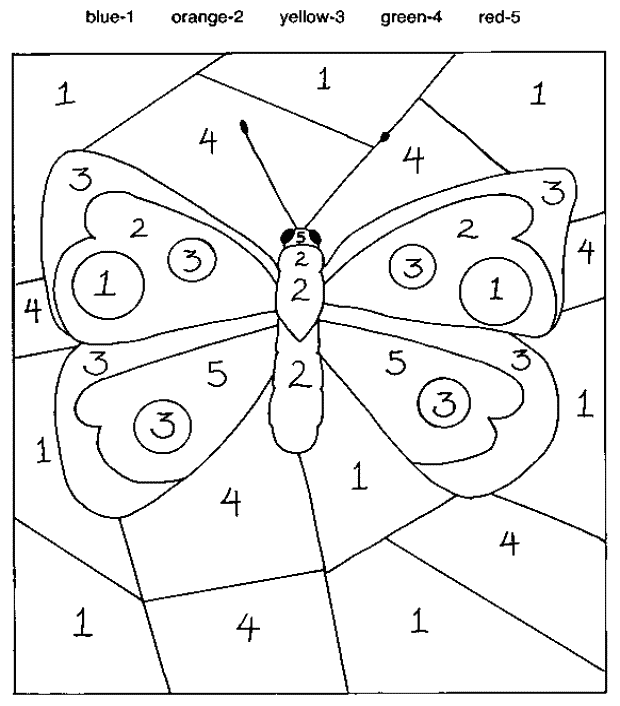
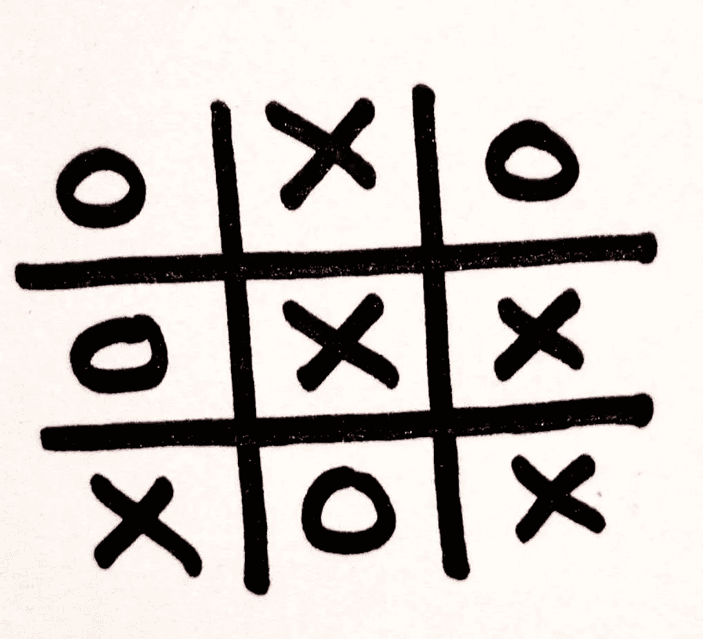

# 胡萝卜和大棒——强化学习

> 原文：<https://medium.com/analytics-vidhya/the-carrot-and-the-stick-reinforcement-learning-e0b2e1e67348?source=collection_archive---------8----------------------->

这是奖励。这是一种惩罚。这些短语和伴随它们的更广泛的技术被称为**强化学习(RL)。计算机科学家用它来编写人工智能程序，可以在复杂的游戏中击败人类，如国际象棋和围棋。在本文中，我将概述强化学习的一些基础知识，并看看它的许多应用。**

# **好艾。坏 AI。—奖惩**

其核心是，强化学习是让人工智能从自己的错误和成功中学习，就像人类学习一样。显然，你不能给一个人工智能一根胡萝卜，也不能用棍子去训诫它。但是你能做的是为你的人工智能定义一个**奖励函数**和一个**成本函数**，允许它评价自己的表现并相应地调整。

一旦定义了这两个函数，人工智能的目标就是最大化回报函数和最小化成本函数。人工智能首先在为其定义的环境范围内采取一些随机行动或移动，对于它采取的每一个行动，它都学习该移动如何影响这两个功能。**如果动作让人工智能朝着它的目标前进，人工智能将来更有可能重复它，反之亦然。**

# **强化学习的好处**

通过在线条内涂色来作画，你不会成为毕加索

允许人工智能犯错误并从错误中学习的好处是双重的。首先，这意味着在给定的任务中，我们的智能体可以比人类做得更好。其他机器学习方法总是将人工智能限制在最优秀的人类的能力范围内，因为这些人工智能正在从人类的动作中学习。这就像你不能仅仅通过完成别人设计的数字绘画工具来成为一名更好的画家，相反，你必须有创造力，做出自己的画。

第二，**AI 不需要任何初始数据集。**大多数学习都包括向代理提供一组数据，并让代理使用这些数据得出某些结论。作为一个例子，让我们来看一个在国际象棋中做出制胜一步的人工智能。其他算法需要大量的数据，以了解特定的棋步在历史上如何帮助或伤害了玩家赢得游戏的机会。

然而，强化学习的神奇之处在于它可以进行自己的研究。在国际象棋的例子中，我们的代理不需要查看以前的大师级游戏，只需要被教会如何下棋，并与自己竞争数百万次，以找出哪些棋步最大化了它的胜利机会。这种自行生成数据的能力至关重要，因为数据并不总是可用的。当然，有太多的历史象棋游戏，但是还没有人解决的问题呢？同样，一个提出气候变化解决方案的模型也不能基于人类过去的成功来提出建议。这类**问题中，机器没有过去的成功经验可以借鉴，这正是 RL 特别方便的地方。**

# **X 和 O 的**

让我们深入一个关于一个程序为了成为一个完美的玩家而和自己玩井字游戏的例子。这将允许我们探索强化学习的方式和原因。我们基本上为机器做了两件事:

首先，**定义一个成本和回报函数。对井字游戏来说，这相对容易，简单到我们只需要一个奖励函数，因为在零和游戏中，奖励直接等同于不产生成本。奖励函数是这样分解的:我们的 AI 赢了奖励 1，输了奖励 0。**

让我们以井字游戏为例

平局稍微复杂一点，因为作为程序员，我们需要决定平局相对于输赢的价值。举例来说，如果我们认为我们的程序应该不惜一切代价获胜，而平局是不可取的，平局应该给出相对较小的奖励，也许是 0.1 或 0.2。另一方面，如果我们认为平局和胜利一样有价值，平局的奖励将接近 1。为了这个练习的目的，我会说一条领带值 0.2。在井字游戏中，平局是如此常见，以至于我们的机器需要不成比例地夸大胜利的价值，否则每次都可能平局。我们希望我们的人工智能赢。

我们的机器需要我们做的第二件事是**解释如何玩游戏。**这被称为**定义我们的 AI 运行的环境**。这也很简单，我们只需要列出井字游戏的规则:

*   有九个正方形
*   轮到你时，你在其中一个方格中放置一个 X
*   在你的对手的回合中，他们在剩余的方格中放置一个 O
*   这个过程一直重复，直到一个玩家连续有三个或者所有的方格都被填满
*   如果一个玩家连续得到三个，他们就赢了
*   如果所有的方格都被填满，并且没有人连续三次都是三，那就是平局。

我们的人工智能现在拥有了成为完美井字游戏玩家所需的所有信息。它将使用上面列出的内容完成以下动作，以实现其目标:

*   玩随机游戏
*   如果在这个游戏中的移动导致了奖励，那么根据它得到的奖励的多少成比例地增加移动的次数
*   如果这些动作没有得到奖励(即在零和游戏中受到惩罚)，不要再做这些动作

我们现在有了一个完美的井字游戏玩家。这显然涉及一些更复杂的代码，但实际上代码只是语义。本例中概述的关键概念是 RL 的基础。

# **其他应用**

井字游戏很酷，但我们大多数人在五年级时就已经掌握了。让我们简单地超越一对一游戏的空间，看看强化学习在现实世界中的应用。

RL 能更有效地分配能量吗？

这种独特的人工智能品牌可以发挥巨大作用的一个地方是能源消耗。现在，[我们对能源的使用超级低效。然而，通过向人工智能解释我们想要最大化使用的能量(我们的奖励函数)和最小化它的成本(我们的成本函数)，我们可以让它告诉我们使用我们能量的最佳方式。更好的资源分配对解决许多问题很重要，包括饥饿和气候变化。](https://www.e-education.psu.edu/earth104/node/999)[一篇关于在高密度网络中使用 RL 分配能量的 2019 年论文](https://www.ncbi.nlm.nih.gov/pmc/articles/PMC6983140/)发现:

> **无线传感器网络(WSNs)中的高密度通信需要新的方法来满足严格的能量和频谱要求。** **我们求助于强化学习**，人工智能中的一个突出方法**来设计一个节能的 MAC[媒体访问控制]协议，**目的是延长网络寿命。

RL 的另一个有趣的实际应用来自在线用户界面。在这里，我们再次看到市场效率低下。给用户的建议并不像它们应该的那样有用。强化学习提供了解决这个问题的方法，比任何人类行为预测器都更能节省人们的宝贵时间。

这种应用程序包括开发一种算法，使推荐产品的点击率最大化(一种奖励函数)，并使在网站上花费的时间最小化(一种成本函数)。网站可以采用一个 RL 模型，运行数百万个 alpha-beta 测试(该模型将学习如何在环境定义阶段进行这些测试)**，并找出哪些测试最符合这两个功能。** [这种简化网上购物流程的算法](https://www.lamda.nju.edu.cn/yuy/%28X%281%29S%28oau3da2n4tycnn55awnyeqiy%29%29/GetFile.aspx?File=papers/kdd18-RobustDQN.pdf&AspxAutoDetectCookieSupport=1)是由阿里巴巴的研究人员开发的。

这些种类的应用独立地使 RL 如此有趣。但除此之外，他们突出了它的多功能性。强化学习的能力被塑造成如此多的任务，这是它的另一个属性，使它成为如此令人兴奋的技术。

# **关键要点**

**强化学习(RL)** 允许计算机自学如何完成各种任务

*   使用 RL 的 AI 试图在某个环境内**最大化奖励函数并最小化成本函数**
*   RL **不需要任何输入**数据，因此**可以在某些任务上胜过人类****而输入驱动的人工智能不能做到这一点**
*   RL 可以应用在无数的地方从搜索建议到资源配给

# **延伸阅读**

如果你想了解更多，网上有很多资源。 [*这个视频*](https://www.youtube.com/watch?v=e3Jy2vShroE) *很精彩* [*这本书*](https://www.amazon.com/Reinforcement-Learning-Introduction-Adaptive-Computation/dp/0262039249/ref=sr_1_3?dchild=1&keywords=reinforcement+learning&qid=1603853076&sr=8-3) *是一个很有深度的探索主题。这里引用的所有资料也很有帮助。如果你想跟我跟进、交谈或有进一步的问题，这是我的联系方式:*

[*邮箱*](http://yamanhabip@icloud.com/)*|*[*Linkedin*](https://www.linkedin.com/in/yaman-habip-51a5491b6/)*|*[*Github*](https://github.com/Yaman-Habip)

*并请* [*订阅*](https://yamanhabip.substack.com/subscribe?utm_source=menu&simple=true&next=https%3A%2F%2Fyamanhabip.substack.com%2Faccount%2Flogin%3Fredirect%3D%252Fpublish%253Futm_source%253Dmenu%26error%3DPlease%2520log%2520in%2520to%2520access%2520this%2520page.) *我的简讯！*