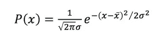
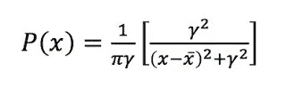
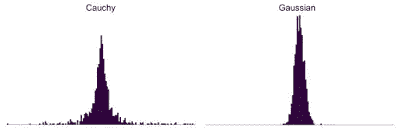
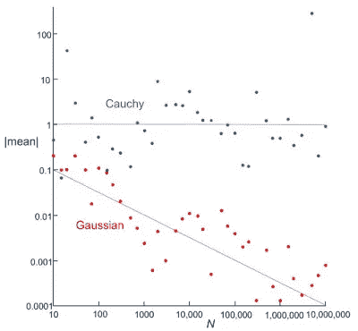

# 柯西分布

> 原文：<https://medium.com/analytics-vidhya/the-cauchy-distribution-eb47642284df?source=collection_archive---------10----------------------->

在 [*医学和生物学中级物理学*](https://www.amazon.com/Intermediate-Physics-Medicine-Biology-Russell/dp/3319126814/ref=asap_bc?ie=UTF8)[的附录中，我和罗斯·霍比](http://www.physics.umn.edu/people/hobbie.html)分析了[高斯概率分布](https://en.wikipedia.org/wiki/Normal_distribution)

它具有经典的[钟形](https://en.wikipedia.org/wiki/Gaussian_function)，以平均值 *x* 为中心，宽度由标准偏差 *σ* 决定。

其他分布也有类似的形状。一个例子是[柯西分布](https://en.wikipedia.org/wiki/Cauchy_distribution)

其中分布以 *x* 为中心，并且具有半峰半宽 *γ* 。我最初认为柯西分布会像其他概率分布一样表现良好，但事实并非如此。它没有[均值](https://en.wikipedia.org/wiki/Arithmetic_mean)，也没有[标准差](https://en.wikipedia.org/wiki/Standard_deviation)！

比起抽象地思考这个问题，我更喜欢计算和观察事情是如何崩溃的。因此，我编写了一个简单的计算机程序，使用高斯分布或柯西分布来生成 N 个随机样本。下面是每种情况的直方图(*N*= 1000；高斯， *x* = 0，*σ*= 1；柯西， *x* = 0， *γ* = 1)。

柯西分布两翼上的那些样本是把事情搞砸的原因。概率下降得如此之慢，以至于很有可能出现一个巨大的随机样本。上面显示的直方图是从 20 到 20 绘制的，但一千个柯西样本中有一个约为 2400。我需要在一个超过 100 倍宽的范围内绘制直方图，以捕捉直方图中的那个 bin。其中七个样本的震级超过 100。相比之下，来自高斯的最大样本约为 4.6。

这几个巨大的样本意味着什么？上面显示的从柯西分布获得的一千个样本的平均值为 1.28，大于半峰时的半宽。从高斯分布获得的一千个样本的平均值为 0.021，远小于标准偏差。

更有趣的是平均值如何随 *N* 变化。我尝试了一堆案例，总结在下图中。

有很多散点，但是高斯数据的平均值似乎变小了(更接近零的预期值),因为 *N* 变大了，红线不是拟合的，只是用眼睛画的。我把它包括在内是为了展示随着 *N* 这些手段是如何消失的。它的斜率为，意味着平均值大致按 1/√ *N* 衰减。相比之下，柯西数据的均值较大(在一的数量级上)，并且不会随着 *N* 而下降。无论你收集了多少样本，你的均值都不会接近零的期望值。一些古怪的样本出现了，扭曲了平均值。

如果计算这些情况的标准差，问题就更严重了。对于使用柯西分布生成的数据，标准偏差随着 *N* 增加。对于超过一百万的 *N* ，标准偏差通常超过一千(记住，半峰半宽是一)，对于我的 *N* = 5，000，000 的情况，标准偏差超过 600，000。怪人主导着标准差。

如果我分析柯西分布的凭直觉的实验方法看起来过于简单，我很抱歉，但对我来说，它提供了洞察力。柯西分布很奇怪，我很高兴 Russ 和我没有在 [*医学和生物学中级物理学*](https://link.springer.com/book/10.1007/978-3-319-12682-1) 中包含关于它的附录。

*原载于【http://hobbieroth.blogspot.com】**。***