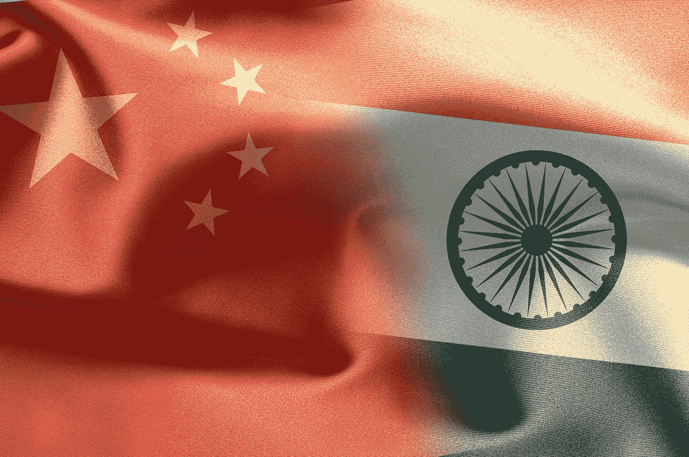
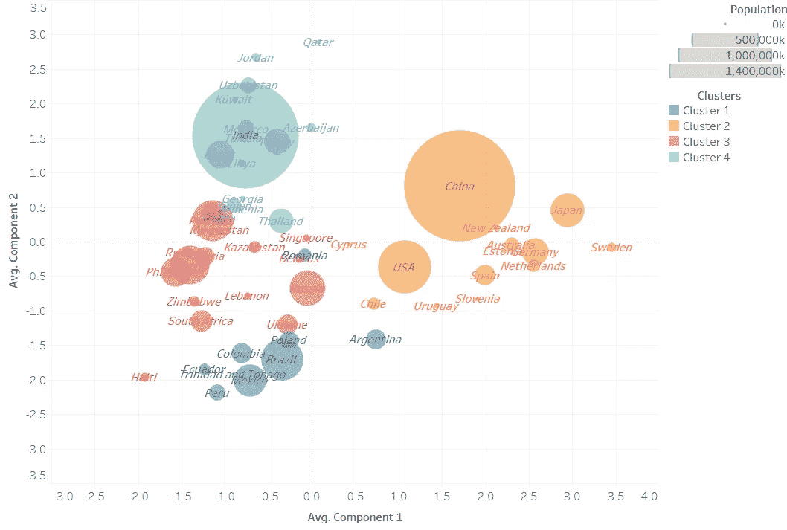
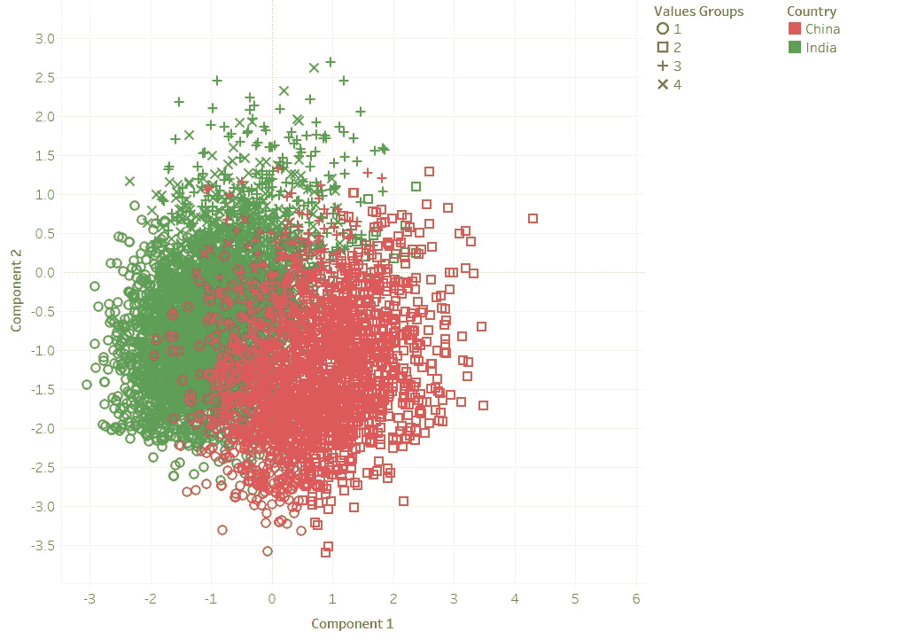
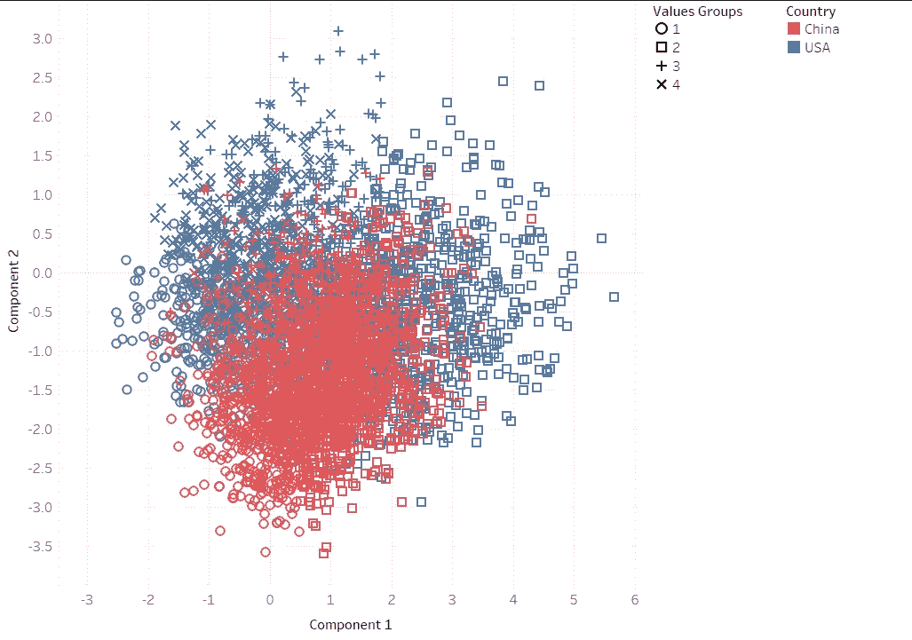
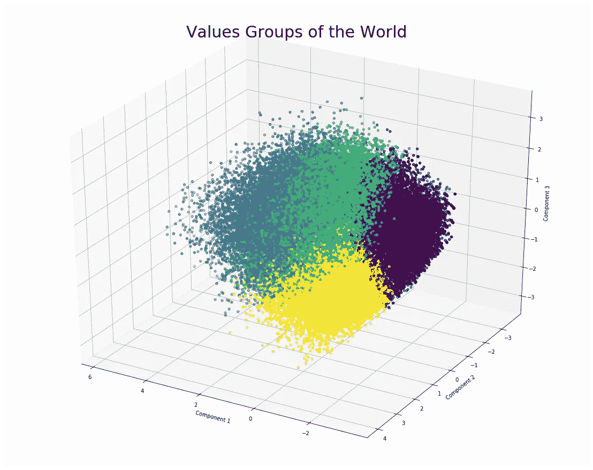
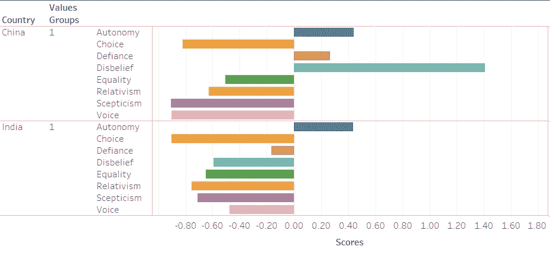
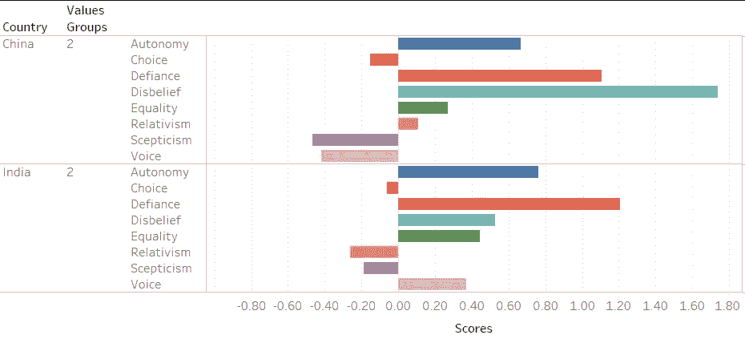
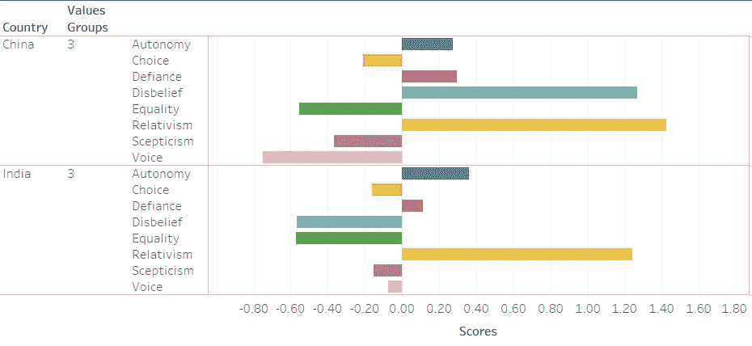
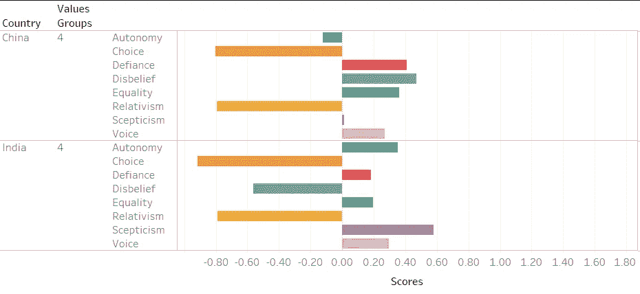
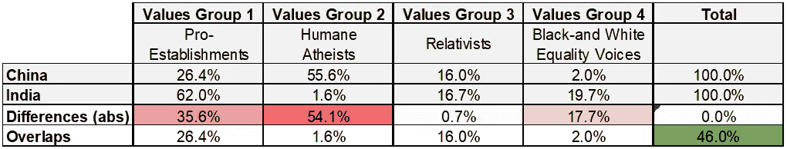

# 印度和中国之间的冲突甚至比美中冲突更加复杂

> 原文：<https://medium.com/analytics-vidhya/the-clash-between-india-and-china-is-more-complicated-than-the-us-china-conflict-4ed3b3c43a46?source=collection_archive---------28----------------------->

## 使用机器学习方法分析价值观和意识形态差异

几天前，我发表了一篇关于美国和中国在价值观和意识形态上的异同的文章。就在我公布结果之后，印度和中国之间的边界冲突变得激烈起来，双方都有人员伤亡的报道。突然间，印中关系再次成为焦点。在这里，我想利用上一篇文章中相同的分析方法和数据集来回答关于印中关系的相同问题。除了边境冲突，印度和中国在价值观和意识形态上也有冲突吗？如果是，它们在哪里不同，在哪里相似？在本文中，我将跳过方法部分，直接进入分析和结果。如果你对方法论感兴趣，请看我的美中冲突文章 [**这里**](/@ericfoundry/did-people-who-see-things-in-black-and-white-caused-the-us-china-conflict-c9cb1a68cdbd) 。

通过使用 PCA(降维主成分分析)和 K-means 聚类机器学习算法，我们发现印度和中国在价值观上确实存在显著差异。我们根据国家的“成分”值得分及其值组组合(稍后解释)确定了 4 个不同的国家集群。结果表明，印度和中国属于不同的集群。

就价值观和意识形态而言，中国更类似于美国和一些主要欧洲国家。它们属于第二组。然而，印度的值更接近聚类 4 中的中东国家和东南亚国家。

现在让我们在散点图上比较一下印度和中国的价值观。该图包括来自印度和中国的 5000 多个数据点(3000 多个来自印度的受访者，2000 多个来自中国的受访者)，这些数据点基于其“分量”值得分沿 x 轴和 y 轴列出。正如我们所看到的，这两个国家之间的差异是相当显著的，它们的人口重叠不到一半。

事实上，印度和中国只有 46%的人属于相同的价值观群体。这个比例比美国要小得多，中国人和美国人之间有 77.5%的重叠。请参见下面的美中散点图进行比较。

# 价值观组

那么，我们是如何形成价值观群体的，它们之间有什么不同？我们的机器学习算法(PCA 加 K-means 聚类)分析了来自 60 个国家的调查分数，并确定具有不同价值观的人可以最佳地分为 4 组。

许多人认为应该有更多的价值观群体，而不是只有 4 个，因为人们应该更加多样化，但我们的模型显示世界更简单。添加更多组将导致信息丢失，并使分组不太准确。这表明在表面之下，世界上的人之间有更多的共性。

在印度和中国的背景下，这四种价值观的特征如下。

## **第一组价值观:支持机构**

**这个群体代表了中国 26.39%的人口**，刚刚超过总人口的四分之一。**但在印度，持有这些价值观和意识形态的人不仅是主流，而且在印度占主导地位，人口比例高达 63%** 。这个价值观组——实际上是我们将要介绍的每一个价值观组——是由世界价值观调查中受访者价值观的 8 个衡量标准的分数定义的。这 8 个衡量标准是蔑视、怀疑、相对主义、怀疑、自主、平等、选择和声音。

**这一群体对相对主义持否定态度(意味着他们对正确和错误有明确的认识，只有很少的灰色地带)，对怀疑主义持否定态度(更信任权威)，对选择持否定态度(选择少也可以)，对声音持否定态度(说出来的自由少也可以)，**而对自主和反抗持温和态度(可以不服从)。所有这些品质似乎表明，这些人更加尊重传统、社会规范以及法律和秩序，这些不可避免地限制了他们的选择权和发言权。他们也倾向于更信任包括政府在内的权威。这两个国家在这一价值观群体中最大的差异来自于不信任，这一群体中的中国人是无神论者，而这一群体中的印度人非常虔诚(不信任的负分)。显然，我们的模型的结果表明，宗教信仰不如其他价值衡量标准重要。因此，无信仰者和宗教信仰者可以在相同的分组结果中共存。

## **价值观组 2 —人道无神论者**

**这个群体在中国占 55.6%，在印度仅占 1.55%。这是主流，也是中国最大的人口；然而在印度，这种价值观群体不仅数量少，而且非常罕见。**

这一群体的人在自主性(更重视独立)、挑战性、平等性和不信任上的得分都是正面的。他们不信教，他们信奉人类固有的权利，不论种族、性别和民族，同时他们尊重个人的生命、自由和独立。这群人在反抗方面也很积极，意味着他们认为不服从是可以的。

## **价值观组 3——相对主义者**

至于这个群体的人口构成，两国几乎相同**(中国 16.02%，印度 16.72%)。**

**一种独特的价值观定义并统一了印度和中国的这个群体——一种非常高的相对主义。这些人认为，道德判断的真假只与某些特定的观点(例如，一种文化或一个历史时期的观点)有关，没有一种观点能凌驾于所有其他观点之上。另一个更重要的价值观衡量标准是消极平等，这意味着他们对平等不是绝对的，做出某些妥协是可以的。和第一组一样，宗教信仰不是这个组的重要区别。**

## **价值观组 4:黑白平等声音**

印度有 19.72%的人口属于这一群体，比中国(2%)多 10 倍。

这一组显示出很高的负面相对主义(非常明确的对与错)分数，而在平等和声音分数上是正面的。其余的元素在我们的算法分组中不太重要。请注意，一个直言不讳、非常明确是非的人可能表明，他们可能更积极地影响自己的国家，尤其是在他们高度重视的平等方面。

以下是两国上述价值观组合的总结。

## **结论**

印度和中国超过一半的人口属于不同的价值观群体，没有重叠。与中美相比，中印在价值观和意识形态上相距甚远。印度在价值观组 1(亲建制)中占主导地位，而中国在价值观组 2(人道无神论者)中占主导地位。不像美中关系，他们的冲突主要是关于贸易和政治，**中印关系更复杂，因为他们的价值观和意识形态不同。我们希望中国和印度的领导人能够认识到这些差异，并特别关注对立的主导价值观群体的感受、担忧和利益。让我们希望印度和中国之间的边界争端能够尽快解决，不会再有人员伤亡。**