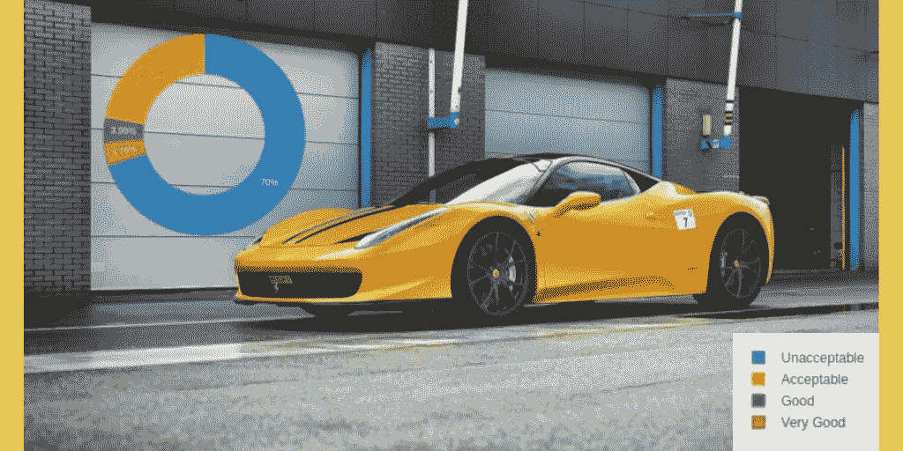
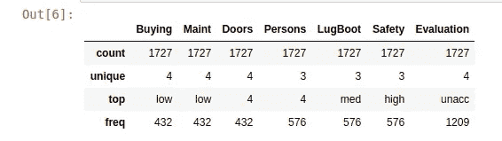
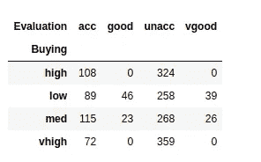
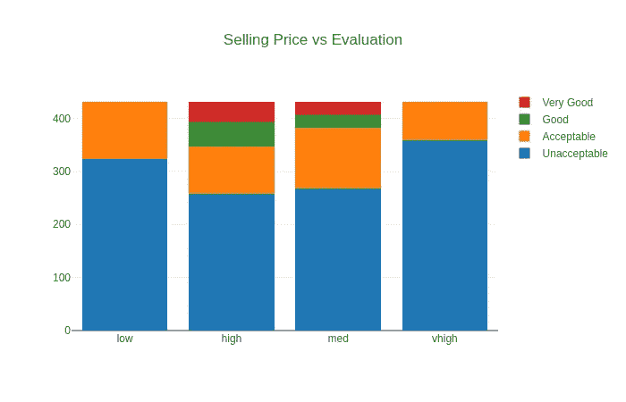
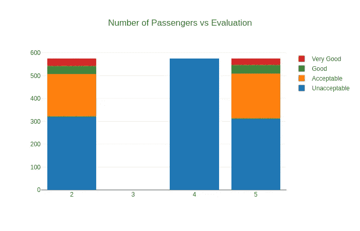
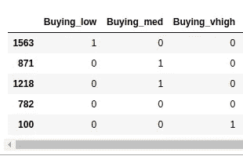

# 分类器——评估汽车的可接受性

> 原文：<https://medium.com/analytics-vidhya/the-classifier-part-1-2-18f3c70d01fe?source=collection_archive---------2----------------------->

## 第 1 部分，共 2 部分:数据探索和预处理



随着我探索和理解数据的追求的继续，我使用了 UCI 机器学习库中的数据集来分类，在给定一些相关特征的情况下，什么使汽车可以接受。数据科学的一个关键部分是理解数据。即使在机器学习中，我们也需要一个干净和定义良好的数据来训练我们的模型。所以我通常会花大量的时间来分析和/或可视化数据。我把这个项目分成两部分，一部分是数据分析，另一部分是模型选择。好吧，那么，让我们探索数据。

在导入必要的库并将数据集作为数据框加载到项目中之后，让我们来看看数据的形状。形状就是数据框的尺寸，其中第一个值告诉我们行数，第二个值告诉我们数据集中的要素数。

```
cars = pd.read_csv('car_data.csv')
cars.shapeOutput: (1727,7)
```

我们看到我们的数据有 1727 行和 7 个特征。让我们仔细看看我们的数据:

```
cars.describe()
```



**计数**告诉我们每个特征中数据值的数量。我们看到每个特性的计数与行数相同，这意味着没有丢失值。这真的很神奇，因为你不必使用统计或其他技术来填充缺失的值，而且这将提供更好的结果，因为我们不需要填充数据缺口。

**唯一值**告诉我们给定特性中唯一值的数量。因为我们有分类数据，所以在该列中显示了不同的值。

顶部的**告诉我们在特定列中出现最多的值。**

**freq** 告诉我们 **top** 值在该列中出现的次数。

现在让我们来看看汽车可接受性的分布。

```
cars['Evaluation'].value_counts().sort_index()Output :
acc       384
good       69
unacc    1209
vgood      65
```

没有可视化有什么乐趣:)


我用*很巧妙的*制作了这个圆环图。不到 4%的汽车被评为*非常好*，70%被评为*不可接受*。

因此，我们需要预测给定 6 个特征的汽车的可接受性。让我们试着找出每个特征变量与目标变量之间的关系。我将使用 pandas crosstab 制作一个显示关系的表格，并绘制一个交互式图表。

```
buy = pd.crosstab(cars['Buying'], cars['Evaluation'])
mc = pd.crosstab(cars['Maint'], cars['Evaluation'])
drs = pd.crosstab(cars['Doors'], cars['Evaluation'])
prsn = pd.crosstab(cars['Persons'], cars['Evaluation'])
lb = pd.crosstab(cars['LugBoot'], cars['Evaluation'])
sfty = pd.crosstab(cars['Safety'], cars['Evaluation'])
```

这里，我针对我们的目标变量*评估，为 6 个特征制作了 6 个数据框表。*看起来是这样的:



我们总共会得到 6 个这样的数据框，但出于演示目的，我只使用了购买 V/s 评估数据框。这显示了车辆的*评估*和*成本之间的关系。*因此，26 辆成本中等的汽车被标记为非常好，324 辆成本高的汽车被标记为不可接受，以此类推。

在可视化之前，我制作了一个变量‘a’来存储特征的每个类别的数量。这将有助于绘制图表。

```
features = cars.iloc[:,:-1]
features[:5]
a=[]
for i in features:
    a.append(features[i].value_counts())
aOutput:
[low      432
 high     432
 med      432
 vhigh    431
 Name: Buying, dtype: int64, low      432
 high     432
 med      432
 vhigh    431
 Name: Maint, dtype: int64, 4    432
 5    432
 3    432
 2    431
 Name: Doors, dtype: int64, 4    576
 5    576
 2    575
 Name: Persons, dtype: int64, med      576
 big      576
 small    575
 Name: LugBoot, dtype: int64, high    576
 med     576
 low     575
 Name: Safety, dtype: int64]
```

到目前为止一切顺利，让我们制作图表:

```
data = [
    go.Bar(
        x=a[0].index, 
        y=buy['unacc'],
        name='Unacceptable'
    ),
    go.Bar(
        x=a[0].index,
        y=buy['acc'],
        name='Acceptable'
    ),
    go.Bar(
        x=a[0].index,
        y=buy['good'],
        name='Good'
    ),
    go.Bar(
        x=a[0].index,
        y=buy['vgood'],
        name='Very Good'
    )]layout = go.Layout(
    barmode='stack',
    title='Selling Price vs Evaluation'
)fig = go.Figure(data=data, layout=layout)
py.iplot(fig, filename='distri')
```

如果你想知道我是如何使用 Plotly 进行可视化的，请查看我以前的一篇帖子，在那里我使用 Plotly 对钦奈水资源短缺进行了交互式数据可视化。不管怎样，我们得到的是:



那么这种表现告诉了我们什么呢？我们可以看到，销售价格和可接受性之间没有线性关系。更确切地说，有些被标为非常好的中高售价。那么这两个变量之间没有线性关系意味着什么呢？这意味着，如果我们改变一个变量，比如说销售价格，那么我们不会看到另一个实体的任何恒定变化，这就是评估。

如果我们分析剩下的 5 张图，我们将看到变量之间同样的非线性关系。出于演示的目的，我只使用了一张图，但是您可以在我的 GitHub 存储库中的代码中查看其余的图。

现在我们进入数据预处理的最后一步，对分类数据进行编码。这里我们有两个选择，要么使用标签编码，要么使用虚拟变量。

在标签编码中，我们为给定特征中的唯一值分配一个数值。在我们的数据集中，卖价(买价)分为 4 类，即*【高、高、中、低】。*现在，这些是字符串值，需要转换成整数。我们可以用数值代替它们，变成*【3，2，1，0】。*但这带来了一个问题，问题是我们的数据是分类的，这些分类数据**显示特征和目标变量**之间没有顺序。那么这意味着什么呢？

这意味着，如果我们增加或减少该特性的值，我们不会看到它们之间的任何有序关系，也就是说，如果值 2 导致更多的汽车被评估为非常好，这并不意味着值 3 将意味着更多或更少的汽车被评估为非常好。此外，数据不必是字符串数据类型，也可以是整数；因为如果我们看到乘客 V/s 评价的曲线图，乘客数量和汽车的可接受性之间并没有特定的顺序。



这里的 5 代表 5 名或更多的乘客

所以我们能做的是，我们为我们的分类数据集使用虚拟变量。虚拟变量的作用是为每个类别创建一个单独的列，如果该行包含该类别的值，它会将新创建的列数据设置为 1。我知道现在有点晦涩，所以我会告诉你我的意思，



所以回到我们的购买变量(销售价格)。如果你还记得，我们有 4 个购买类别，*【高，高，中，低】。*因此，我们为类别创建了新列，并删除了原来的列。你可以看到我们有 3 列而不是 4 列，这是因为如果 Buying_low、Buying_med 和 Buting_vhigh 都是 0，这意味着汽车的售价肯定很高。因此，我们不需要为该类别增加一个额外的列。类似地，对于 *n* 个类别，我们将有 *n-1* 列。

至此，我们已经完成了数据准备工作，接下来是预测给定这 6 个特征的汽车的可接受性。由于这篇博文越来越长，我将把这部分留给我博文的第二部分。所以请继续关注即将发布的博客文章。