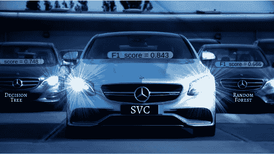
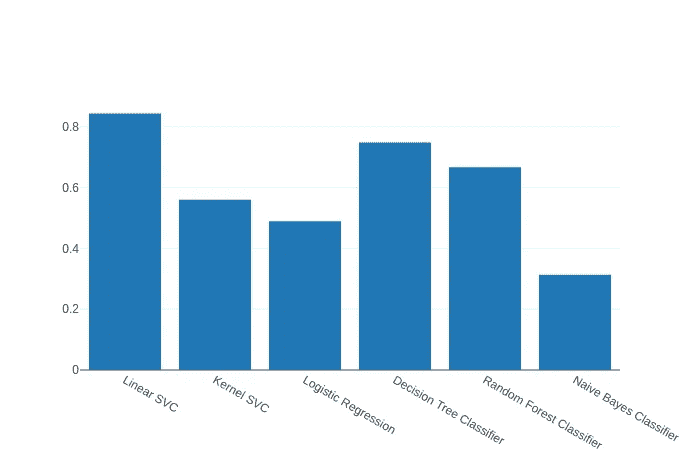
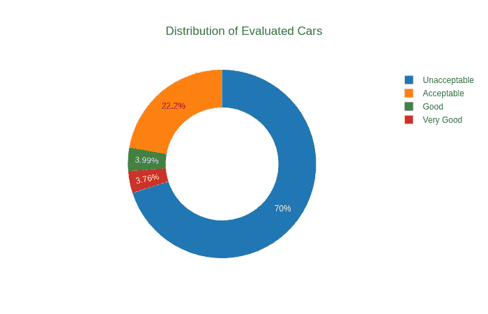
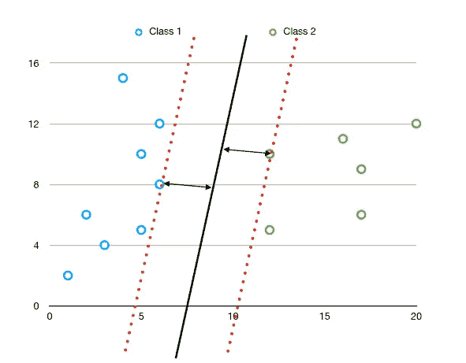

# 分类器——评估汽车的可接受性

> 原文：<https://medium.com/analytics-vidhya/the-classifier-part-2-2-38df3de1f9b3?source=collection_archive---------10----------------------->

## 第 2 部分，共 2 部分:模型评估度量和支持向量机(SVM)

谁赢了这场比赛？

嗯，博客的横幅图像显示，在汽车可接受性分类方面表现最好的是 Liner SVC。如果你想知道我在说什么，这篇博文是我之前的一篇博文的延续，[分类器部分(1/2)](/@harjotspahwa/the-classifier-part-1-2-18f3c70d01fe) 。所以经过数据分析和预处理，下面是不同模型对数据的结果:

不同车型的 F1 分数

很明显，F1 得分为 0.843 的线性 SVM 在其他车型中表现最佳。我使用 F1 分数作为我的评估标准的原因是数据是有偏差的；意味着阶级分布很不均匀。

阶级分布

很明显，与“可接受”和“不可接受”相比，值为“好”和“非常好”的等级更少。因此，这种类的不均匀分布在我们的数据中造成了偏斜，并且在数据量有限的情况下，模型无法学习数据的底层映射。这导致了我所谓的准确性谬误，你可以在我的博客中读到更多:

 [## 信用卡欺诈检测中的准确性谬误

### 了解用于分类的指标

medium.com](/@harjotspahwa/accuracy-fallacy-in-credit-card-fraud-detection-146abafb54bf) 

在余下的博客中，我将简要介绍赢家算法以及它获胜的原因。

# 什么是 SVM(支持向量机) :

这是我最喜欢的算法之一。支持向量机的工作方式是通过寻找最佳/最优的决策边界，这将帮助我们最准确地分离类别。

SVM 分类

通过与*支持向量尽可能等距的*最大间隔*搜索决策*超平面*。*

**超平面**:是分隔数据点的(n- 1)维决策边界。在二维数据的情况下，如上图所示，超平面相当于一条简单的直线。黑线是我们的超平面，或者简单地说是分隔两个类的决策边界。

**支持向量** : 这些是对决策超平面有贡献的数据点。这些是一个类的非常极端的情况，或者简单地说，可能属于该类的最不可能的数据点。所以支持向量是最有用的数据点，因为它们最有可能被错误地分类。这里，与红色虚线一致的数据点分别是两个类别的支持向量。

**最大间距**:这是决策超平面和支持向量之间的距离。SVM 试图最大限度地提高利润率，同时保持最少的错误分类。通过保持边缘与任一支持向量等距来构建超平面。

因此在上图中，位于决策边界右侧的数据点属于第 2 类，而位于左侧的数据点属于第 1 类。在多于两个类别的情况下，SVM 使用“一对所有”方法，其中它为每个类别训练一个分类器。所以在这种情况下，一个类是正的，而所有其他类都是负的，所有其他类也是如此。

# SVM 工作的原因:

支持向量机如此有效的原因是因为支持向量。首先，因为只需要几个向量(数据点)来找到分类边界，所以该算法能够在我们的数据集中处理适度偏斜的类。因此，对于算法来说，每个类中只有几个例子就足以给出一个相当好的决策边界。

其次，如果我们考虑我们的问题，我们需要找到汽车的可接受性，我们看到的功能告诉我们，最终的决定可能会受到几个功能的小变化的影响。因此，假设汽车的维护成本很高，但 rest 功能足够公平，那么这种高维护成本可能会显著影响最终决策；并且因为支持向量是最有用的数据点，因为它们是最可能被错误分类的数据点。

你可以在我的知识库中找到给定博客的代码:

 [## retro flake/汽车-评估

### 此时您不能执行该操作。您已使用另一个标签页或窗口登录。您已在另一个选项卡中注销，或者…

github.com](https://github.com/retroflake/Car-Evaluation)