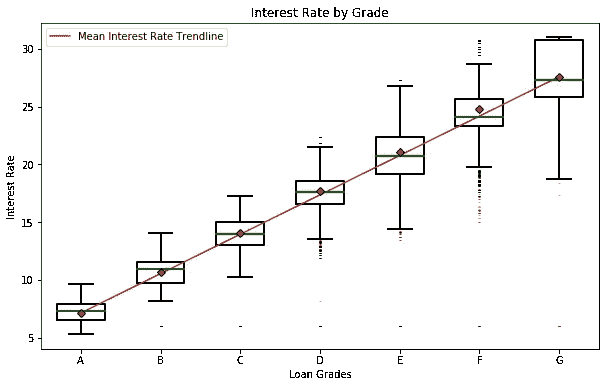
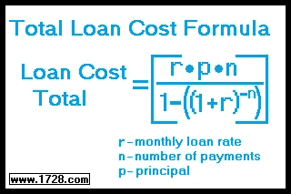
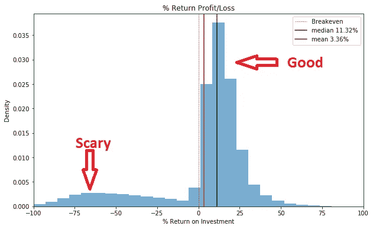
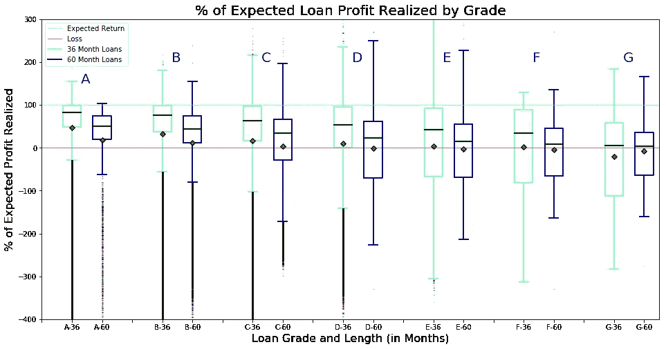
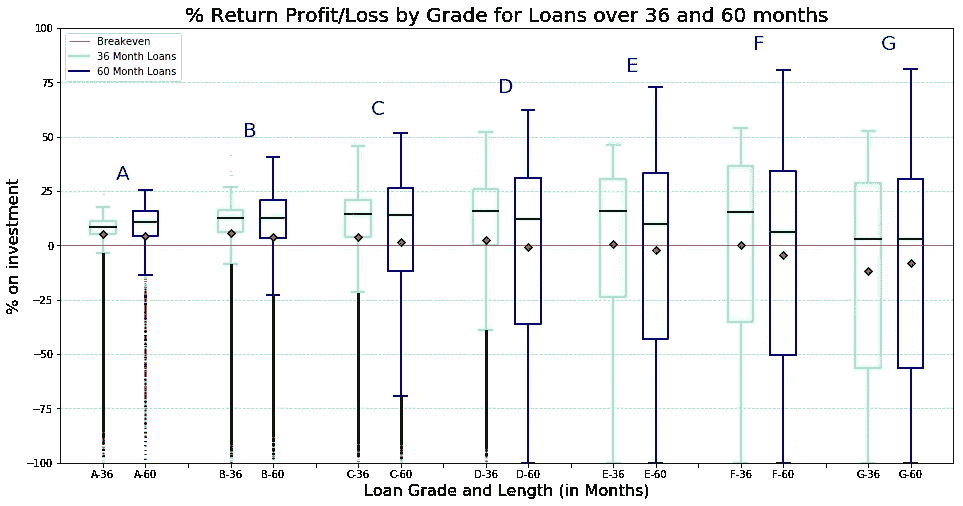
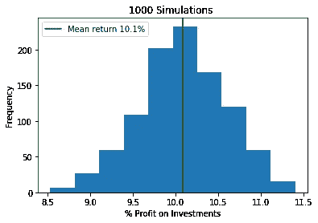

# 临阵退缩的投资者

> 原文：<https://medium.com/analytics-vidhya/the-cold-foot-investor-82da6c0baff0?source=collection_archive---------25----------------------->

迈克尔·朗米尔在 [Unsplash](https://unsplash.com?utm_source=medium&utm_medium=referral) 上的照片

我在金钱方面不是很差，但也不是特别好。像大多数住在纽约的人一样，我光是付房租就已经够麻烦了，所以投资的整个概念有一种令人向往的特质。我可以满足眼前的需要，并且有多余的钱？！这笔钱会变成更多的额外收入吗？！如果我不确定，不知何故，其他人也在这么做，那就太不可思议了。但如果我能暂时满足这种幻想，成为一名投资者！我该怎么做呢？

投资世界是令人生畏的，有很多方式投资我想象中的额外资金，像所有新手一样，我害怕做出错误的决定，但我也很兴奋(只是有点贪婪)。但是，股票市场是不稳定的，即使对于我想象中的额外收入来说，房地产也是不现实的，所以，慢慢地，小心地，我将使用数据科学(加上一点现实主义，从眼中抹去美元的符号)来仔细研究一下 LendingClub。

LendingClub 是一个点对点借贷交易所。我不会把我想象中的钱投资到毁灭地球的无名公司；我会把它借给真正的人，他们会用它来改善他们的生活(希望不是通过毁灭地球)。更简洁地说:

> LendingClub 使借款人能够创建 1，000 至 40，000 美元的无担保个人贷款。标准贷款期限为三年。投资者可以在 LendingClub 网站上搜索和浏览贷款列表，并根据提供的关于借款人、贷款金额、贷款等级和贷款目的的信息选择他们想要投资的贷款。投资者从利息中赚钱。LendingClub 通过向借款人收取发起费和向投资者收取服务费来赚钱。
> - [维基百科](https://en.wikipedia.org/wiki/LendingClub)

可能是放高利贷的，但也是善良的放高利贷的。

LendingClub 提供大量关于过去和当前贷款的数据，从 2007 年到 2018 年的贷款数据库可从 kaggle.com[这里](https://www.kaggle.com/wendykan/lending-club-loan-data)获得。所以让我想象一下我自己会变成什么样。

数据集包含**226 万**笔贷款，有 145 个特征。完整的功能列表是广泛的，并深入到借款人的财务状况以及贷款和还款条件的细节。我只关心我要假装赚多少钱，我怎么能算出来呢？

基本前提很简单，我借出我假想的钱，然后连本带利的还回来，利息就是我的利润。**是魔鬼*总是*在细节上。贷款期限为 3 年或 5 年，评级为 A-F，利率范围随着字母的增加而增加。**

更多的利息意味着更多的利润，贷款的预期总还款可以用以下公式计算:

由[1728.com](http://www.1728.com)提供

从数据集特征‘int _ rate’，‘term’和‘loan _ amnt’可知每笔贷款的所有上述组成部分，因此计算我的假想回报很简单，但现实吗？我真的可以把想象中的钱借出去，然后 3 年后我有更多的想象中的钱吗？LendingClub 的贷款也是这样吗？该数据集中表示的许多贷款仍然是当前的，仍在进行支付，贷款的最终回报无法确定，因此我将只考虑最终“贷款 _ 状态”特征为“已注销”或“已全部支付”的贷款

仅已完成的贷款

其中一半以超过 11%的利润回报给了投资者(好！).平均而言，投资者从贷款中获得的利润只有 3.36%，回报就没那么可观了。可怕的是，有些贷款没有全部偿还，有些根本没有偿还！风险！啊啊啊啊啊！

不幸的是，假设贷款将会完全按时和带息偿还是理想化和天真的。世事无常，人生复杂，投资总有风险。但是风险是可以衡量和最小化的。那么，哪些贷款并不像人们所说的那样好呢？

没有完美的借款人群体，但贷款是按风险分级的，短期贷款比长期贷款表现更好(出问题的可能性更小？).有趣的是，通过我们简单的计算，其中一些贷款的回报率高于预期。这可能是由于滞纳金，贷款延期或临时付款不足，最终导致贷款成本高于借款人的预期。

不过，一般来说，36 个月期限的 A 级和 B 级贷款表现最接近预期。所以让我们看看所有这些贷款的实际投资回报，看看我能从我想象的投资中得到什么

LendingClub 从他们的[网站](https://www.lendingclub.com/investing/peer-to-peer)推广退货

如此诱人的 G 级高利率贷款(不足为奇)是一项糟糕的投资。每个贷款等级和期限都有一些投资回报率为-100%的贷款。没有任何回报，投资者只是空手而归。这似乎在 A 级和 B 级贷款中更为罕见，在这些贷款中，盒子的四分位数范围、平均值和中间值都很好，远离我开始失去想象中的钱的 0%回报线。这就是需要注意的地方，LendingClub 并不要求你为所有的个人贷款提供资金。他们实际上不鼓励它。LendingClub 允许你*分散投资，为许多贷款中的一小部分(称为票据)提供资金，分散风险，抵消未全额偿还贷款的任何损失。*

这都是虚构的，所以我仍然在船上，我愿意尝试一下！即使我有想象中的钱，我也是一个保守的投资者，我只会从 A 级或 B 级贷款中获取笔记，我会疯狂地分散投资。每 1，000 笔贷款中有 1 个虚构的美元。(LendingClub 要求每张钞票至少 25 美元(实际美元)，但不管怎样，这是虚构的)。我也会试着稍微现实一点。我打算将自己的贷款限制在 2013 年，期限为 36 个月。这些都是相对较新的贷款，在 2018 年底编制该数据集时，所有贷款都应已完全完成还款或作为损失核销。有 54，107 个符合我的严格标准，但我只会随机选择 1，000 个，并确定总付款除以每笔贷款的贷款金额，然后求和。

> df _ sim = df . loc[(df[' issue _ d ']> ' 2013 ')&(df[' issue _ d ']< ' 2014 ')]。loc[(df[' grade ']= ' A ')|(df[' grade ']= ' B ')]。loc[df[' term ']= = 36][[' loan _ amnt '，' total_pymnt']]。样本(n=1000，random_state=44)
> 
> ((df _ sim[' total _ pym nt '])/df _ sim[' loan _ amnt '])。总和()

我 1104.76 美元！！从我最初的 1000 美元投资中获得了超过 10%的可观回报。我的多元化战略和高等级贷款似乎已经奏效，但也可能这只是一个侥幸。所以我要再试一次，一次，一次。1000 次(以防万一)。是的，我正在进行蒙特卡洛模拟。

我的投资方案回报率在 8.5%至 11.4%之间，平均回报率约为 10.1%，呈正态分布。值得注意的是，这不是年度回报，而是贷款期间的回报，在上述场景中是 36 个月。然而，LendingClub 不会让你等那么久，也不会按月为投资者购买的债券支付回报。

因此，我认为我已经确定了一个回报率适中、风险较低的投资策略，其中还包括一种温暖的模糊感觉，即帮助人们获得贷款，以改善生活、创业、结婚、巩固债务和做各种美好的事情。现在我需要做的就是把我想象中的钱换成真钱！

完整的 python 笔记本链接如下:

 [## ktzioumis/借贷俱乐部

### 此时您不能执行该操作。您已使用另一个标签页或窗口登录。您已在另一个选项卡中注销，或者…

github.com](https://github.com/ktzioumis/Lending-Club/blob/master/Cold-Foot-Investor.ipynb)