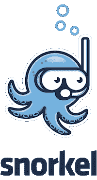
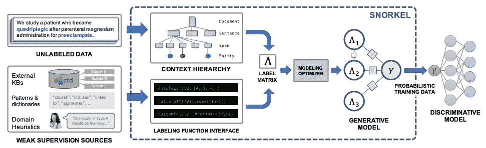
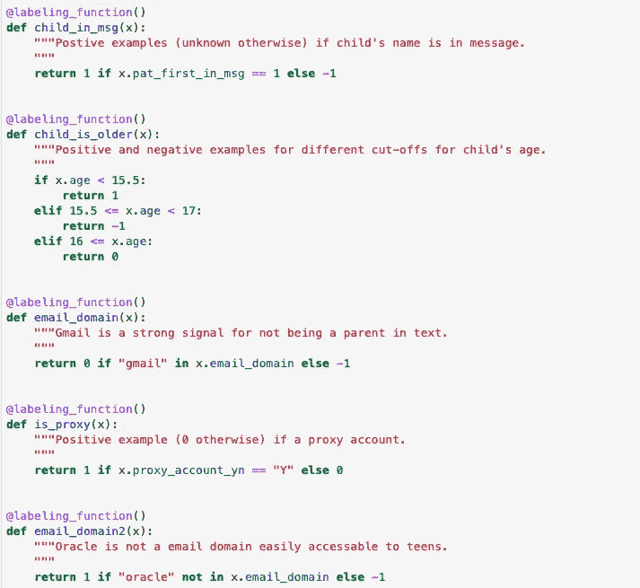
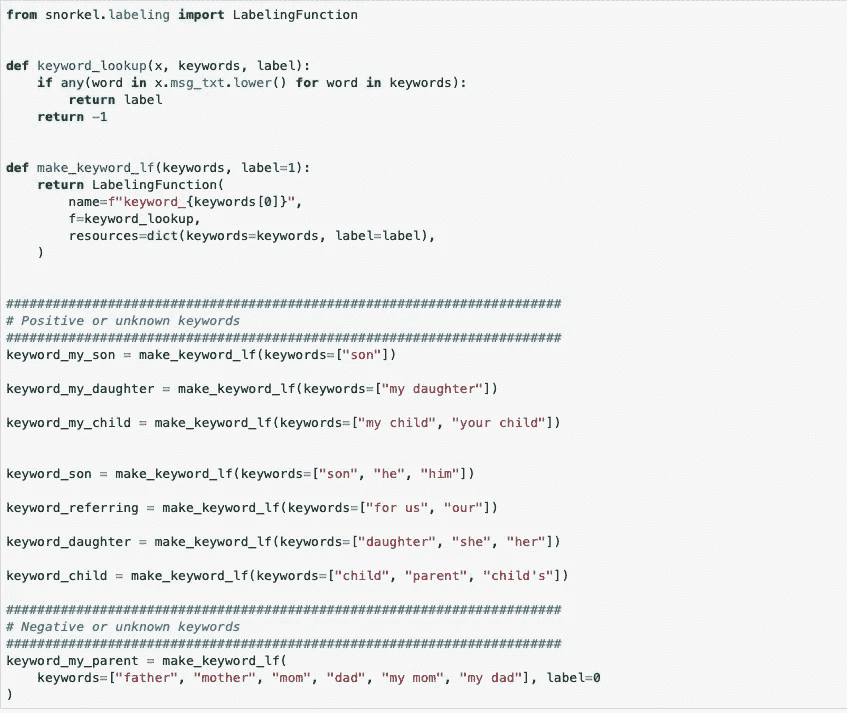
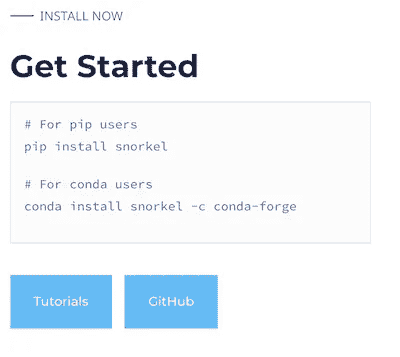
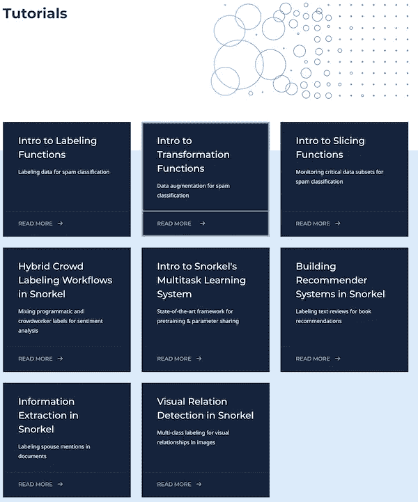

# 斯坦福通气管的冷启动问题

> 原文：<https://medium.com/analytics-vidhya/the-cold-start-problem-with-stanford-snorkel-6fc5b55ec216?source=collection_archive---------8----------------------->

这是我使用斯坦福浮潜的实践经验的简要记录。它旨在介绍问题空间、使用它的动机以及分享我所获得的实践经验。

# 介绍

## *什么事？*

简而言之，斯坦福潜泳是一个 Python 库，可以帮助你为有监督的机器学习任务标记数据。

该小组发表论文的图表:【https://arxiv.org/pdf/1711.10160.pdf 

## *为什么用它？*

简短的回答应该是非常明显的:你想估计一些数据 *X* 。但是为了训练我需要 *y* ，那么当我没有 *y 的时候我不要什么呢？*这通常被称为[“冷启动问题”](https://www.kdnuggets.com/2019/01/data-scientist-dilemma-cold-start-machine-learning.html)，人们越来越希望利用积累的大量数据。最直接、最实用的解决方案是给数据贴标签。

如果只有我，我自己和我喜欢我开始这个项目的实际动机，这是相当简单的。假设我想创建一个模型来判断电子邮件是否是垃圾邮件。我会坐 1 个小时，给一堆数据贴上标签。为了扩大规模，许多公司使用[机械土耳其人](https://www.mturk.com/)，你给一群人下达指令，让他们坐下来，给一堆数据贴上标签。

这里有两个大问题(这也是我看到潜泳的动机所在):1)你付钱给一群人来训练一台计算机 2)人类不会给你所有的数据贴上相同的标签。这里是该组织的一篇早期文章，以获得进一步的动力: [**潜泳和弱监督机器学习的黎明**](https://dawn.cs.stanford.edu/2017/05/08/snorkel/)

**怎么用？**

编写标签函数有点艺术和科学的味道。这个建议来自经验和浮潜的创造者。以下是一些在我的使用案例中似乎很有效的技巧:

*   写一个标签函数的平衡:如果你正在为一个二进制分类器写标签函数，你想要用正面的例子来平衡反面的例子。即使您使用的是弱学习者，目标也是对生成模型的标签给予同等的重视。
*   不要害怕写冲突的标签:你的目标不是写令人惊讶的逻辑函数，而是有洞察力的函数。
*   *尝试编写高覆盖率的标注函数:*这意味着，对于主要在男性文本中寻找女性词汇的文本规则，你的收敛将会很低。
*   *有一套金玉良言:*贴标签的功能不是人。只有你才真正知道应该是什么标签。如果你不能定义正面和负面推文之间的区别，你怎么能指望贴标签的人也是这样呢？

# 在现实生活中应用

到目前为止，所涉及的大部分信息都可以通过阅读自己写得很好的教程来收集。我花时间研究这个的目的是利用通气管的净交换。

它能让我从零开始→有很多标签→比我手动浏览它们更有用吗？

*我的用例是所谓的作者归属(将文本归属于正确的作者)。在这种情况下，给属于父母或青少年的临床医生的消息。青少年应该是唯一一个访问临床医生信息的人，但是父母总是倾向于使用这个功能。*

> 一种测量努力的方法可能是说仅仅根据经验创建标签函数花费了多少时间。对我来说，**花了几个小时来获得一些关于如何创建标签函数的直觉**，但是大部分时间都在习惯工作流程。我相信下次会更快，因为我知道如何创造和评估。

我采取的步骤:

*   1)手动标记约 100 条“黄金标准”信息
*   2)创建标注几个标注函数，迭代 3)和 4)
*   3)验证，因为我在验证测试中编写了具有合理覆盖和冲突的函数。
*   4)当我的“黄金标准”集使用标签功能达到 90%时，我停止了
*   5)使用您可以用通气管训练的模型在最终保持测试集上进行测试，看看产品环境“标签”可能是什么样子。

一些要点:

*   通常多数标签规则在“黄金标准”上比概率潜泳法更准确。
*   在对标记数据集的通气管进行训练并在测试集上进行测试后，我能够获得超过 90%的准确率，但不清楚这是否是手动标记的净收益。
*   通气管提供了一些评估方法，如*标签冲突、极性、*和*覆盖范围*，这些方法有助于在您标记数据时找到发出良好信号的标签。
*   我觉得浮潜对多标签贴标签机更有利，因为数据上的直觉或真正的标签是什么(我在这里想的是机械土耳其人)可能会更“模糊”。

# 一些代码标签功能

这里是我的标签功能，最终让我开始。

*   **表格标注功能**

*   **文本标注功能**这些被应用于文本语料库。在某种程度上，这是浮潜的最佳使用案例，因为你可以非常自由地运用你的假设。我注意到，当你确保平衡正负标签函数时，最终结果肯定会有所不同。

# 入门指南

文档非常好，教程中的所有代码都很容易复制和粘贴。

# 结论

作为唯一/主要贡献者，我不确定在不久的将来使用浮潜会有什么好处。作为一种诊断工具，它确实有**一些**积极的用途……一种告诉你你的特征/标签功能有多好的启发式模型。当然，尝试一些可能值得一试的方法是很快的。

它的真正用途似乎是在土耳其机器人的情况下。你有很多来自制造很多噪音的人的标签(例如[关于医疗保健中众包 NLP 注释的可行性)。](https://roamanalytics.com/2018/07/26/on-the-viability-of-crowdsourcing-nlp-annotations-in-healthcare/))

感谢阅读！

# 资源

绝对检出:[https://www.snorkel.org/](https://www.snorkel.org/)

## **YouTube**

包含最佳实践和一些优秀示例的新旧资源视频

*   [2018 年通气管研讨会:改善您标签功能的最佳实践](https://www.youtube.com/watch?v=mrIkus844B4)
*   [Eddie Bell:弱监管:不可靠数据的新范式| PyData London 2019](https://www.youtube.com/watch?v=KRcgteDTm3k)
*   [埃迪·贝尔:弱监管:不可靠数据的新范式| PyData 伦敦 2019](https://www.youtube.com/watch?v=KRcgteDTm3k)